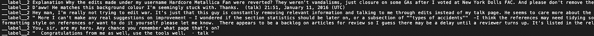

# 使用 FastText 进行亵渎检测

> 原文：<https://towardsdatascience.com/profanity-detection-with-fasttext-ab2b3d63264f?source=collection_archive---------33----------------------->

## 通过 Python 在文本分类模式下使用 fastText

艾莉娜·格鲁布尼亚克在 [Unsplash](https://unsplash.com/s/photos/neural-network?utm_source=unsplash&utm_medium=referral&utm_content=creditCopyText) 上的照片

如今，无数网站以文本的形式接受来自用户的内容。社交媒体平台上的帖子评论、电子商务网站上的产品评论以及 Medium 等平台上的文章等内容每天都在以比以前更快的速度增长。随着如此大量的内容产生，有越来越多的负担，主持人来调节这些内容。自动化这个审核过程的几个方面不仅有助于审核过程中的仲裁者，还会使整个过程更加有效。检测内容中的亵渎就是这样一个用例。

[FastText](https://fasttext.cc/) 是脸书开发的一个[单词嵌入](https://en.wikipedia.org/wiki/Word_embedding)和[文本分类](https://en.wikipedia.org/wiki/Document_classification)模型。它建立在 [Word2vec](https://www.tensorflow.org/tutorials/text/word2vec) 之上，依靠浅层[神经网络](https://en.wikipedia.org/wiki/Artificial_neural_network)来训练一个单词嵌入模型。fastText 从 Word2vec 继承了一些要点，我们将在继续我们的用例之前考虑这些要点，

1.  **FastText 根据单词使用的上下文创建单词嵌入**。这是在训练期间通过滑动单词窗口来完成的。它采用两种方法— [连续包字和跳过克数](/nlp-101-word2vec-skip-gram-and-cbow-93512ee24314)。
2.  Word2vec 模型依赖于训练数据集的词汇。具有异构单词的较大数据集导致更好的嵌入模型。为单词生成嵌入时，如果该单词不是在训练模型期间构建的词汇表的一部分，则该单词将被忽略。因此，当训练样本量很小时，Word2vec 变得不太有效。 **FastText 通过将每个单词分解成 n 个字母的记号，并用这些 n 个字母的记号创建一个词汇表**来代替原来的单词，从而解决了这个问题。这增加了词汇表的大小，并适应了存在单词拼写错误或训练数据集很小的情况。
3.  像 Word2vec 这样的 FastText 已经被证明比更确定的特征提取/矢量化技术(如[单词包](https://en.wikipedia.org/wiki/Bag-of-words_model))更好。用 fastText 或 Word2vec 创建的向量分布更加均匀，每个向量维度都包含一些关于单词的信息。

FastText 库被开发用于两种模式——[**单词嵌入**](https://fasttext.cc/docs/en/unsupervised-tutorial.html) 和[**文本分类**](https://fasttext.cc/docs/en/supervised-tutorial.html) 。在嵌入模式中，我们训练一个具有一个隐层的浅层神经网络来构建一个词向量矩阵[。该矩阵可用于识别具有相似含义的单词。由于单词向量是在考虑单词上下文的情况下构建的，因此有了足够的数据，可以实现诸如 V(国王)-V(男人)+V(女人)=V(王后)的计算。在文本分类模式中，fastText 训练单词嵌入模型，建立单词向量矩阵，并使用这些单词向量训练多项式](https://en.wikipedia.org/wiki/Matrix_(mathematics))[逻辑回归](https://en.wikipedia.org/wiki/Logistic_regression)模型。

在这篇博客中，我将只关注文本分类模式下的 fastText。以下是我们在训练分类模型时将遵循的几个重要步骤:

1.  训练和测试数据集取自 Kaggle ( [下载](https://www.kaggle.com/c/jigsaw-toxic-comment-classification-challenge/data?select=train.csv.zip))。数据集可以免费分发，并归入 [CC0](https://creativecommons.org/share-your-work/public-domain/cc0/) 之下，底层评论文本由[维基百科的 CC-SA-3.0](https://creativecommons.org/licenses/by-sa/3.0/) 管理。该数据集包含带有 6 个标签的注释。
2.  根据注释是否亵渎，预处理数据集，使其只有一种标签类型。
3.  清理注释——删除停用词，删除标点符号和词条。
4.  在训练集上训练 FastText 单词嵌入模型。
5.  在训练的单词向量上训练逻辑回归模型。
6.  使用 10 重交叉验证进行训练和测试，以更好地量化模型的准确性。

作者图片

我们开始吧。

默认情况下，数据集为 CSV 格式，结构如下:

作者图片

让我们首先重新构建这个数据集，使其只包含一种标签类型，这种标签类型将表明这个句子是否是亵渎的。如果任何有毒，严重有毒，淫秽，威胁，侮辱，身份仇恨被标记为 1 ，我们将认为该评论是**亵渎。最终重构的数据集应该如下所示。请注意，**数据集也应该转换为 FastText 兼容格式，标签设置为 *__label__* 前缀**。在我们的例子中， *__label__1* 和 *__label__2* 分别对应被亵渎和不被亵渎的评论。**

作者图片

正如你已经注意到的，数据集中仍然存在许多不必要的数据，比如[停用词](https://en.wikipedia.org/wiki/Stop_word)和标点符号。这些并不真正包含任何有用的数据，只是在训练过程中造成了*噪声*。因此，下一步，我们必须通过执行操作来清除数据集的这些不必要的数据，例如:**删除标点符号，删除停用词和** [**词条匹配**](https://nlp.stanford.edu/IR-book/html/htmledition/stemming-and-lemmatization-1.html#:~:text=Lemmatization%20usually%20refers%20to%20doing,is%20known%20as%20the%20lemma%20.) **词**。我最终使用了来自 [Sklearn](https://scikit-learn.org/stable/modules/preprocessing.html#preprocessing) 的停用词，因为它们为这个用例提供了更好的结果。为了进行词汇匹配，我使用了[NLTK](https://www.nltk.org/)wordnet lemmatizer。这里值得一提的重要一点是，在去除单词方面，lemmatising 比[词干](https://www.baeldung.com/cs/stemming-vs-lemmatization)做得更好。总之，在这些操作之后，数据集看起来应该是这样的，

作者图片

这个清理过的数据集现在准备好用于训练 FastText 单词嵌入模型和分类器。为此，我使用了 Python 的 *fasttext* 库。**在文本分类模式下，可以使用*fast text . train _ supervised】*定义。该定义在内部负责为** [**多类分类**](https://machinelearningmastery.com/multinomial-logistic-regression-with-python/) 训练词向量模型和多项式逻辑回归分类器。对于我们的用例，我们只有 2 个类—世俗的(__label__1)和非世俗的(__label__2)。为了更好地量化测试准确性，**使用 K 倍交叉验证**是一个很好的实践。在这种情况下，我使用 sk learn[StratifiedKFold](https://scikit-learn.org/stable/modules/generated/sklearn.model_selection.StratifiedKFold.html)进行了 10 重交叉验证。下面的代码片段显示了如何使用 FastText 库来训练模型和测试数据。

让我们来谈谈我配置的超参数。***ws****是窗口大小。大小为 1 意味着模型将考虑上下文单词两边的一个单词。"***wordNgrams****"*定义了我们一次要为上下文考虑多少个单词。在这里将其设置为 2 意味着两个相邻的单词将被同时采用。****Minn****和****maxn****定义单词进一步分解成的最小和最大字符大小。请注意，正如本文开头所讨论的，这是 FastText 相对于 Word2vec 的改进之处。****lr****是学习率，而***epoch****定义了模型应该迭代每个数据样本的次数。这里使用的[损失函数](https://en.wikipedia.org/wiki/Loss_function)是[分级 Softmax](https://paperswithcode.com/method/hierarchical-softmax#:~:text=Hierarchical%20Softmax%20is%20a%20is,the%20path%20to%20that%20node.) 。通过反复试验，我最终在我的模型中收敛了这些值。" *model.test_label"* 定义返回每个标签的准确度分数字典— [precision](https://en.wikipedia.org/wiki/Precision_and_recall) ， [recall](https://en.wikipedia.org/wiki/Precision_and_recall) 和 [f1score](https://en.wikipedia.org/wiki/Precision_and_recall) 。它应该看起来像，********

****

**作者图片**

**我不会深入研究如何对训练数据进行 K-fold 交叉验证来计算准确性分数。将来我可能会就此单独写一篇文章。**

**10 倍的每次迭代花费 3 分钟来训练模型，对于大约 170k 的数据集，总训练时间达到大约 30 分钟。培训是在我的 Macbook Pro Intel i7、16GB 内存、4GB GPU 内存上完成的。用这些超参数在 10 倍上平均得到的模型的最终精度是，**

****

**作者图片**

**如果你不知道 [**精度和**](https://en.wikipedia.org/wiki/Precision_and_recall) 召回，这些本质上是**精度测量，以确定我们的模型预测的假阳性和假阴性**的数量。虽然这些分数的一个好值取决于用例，但是一般来说，**越接近 100%，越好**。**

**现在，确定模型的精度和召回率是非常好的，因为它有助于量化我们模型的准确性。但是，如果我们自己测试几个语句，看看模型预测的是什么，那会更令人满意。下面是我测试模型的几个样本， *__label__1* 为亵渎， *__label__2* 为非亵渎，**

****

**作者图片**

****

**作者图片**

**正如你所看到的,**模型能够预测句子中的脏话，可信度得分非常高**。不仅是简单的情况，而且该模型还能够根据使用单词的上下文来预测脏话，**

****

**作者图片**

****

**作者图片**

**正如你所观察到的，**模型预测 *pig* 在一个基于上下文的评论中会被亵渎**。FastText 证明有用的另一种情况是对于打字错误，**

****

**作者图片**

****

**作者图片**

**因为 **FastText 将一个单词进一步分解成 n-gram 标记来构建其单词向量矩阵，所以用户可能输入拼写错误的单词的用例也被考虑在内**。**

**利用我们上面训练和测试的模型，可以得出结论，文本分类模式中的 **fastText 对于检测句子中的亵渎性**产生了非常好的结果。凭借超过 95%的**精确度和召回分数**，FastText 是其他已建立的检测亵渎的方法中的一个极好的选择。FastText 的单词嵌入功能非常强大，像逻辑回归这样的相对基本的分类器能够以如此高的精度在类之间进行分类。此外，我们在上面看到，我们训练过的 **fastText 模型会处理拼写错误，甚至会考虑单词使用的上下文**来判断它是亵渎还是非亵渎。FastText 的这些预测能力使其成为识别句子中脏话的强大工具，它在几乎每个接受和调节用户内容的领域都有自动调节的应用。**