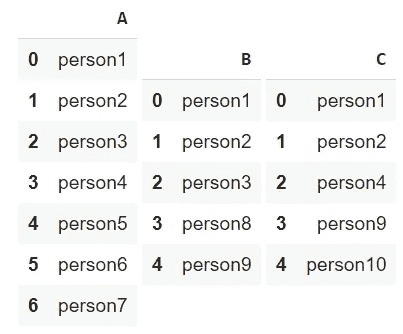
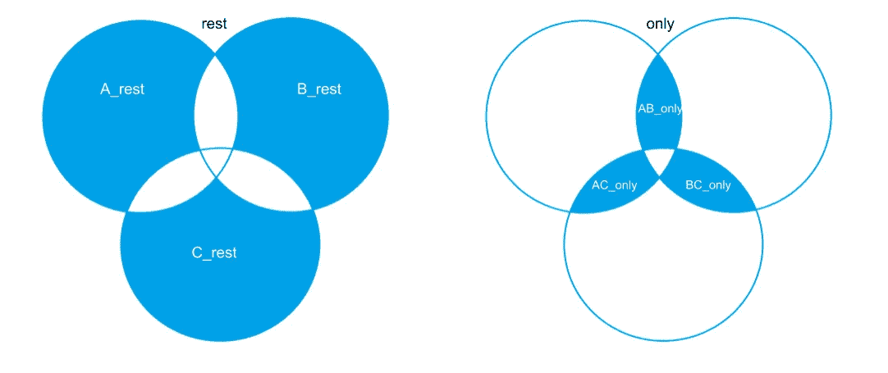
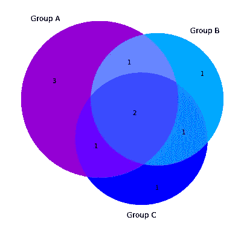
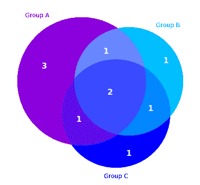
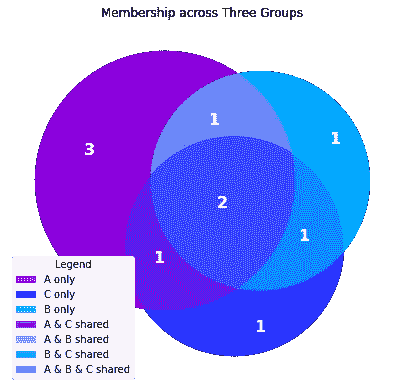
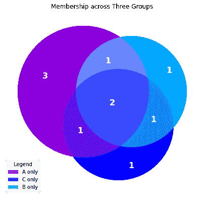
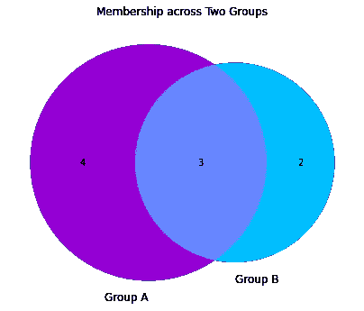

# Python 中的专业维恩图

> 原文：<https://towardsdatascience.com/professional-venn-diagrams-in-python-638abfff39cc?source=collection_archive---------18----------------------->

## 数据可视化

## 从熊猫数据帧生成带有定制标签和图例的 3 向 Venns

作为一个狂热的 python 爱好者，我最近遇到了生成三向维恩图的任务。我在这个看似简单的任务上花费的时间揭示了我在 matplotlib 工作知识方面的不足。希望本教程可以帮助其他人有效地定制 matplotlib 嵌入式文本，以生成可用于发布、仪表板或报告的图形。完整的 Jupyter 笔记本托管在 [GitHub](https://github.com/katewall/medium_tutorials/blob/main/210124_venn.ipynb) 上。

# 设置

让我们从存储在熊猫数据帧中的数据开始。作为一个标准的数据结构，我们希望快速可视化来自三个数据帧或系列的分类数据。在本例中，我们将考虑分布在 A、B 和 c 三个组中的总共 10 个人。目标是使用维恩图将这些分组可视化。

```
import pandas as pd
groupA =['person1','person2','person3','person4','person5',
         'person6','person7']
groupB = ['person1','person2','person3', 'person8','person9']
groupC = ['person1','person2', 'person4', 'person9','person10']dfA = pd.DataFrame(groupA,columns=[‘A’])
dfB = pd.DataFrame(groupB,columns=[‘B’])
dfC = pd.DataFrame(groupC,columns=[‘C’])
```



dfA、dfB 和 dfC 的内容

# 三向维恩图

用于分析分组的理想 python 数据结构是“集合”集合是唯一物品的无序组合。在第一行中，我们把熊猫数据帧 dfA 的 A 列称为一个系列。然后，我们将系列转换为集合。

如果您的数据列有重复项，您需要在使用此方法之前删除它们或转换它们的名称。如果您不确定，请致电 sum(dfA。A.duplicated())。如果该数字大于零，请在继续操作之前处理重复的地址。

```
A = set(dfA.A)
B = set(dfB.B)
C = set(dfC.C)
```

使用集合运算符`&`和`-`计算交集(共享组件)和差，可以找到 A、B 和 C 的子集。`A_rest`包含仅在 A 中发现的个体。`AB_only`包含在 c 中未发现的 A 和 B 中的个体。`ABC_overlap`包含在所有三个组中都有成员的个体。

```
AB_overlap = A & B  #compute intersection of set A & set B
AC_overlap = A & C
BC_overlap = B & C
ABC_overlap = A & B & CA_rest = A - AB_overlap - AC_overlap #see left graphic
B_rest = B - AB_overlap - BC_overlap
C_rest = C - AC_overlap - BC_overlapAB_only = AB_overlap - ABC_overlap   #see right graphic
AC_only = AC_overlap - ABC_overlap
BC_only = BC_overlap - ABC_overlap
```



子集之间的交集

现在可以使用 matplotlib_venn 包使用这些变量来生成 Venn。当定制您的数据时，请跟踪分组顺序！

```
from collections import Counter
from matplotlib_venn import venn2, venn3
import matplotlib.pyplot as pltsets = Counter()               *#set order A, B, C  * 
sets['100'] = len(A_rest)      *#100 denotes A on, B off, C off* sets['010'] = len(B_rest)      *#010 denotes A off, B on, C off* sets['001'] = len(C_rest)      *#001 denotes A off, B off, C on* sets['110'] = len(AB_only)     *#110 denotes A on, B on, C off* sets['101'] = len(AC_only)     *#101 denotes A on, B off, C on* sets['011'] = len(BC_only)     *#011 denotes A off, B on, C on* sets['111'] = len(ABC_overlap) *#011 denotes A on, B on, C on*labels = ('Group A', 'Group B', 'Group C')  
plt.figure(figsize=(7,7)) 
ax = plt.gca() 
venn3(subsets=sets, set_labels=labels, ax=ax,set_colors=    
      ('darkviolet','deepskyblue','blue'),alpha=0.7)    
plt.show()
```



默认三路维恩

# 更改“集合标签”的颜色(例如，组 A)。

这个图不错，但是看起来业余多过专业。为了让它更有趣，我们可以定制视觉效果的几个方面。首先，我们可以修改设置的标签颜色。请参见添加代码的粗体部分。

```
plt.figure(figsize=(7,7))
ax = plt.gca()
colors = ['darkviolet','deepskyblue','blue']
v = venn3(subsets=sets, set_labels=labels, ax=ax,set_colors=
          colors,alpha=0.7) **i = 0for text in v.set_labels:
  text.set_color(colors[i])
  i+=1**plt.show()
```


将标签颜色与子集颜色匹配

# 更改“子集标签”的颜色(例如 1，2，3)。

既然设置的标签颜色与圆形部分相对应，我们还可以修改数字字体。为了更加清晰，我们可以改变维恩图上子集标签的颜色、字体大小和字体粗细。

```
plt.figure(figsize=(7,7))
ax = plt.gca()
colors = ['darkviolet','deepskyblue','blue']
v = venn3(subsets=sets, set_labels=labels, ax=ax,set_colors=
          colors,alpha=0.7)   
i = 0
for text in v.set_labels:
  text.set_color(colors[i])
  i+=1

**for text in v.subset_labels:
  text.set_color('white')
  text.set_fontsize(16)
  text.set_fontweight('bold')**plt.show()
```



使子集标签在背景色上可读

# 用图例替换标签，并添加标题。

一旦对这些字体感到满意，我们可能希望完全消除彩色标签，以获得更正式的效果。通过生成两个列表、句柄和标签来创建图例。

Handles 是通过使用 Venn3 类中的`get_patch_id()`方法遍历 Venn 的补丁并将组件添加到空列表中来生成的。根据我的经验，最好在图形上打印句柄列表，手动编写标签列表进行匹配。

```
plt.figure(figsize=(7,7))
ax = plt.gca()
v = venn3(subsets=sets, set_labels=('','',''), ax=ax,set_colors=
          colors,alpha=0.7)  
for text in v.subset_labels:
  text.set_color('white')
  text.set_fontsize(16)
  text.set_fontweight('bold')

**h = [] 
for i in sets:
    h.append(v.get_patch_by_id(i)) 
l = ['A only','C only','B only','A & C shared','A & B shared',
     'B & C shared','A & B & C shared']
ax.legend(handles=h, labels=l, title="Legend",loc='lower left')** **plt.title('Membership across Three Groups')**plt.show()
```



取消标签，选择图例

# 自定义图例内容。

删除不言自明、多余或不重要的图例元素。这将把你的听众引导到你想要强调的其余部分。为此，我们手动修改上面生成的句柄和标签列表。

请注意，当计数改变时，句柄列表`h`有办法移动。对于这个例子，我可以方便地使用`h[0:3]`和`l[0:3]`来调用`h`和`l`的片段。然而，如果您需要从这两个列表的中心消除色标，您可以在将它们作为参数在`ax.lengend()`中调用之前，应用`del h[2]`操作符从句柄和标签中移除特定索引处的元素。例如，这将从列表`h`中移除索引 2 处的元素。只要记住保持这些列表的长度相等。

```
plt.figure(figsize=(7,7)) 
ax = plt.gca() 
v = venn3(subsets=sets, set_labels=('','',''), ax=ax,   
          set_colors=colors, alpha=0.7) 
**for** text **in** v.subset_labels:   
    text.set_color('white')   
    text.set_fontsize(16)   
    text.set_fontweight('bold') **ax.legend(handles=h[0:3], labels=l[0:3], title="Legend",
          loc='lower left')**plt.title('Membership across Three Groups') 
plt.show()
```



自定义图例的内容

# 双向文氏图

这些方法也可以应用于简单得多的双向图。venn2 类的符号遵循 venn3 的符号。使用相同的格式，上述所有方法都可以应用于这个基类。

```
sets = Counter()               *#set order A, B  * 
sets['10'] = len(A-AB_overlap) *#10 denotes A on, B off* 
sets['01'] = len(B-AB_overlap) *#01 denotes A off, B on* 
sets['11'] = len(AB_overlap)   *#11 denotes A on, B on* 
labels = ('Group A', 'Group B') plt.figure(figsize=(7,7)) 
ax = plt.gca() 
**venn2(subsets=sets, set_labels=labels, ax=ax,set_colors=
          ('darkviolet','deepskyblue'),alpha=0.7)** plt.title('Membership across Two Groups') 
plt.show()
```



默认双向文氏

本教程到此结束。

对某些人来说，定制文本内容、位置、颜色、大小或图形的重量似乎是不必要的。对于实际应用来说，确实如此。然而，在正式的演示场合，干净、清晰的图形是至关重要的。如果一张图片能表达 1000 个单词，使用这些技巧让它们有价值。

更多信息，请查看 GitHub 上的完整笔记本。对相关文章感兴趣？多读读作者。

<https://medium.com/swlh/series-on-theories-high-dimensional-data-101-81cab8e0bea6>  <https://www.linkedin.com/in/kate-wall/> 