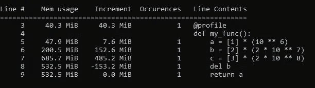

# 在一行代码中分析 Python 函数的内存消耗

> 原文：<https://towardsdatascience.com/profile-memory-consumption-of-python-functions-in-a-single-line-of-code-6403101db419?source=collection_archive---------4----------------------->

## 使用内存分析器模块逐行监控函数的内存使用情况


图片来自 [Pixabay](https://pixabay.com/?utm_source=link-attribution&amp;utm_medium=referral&amp;utm_campaign=image&amp;utm_content=932180) 的[图卡皮克](https://pixabay.com/users/tookapic-1386459/?utm_source=link-attribution&amp;utm_medium=referral&amp;utm_campaign=image&amp;utm_content=932180)

Python 是数据科学社区中的一种流行语言，以其健壮性和大量框架而闻名。Python 更喜欢简单而不是复杂，这使得它更受欢迎，但却牺牲了性能。Python 程序经常容易出现内存管理问题。

数据科学家使用 Python 语言在固定的内存限制下处理大量数据。如果代码执行超过 RAM 限制，可能会出现内存错误，程序执行会终止。一个快速的解决方案是增加内存分配以避免内存管理问题，但这并不总是可行的。

## 为什么内存分析很重要？

通常新手不会释放未使用的内存，并不断分配新的变量，这可能会增加内存消耗。当代码被执行时，越来越多的内存被分配。Python 自动管理内存，但在执行长 Python 代码时，它可能无法将内存消耗返回给操作系统。

因此需要外部工具来监控内存消耗，这将进一步帮助优化内存。

本文将讨论监控 Python 函数内存消耗的内存分析器模块。

# 内存分析器:

Memory Profiler 是一个开源的 Python 模块，它在内部使用`**psutil**` 模块，来监控 Python 函数的内存消耗。它对函数执行逐行的内存消耗分析。

## 安装:

可以使用以下命令从 PyPl 安装内存分析器:

```
**pip install -U memory_profiler**
```

并且可以使用导入

```
**from memory_profiler import profile**
```

## 用法:

设置好一切之后，使用这个模块来跟踪函数的内存消耗就相当容易了。`@profile` decorator 可以用在每个需要跟踪的函数之前。这将按照与[行分析器](https://pypi.org/project/line-profiler/)相同的方式逐行跟踪内存消耗。

用`@profile`修饰所有函数后，用一组特定的参数执行 python 脚本。

绕过`-m memory profiler`到 Python 解释器，执行上面的 Python 脚本。这将加载 memory_profiler 模块并逐行打印内存消耗。

使用下面的来执行 Python 脚本和内存分析器。

```
**python -m memory_profiler <filename>.py**
```



(图片由作者提供)

成功执行后，您将得到一个逐行的内存消耗报告，类似于上图。该报告有 5 列:

*   **行号**:行号
*   **行内容**:各行号处的 Python 代码
*   **Mem usage**:Python 解释器在每次执行该行后的内存使用情况。
*   **增量**:当前行到最后一行的内存消耗差异。它基本上表示特定 Python 代码行消耗的内存。
*   **出现次数**:某一行代码被执行的次数。

可以跟踪 Mem 使用情况，以观察 Python 解释器的总内存占用情况，而可以观察 Increment 列，以查看特定代码行的内存消耗。通过观察内存使用情况，可以优化内存消耗，从而开发出生产就绪的代码。

# 结论:

优化内存消耗与优化 Python 代码的时间复杂度一样重要。通过优化内存消耗，可以在一定程度上加快执行速度，并避免内存崩溃。

还可以尝试自定义的`@profile`装饰器来指定参数的精度。为了更好地理解，请阅读内存分析器模块的[文档](https://pypi.org/project/memory-profiler/)。

# 参考资料:

[1]内存分析器文档:[https://pypi.org/project/memory-profiler/](https://pypi.org/project/memory-profiler/)

*喜欢这篇文章吗？成为* [*中等会员*](https://satyam-kumar.medium.com/membership) *继续无限制的学习。如果你使用下面的链接，我会收到你的一小部分会员费，不需要你额外付费。*

<https://satyam-kumar.medium.com/membership>  

> 感谢您的阅读