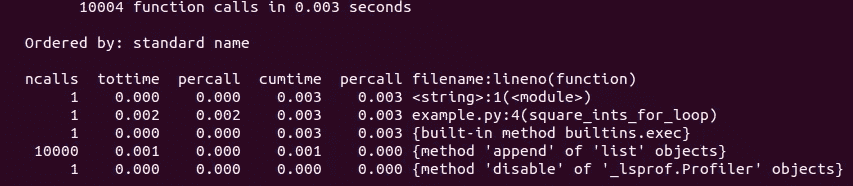
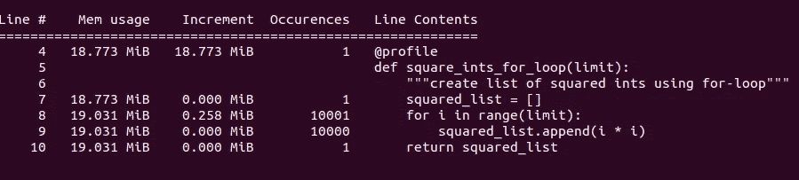

# Python 中的剖析

> 原文：<https://towardsdatascience.com/profiling-in-python-83415daa844c?source=collection_archive---------27----------------------->

## 帮助发现应用程序瓶颈的基本工具


[附身摄影](https://unsplash.com/@possessedphotography?utm_source=unsplash&utm_medium=referral&utm_content=creditCopyText)在 [Unsplash](https://unsplash.com/s/photos/memory-card?utm_source=unsplash&utm_medium=referral&utm_content=creditCopyText) 上拍照

当试验一个项目时，它可能是有帮助的(或者仅仅是有趣的！)来尝试查看代码的哪些部分是最消耗内存的。如果代码中的这些地方造成了问题，那么找出如何改进它们是值得的。有时候，你需要做的只是做一些小小的调整来节省一些时间。其他时候，考虑一种[完全不同的方法](/concurrency-and-parallelism-in-python-bbd7af8c6625)是个好主意。

首先，值得问问自己，剖析和优化代码是否值得，因为它可能会带来过度的复杂性。在开始编辑和优化之前，仔细考虑所有的权衡是非常重要的，比如可读性和易维护性。或者，用唐纳德·克努特 (1974)的话说:

> 我们应该忘记小的效率，比如说 97%的时候:过早的优化是万恶之源。然而，我们不应该错过这关键的 3%的机会。

然而，如果需要的话，有几个推荐的库用于检查代码执行，可以在[这里](https://docs.python.org/3/library/debug.html)找到。我将回顾一下那里提到的`timeit`和`cProfile`，以及`memory_profiler`。这 3 个模块是我的首选工具。

## 我的示例. py 文件

出于演示目的，我将使用一段相当简单的代码:

```
def square_ints_for_loop(limit):
    """create list of squared ints using for-loop"""
    squared_list = []
    for i in range(limit):
        squared_list.append(i * i)
    return squared_list
```

它所做的只是一些虚拟计算，在一个整数范围内迭代，直到一个给定的阈值，以计算出一个平方数的列表。

## 时机

如果您对一段代码的总执行时间感兴趣，您可以测量一下。实际上，您可以使用两个标准模块— `[time](https://docs.python.org/3/library/time.html)`和`[timeit](https://docs.python.org/3/library/timeit.html)`。然而，`timeit`被认为是更准确的(更多细节见文档)。它多次执行语句来测量，以避免被随机因素扭曲。除此之外，`timeit`暂时关闭垃圾收集器，这样也不会影响计时。

例如，如果我计算循环遍历一个 100 以内的数字列表需要多长时间，我可以看到下面的结果:

```
if __name__ == '__main__':
    print(timeit('square_ints_for_loop(100)', 'from __main__ import square_ints_for_loop'))
```

输出:

```
9.349990251997951
```

如果我将其与使用列表理解进行比较，我可以看到一些改进:

```
def square_ints_list_comprehension(limit):
    """create list of squared ints using list comprehension"""
    return [i * i for i in range(limit)]if __name__ == '__main__':
    print(timeit('square_ints_list_comprehension(100)', 'from __main__ import square_ints_list_comprehension'))
```

输出:

```
6.0150625230162404
```

## 执行分析器

有几个收集执行统计数据的标准模块— `[profile](https://docs.python.org/3/library/profile.html)` [和](https://docs.python.org/3/library/profile.html) `[cProfile](https://docs.python.org/3/library/profile.html)`。两者都提供相似的功能。它们详细说明了调用次数、在给定函数中花费的总时间、 *percall* 作为总时间除以调用次数的商、在该函数和所有子函数中花费的累计时间，另一个 *percall* 列作为累计时间除以原始调用的商(如下图所示)。

`cProfile`应该更准确(更多细节见文档)。

它可以这样运行:

```
if __name__ == '__main__':
    limit = 10000
    cProfile.run('square_ints_for_loop(limit)')
```

输出:



cProfile 输出

## 内存使用统计

另一个流行的模块是`[memory_profiler](https://pypi.org/project/memory-profiler/)`，尽管它不是标准库的一部分。该模块监控内存消耗。

它提供的几个不错的功能是逐行分析(类似于`[line_profiler](https://pypi.org/project/line-profiler/)`，另一个很多人喜欢的分析工具)和使用`mprof`可执行文件报告一段时间内的内存使用情况。

通过应用装饰器，它可以用来分析模块中的特定函数:

```
[@profile](http://twitter.com/profile)
def square_ints_for_loop(limit):
    """create list of squared ints using for-loop"""
    squared_list = []
    for i in range(limit):
        squared_list.append(i * i)
    return squared_list
```

要运行分析:

```
python -m memory_profiler example.py
```

输出:



memory_profiler 输出

当然，还有许多 Python 库对剖析有用。有些相当复杂，有助于钻取更多的细节。有些在报告上提供了更多的可视化。很好的例子是孔雀鱼 3 号和 T2 号。然而，我不能说我不得不经常使用它们。

有没有你觉得特别有用的工具？或者任何特别有用的情况？