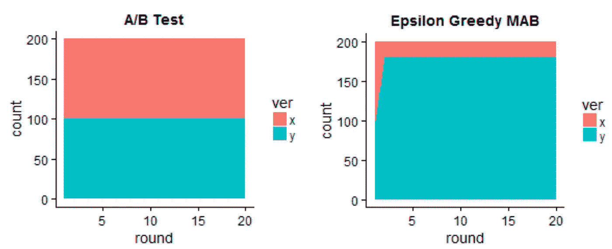

# 利润还是信息？

> 原文：<https://towardsdatascience.com/profit-or-information-3544c7d13468?source=collection_archive---------36----------------------->


来源: [Unsplash](https://unsplash.com/photos/K5DY18hy5JQ) ， [Unsplash](https://unsplash.com/photos/wO42Rmamef8)

## 机器学习实验权衡:一个框架

如果你是一家公司，你会不断寻求如何获得更多利润。如果一家公司正在寻求扩大或改变其目前的业务(无论是大还是小)，一个常见的解决方案是*实验*。

公司可以尝试改变是否可行；如果变化看起来有希望，他们可以将这种变化融入到他们更广泛的业务中。尤其是对于基于数字的公司，实验是创新和增长的驱动力。

一个常见且相对简单的测试是 A/B 测试。一半用户随机指向布局 A，另一半用户随机指向布局 B，然后在实验结束后，可以对比布局 A 和布局 B 中用户的结果，看哪个布局的表现更好。

通过选择 A/B 测试，你在信息和利润的实验权衡中选择了*信息*。也就是说，A/B 测试是现存的最根本的科学测试方法；测试对照组和治疗组的想法和测试一样是科学的基础。用 A/B 检验，统计显著性是最值得信赖和严谨的。

(技术上的信息*就是*利润，只是延迟了，不那么具体，从某种意义上来说，但不一定不那么有价值。不过，目前保持信息或利润的平衡是值得的。)

然而，实验并没有发生在遥远的不相干的星系中——实验影响的是真实的顾客。如果你是一家公司，尤其是一家没有太多资源可花的公司，你会希望将损失最小化——一直都是如此，包括在实验期间。

因此，举例来说，如果一个新的网站布局只有 25%的成功率，而原来的网站布局有 75%的成功率，那么在 A/B 测试中，在测试期间，只有 50%的网站访问是成功的，而原来是 75%。做测试*会伤害*公司。

```
(0.5 × 0.25) + (0.5 × 0.75) = 0.5 #success rate in A/B test
```

事实上，《哈佛商业评论》发现，在谷歌和必应，只有大约 10%到 20%的实验产生积极的结果。鉴于这种相对较低的成功率，公司应该进行这么多这种高信息但也高风险的 A/B 测试吗？

多臂土匪(MAB)测试把旋转放在 A/B 测试上来解决这个问题——A/B 测试可能不是很有利可图。这些 MAB 测试并不是一成不变的，每一组的人口比例都是如此。

也就是说，

*   A/B 测试是静态的；在对照组和治疗组中，它们将总是 50% — 50%。
*   MAB 测试变化；例如，如果第二组表现得更好，他们可能从 50% — 50%开始，但在测试结束时，比例变成 10% — 90%。



A/B 测试对ε贪婪 MAB(一种 MAB)。x 和 y 代表用户被随机分成的组。该 MAB 发现 y 执行得更好并利用它，但是达到模型中编码的利用限制(即，它不能利用超过某个阈值以确保探索仍然发生)。来源:[调整](https://justrthings.files.wordpress.com/2017/05/sim_plot.png)

在这种情况下，如果我们选择 MAB 而不是 A/B 考试，我们既有优势也有劣势。

*   *优势:利润*。在 MAB 测试中，在上述示例测试的末尾，我们将 40%以上的人口归入表现更好的群体。这表明，在整个测试过程中，MAB“挽救”了大量用户，否则这些用户会流向表现较差的群体。
*   *劣势:信息*。在 MAB 检验中，最终结果并不是按相等的比例分开的，所以用统计上严格的方法得出结论并不那么简单。事实上，如果实验者想要特别严格，根据情况人们可能甚至不能从实验中得出结论。
    例如，假设在整个 MAB 实验中，30%的参与者属于 A 组，成功率为 40%,另外 70%属于 B 组，成功率为 33%。你能在 a)样本大小之间 40%的差距造成的噪音和 b)只有 7%的成功率差异之间做出自信的决定吗？

在这个利润信息框架中比较 MAB 和 A/B 测试是有用的。使用这个框架，人们可以以一种更加结构化的方式来解决使用哪种测试类型的难题。

首先，我们必须认识到 A/B 测试是 MAB 测试的一个子集。让我们从探索/利用的角度，重新定义一个更严格(但仍然相对简单)的 MAB 测试视图。考虑某个数字δ，其中

*   MAB 测试是探索性的。也就是说，他们将用户随机发送到对照组和治疗组，以收集更多数据，从而使其在统计上更有意义。
*   MAB 测试是 100%δ百分比*剥削*。也就是说，他们将用户发送到他们知道会表现更好的组，以实现利润最大化。

因此，A/B 测试是 MAB 测试，其中δ= 100 %,它一直在探索，根本没有利用。在这个框架中，我们将 MAB 模式视为探索和开发的混合体。

值得注意的是，这可能会使人误解。MAB 模型所做的探索和开发的数量是动态的，它会改变，但是把这个框架想成“一个纯探索性测试和一个纯开发性测试之间的混合程度有多大？”实际上，δ表示类似于“模型需要有多大的信心来利用？”

在这种情况下，δ越高，就需要越多的统计置信度来做出利用的决定，这意味着它将更加犹豫利用和花费时间探索。另一方面，如果δ较低，模型愿意毫无把握地利用。

回到手头的框架:我们可以开始调整δ来决定勘探(统计意义)和开采(利润)之间的权衡。

让我们举一个例子，其中人口是相同的，但是建模使用不同的δ值。

*   *在δ = 100* 时，如上所述，这是一个 A/B 测试。虽然利润甚至不是一个考虑因素，但收集的数据在统计上非常重要。
*   *在δ = 75* 的时候，模型大多在做探索，但也有一点剥削。然而，在文本开始时，这些组可能是 50% — 50%，通过这种小的利用，模型慢慢地向 40% — 60%学习(第二组更成功)。
*   *δ= 50*时，模型在做平等的探索和开采。然而，在文本开始时，组可能是 50% — 50%，而模型相对快速地达到 30% — 70%。
*   *在δ = 25* 时，模型大多在做探索，也有一点剥削。然而，在本文开始时，这些组可能是 50% — 50%，随着这种大规模开发，该模型迅速向 25% — 75%的方向发展。
*   *在δ = 0* 时，模型在做纯剥削。然而，在文本开始时，这些组可能是 50% — 50%，通过这种小的利用，模型立即变成 100% — 0%。(无论第一个数据点是什么，纯粹的剥削模型都会遵循，所以在这种情况下，收集的第一个数据点碰巧表明第一组做得更好。)

当然，这些数字是虚构的，但它们是准现实的，我们可以对我们从这个框架中得到的虚构结果进行分析。

作为一名实验者，根据δ值分析结果会使权衡变得更加清晰。你可能会注意到两件事:

*   *统计显著性*。出于实用目的，当δ = 75 时，40% — 60%组与当δ = 100 时，50% — 50%组在得出具有统计意义的结论方面真的有很大差别吗？然而，当δ = 50 时，问题似乎就出现了，因为组间差异要大得多，并且会引起统计有效性和显著性的问题。
*   *利润*。具有讽刺意味的是，在某一点上，开发给我们带来了*损失*，因为它没有做足够的探索，并且正在利用错误的想法。例如，当δ = 0 时，我们的 MAB 测试实际上将 100%的用户发送到错误的组。一般来说，任何低于δ = 50 的值都显得太草率了，因为我们直觉地希望模型花尽可能多的时间去探索，就像它利用从探索中学到的知识一样。

仅基于这两个观察，我们的实验者会得出这样的结论:δ = 75 左右是最好的测试模型。

当然，这些数字并不适用于所有场景，有充分的理由选择δ的高值和低值。

例如，一家新闻机构可能会因为其业务的性质而将眼前的利润置于统计意义之上。A/B 测试的统计意义来源于它所做的探索量，而探索需要时间。考虑到新闻变化很快，当一个测试被充分利用时，新闻已经发生了变化，从探索中学到的知识不再适用。

另一方面，如果一个大公司的实验团队有几个月的时间来开发和运行一个新特性的测试，A/B 测试可能更合适。利润不是一个重要的问题，鉴于大公司通常拥有大平台，某一假设的统计意义非常重要——鉴于测试的结果将决定公司整个受众的界面。该团队可以对结果进行广泛的后处理分析，并在利用之前确定决策。

当然，在为您的实验模型决定δ值时，除了利润与信息范式之外，还有许多其他因素需要考虑。然而，通过利润与信息的镜头思考可以使δ的发现更清晰一些。

# 感谢阅读！

我最近推出了一个新的播客，ML & DS Papers On The Go。播客的目标是让您在旅途中也能听到最迷人和最新的进展——这是一个赶上最新研究趋势和发展的好时机！

点击 [Spotify](https://open.spotify.com/show/0wUzfk9C6nnH9G0tKXudUe) 查看。请随时联系 LinkedIn，我仍在探索如何浏览播客空间，所以如果你有任何反馈，我很乐意与你联系并听取你的反馈。