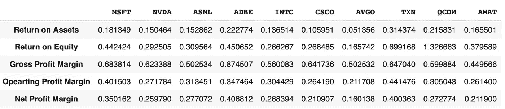

# 用 Python 进行利润率分析

> 原文：<https://towardsdatascience.com/profitability-margin-analysis-with-python-ae8290ee0015?source=collection_archive---------18----------------------->

## 盈利率是一种财务指标，可以洞察一家公司产生收益的效率。

在本帖中，我们将使用 Python 进行**利润率分析，比较同行公司的利润率。下面是我们将计算和分析的 5 个不同的相关盈利率:**

*   纯利润率
*   毛利
*   营业利润
*   资产回报率
*   股本回报率

照片由[埃米利奥·塔卡什](https://unsplash.com/@emiliotakas?utm_source=medium&utm_medium=referral)在 [Unsplash](https://unsplash.com?utm_source=medium&utm_medium=referral) 上拍摄

# 如何计算盈利率

在开始用 Python 代码识别同行公司和分析利润率之前，我们将在本节中介绍每个比率。

## 利润率和利润率

利润率对于了解一家公司将收入转化为营业收入和净收入的效率非常有用。在这个故事中，我们将涵盖三个主要指标:毛利率、营业利润率和净利润率:

***毛利率=毛利/收入***

***营业利润率=营业利润/收入***

***净利润率=净收入/营业收入***

在进行财务分析时，我们需要意识到，在比较同行时，我们可以得出非常有见地的结论。例如，通过比较各公司的净利润率，我们可以确定哪些公司在将销售额转化为利润方面的运营效率更高。

一旦我们在一群同行中找到净利润率表现最好的公司，我们就可以进一步**分析毛利率** **和营业利润率，以更好地理解为什么表现最好的公司有优势。较高的营业利润率表明一家公司要么拥有极具竞争力的毛利率，要么拥有极具吸引力的营业利润率。也就是说，能够产生一个单位的销售额，减少产生一美元销售额所需的[销售成本](https://en.wikipedia.org/wiki/Cost_of_goods_sold)(更高的毛利率)或更低的营销&销售、研究&开发和 G & A(一般和管理)费用。**

或者，为了比较同类公司，我们可以进行时间序列分析，以分析单个公司在不同时期的表现。这种比率分析对于了解公司趋势特别有用。在我上一篇关于[用 Python 分析资产负债表财务比率的文章](https://codingandfun.com/analysing-balance-sheet-financial-ratios-with-python/)中，我谈到了财务比率的时间序列分析。

# 股本回报率和资产回报率

ROE 或 ROA 是盈利能力比率，衡量一家公司基于所用股本(ROE)或所用资产量(ROA)创造利润的效率。

我们已经在我的前一篇文章[中看到了如何用 Python](https://codingandfun.com/analyze-a-firm-roe-with-python/) 分析公司的股本回报率。因此，关于如何解释**净资产收益率(ROE)** 比率，我们无需赘述。这个财务比率只是让我们知道一家公司基于股东权益能创造多少净收入。

同样，**资产回报率(ROA)** 表示一家公司使用多少资产来创造净收入。

***净资产收益率=净收入/平均总股本***

***ROA =净收入/平均总资产***

太好了，我们已经讨论了足够多的理论。让我们在下一节中看看我们如何首先找到对等公司，然后使用 Python 检索利润率。

# 用 Python 检索利润率

我们将使用[financial modeling rep](http://financialmodelingprep.com)来检索和处理所需的财务数据。这篇文章中的代码非常简单。以下是脚本执行的高级步骤:

1.  **查找所有公司同辈**。为此，我们将依靠 Financialmodelingprep。该应用编程接口提供了检索所选公司的同行的入口和终点。因此，我们只需要在 url 中传递公司的股票代码。然后，API 将返回一个 Python 列表，其中包含基于行业和市值的所有对等项。
2.  循环遍历每只股票，从财务比率 API 端点**检索盈利比率**。
3.  **将每个财务比率提取并添加到 Python 字典中**。这将有助于能够按公司列出财务比率。
4.  将 Python 字典转换成熊猫数据框架

请注意，我们需要 financialmodelingprep 中的一个 API 键，以便代码工作。您可以通过每天 250 个请求获得一个免费的 API 密钥。

财务盈利能力分析

运行代码后，下面的 Pandas DataFrame 将显示使用 Python 进行的**盈利能力分析的结果。我们得到一个包含苹果公司同行的财务表，因为这是我们在代码中传递的公司。请随意更改股票代码，以便为其他公司执行类似的盈利能力分析。**

同行公司盈利能力分析

# 包扎

是不是很棒？使用不到 20 行 Python 代码，我们能够比较不同同行公司的盈利能力指标。

我们看到与其他公司相比， *Adobe* (ADBE)的净利润率非常高。我们可以观察到，Adobe 较高的净利润率主要是由较高的毛利率推动的，相比之下，同行的毛利率约为 87%。这可能是因为 Adobe 的数字产品缺乏实体，而且生产成本相对较低。但营业利润率与其余同行持平。可能是因为 Adobe 在新产品研发上的投入。

下一步，我们可以改进 Python 脚本来添加新的函数。例如，我们可以计算每个指标的平均值，以便将每个公司与该组的平均值进行比较。

***请注意，本帖包含的任何信息都将用作财务建议。此处提供的信息可能不准确，因此不应用于投资决策。***

*原载于 2021 年 5 月 22 日 https://codingandfun.com**的* [*。*](https://codingandfun.com/profitability-analysis-with-python/)