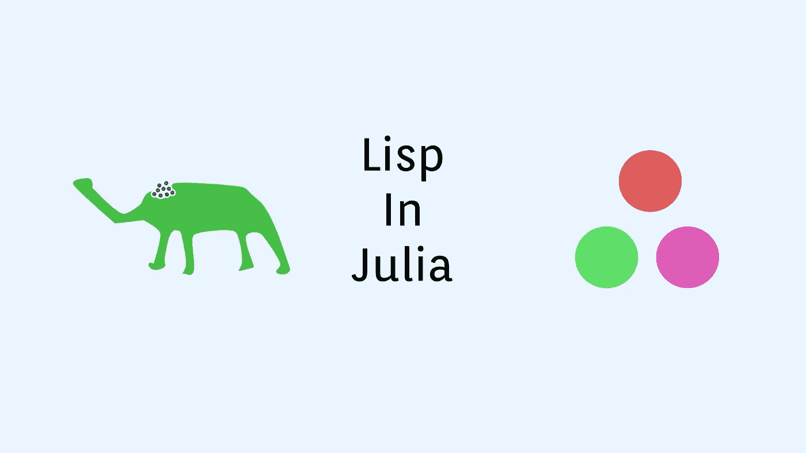

# 用 Julia 在 5 分钟内编写一个 Lisp REPL

> 原文：<https://towardsdatascience.com/programming-a-lisp-repl-in-julia-in-under-5-minutes-f204046e75cb?source=collection_archive---------28----------------------->

## 使用 Julia 生态系统解释 Lisp 代码的快速而独特的方法



(图片由作者提供)

# 介绍

在上一篇文章中，我详细介绍了一个非常棒的 Julia 包，它完全有可能使用 REPL 的解析器创建交互式 REPLs，而无需 Julia 代码进行交互。这个包叫做 REPLMaker.jl，是一个非常酷的工具，它在很多方面改变了 Julian 的面貌。这个包产生影响的一个显著例子是在 Genie.jl 中。Genie.jl 具有交互式复制器，使得处理依赖关系和部署 web 服务器变得非常容易。

虽然这可能不是最好的例子，但在使用 Julia 中的 REPLMaker 创建 REPLs 方面，几乎有无限的潜力。在我介绍该软件的上一篇文章中，我最终创建了一个评估 Julia 表达式的 REPL。如果你想阅读我以前关于 REPLMaker.jl 的文章，你可以在这里查看:

</replmaker-jl-create-interactive-julia-packages-67be382f3eb8>  

# 入门指南

因为我们将使用 REPLs，所以我们将对这个 Lisp 示例中的所有代码使用朱莉娅 REPLs。包 [lispSyntax.jl](https://github.com/swadey/LispSyntax.jl) 提供了一个字符串宏，用于将 Lisp 风格的代码解析为 Julia 代码，然后对其进行评估，本质上创建了一种新的 Lisp 编程语言，由 Julia 代码进行解释。为了开始，我们需要添加这个包以及 REPLMaker.jl。为了做到这一点，我喜欢用]输入 Pkg REPL，而不是导入 Pkg 并使用 Pkg.add()方法。

```
julia> ]
pkg> add LispSyntax
pkg> add REPLMaker
```

下一步是将这些模块及其各自的导出加载到我们的 Julia 环境中。

```
using LispSyntax, ReplMaker
```

之后，我们将从 REPL.jl 加载一些东西。不要担心，你不需要添加这个包，因为它包含在 Julia 库中。

```
using REPL: REPL, LineEdit
```

最后，我们还需要一个不是从 LispSyntax 导出的模块，名为 ParserCombinator。我们可以称之为 LispSyntax。ParserCombinator，但是直接导入将使它更容易调用。

```
using LispSyntax: ParserCombinator
```

现在我们要获取我们的解析函数。这存储在别名为“lisp_eval_helper”的 LispSyntax 模块中。

```
lisp_parser = LispSyntax.lisp_eval_helper
```

这个函数将成为解析器，接受我们传递的 REPL 参数并生成返回。

# REPL

现在我们有了一个 Lisp 解析器，我们需要一种方法来评估语法，以避免得到令人困惑的返回。如果我们不完成这一步，那么语法不好的代码很可能会抛出一个非常详细的错误，这个错误在解释函数的 Julia 代码中有所涉及。这使得在 Lisp REPL 中工作时很难追踪问题和错误。为了做到这一点，我们将使用 LispSyntax。ParserCombinator . parser exception，以便从解析器获得一个返回，LispSyntax.read()评估解析器是否能够读取传递的代码。

```
function valid_sexpr(s)
  try
    LispSyntax.read(String(take!(copy(LineEdit.buffer(s)))))
    true
  catch err
    isa(err, ParserCombinator.ParserException) || rethrow(err)
    false
  end
end
```

我们当然可以使用 try/catch 块来实现这一点。如果解析器不能读取传递的缓冲区，那么传递的内容很可能有错误。这个过程的最后一步是用我们的解析器和错误捕捉器函数作为参数初始化一个新的 Lisp REPL:

```
initrepl(lisp_parser,
                valid_input_checker=valid_sexpr,
                prompt_text="LISP > ",
                prompt_color=:blue,
                start_key=")",
                mode_name="Lisp Mode")
```

现在，我们可以使用这个新的朱利安 Lisp REPL 按下)键！现在你可以在 Julia 语言中尽情地列举了！

# 结论

Julian 包生态系统有许多非常酷的宝石，使包探索成为一个不断的旅程，展示编程是多么令人兴奋。这里我们看到，只需几个步骤，利用 Julia 的生态系统，使用 Julia 的垃圾收集和开源 Lisp 解析器，在几秒钟内编写一个令人惊叹的程序是完全可能的。更令人兴奋的是它的增长速度！有这么多有趣的项目，人们可以用现有的工具来做，比如这个，只需要几分钟就可以完成！感谢您的阅读！