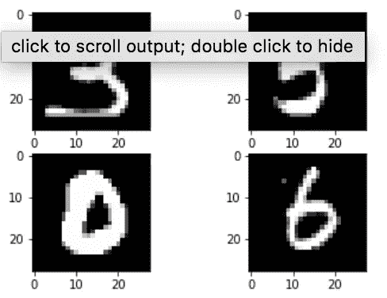
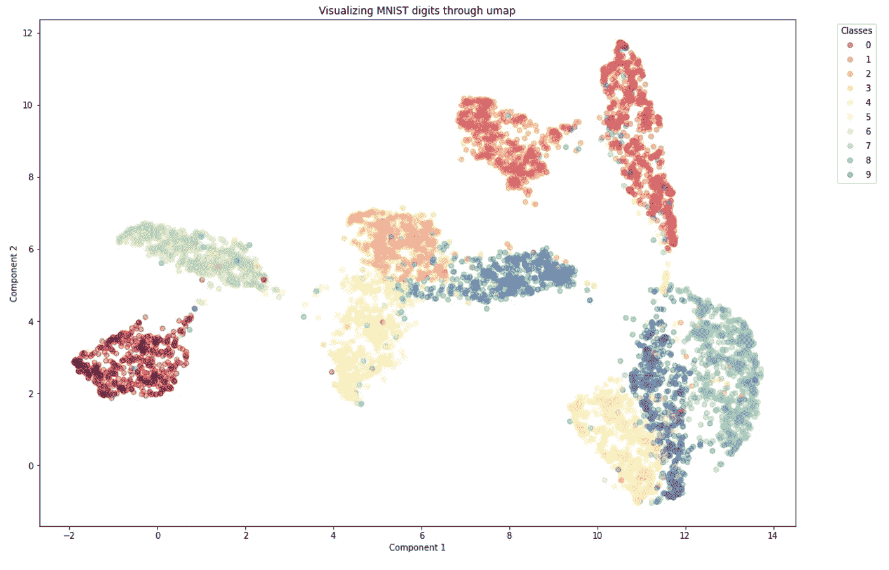
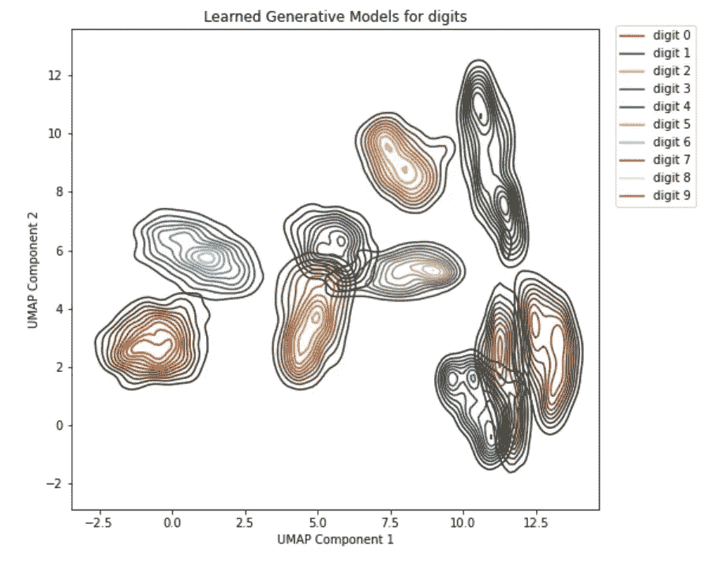

# 工程直观计算机视觉

> 原文：<https://towardsdatascience.com/programming-an-intuitive-image-classifier-part-1-266bd657aa4?source=collection_archive---------13----------------------->

## [动手教程](https://towardsdatascience.com/tagged/hands-on-tutorials)，*比人工更智能*

## *我们如何才能创建一个像人类一样做出决策和预测的图像分类系统？*


照片由[最大聚焦](https://unsplash.com/@maximalfocus?utm_source=medium&utm_medium=referral)在[未飞溅](https://unsplash.com?utm_source=medium&utm_medium=referral)上拍摄

图像分类是机器学习、数据科学和人工智能的最热门领域之一，通常用于测试某些类型的人工智能算法——从逻辑回归到深度神经网络。

但是现在，我想把你的注意力从这些热门技术上移开，问我们自己一个问题:如果我们人类看到一个手写字符的图像，或者一只狗或猫，我们的大脑如何直观地分类不同类型的图像？以下是图像中数字的示例；“2”、“0”、“1”和“9”。


照片由[诺德伍德主题](https://unsplash.com/@nordwood?utm_source=medium&utm_medium=referral)在 [Unsplash](https://unsplash.com?utm_source=medium&utm_medium=referral) 上拍摄

在上面的数字例子中，我们的大脑如何区分底部的 1 和 9 呢？嗯，直觉上，我们的大脑对 1 的样子有一种“心智模型”，对 9 的样子也有一种心智模型。对于一个数字的新图像，我们的大脑可以根据每个心理模型来比较这个数字，并决定它是 1、9 还是完全不同的手写字符。事实上，我们的心智模型不仅仅可以分类:它可以*生成*相似数据的新实例。第一次给小孩子看数字，这样他们的大脑可以形成一个心理模型，我很肯定他们可以学会画出新的数字，比如 1 或 9，或者上面照片中的其他数字。

现在*这种*类型的决策、分类，与你在摄像机、医院等世界各地部署的流行人工智能视觉系统中看到的截然不同。——那些依赖于卷积深度学习的东西——[看看这个视觉演示。](https://poloclub.github.io/cnn-explainer/)虽然卷积神经网络(CNN)的卷积层可能类似于我们眼中视觉系统的特定部分[根据作者](https://www.nature.com/articles/srep32672)的说法，深度 CNN 网络的实际决策主要来自网络前馈“最终完全连接层”中成千上万的调谐权重。

顺便说一句，如果你没有听说过神经网络或者不熟悉神经网络是如何用于图像分类的，我绝对[推荐 3Blue1Brown (3b1b) Youtube 频道上格兰特·桑德森](https://www.youtube.com/watch?v=aircAruvnKk&t=985s)的这个视频；他的阐述和解释非常精彩。

但是我们将要设计的决定和分类数字的 ML 系统将不会像人工神经网络那样包含成千上万的权重和参数。

在我们继续之前，我们需要弄清楚数字在计算机中的“心智模型”是什么样的。

**什么是大脑相对于计算机的“心智模型”？**

简而言之，大脑中的实际心理模型——嗯，我们仍在研究中。关于大脑，我们还有很多不了解的地方，神经科学家、认知科学家和其他人有很多共同之处。

然而，越来越多的理论认为大脑中的心智模型在计算上与 T10 相似。计算神经科学家 Karl Friston 的这篇文章更多地讨论了大脑如何“调用一个内部的、精神的世界生成模型”来推断和预测从身体其他部分(包括视觉系统)接收到的感觉信号背后的原因的计算理论。在这个理论中，大脑基本上必须根据它拥有的心理模型来推断感觉的原因，关于哪些可能的原因导致可能的身体感知。弗里斯顿还提到，像这样的计算模型已经预测了广泛的真实生物生理和行为现象。我省略了一堆细节，如果你感兴趣，可以看看这篇文章:)

在我们的机器学习案例中，谢天谢地，我们不必处理所有的身体感觉——只是屏幕上的 28x28 黑白图像。但这仍然是一个具有挑战性的问题！——否则计算机视觉早就“解决”了。所以现在的问题仍然是:在某种意义上，我们如何创建一个“心理生成模型”，让计算机能够将其作为一个对象保存在内存中？

**作为“分布”的生成模型**

之前我说过一个“心智模型”，或者说一个生成模型，如何让你基本上创建类似数据的*新*实例。如果我在比如数字 2 上训练一个生成模型，那么计算机将能够画出 2 的新实例。拥有一个创建这些实例的模型就像一个粗略的蓝图:它允许你填充细节并创建房屋、建筑等的不同实例。这个“粗略的蓝图”被称为*分布*，因为，直觉上，你基本上是在生成新数据的集合——而分布只是集合的另一个词。专业术语称之为“*概率分布*”(别担心，我不会重温统计职业的恐怖！)因为在您生成的集合中，有些样本比其他样本更有可能。例如，如果计算机正在生成“2”的新实例，那么顶部缺少“弯钩”的 2 的样本将被计算为“不太可能像”2，而不是如果它有 2。不太可能只是意味着模型产生的 2 比通常的 a 2 看起来要少*。*

*用机器学习的语言来看待生成模型的另一种方式是，它们创建“聚类”的模型——它们帮助将数据聚类到特定的区域。这将被称为“无监督学习”——在没有任何训练标签来教导机器的情况下推断数据*中的结构。**

**

*美国宇航局在 [Unsplash](https://unsplash.com?utm_source=medium&utm_medium=referral) 拍摄的照片。看到上图中城市灯光的某些“簇”是如何聚集在一起的了吗？生成模型将能够为用户提供一个“蓝图模型”,显示城市和农村地区的光照分布情况。*

*既然我们知道生成模型是分布，我们首先需要做的是看看如何在数字类型(0，1，2，..9).在 Python 的 *sci-kit learn* 库中，有一个名为*密度估计模型*的函数可以帮助我们。*

*分类的最后一步:推理*

*现在，我们的计算机为每种类型的数字调用它自己的内部生成“心智模型”,并生成新类型的图像——这肯定很酷！—但我们仍然需要完成我们的第一个目标:分类和预测它以前没有见过的数字的新图像。*

*在我们的直觉分类器中进行分类和预测的关键叫做*推理*。实际上，我们的大脑一直在这么做！想象一下下面这个问题:*

*"你今天晚餐只能吃绿色蔬菜了！"绿色指的是什么？*

*嗯，绿色是一种颜色，而且绿色以复数形式使用，可以推断它指的是绿色物体——但是*什么*物体？我们的大脑*推断*这些“物体”是指绿色蔬菜，如花椰菜、菠菜、甘蓝等。因为还有什么绿色的东西可以煮着吃？我们的大脑很容易一直进行这样的推理，但如果没有数十亿个数据点、参数和高能量使用，让自然语言处理(NLP)计算机系统进行这样的推理是非常困难的——这是人类大脑并不真正需要的。幸运的是，我们现在没有处理 NLP 推理，但不要误解我——视觉类人推理也是人工智能中需要克服的一个长期挑战。*

*总之，回到视觉。我们希望我们的计算机*根据它对数字外观的“心智模型”(分布)来推断*新的数字将会是什么。这样的推论会是怎样的呢？假设我们只处理两种类型的数字。一个 2 和一个 7。假设计算机已经创建了它认为 2 和 7 的 28x28 图像的分布。当一个新的未见过的图像出现时，它是如何推断的？计算机问自己:在哪个心智模型下，图像*更有可能*:我的 a 2 模型，还是 a 7 模型？如果它更有可能在 a 2 下，那么我将决定该图像是 a2；否则我决定 7。这样，实际的分类就变成了 if-else 条件语句，这种语句在从 Python 到 Java 再到 c 的计算机科学语言中非常普遍。有趣的是，这个决定是非常程序化的！*

*如果你想了解更多关于概率分布的知识或者熟悉它，我推荐[来自 Youtube 频道“3Blue1Brown”的 Grant Sanderson](https://www.youtube.com/watch?v=ZA4JkHKZM50) 的这个视频，以及关于概率和统计的 KhanAcademy 视频！*

*所以…让我们开始实施吧！在我们开始之前，请稍作休息！*

***数据导入***

*首要任务是从某处导入手写数字数据。为此，TensorFlow 和 Keras(运行在 Tensorflow 之上的高级语言)有一个组织良好的数据集集合，而 Keras 恰好有手写数字。MNIST 数据集[可以在这里](https://keras.io/api/datasets/mnist/)找到(它的许可证是:CC BY-SA 3.0)。要导入数字数据集，我们只需使用代码:*

```
*from keras.datasets import mnist
(x_train, y_train), (x_test, y_test) = mnist.load_data()*
```

**

*这里有一个 Keras MNIST 训练图像数据的样本*

*来自 Keras 的 MNIST 数据集每个数字类有 6，000 个训练样本，我们有 10 个类(因此总共有 60，000 个训练数字)，但我们不会使用那么多数据。为什么？首先，为了表明原则上我们可以不用那么多数据来创建这些生成模型。但是，在现实世界中，60，000 个训练数据点可能并不存在，每个类可能只有几十或几百个训练数据。所以我们要做的只是从训练组中随机选择一组，比如说 6000 个数字。这给了我们每个数字类大约 600 个训练数字样本。那已经是*减少 90%* 的原始数据了！因此，如果我们可以基于这个更小的训练集来训练每个数字类的生成性“心智”模型，我们将更有数据效率。*

*我们可以随机抽样，用下面的代码创建一个新的更小的训练集:*

```
*np.random.seed(10)
random_indices = np.random.choice(60000, size=6000, replace=False)
random_x_train = x_train[random_indices, :]
random_y_train = y_train[random_indices]*
```

***特征提取***

*为了创建模型，我们首先必须做所谓的“特征工程”(或者“特征选择”，如果您处理的数据中的特征是表中的列)。我们为什么要这么做？嗯，我们必须意识到一些事情:这些图像存在于一个非常非常高维度的空间中。每幅图像有 784 个像素，所以作为一个*向量，*每幅图像都存在于同一个 784 维空间中。就此而言，我们甚至不能在 4D 空间中绘制图形，所以放弃在 784D 空间中绘图吧！*

*处理高维数据可能非常困难，高维空间会发生一些奇怪的事情——例如，在 4D 和更高的地方，球体开始变得“尖锐”:[如果你想体验一下，请查看 Youtube 频道 Numberphile](https://www.youtube.com/watch?v=mceaM2_zQd8&t=224s) 的视频。你可能也听说过这种现象，称之为机器学习中的“维数灾难”。*

*如果您有以要素为列的表格数据，有一些统计方法可以根据统计资料(如相关性和分布)预先选择一组较小的要素。如果你*没有*有表格数据，一般来说有几种方法可以做特征*提取。*对我们来说幸运的是，有一种提取特征的神奇方法——在 ML 行话中也称为“降维”——我们可以保存几乎所有关于数据的信息，然后一路走到 2D！它被称为 UMAP-y[你可以在这里阅读 Python 用户手册](https://umap-learn.readthedocs.io/en/latest/)-它是由数学家利兰·麦金尼斯在 2018 年创建的。UMAP 代表“一致流形逼近和投影”——如果这是一个口，不要担心。(如果你想要一个解释，[看看 Letitia 博士的这个视频](https://www.youtube.com/watch?v=6BPl81wGGP8))我可以用最简单的方式解释:UMAP 算法试图根据数据的聚集程度用点和线连接 784D 图像数据(有点像社交网络！);然后使用*拓扑将整个图*投影*，*到一个低维空间。如果你想将数据点可视化，你必须一直向下投射到 2D 或 3D 空间，就像我下面所做的:*

**

*图片来源:Raveena Jayadev。“组件 1”和 2 代表 UMAP 组件。如果你听说过的话，这基本上与“PCA”中用于降维的“主成分”是一回事。*

```
*mapper = umap.UMAP(n_components=2, random_state=40).fit(random_x_train)
umap_components = mapper.transform(random_x_train)*
```

*你在这里看到的星团之间的距离反映了这样一个事实，以某种具体的方式，像 0 和 7 这样的数字与 7 和 9“很远”或“相当分开”。当然你可能会说“Raveena！每个数字都是分开的”这是事实，但是当手写数字时，有时笔画会令人困惑。这就是 UMAP 试图压缩到 2D 的基本结构，这样我们就可以亲眼看到了！*

**(免责声明:*虽然 UMAP 分量在散点图中显示出清晰的聚类，但是分量轴本身并不是人类能够真正解释的。但是，决策预测过程仍然是。)*

***学习“心理”生成模型***

*现在是时候学习“心智模型”了——计算机将从数据中学习的每一类手写数字的生成概率模型，以便在分类时做出有根据的推断。为了创建实际的模型，我们将在 *sci-kit learn* 模块中使用一种称为*内核密度估计(KDE)* 的技术。想象一组数据点，其中一些点彼此靠近，一些点更加孤独和孤立。估算过程如下图所示:*

**

*图片来源:维基百科。底部的黑色刻度线是集合中的数据点，红色虚线是放置在每个点上的小钟形曲线。KDE 将钟形曲线平均成蓝色实线，从而得到大致的形状。(链接:[https://en.wikipedia.org/wiki/Kernel_density_estimation](https://en.wikipedia.org/wiki/Kernel_density_estimation))*

*一旦我们了解了每个数字的生成性“心理”模型，我们就可以将这些模型绘制在一起，并使用 10 种不同的颜色来表示数字 0-9 及其模型形状。下面的每个“形状优美的斑点”代表计算机从每个数字的数据中学习的内部模型，类似于人类大脑对数字应该看起来像什么的内部模型。*

**

*图片来源:Raveena Jayadev*

*现在我们的计算机已经有了每个数字的生成模型，是时候做…推理了！在这个项目中，我想强调两件事:1)我们可以编写图像分类器，像人脑一样用内部“心理”模型进行推理和决策，2)这使得人工智能系统易于*排除故障*。在一个黑盒深度人工智能系统正在世界各地部署[并经常歧视边缘化人群](/towards-trans-inclusive-ai-a4abe9ad4e62)(Zachary Hay 的文章*走向数据科学*)的时代，很难排除这些系统可能做出的歧视性预测——如果你不能排除故障，这个系统在我看来还不如危险。*

*不过，让我向您展示我们如何检查我们在本文中创建的系统。下面是我们的系统将如何推断和预测一个看不见的测试图像的内容的总结代码:*

```
*def decision(sample, mental_models):
... (summary) 
   **if likelihood_ratio <= 3.0:**
        print("There's very little evidence that my first choice, is better than my second choice."
       **return "I refuse to decide!"**
   **elif (likelihood_ratio > 4.0) and (likelihood_ratio <= 10.0):**
        print("There is a bit of evidence that my first choice is better than my second choice")
       **return "maybe digit {} over {}"
   else:** print('There is strong evidence that my first choice, is better than my second choice.'
       **return [confident machine choice]***
```

*(机器预测代码看起来就像一个 *if-else 语句*(如上所述)，机器可以用*不同的*置信度进行预测，这非常直观！)*

*现在假设我们给这个人工智能系统一个 3 的图像，相反它预测的是 5。我们如何对模型进行故障诊断，以了解它是如何出错的？好吧，跟我来:*

*   *机器从 if-else 语句中决定，在其生成性“心理”模型下，5 比 3 更有可能来自图像数据。*
*   *If-else 决策是纯逻辑，因此这意味着问题不在于决策，而在于*统计心智模型*或*特征提取*。我们可以要求机器显示心智模型和特征提取，就像我上面做的那样。从那里我们可以分析模型的缺点，并看看如何调整它们。*

*在这两个步骤中，我们已经确定了如果这个人工智能系统出错，它可能会在哪里出现问题，相比之下，世界上许多连接到监控技术的深度学习系统甚至不能以这种方式进行故障排除，这导致了潜在的危险人工智能。*

*我希望你，读者，从这篇文章中带着这样的希望离开:1)我们可以创建人工智能系统，它可能像人类一样直观地做出决策，2)如果人工智能模型出错，我们可能可以*对其进行故障排除*，并回溯错误直到系统的内部部分，并了解应该修复什么，应该废弃什么。*

*不可否认，你可能会告诉我:“Raveena，UMAP”特征提取看起来不太直观！”是的，我知道。不幸的是，这些特征不是人类可以解释的。然而，有一种方法可以修改这个系统，使它*可以*被解释，尽管是以不同的方式。如果你有兴趣知道，[麻省理工学院教授 Joshua Tenenbaum](https://www.cs.cmu.edu/~rsalakhu/papers/LakeEtAl2015Science.pdf) 在 2015 年发表的这篇文章谈到了使用与我们的概率生成模型非常相似的内部“心智模型”来制作人工智能手写字符分类器系统。事实上，它是如此直观和数据高效，它只从 *30 个数据点*中学习，并模仿人类手写符号出奇地好。在我看来，这是人工智能未来最具革命性的创造之一。*

*顺便说一下，[如果你想看完整的实现细节，这里有我的代码](https://github.com/galaxyenby1997/Image-Classifier-generative)的链接:我的 Github 是公开的，可以免费访问:)*

***参考文献***

1.  *托马斯·帕尔(Thomas Parr)，卡尔·弗里斯顿(Karl Friston)，《推理的解剖:生成模型和大脑结构》(2018)，《计算神经科学前沿*，2018。**
2.  *S.R. Kheradpisheh 等人，深度网络可以在不变物体识别中类似人类的前馈视觉(2016)， *Nature* 。*
3.  *约书亚·特南鲍姆(Joshua Tenenbaum)，布伦丹·莱克(Brendan Lake)，通过概率程序归纳进行人类水平的概念学习(2015)，*科学*。*