# 使用 dplyr 编程

> 原文：<https://towardsdatascience.com/programming-with-dplyr-a8161c03d947?source=collection_archive---------37----------------------->

## 在 1.0 版本中，你可以用新的方式编写函数

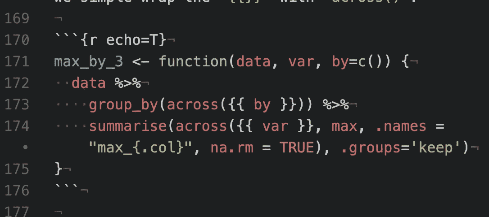

我们的超能力！图片作者。

如果你是 R 的新手，那么使用 dplyr 编程的文档是最好的参考……但是如果你不是，让我们看看如何从旧的方式升级你的编程。

如果您熟悉使用`sym`并从标准形式转换为非标准形式，下面的进度将向您展示如何替换(和扩展)您的代码。应该大多是查找-替换！如果你有一个函数，它接受一个字符向量并使用一个`_at`动词，看看相应的旧选项(这里是带有`_at`的选项 1)之间的区别，并看看底部的“超级版本”是如何改变的。

# 老办法 1:使用`*_at`动词

这是编写 dplyr 函数的老方法:

```
max_by_at <- **function**(data, var, by="") {
  data %>%
    group_by_at(by) %>%
    summarise_at(var, max, na.rm = TRUE)
}
```

让我们试一试:

```
starwars %>% max_by_at("height", by="gender")
starwars %>% max_by_at(c("height", "mass"), by="gender")
starwars %>% max_by_at(c("height", "mass"), by=c("sex", "gender"))
```

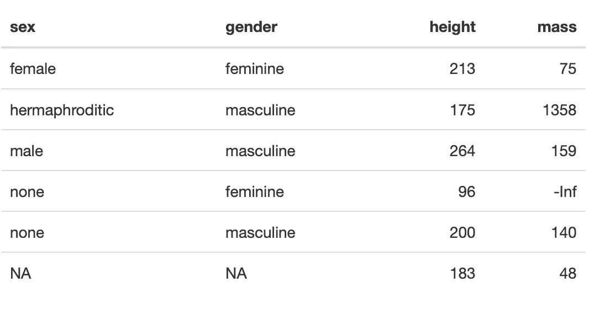

这很有效，但是对 env 变量无效:

```
testthat::expect_error(starwars %>% max_by_at(height, by=gender))
testthat::expect_error(starwars %>% max_by_at("height", by=gender))
testthat::expect_error(starwars %>% max_by_at(height, by="gender"))
```

# 旧选项 2:使用`*across*`

这适用于字符和字符向量，但不适用于 env 变量。使用`across`是使用`*_at`的替代，它具有相同的功能:

```
max_by_across <- **function**(data, var, by="") {
  data %>%
    group_by(across(by)) %>%
    summarise(across(var, max, na.rm = TRUE), .groups='keep')
}
```

这是如何工作的:

```
starwars %>% max_by_across("height", by="gender")
starwars %>% max_by_across(c("height", "mass"), by="gender")
starwars %>% max_by_across(c("height", "mass"), by=c("sex", "gender"))
```

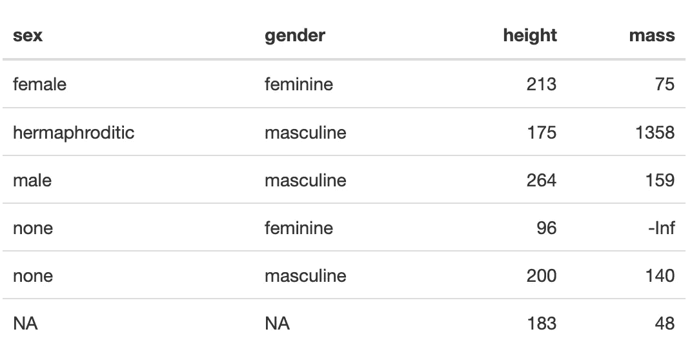

这对向量和字符串都有效(记住，R 中的所有东西实际上都是向量)。但是我们不能使用环境变量:

```
testthat::expect_error(starwars %>% max_by_across(height, by=gender))
testthat::expect_error(starwars %>% max_by_across("height", by=gender))
testthat::expect_error(starwars %>% max_by_across(height, by="gender"))
```

# 旧选项 3:通过`sym`从字符转换为环境变量

```
max_by_1 <- **function**(data, var, by="") {
  data %>%
    group_by(!!sym(by)) %>%
    summarise(maximum = max(!!sym(var), na.rm = TRUE))
}
```

它不适用于传入 env 变量:

```
testthat::expect_error(starwars %>% max_by_1(height))
testthat::expect_error(starwars %>% max_by_1(height, by=gender))
```

它对字符串有效:

```
starwars %>% max_by_1("height")
starwars %>% max_by_1("height", by="gender")
```

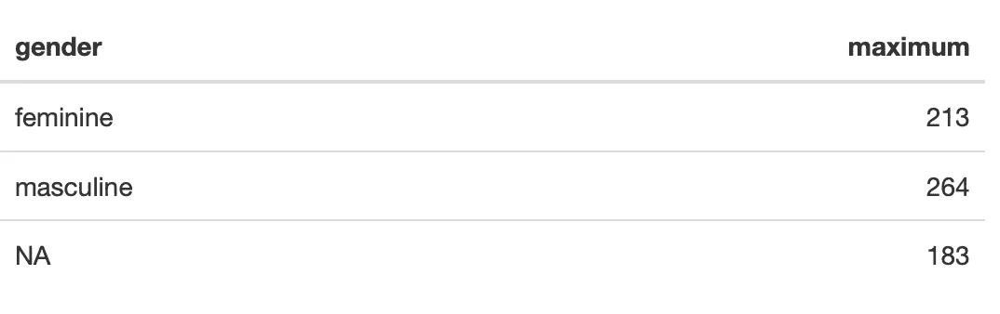

但是，它对列表不起作用(所以，它没有`across`那么通用):

```
testthat::expect_error(starwars %>% max_by_1(c("height", "weight")))
testthat::expect_error(starwars %>% max_by_1("height", by=c("gender", "sex")))
```

# 戴牙套更好

看看这个改进的版本！

它适用于 env 变量，所以我们可以像使用非标准 eval 的 dplyr 函数一样使用它，也可以传入`sym`变量。

```
max_by_2 <- **function**(data, var, by) {
  data %>%
    group_by({{ by }}) %>%
    summarise(maximum = max({{ var }}, na.rm = TRUE))
}
```

它对 env 变量有效！

这很酷:

```
starwars %>% max_by_2(height)
starwars %>% max_by_2(height, by=gender)
```

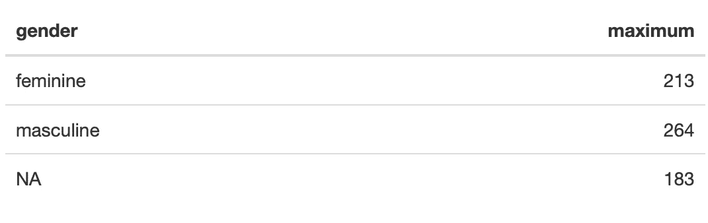

它不适用于现成的字符串:

```
starwars %>% max_by_2("height")
starwars %>% max_by_2("height", by="gender")
```

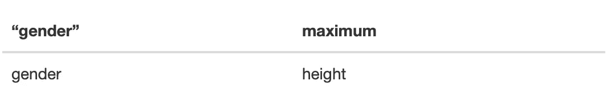

我们可以用`sym`来解决这个问题:

```
starwars %>% max_by_2(!!sym("height"))
```

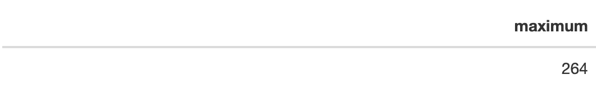

它不适用于环境变量列表:

```
starwars %>% max_by_2(c(height, mass))testthat::expect_error(starwars %>% max_by_2(height, by=c(gender, sex)))
```

# 超级版本

我们将使用`across()`来允许字符串、环境变量列表，甚至字符串列表。默认的`by=()`变成一个空列表，我们简单地用`across()`包装`{{}}`:

```
max_by_3 <- **function**(data, var, by=c()) {
  data %>%
    group_by(across({{ by }})) %>%
    summarise(across({{ var }}, max, .names = "max_{.col}", na.rm = TRUE), .groups='keep')
}
```

它适用于环境变量:

```
starwars %>% max_by_3(height)
starwars %>% max_by_3(height, by=gender)
```

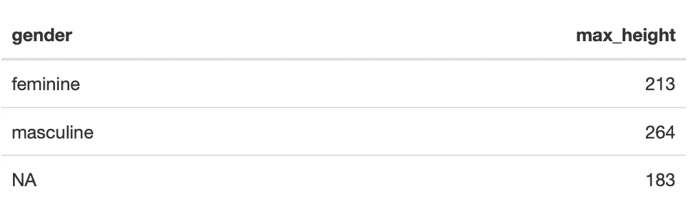

它适用于字符串:

```
starwars %>% max_by_3("height")
starwars %>% max_by_3("height", by="gender")
```

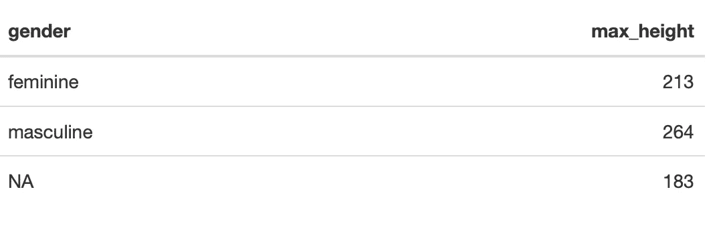

它适用于 env 变量列表:

```
starwars %>% max_by_3(c(height, mass))
starwars %>% max_by_3(height, by=c(gender, sex))
starwars %>% max_by_3(c(height, mass), by=c(gender, sex))
```

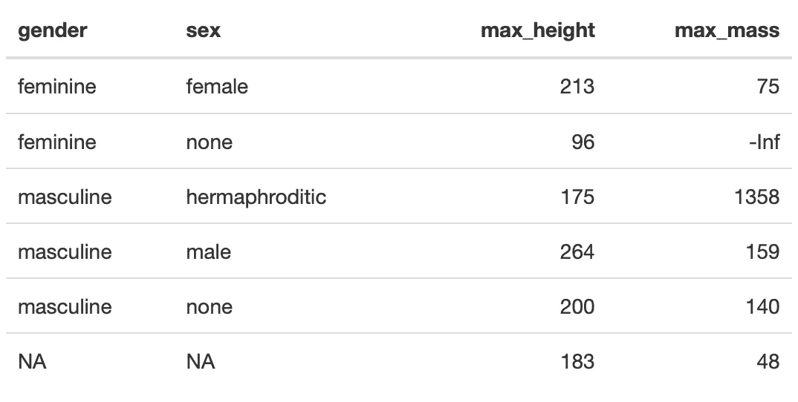

它适用于字符列表:

```
starwars %>% max_by_3(c("height", "mass"))
starwars %>% max_by_3("height", by=c(gender, sex))
starwars %>% max_by_3(c("height", "mass"), by=c("gender", "sex"))
```

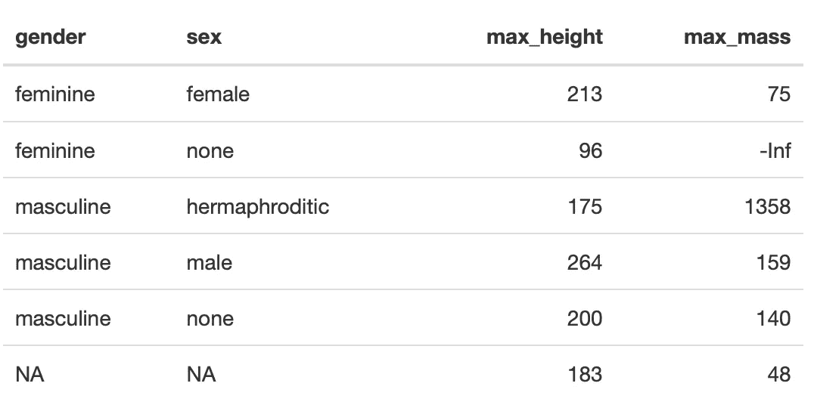

现在您已经看到了如何使用 dplyr 编程的新功能编写一些非常灵活的函数。尽情享受吧！