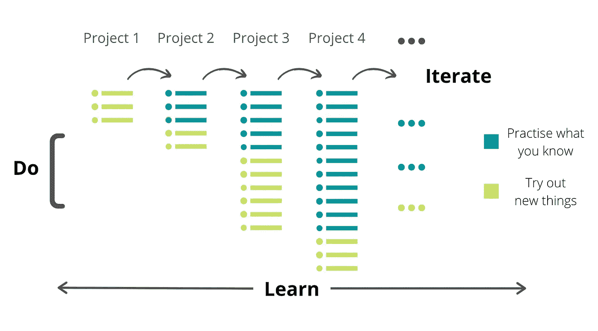
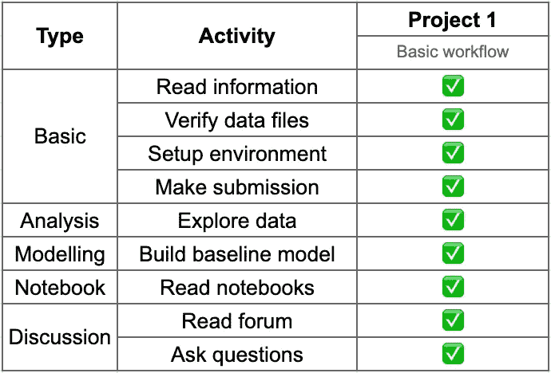
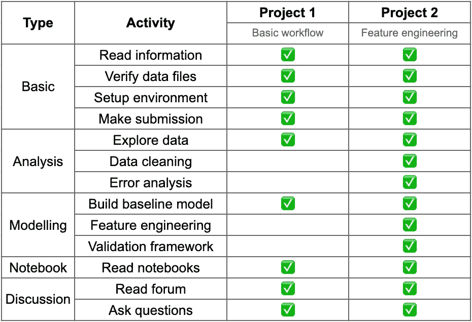
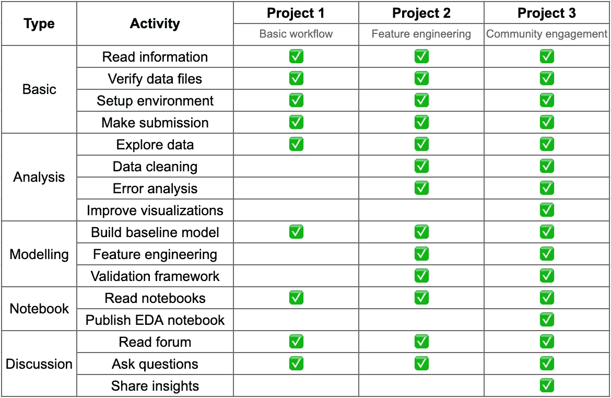
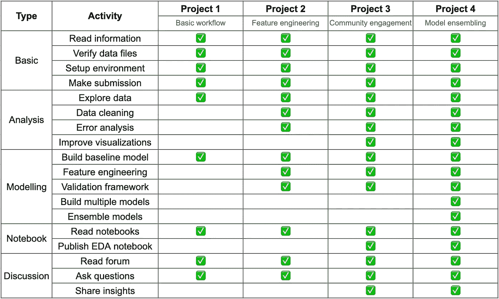

# 逐渐接近卡格尔

> 原文：<https://towardsdatascience.com/progressively-approaching-kaggle-f58db71a42a9?source=collection_archive---------9----------------------->

## 使用表格游乐场系列开始 Kaggle 竞赛

布雷特·乔丹在 [Unsplash](https://unsplash.com?utm_source=medium&utm_medium=referral) 上的照片

[泰坦尼克号比赛](https://www.kaggle.com/c/titanic)是大多数人对 Kaggle 的第一次尝试。它有一个奇妙的资源档案，但如果你正在寻找更新、更快和更先进的东西，让你熟悉 Kaggle 比赛，那么[表格游乐场系列](https://www.kaggle.com/c/tabular-playground-series-jan-2021)是一个很好的开始。

# 表格游乐场系列(TPS)

TPS 是一系列带有简单表格数据集的月度竞赛。它有一个初学者友好的设置，以帮助 Kagglers 适应 Kaggle 比赛。

它提供了一个端到端的体验，让您快速建立探索主流比赛的信心。

**新的！**大部分的讨论、代码和模型都与今天的机器学习非常相关。老比赛中经常发现的过时的、不重要的资源被自动过滤掉。

**快了！** 30 天。这是一个将它作为一个有截止日期和可交付成果的项目进行工作的好方法。在某种程度上提供了真实比赛甚至行业工作的体验。

数据科学项目就应该这样。

如果你曾经推迟、拖延或害怕尝试 Kaggle 比赛，现在是一个把它抛在脑后并开始的好时机。我的字面意思是**现在是**。

# 渐进工作

学习。去吧。迭代。(图片由作者提供)

继续练习你所知道的。不断尝试新的东西来学习。

以下是逐步完成 TPS 竞赛的框架示例。随意选择你自己的项目或者根据你自己的兴趣和技能调整方法，因为它最适合你。为了方便起见，比赛的顺序是按时间顺序选择的，但是你可以使用你自己的顺序，因为它们都是独立的。

# 项目 1:TPS-2021 年 1 月

<https://www.kaggle.com/c/tabular-playground-series-jan-2021>  

**1:阅读比赛信息** 阅读[描述](https://www.kaggle.com/c/tabular-playground-series-jan-2021/overview/description)、[评测](https://www.kaggle.com/c/tabular-playground-series-jan-2021/overview/evaluation)、[时间线](https://www.kaggle.com/c/tabular-playground-series-jan-2021/overview/timeline)、[奖品](https://www.kaggle.com/c/tabular-playground-series-jan-2021/overview/prizes)和[规则](https://www.kaggle.com/c/tabular-playground-series-jan-2021/rules)。

一些比赛可能有更多的细节，所以养成阅读所有信息和标签的习惯。

概述页面底部提到了积分/等级标准。像 TPS 这样的初学者比赛一般不给分，因为它们主要是为了学习。

**2:验证数据文件** 阅读[数据描述](https://www.kaggle.com/c/tabular-playground-series-jan-2021/data)快速查看实际数据:[训练](https://www.kaggle.com/c/tabular-playground-series-jan-2021/data?select=train.csv)，[测试](https://www.kaggle.com/c/tabular-playground-series-jan-2021/data?select=test.csv)，[样本 _ 提交](https://www.kaggle.com/c/tabular-playground-series-jan-2021/data?select=sample_submission.csv)。检查所有字段和描述是否匹配。

了解提交文件的格式。重新考虑如何使用提交文件来计算评估指标也是一个好主意。

**3:设置您的环境** 将数据集下载到您的本地机器或使用免费代码资源，如 [Kaggle Notebooks](https://www.kaggle.com/code) 和 [Google Colab](https://colab.research.google.com/) 。

大部分比赛会直接让你从比赛的[代码](https://www.kaggle.com/c/tabular-playground-series-jan-2021/code)标签启动笔记本。

**4:探索数据**
探索数据。了解数据。

花时间在这上面。

这将是一个持续的过程，贯穿于任何项目的整个生命周期，所以要做好准备，不断地分析数据，每次都能学到更多。

一般来说，在进入公开共享的笔记本和讨论之前，先自己探索数据是个好主意。

**5:阅读论坛**
通读[竞赛论坛](https://www.kaggle.com/c/tabular-playground-series-jan-2021/discussion)。

那里有大量有用的信息和有趣的讨论。确保您了解最新情况并知晓它们。

如果你不介意通过电子邮件获得更新，你应该关注论坛。或者不时查看新的帖子和评论。

**6:阅读笔记本**
通读并理解[公共笔记本](https://www.kaggle.com/c/tabular-playground-series-jan-2021/code)。

这是你能得到的最好的资源之一。将会有一个[初学者笔记本](https://www.kaggle.com/inversion/get-started-jan-tabular-playground-competition)，这是一个开始你自己的代码的好地方，在那里你可以随着你的进步而改进和更新。

两种最受欢迎的笔记本是 EDA /分析/信息笔记本和建模/基准测试/提交笔记本。不要犹豫叉抄他们。给任何你喜欢或觉得有用的投稿投赞成票是一个很好的做法。

**7:构建基线模型**
构建一个简单的基础模型。

拥有一个非常基本的端到端模型，无论是来自您自己的代码管道，还是来自初学者笔记本或公共笔记本，都是很好的选择，这样它就成为了您可以进行量化改进的起点或分数。

通常有一个基线模型，它是简单的试探法或目标变量平均值的集合，不一定需要是机器学习模型。

**8:提交**
布丁的证明是当你最终使用一个模型对测试数据进行预测并提交给 Kaggle 排行榜时。

投降吧！成为一名卡格勒。

**9:提问** [你是你最大的资产。你是你最大的负担。选择权在你。](https://twitter.com/vopani/status/1377501855383625731)

任何你不确定或不明白的事情，你需要做的就是问。Kaggle 社区 24 小时都很活跃，总会有人帮你解决问题。

项目 1 计划(图片由作者提供)

# 项目 2:TPS-2021 年 2 月

  

**1:迭代项目 1**
做你在前一个项目中做的所有事情。跳过与你无关或你不感兴趣的东西。

**2:验证框架**
验证你尝试的一切。

建立一个强大的验证框架是多年来 Kaggle 上许多成功解决方案中最常见的主题。

花时间建立验证管道，并在本地和公共排行榜上进行测试，以了解其可靠性。有时你甚至可能需要多种验证策略，但每个比赛都不一样。

**3:数据清理**
清理数据。记住 GIGO:垃圾进，垃圾出。

回到原始数据集，将它们准备成最干净的形式。不同的数据集，有时是不同的模型，需要不同种类的预处理和转换。

使用验证分数测试和验证清理转换。

**4:特征工程**
创建特征。这是数据科学有趣的部分之一。

新功能可以极大地帮助提高模型性能。不同类型的功能可能适用于不同的模型。

狂野一点。努力实验。尝试尽可能多的功能和想法，并使用验证分数不断测试它们。通常，给你带来最佳性能的特征空间是一些原始特征和一些工程特征的混合。

推动自己从单一模型中获得最佳性能。

**5:误差分析**
确定模型能够很好预测的验证观察值和模型失败的验证观察值。想想为什么，你能做些什么。调查一下。

分析模型错误是机器学习工作流程中非常容易被忽视的一部分，但获得添加新功能的想法可能至关重要。

项目 2 计划(图片由作者提供)

# 项目 3:TPS-2021 年 3 月

<https://www.kaggle.com/c/tabular-playground-series-mar-2021>  

**1:迭代项目 2
跳过与你无关或你不感兴趣的东西。**

**2:提高可视化效果**
提高你在 Kaggle 上的可视化效果和演示效果。

虽然在 Kaggle 上你不会被直接评估，但在处理行业问题时，你可能需要向商业利益相关者展示你的工作，这是很有用的。

当然，这将有助于展示您的贡献，并从社区获得反馈。所以不要回避。

提升技能的最好方法是学习获得高度评价的 EDA 笔记本，并学习如何构建出色的可视化。

**3:发布你的 EDA 笔记本**
让 Kaggle 成为如此精彩平台的是 ka ggle 人和社区。成为它的一部分。投稿。

尝试体验一下写一个 EDA 笔记本需要什么，并让其他人提供反馈。你得到多少票并不重要。每个人都要从某个地方开始。而每个人都是从出版自己的第一本笔记本开始的，不是吗？

分享见解
如果你在数据中发现一些有趣的东西，或者如果你想分享一个有趣的见解，或者报道一个问题，或者写些什么，你将永远拥有一批读者。投稿。

论坛上的帖子。或者写点评论。开始与社区互动。你分享你的工作越多，你学到的就越多，越多的人会帮助你。

项目 3 计划(图片由作者提供)

# 项目 4:TPS-2021 年 4 月

<https://www.kaggle.com/c/tabular-playground-series-apr-2021>  

**1:迭代项目 3
做你在之前项目中做过的所有事情。跳过与你无关或你不感兴趣的东西。**

**2:探索模型**
这是你试验和构建大量模型的机会，以找出最有效的模型。这是该领域的奇特之处，但如果你认为这就是机器学习的全部，那就再想想吧。在完成三个完整的项目后，您正在处理它。

阅读和理解不同模型的内部工作原理非常重要，这样您就可以在数据集上优化它们并充分利用它们。这是获得在真实数据集上实现这些的实践经验的最佳方式，大多数最新的模型将在 Kaggle 上讨论。

**3:组合**
组合模型。没有一种模式是完美的。

有许多方法可以将多种多样的模型结合起来，几乎总能带来更稳定的预测和更好的性能。

学习和建立许多不同的模型，并在开始集成之前，首先将它们优化到最佳的功能和超参数集。

从混合模型开始，然后学习堆叠模型。

项目 4 计划(图片由作者提供)

# 学习。去吧。迭代。

虽然其中一些可能看起来很简单，但需要时间来熟练掌握。所以要多多练习。许多术语和任务需要您阅读和研究，这应该作为它们的实现和实验的一部分来完成。

没有编码的阅读是不好的。
编码不理解是不好的。

它们都需要齐头并进。

没有什么是一成不变的。每个数据科学家都会经历自己独特的旅程。让它变得愉快。

> [“学。去吧。迭代。”-数据科学夜](https://github.com/vopani/datasciencenightly)
> 
> [在 Twitter @vopani 上找到我](https://twitter.com/vopani)