# 项目:客户流失的建模和预测

> 原文：<https://towardsdatascience.com/project-modeling-predicting-of-churning-customers-in-r-cb0a846ba94a?source=collection_archive---------14----------------------->

## 你刚刚被聘为数据科学家


来源:https://unsplash.com/photos/lvWw_G8tKsk

**目录**

**1。简介**

**2。数据角力**

**3。探索性数据分析**

**4。建模**

**5。参考文献**

# **1。简介**

# **场景:**

你刚刚被聘为**数据科学家。银行的一名经理对数量惊人的客户退出信用卡服务感到不安。你被聘为数据科学家，预测谁将离开他们的公司，这样他们就可以主动去找客户，为他们提供更好的服务，并将客户的决策转向相反的方向。一名数据收集员将这些数据交给你**进行数据分析**，并希望你检查我们数据中的**趋势** & **相关性**。我们想做模型&预测谁将离开我们的公司
**注**:退出标志是我们必须为其创建预测模型的离散目标变量，但我们也将使用信用限额进行另一个连续预测器的建模示例演练。**

# 目标:

*   **通过及早发现这些特征，防止**潜在客户流失/周转/流失的损失；我们可以防止进一步的破坏
*   预测客户是否会流失公司。这是一个**二元**结局。
    **正** (+) = 1，客户留在公司
    **负** (-) = 0，客户离开公司
*   用**分类模型** &做实验，看看哪一个产生最大的**精确度**。
*   检查我们数据中的**趋势** & **相关性**
*   确定哪些**功能**对客户来说**最重要**
*   想出一个最符合我们数据的**模型**

# 特征和预测:

1.  **CLIENTNUM — (Feature，dbl，continuous)** 客户号
2.  **客户年龄—(特征，整数，连续)**客户年龄
3.  **性别—(特征、chr、离散)**客户的性别
4.  **Dependent_count — (Feature，int，continuous)** 用户拥有的受抚养人数量。也就是说，有多少人依靠信用卡用户获得经济支持。较高的计数告诉我们，支出可能会很高。
5.  **教育程度—(特征、字符、离散)**客户的教育程度
6.  **婚姻状况—(特征、性格、离散)**客户的婚姻状况
7.  **收入 _ 类别—(特征，字符，离散)**客户的收入类别
8.  **卡 _ 类别—(特征、字符、离散)**客户的卡类别
9.  **信用额度—(特征，dbl，连续)**客户号
10.  **attraction _ Flag—(预测值，离散，二进制):已离职(**客户离开公司)**或当前(**客户留在公司)

# 2.数据争论

在数据争论的第 1 部分(共 3 部分),我们在数据文件& **中**读取**并安装**我们项目所需的所有库/包。我们还检查我们的数据集&是否有任何**问题**，因此看到没有问题。

```
```{r DataWrangling1}**library(tidyverse)
library(plyr)
library(readr)
library(dplyr)**
**cc1 <- read_csv("BankChurners.csv")** # original dataset#----------------------------
#----------------------------**problems(cc1)** # no problems with cc1 **head(cc1)
dim(cc1)** # # returns dimensions;10127 rows   23 col **cc1 %>% filter(!is.na(Income_Category))
(is.na(cc1))
glimpse(cc1)```
```


**头**的输出(cc1)


**一瞥** (cc1)的输出

在数据争论的第 2 部分(共 3 部分),我们**操纵**数据，只得到我们想要的列&删除数据中的未知值。我们还检查离散变量的维度&唯一值。

**6** 不同的离散类型为**收入 _ 类别**:*6 万美元—8 万美元，不到 4 万美元，8 万美元—12 万美元，4 万美元—6 万美元，+12 万美元，未知*
**4** 不同的离散类型为**婚姻 _ 状态** : *已婚，单身，离婚，未知*
**4**

**注意:我们还将删除任何具有“未知”/NA 值的行/条目。**

**我们在这里看到，我们最初有 10，127 行和 23 列，但我们也截断了 8348 行和 9 列。**

```
```{r DataWrangling2}# selected the columns we care about
**cc2 <- cc1 %>% select(Customer_Age,Gender,Dependent_count,Education_Level,Marital_Status,Income_Category,Card_Category,Credit_Limit, Attrition_Flag) %>% filter( !is.na(.))**
# see the head of it
**head(cc2)
dim(cc2) #dimensions 10127 rows 9 columns**
#**(cc2 <- na.omit(cc2) )** # EXACt SAME as :  %>% filter( !is.na(.))#----------------------------**cc2 %>% group_by(Income_Category,Marital_Status)**#----------------------------# Lets see which distinct types there are
**(distinct(cc2, Income_Category)) ** # 6 types:$60K - $80K, Less than $40K ,$80K - $120K  ,$40K - $60K ,$120K + ,Unknown 
**(distinct(cc2, Marital_Status))**  # 4 types:  Married, Single, Divorced, Unknown 
**(distinct(cc2, Card_Category))**  # 4 types:  Blue, Gold, Siler, Platinum#----------------------------# Drop all the "unknown" rows from Marital_Status & Income_Category
# 82x9, 82 rows must remove these rows
**cc3 <- cc2 %>% select(Customer_Age,Gender,Dependent_count,Education_Level,Marital_Status,Income_Category,Card_Category,Credit_Limit, Attrition_Flag) %>% filter(Marital_Status != "Unknown" , Income_Category != "Unknown",Education_Level !="Unknown")**#----------------------------
**head(cc3)
dim(cc3)** #8348 rows by 9 cols
#----------------------------```
```

********

**原始和新数据框的尺寸**

**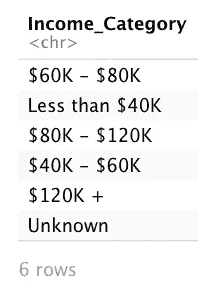**

**( **distinct** (cc2，Income_Category)) # 6 类型的输出:6 万美元到 8 万美元，不到 4 万美元，8 万美元到 12 万美元，4 万美元到 6 万美元，12 万美元以上，未知**

**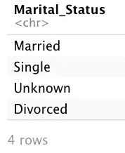**

**( **distinct** (cc2，marriage _ Status))# 4 类型的输出:已婚、单身、离婚、未知**

**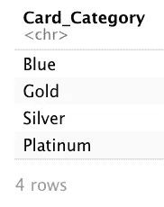**

**(**不同** (cc2，Card_Category)) # 4 类型输出:蓝色、金色、银色、铂金**

**在 3 个数据争论的第 3 部分中，我们**将**我们的预测器列 Attrition _ Flag 重命名为 Exited _ Flag。我们还**将这个预测器的二进制输出值分别从现有客户/流失客户重命名为当前/退出客户。最后，我们还可以通过离散预测器看到每个**离散**特征的 **cout** 。****

```
```{r DataWrangling3}#----------------------------
#----------------------------
#install.packages("dplyr")
**library(dplyr)**# Rename Label Colum to Exited_Flag
**dataCC4 <- cc3 %>% rename(Exited_Flag = Attrition_Flag)**

#----------------------------
#----------------------------
**dataCC4 <- cc3**
#Rename values 
**dataCC4 $Attrition_Flag[dataCC4 $Attrition_Flag == "Existing Customer"] <- "Current"
dataCC4 $Attrition_Flag[dataCC4 $Attrition_Flag == "Attrited Customer"] <- "Exited"**#----------------------------
#----------------------------
**(dataCC4  %>% group_by(Attrition_Flag) %>% summarize(meanAge= mean(Customer_Age), meanDepdent= mean(Dependent_count), meanCreditLim= mean(Credit_Limit)))**#AKA: 
 ** summarise_mean <- function(data, vars) {
 data %>% summarise(n = n(), across({{ vars }}, mean))
}**#**dataCC4  %>% 
  #group_by(Attrition_Flag) %>% 
# summarise_mean(where(is.numeric))**#----------------------------
#----------------------------
#see the count of each**(dataCC4  %>% select(Gender,Attrition_Flag) %>% group_by(Gender) %>% count(Attrition_Flag) )      
(dataCC4  %>% group_by(Education_Level) %>% count(Attrition_Flag) ) 
(dataCC4  %>% group_by(Marital_Status) %>% count(Attrition_Flag) ) 
(dataCC4  %>% group_by(Income_Category) %>% count(Attrition_Flag) ) 
(dataCC4  %>% group_by(Card_Category) %>% count(Attrition_Flag) ) 
summary(dataCC4)**
```
```

****

**(data cc4 % > %**group _ by**(attention _ Flag)%>%**summary**(mean Age =**mean**(Customer _ Age)，mean depend =**mean**(Dependent _ count)，mean Credit lim =**mean**(Credit _ Limit))**

**从上图中，我们可以清楚地看到，当前客户的平均信用额度高于频繁交易的客户。**

****

**(data cc 4% > %**group _ by**(Education _ Level)%>%**count**(attinction _ Flag))**

****

**(dataCC4 %>% **group_by** (婚姻状况)% > % **count** (减员 _ 标志) )**

****

**(data cc 4% > %**group _ by**(Income _ Category)%>%**count**(attinction _ Flag))**

****

**(dataCC4 %>% **group_by** (卡片 _ 类别)% > % **count** (损耗 _ 标志) )**

**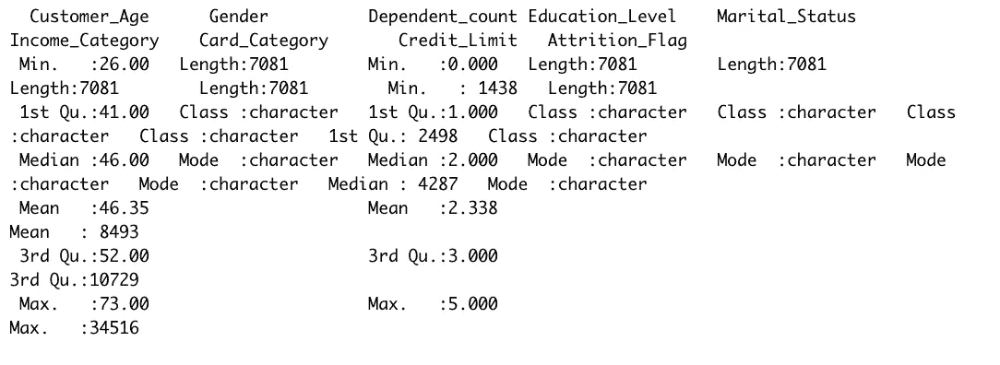**

****概要**(数据 CC4)**

# ****3。探索性数据分析****

**在 EDA 的第 1 部分(共 2 部分)中，我们**对某些离散变量的**因子**级别进行了重新排序**，因为我们希望它们在我们的图表中按顺序显示。我们绘制了两个彼此相对的离散变量，其中一个变量是填充。我们目视检查每个的**计数**。**

```
```{r EDA1}# 2 discrete var, but using 1 as a fill. 
# Count, with Y being Income Category, Fill is our 
**ggplot(dataCC4 , aes(y = Income_Category)) +
 geom_bar(aes(fill = Attrition_Flag), position = position_stack(reverse = FALSE)) +theme(legend.position = "top") + theme_classic() + xlab("Count") + ylab("Income Category") + ggtitle(" Customer Status by Income" )+  labs(fill = "Customer Status")**#----------------------------# RE-ODER factor levels
**dataCC4$Education_Level <- factor(dataaa$Education_Level, levels = c("Uneducated","High School",
                                                                    "College",
                                                                    "Graduate",
                                                                    "Post-Graduate","Doctorate"))
ggplot(dataCC4 , aes(y = Education_Level)) +
 geom_bar(aes(fill = Attrition_Flag), position = position_stack(reverse = FALSE)) +
 theme(legend.position = "top") + theme_classic() + xlab("Count") + ylab("Education Level") + ggtitle("Customer Status by Education Level" ) +  labs(fill = "Customer Status")**#----------------------------**ggplot(dataCC4 , aes(y = Marital_Status)) +
 geom_bar(aes(fill = Attrition_Flag), position = position_stack(reverse = FALSE)) +
 theme(legend.position = "top") + theme_classic() + xlab("Count") + ylab("Martial Status") + ggtitle("Customer Status by Martial Status" )+  labs(fill = "Customer Status")**#----------------------------**ggplot(dataCC4 , aes(y = Card_Category)) +
 geom_bar(aes(fill =  Attrition_Flag), position = position_stack(reverse = FALSE)) +
 theme(legend.position = "top") + theme_classic() + xlab("Count") + ylab("Card Category") + ggtitle("Customer Status by Card Category" )+  labs(fill = "Customer Status")**#----------------------------**ggplot(dataCC4 , aes(y = Gender)) +
 geom_bar(aes(fill =  Attrition_Flag), position = position_stack(reverse = FALSE)) +
 theme(legend.position = "top") + theme_classic() + xlab("Count") + ylab("Gender") + ggtitle("Customer Status by Gender" )+  labs(fill = "Customer Status")**
#There are more samples of females in our dataset compared to males but the percentage of difference is not that significant so we can say that genders are uniformly distributed.#----------------------------
```
```

**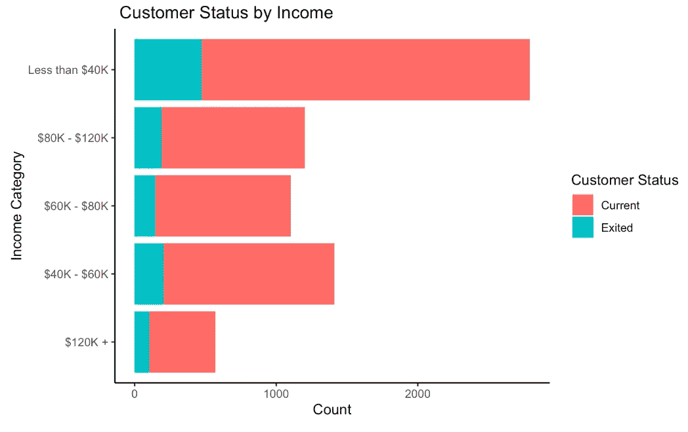**

**很明显，大多数退出的客户属于收入低于 4 万美元的类别，但我们的大多数现有/退出客户都属于这一类别。**

**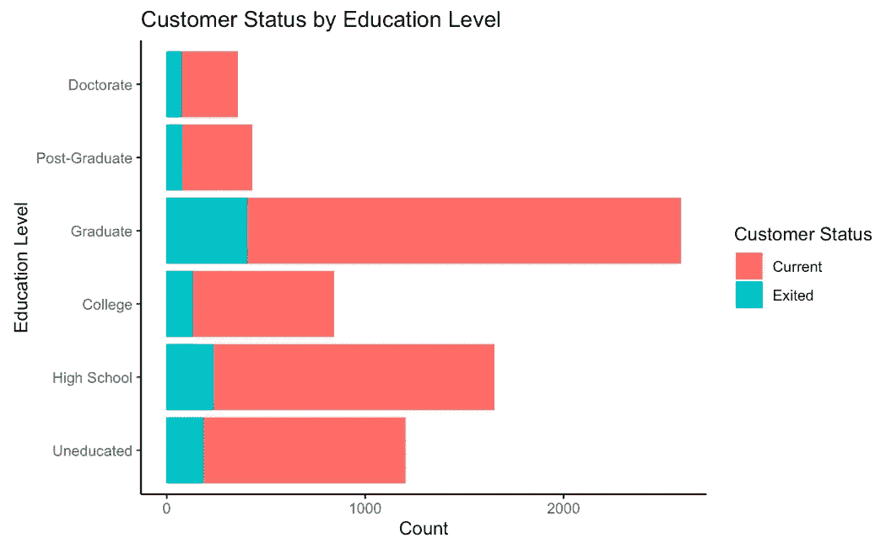**

**我们目前的大部分客户都是大学毕业生&拥有高中学历。**

**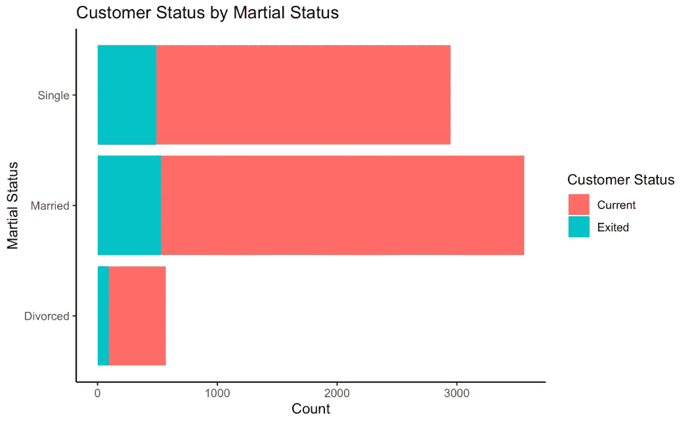**

**客户的婚姻状况，很少比例是离婚，大多数是已婚和单身。**

****

**蓝卡是我们现有和现有客户最重要的卡类。**

**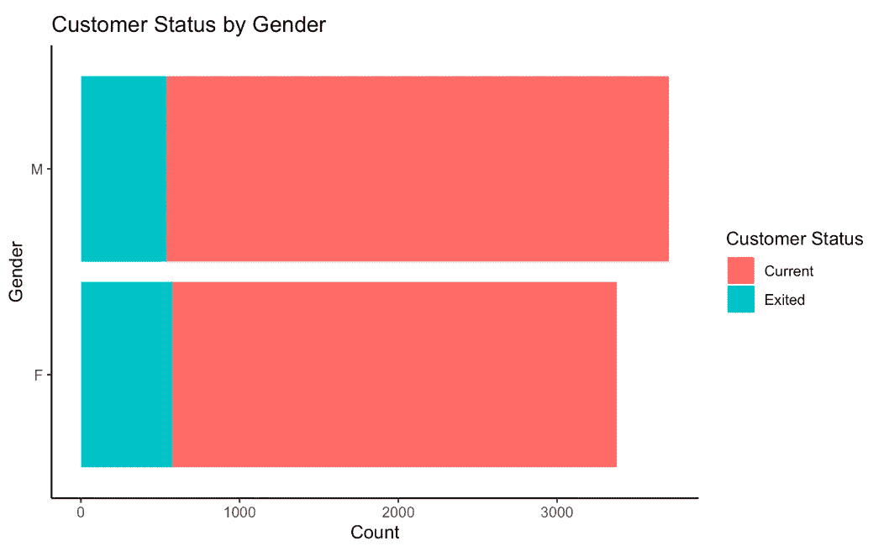**

****性别&年龄**在确定客户状态时并不重要，因为性别计数的两个平均值是相同的 46.31736(当前)& 46.51033(已退出)**

**在 EDA 的第 2 部分中，我们探索了两个带有分位数的 violin 图，两个离散变量的可视化&面积分布图。**

```
```{r EDA2}#----------------------------# Discrete X, Continous Y, Violin Plots**ggplot(dataCC4 , aes(Attrition_Flag,Credit_Limit,color= Credit_Limit)) + geom_violin(draw_quantiles = c(0.25,0.5,0.75),colour="red",size=1.4) + theme_classic() +xlab("Income Category") + ylab("Credit Limit") + ggtitle("Customer Status by Credit Limit" ) +   labs(fill = "Customer Status")**# RE-ODER factor levels
**dataCC4 $Income_Category <- factor(dataCC4 $Income_Category, levels = c("Less than $40K","$40K - $60K","$60K - $80K","$80K - $120K","$120K +"))****ggplot(dataCC4 , aes(Income_Category,Credit_Limit,color= Credit_Limit)) + geom_violin(draw_quantiles = c(0.25,0.5,0.75),colour="blue",size=1) + theme_classic() +xlab("Income Category") + ylab("Credit Limit") + ggtitle("Income Category by Credit Limit" )**#----------------------------# 2 discrete variables x,y
#need  to specify which group the proportion is to be calculated over.
**ggplot(dataCC4 , aes(Income_Category,Attrition_Flag, colour= after_stat(prop), size = after_stat(prop), group = Income_Category)) + geom_count() +  scale_size_area() + theme_classic() +xlab("Income Category") + ylab("Status of Customer") + ggtitle("Customer Status by Income Proportion" )**#----------------------------
#
#library(plyr)
#**mu <- ddply(dataaa, "Exited_Flag", summarise, grp.mean=mean(Credit_Limit))
#head(mu)**
#
**ggplot(dataCC4, aes(x=Credit_Limit, fill=Attrition_Flag)) +
  geom_area(stat ="bin") + xlab("Credit Limit")+ylab("Count") +ggtitle("Customer Status by Credit Limit " ) +  labs(fill = "Customer Status")**
```
```

**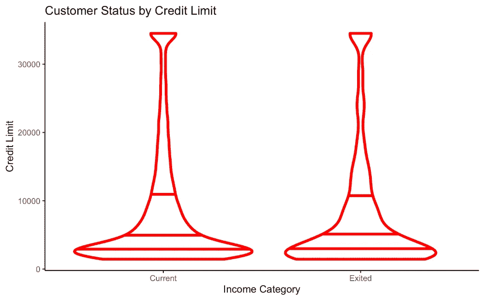**

**1 个离散变量和 1 个连续变量，这个小提琴图告诉我们，他们是当前客户的更大传播。红色水平线是分位数。**

**Q 可以告诉我们大量的信息。**

**第一条水平线告诉我们第一个分位数，或第 25 个百分位数——这个数字将最低的 25%的群体与最高的 75%的信贷限额区分开来。**

**接下来，第二行是中间值，或第 50 个百分位数——信贷限额中间的数字。**

**最后，第三行是第三个四分位数，即 Q3 或第 75 个百分位数，这是将该组中最低的 75%与最高的 25%分开的数字。**

**分位数显示在上面和下面的小提琴图中。**

**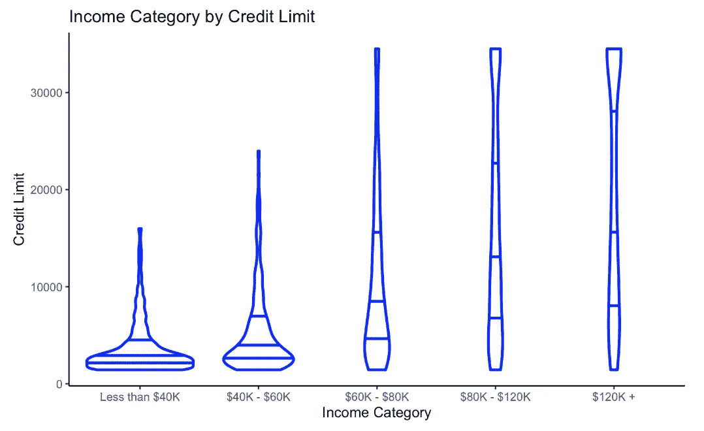**

**当然，较高的收入类别与较高的信贷限额相关。**

**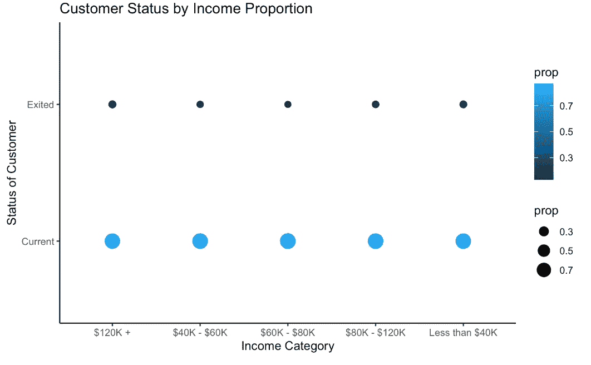**

**2 个检验客户身份和收入类别比例的离散变量。目前，收入低于 4 万美元的客户比例更高。**

**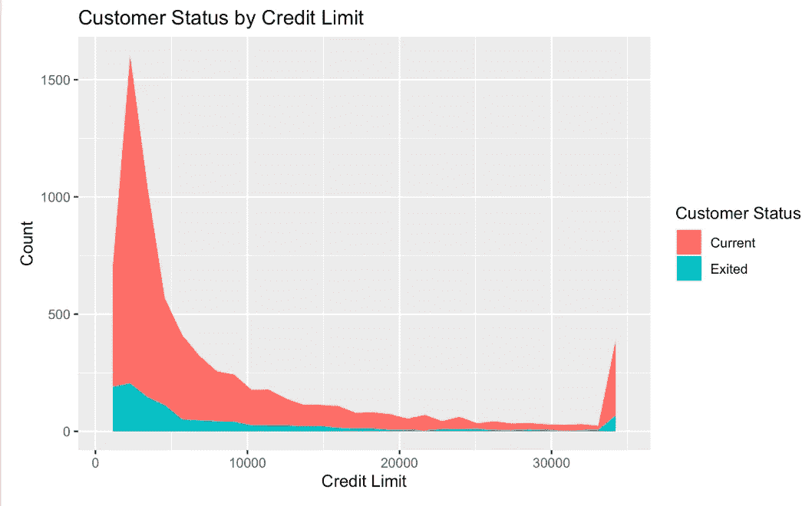**

****地区** **信用额度的分布**与客户状态。我们在这里看到，我们的数据主要是当前客户，而不是现有客户。**

**我们只有 **16.07%** 的客户有**的搅动**。因此，训练我们的模型来预测不断变化的客户有点困难。我们将尽最大努力处理给定的数据，就像处理任何模型一样。**

# ****4。建模+置信区间****

**O 我们建模的目标是提供数据集的简单低维摘要。我们使用模型将数据分成模式和残差。拟合模型是模型家族中最接近的模型。**

****分类模型**是预测分类标签的模型。研究哪个(些)特征区分每个类别以及区分到什么程度将是有趣的。预测客户会离开还是留在公司。下面我们将使用逻辑回归算法。**

**首先，我们必须将非数字变量(离散变量)转换成因子。**因素**是数据对象，用于对数据进行分类，并将其存储为级别。**

## **4 个步骤:数据划分、构建、预测和评估**

```
```{r Modeling1}
**library(tidyverse)
library(modelr)
library(plyr)
library(readr)
library(dplyr)
library(caret)**# glimpse is from dplyr
# output shows that the dataset has 
**glimpse(dataCC4)**# convert the non numeric into factors.
**names <- c(2,5,7,9) # col numbers that are chars
dataCC4[,names] <- lapply(dataCC4[,names] , factor)** ```
```

## ****数据分区****

```
```{r Modeling2}
#----------------------------
# DATA PARTITIONING
#----------------------------
#build our model on the Train dataset & evaluate its performance on #the Test dataset
# aka.  holdout-validation approach to evaluating model performance.**set.seed(100)** # sets random seed for reproducibility of results
**library(caTools)** # for data partioning# create the training and test datasets. The train dataset contains    # 70 percent of the data (420 observations of 10 variables) while #the #test data contains the remaining 30 percent (180 observations #of 10 variables).
**spl = sample.split(dataCC4$Attrition_Flag, SplitRatio = 0.7)****train = subset(dataCC4, spl==TRUE)
test = subset(dataCC4, spl==FALSE)****print(dim(train))** # 4957 rows/obs 9 cols/variables
**print(dim(test))** # 2124 rows/obs  9 cols/variables```
```

## ****建立、预测&评估模型****

**我们符合逻辑回归模型。第一步是实例化算法。我们声明**二项式**是因为有两种可能的结果:退出/当前。**

```
```{r Modeling3}
#----------------------------
#BUILD, PREDICT &  EVALUATE the Model#----------------------------
# BUILD
#----------------------------**model_glm = glm(Attrition_Flag ~ . , family="binomial",data = train)
summary(model_glm)**# Baseline Accuracy
   #Let's evaluate the model further, 
  # Since the majority class of the target (Y) variable has a #proportion of 0.84, the baseline accuracy is 84 percent.
**prop.table(table(train$Attrition_Flag))**#Let's now evaluate the model performance on the training and test data, which should ideally be better than the baseline accuracy.# PREDICTIONS on the TRAIN set
**predictTrain = predict(model_glm, data = train, type = "response")**# confusion matrix w/ threshold of 0.5,
  #which means that for probability predictions >= 0.5, the      #algorithm will predict the Current response for the Y #variable. 
**table(train$Attrition_Flag, predictTrain >= 0.1)** Evaluate:#prints the accuracy of the model on the training data, using the #confusion matrix, and the accuracy comes out to be 0 percent.
**(50+774)/nrow(test)** #Accuracy - 84% (50+774)/2124-------------------------------------------------------------
#We then repeat this process on the TEST data, and the accuracy #comes out to be 84 percent.# PREDICTIONS on the TEST set
**predictTest = predict(model_glm, newdata = test, type = "response")**Evaluate:# Confusion matrix on test set
**table(test$Attrition_Flag, predictTest >= 0.5)****1790/nrow(test)** #Accuracy - 84%```
```

**以上输出中的显著性代码' *** '显示了特征变量的相对重要性
**AIC** 估计给定模型丢失的相对信息量:
模型丢失的信息越少，模型的质量越高。较低的 AIC 值指示更好拟合的模型，**

**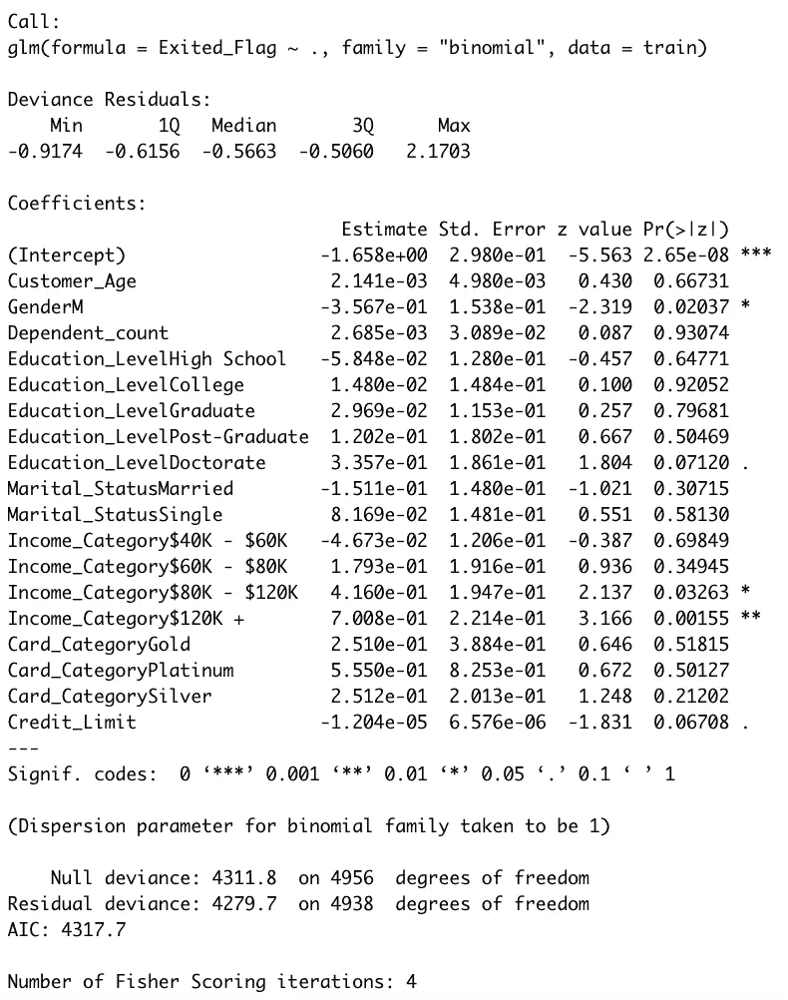**

****model _ glm = glm(attachment _ Flag ~)的输出。，family="binomial "，data = train)
汇总(model_glm)****

**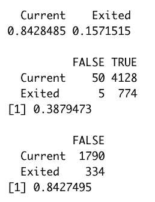**

**84%的准确率**

**您已经学习了使用**强大的逻辑回归算法在 R 中构建**分类模型**的技术。**训练&测试数据的基线准确度为**84%**。总的来说，逻辑回归模型在训练和测试数据集上都大大超过了基线精度，结果非常好。**

**下面我将向你展示另一种建模方法，使用 **SVM(支持向量机)。****

```
```{r ModelAgain}**unique(dataCC5$Attrition_Flag)** #Levels: Current Exited# Encoding the target feature as factor
**dataCC5$Attrition_Flag = factor(dataCC5$Attrition_Flag, levels = c(0, 1))**# spliting datast into Train & Test Set**install.packages('caTools')**
**library(caTools) # for data partioning****set.seed(123) #SEED**#SPLIT
**split = sample.split(dataCC5$Attrition_Flag, SplitRatio = 0.75)****train_set = subset(dataCC5,split==TRUE) #TRAIN
test_set = subset(dataCC5,split==FALSE) #TEST**#FEATURE SCALING: age
**library(caret)
train_set[-9] = scale(train_set[-9])
test_set[-9] = scale(test_set[-9])****install.packages('e1071')
library(e1071)****model_glm = glm(Attrition_Flag ~ . , family="binomial",data = train)****classifier = svm(formula= Attrition_Flag ~ .,
                 data= train_set,
                 type= 'C-classification',
                 kernel = 'radial')**# predicting Test Set Results
**y_pred = predict(classifier, newdata = train_set[-9])**# making confusion matrix
**cm = table(test_set[, 3],y_pred)```
```

****置信区间**与**建模**相关，因为它们经常用于**模型**验证。**

**接下来，我们考虑信用额度的 **95%置信区间。
由于信用额度大于 0，我们缩小了置信区间。
有 **91.75%** 的数据位于置信区间内。我们将保留相应的记录，并将其余的存储在另一个变量 **rest.data** 中，以供以后分析。****

```
```{r CI}**mean.Credit_Limit <- mean(dataCC5$Credit_Limit)
std.Credit_Limit <- sqrt(var(dataCC5$Credit_Limit))
df = dim(dataCC5)[1] - 9
conf.Credit_Limit <- mean.Credit_Limit + c(-1, 1) * qt(0.975, df) * std.Credit_Limit**# As the CreditLimit is greater than 0, we narrow the confidence interval**conf.Credit_Limit[1] <- 0
conf.Credit_Limit**#There are 91.75% data locates within the confidence interval. We will keep the corresponding records and store the rest in another variable rest.data for later analysis.**sum(dataCC5$Credit_Limit <= conf.Credit_Limit[2]) / dim(dataCC5)[1]**
#----------------------------
#
#----------------------------
**rest.data <- dataCC5 %>%
  filter(Credit_Limit > conf.Credit_Limit[2])****dataCC5 <- dataCC5 %>%
  filter(Credit_Limit <= conf.Credit_Limit[2]) %>%
  filter(Credit_Limit != 0)**#We recall the historgrams of Credit Limit
**boxplot_credLim <- dataCC5 %>%
  ggplot() +
  geom_boxplot(aes(Credit_Limit))
(boxplot_credLim)
histplot <- dataCC5 %>%
  ggplot() +
  geom_histogram(aes(Credit_Limit))
(histplot)**
#----------------------------
#
#----------------------------
#We consider a log-transofrmation to convert the distribution of the histogram to normal distribution. Right-skew.
**histplot <- dataCC5 %>%
  ggplot() +
  geom_histogram(aes(log(Credit_Limit)))
(histplot)****qqplot <- dataCC5 %>%
  ggplot() +
  geom_qq(aes(sample = log(Credit_Limit)))
(qqplot)**
#It seems that normality exists. Great! There are 6 types of categorical variables.# Distrubution of Income Category
**p1 <- dataCC5 %>%
  ggplot() +
  geom_histogram(aes(Income_Category, fill = Income_Category), stat = "count")
(p1)**
# Box Plots of Depdent count & Income Category
**p2 <- dataCC5 %>%
  ggplot() +
  geom_boxplot(aes(x = Dependent_count, y = Income_Category, color = Income_Category))
(p2)```
```

****

**有 **91.75%** 的数据位于置信区间内。sum(data cc 5 $ Credit _ Limit<= conf。credit _ Limit[2])/dim(data cc 5)[1]**

**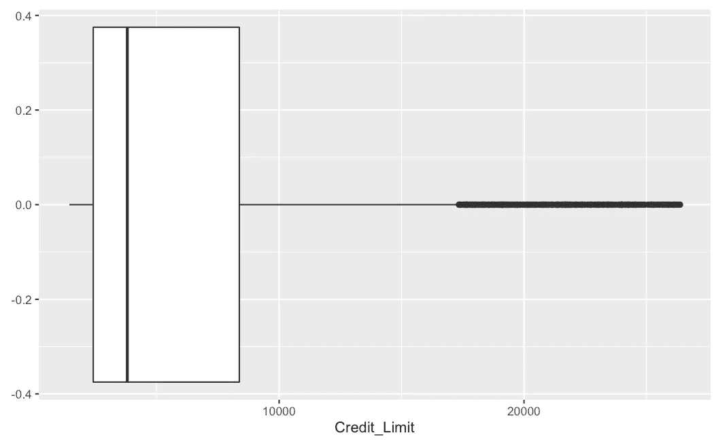**

**我们回忆一下信用额度
**box plot _ cred lim<-data cc 5%>%
gg plot()+
geom _ box plot(AES(Credit _ Limit))
(box plot _ cred lim)**的历史记录**

**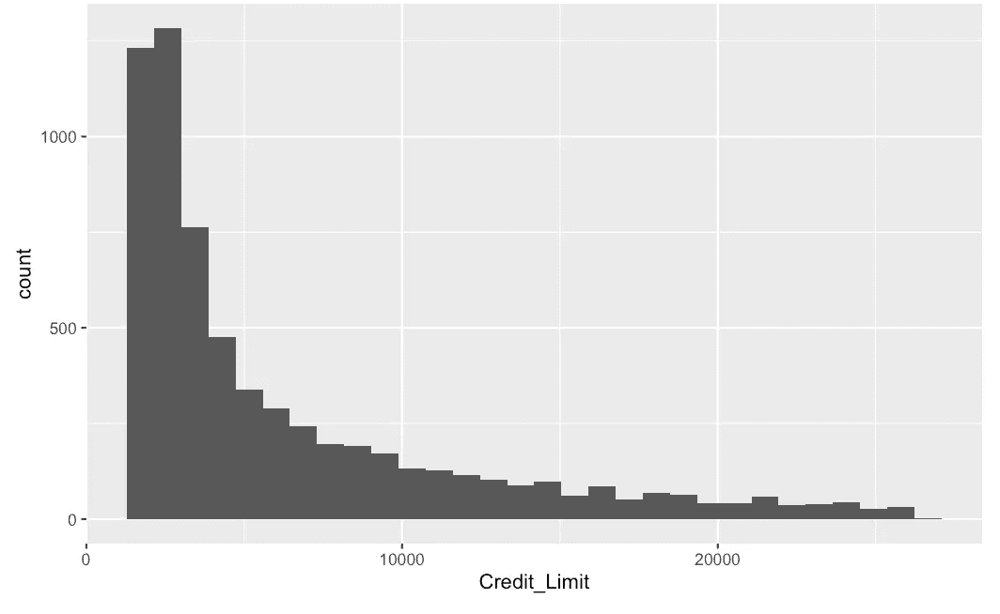**

****hist plot<-data cc 5%>%
gg plot()+
geom _ histogram(AES(Credit _ Limit))
(hist plot)****

**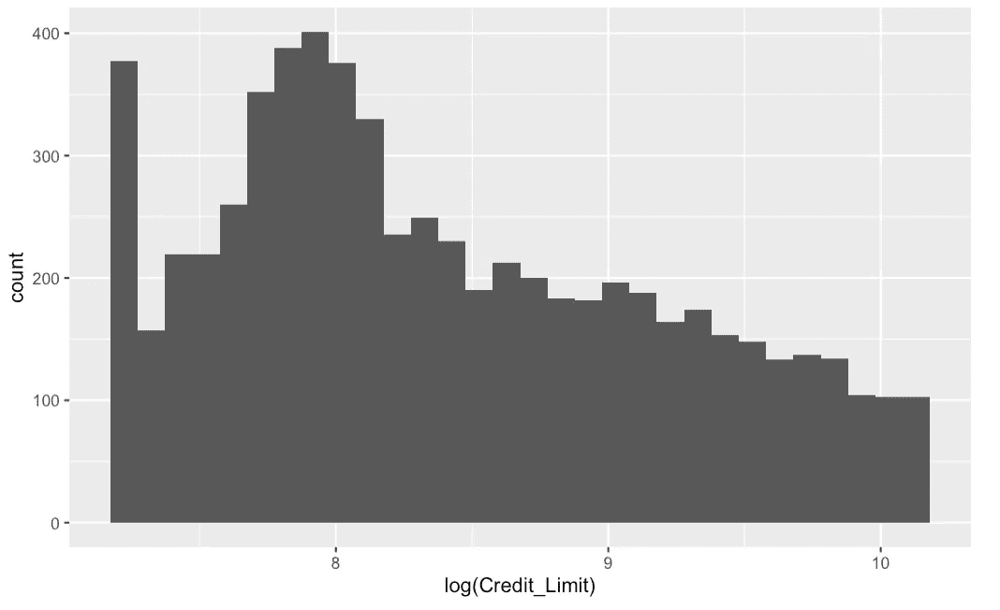**

**我们考虑使用**对数变换**将直方图的分布转换为**正态分布**。向右倾斜。
**hist plot<-data cc 5%>%
gg plot()+
geom _ histogram(AES(log(Credit _ Limit)))
(hist plot)****

**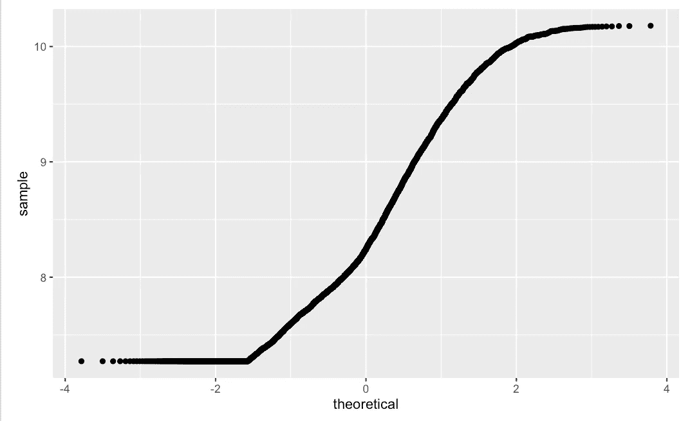**

****QQ plot<-data cc 5%>%
gg plot()+
geom _ QQ(AES(sample = log(Credit _ Limit)))
(QQ plot)**
看来**常态**是存在的。太好了！有 6 种类型的分类变量。**

**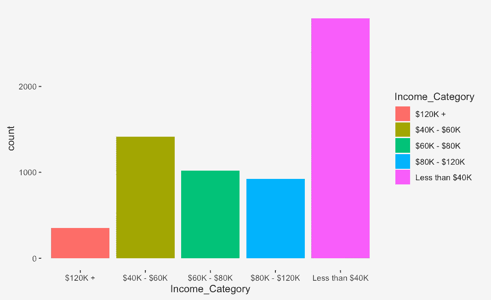**

**#收入类别分布
**P1<-data cc 5%>%
gg plot()+
geom _ histogram(AES(Income _ Category，fill = Income_Category)，stat = "count")
(p1)****

****

**#受抚养人人数和收入类别的箱线图:**data cc 5%>%
gg plot()+
geom _ Box plot(AES(x = Dependent _ count，y = Income_Category，color = Income _ Category))
(p2)****

## **评价:RMSE**

**#以下旨在建立一个模型来预测价格。##评估我们将使用 MSE 作为衡量模型性能的标准。**

**我们将 20%作为测试数据集，80%作为训练数据集。**

```
```{r RMSE}#Train and test split
#Split 20% as test dataset and 80% as training dataset.
### convert character to factor
**dataCC5$Gender <-as.factor(dataCC5$Gender)**# Split
**set.seed(100)
train.index <- sample(nrow(dataCC5), 0.7*nrow(dataCC5), replace = FALSE)
train.set <- dataCC5[train.index, ]
test.set <- dataCC5[-train.index, ]**
# build a model to predict the price. 
## Evaluation: We will use MSE as the criteria to measure the model performance.
**RMSE <- function(true, pred){
  residuals <- true - pred
  res <- sqrt(mean(residuals^2))
  return(res)
}
----------** #----------------------------
#Linear regression
#Linear regressoin is a kind of simple regression methods. It is easy to be conducted while it has some strict assumptions. The following code will perform the modeling process with check some assumptions. ### Multicolinearity
#**library(corrplot)
#cor <- cor(dataCC5)
#corrplot::corrplot(cor, method = 'ellipse',  type = 'lower')
#cor(dataCC5$Credit_Limit, dataCC5$Dependent_count)**# IF data had more numeric values use this for 
# correlation plot: 
**#M <- cor(dataCC5)
#corrplot(cor(dataCC5), method = "circle")```
```

## **模特& AIC**

**回想一下: **AIC** 估计给定模型丢失的相对信息量:
模型丢失的信息越少，模型的质量越高。
因此，较低的 AIC 值指示更好拟合的模型，**

```
```{r AIC}**AICs <- c()
models <- c()**

**start.model <- lm(Credit_Limit ~ Customer_Age, data = train.set)**# summary(start.model) 
**models <- append(models, as.character(start.model$call)[2])
AICs <- append(AICs, AIC(start.model))**# Add next varaible
**update.model <- update(start.model, . ~ . + Gender)**# summary(update.model)
**models <- append(models, as.character(update.model$call)[2])
AICs <- append(AICs, AIC(update.model))**# Add next var
**update.model <- update(update.model, . ~ . + Dependent_count)**# summary(update.model)
**models <- append(models, as.character(update.model$call)[2])
AICs <- append(AICs, AIC(update.model))**# Add next var
**update.model <- update(update.model, . ~ . + Education_Level)**# summary(update.model)
**models <- append(models, as.character(update.model$call)[2])
AICs <- append(AICs, AIC(update.model))**# Add next variable
**update.model <- update(update.model, . ~ . + Marital_Status)**# summary(update.model)
**models <- append(models, as.character(update.model$call)[2])
AICs <- append(AICs, AIC(update.model))**# Add calculated_host_listings_count
**update.model <- update(update.model, . ~ . + Income_Category)**# summary(update.model)
**models <- append(models, as.character(update.model$call)[2])
AICs <- append(AICs, AIC(update.model))**# Add last var
**update.model <- update(update.model, . ~ . + Card_Category)**# summary(update.model)
**models <- append(models, as.character(update.model$call)[2])
AICs <- append(AICs, AIC(update.model))****res <- data.frame(
  Model = models,
  AIC = AICs
)
knitr::kable(res)**#----------------------------
#----------------------------
**par(mfrow = c(3,1))
plot(update.model, 1)
plot(update.model, 2)
plot(update.model, 3)```
```

****

****表显示最佳模式是
**信用 _ 限额~客户 _ 年龄+性别+赡养 _ 人数+教育 _ 水平+婚姻 _ 状况+收入 _ 类别+卡 _ 类别**
带**的 **72870.02** 的**AIC，我们要最低的 AIC。****

**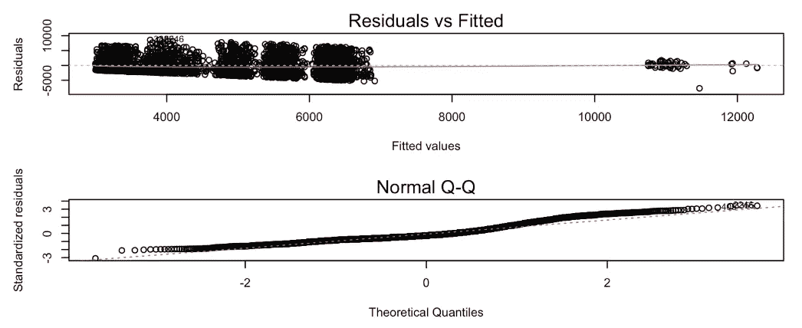**

****par(m flow = c(3，1))
plot(update.model，1)
plot(update.model，2)
plot(update.model，3)****

```
```{r LogLinearRegression}**log.lm <- lm(log(Credit_Limit) ~ Customer_Age + Gender + Dependent_count + Education_Level + Marital_Status + Income_Category + Card_Category, data = dataCC5)****summary(log.lm)```
```

****

**性别男性、收入类别和银卡类别对我们的信用额度预测非常重要。**

**以下是从我的 GitHub 页面获得的数据集和代码:**

**[https://github.com/jararzaidi/ModelingChurningCustomersR](https://github.com/jararzaidi/ModelingChurningCustomersR)**

**【https://www.kaggle.com/sakshigoyal7/credit-card-customers】**

**欢迎推荐和评论！**