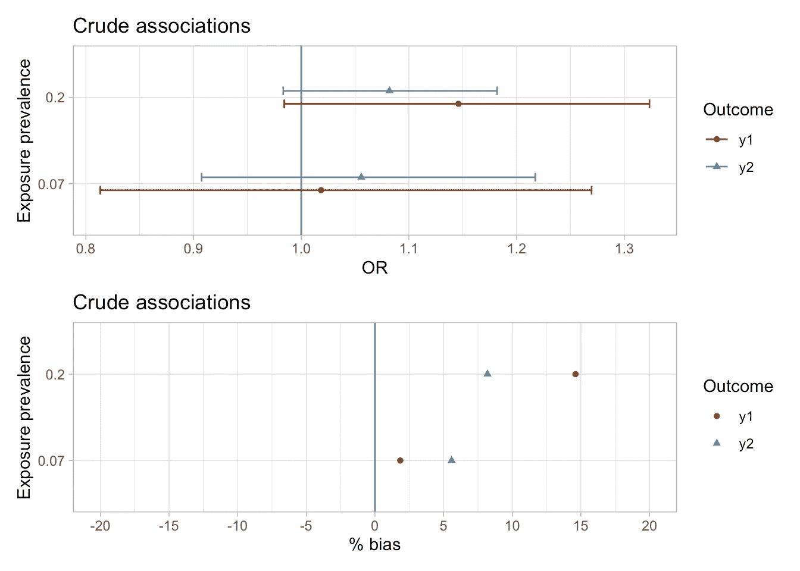
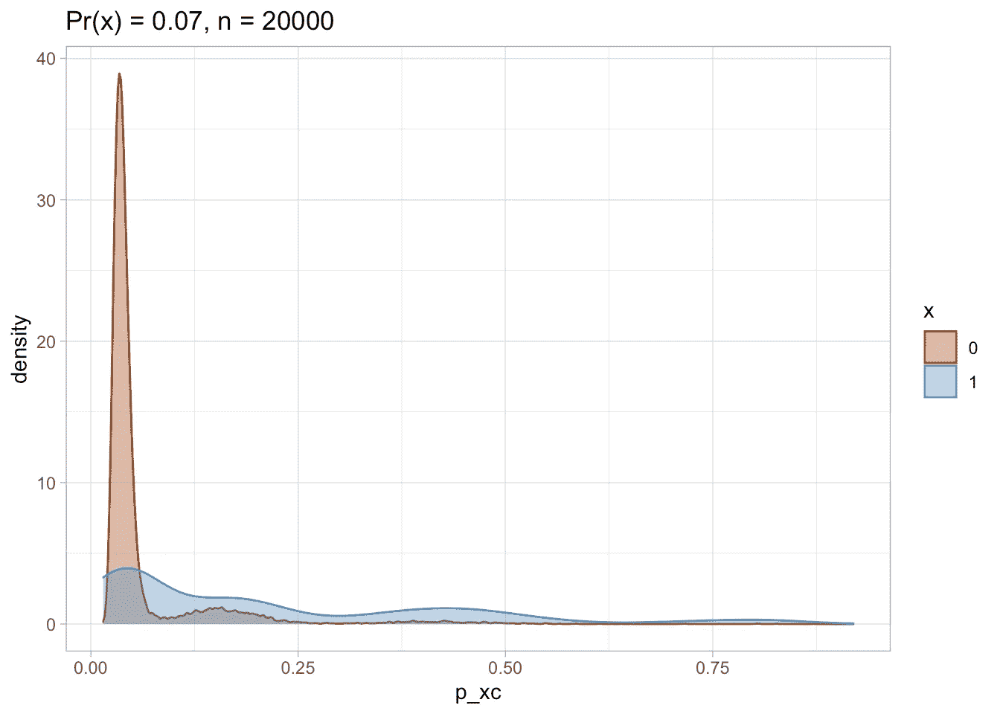
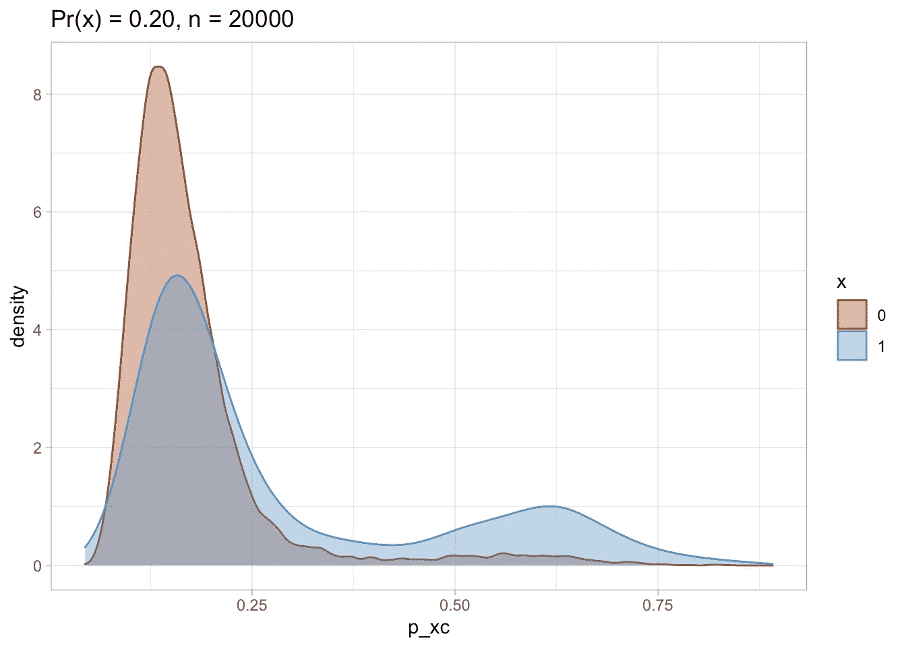
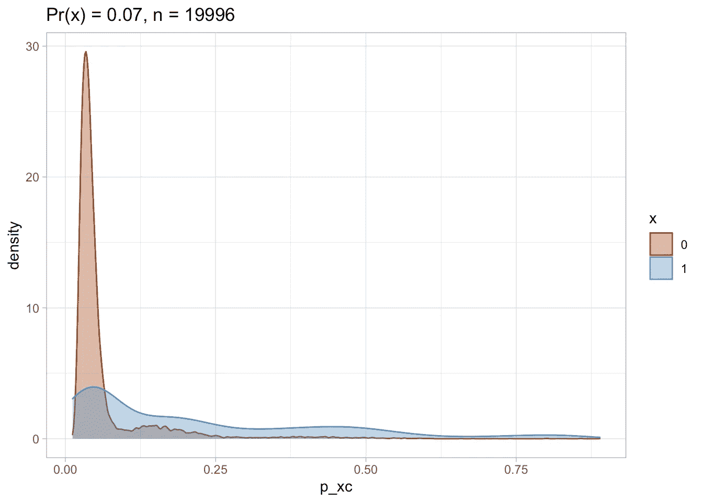
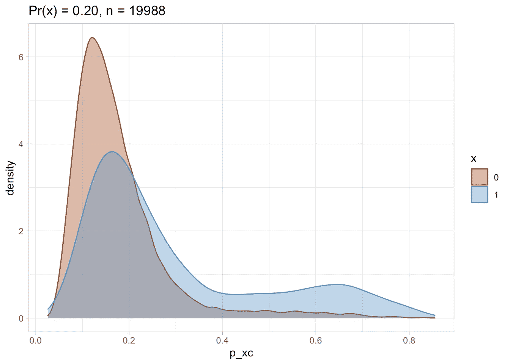
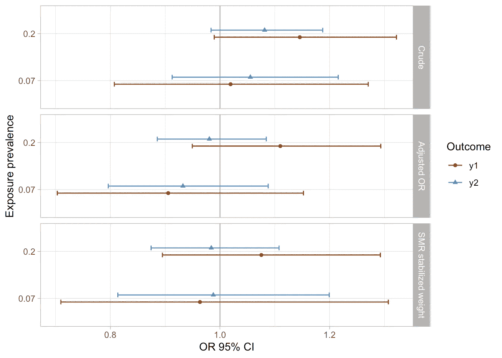
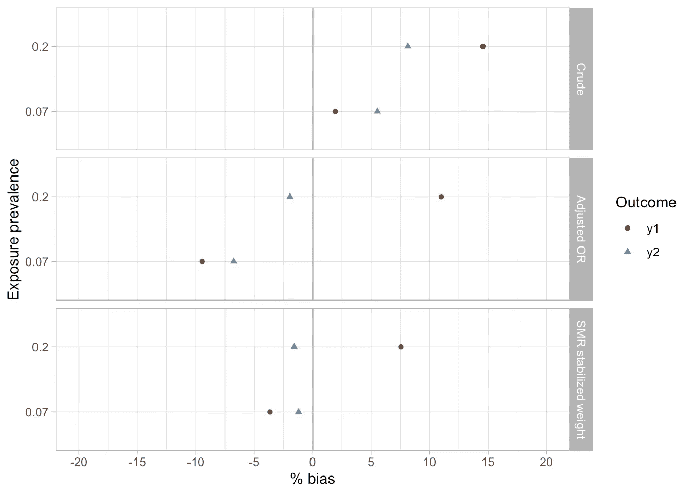

# 倾向得分估计和可视化

> 原文：<https://towardsdatascience.com/propensity-score-estimation-and-visualization-9c41f7ce5006?source=collection_archive---------23----------------------->

## 使用模拟数据集

由 [Filiberto Santillán](https://unsplash.com/@filisantillan?utm_source=medium&utm_medium=referral) 在 [Unsplash](https://unsplash.com?utm_source=medium&utm_medium=referral) 上拍摄的照片

在我的领域——流行病学——以及其他各种科学领域，基于倾向评分(PS)的方法经常被用于混杂调整。在这篇文章中，我用两个不同的治疗变量(`x1`和`x2`)模拟了两个小数据集(N=20，000)，患病率分别为 7%和 20%。然后，我继续模拟两种不同的结果(`y1`和`y2`)，在模拟人群中的患病率分别为 6%和 16%。风险暴露对结果的真实影响为零。这篇文章很大程度上是受 Desai 等人(2017)的论文的启发。

## **这篇文章将涵盖哪些内容？**

*   用两个不同暴露(`x1`和`x2`)和每个暴露的结果`y1`和`y2`)之间的零关联来模拟我自己的数据集(4 个暴露-结果对)
*   计算每次暴露的倾向分数(PS ),修整暴露和未暴露之间 PS 分布的非重叠区域
*   运行几个逻辑回归模型

在这篇文章中，我只分享一些代码片段。这篇文章的所有代码版本可以在[这里](https://www.elenadudukina.com/post/ps/2021-03-08-ps-estimation/)找到。

## 数据模拟

我模拟了 10 个混杂因素，2 个治疗预测因素，2 个结果预测因素。

## 分析

对暴露和结果之间关联的粗略分析表明，在估计值周围有一个较宽的 95%置信区间，呈弱正相关。最大偏倚约为 10%(对于两者中不太常见的结果，`y1`)，在模拟人群中的患病率约为 6%。)

**倾向得分**

我使用混杂因素和结果预测因素分别计算了每次暴露的倾向得分(PS)。

倾向评分(PS)分布在治疗组和未治疗组之间大部分重叠，因此非重叠区域的修整不会导致许多数据点的丢失。

使用倾向评分，我计算了标准化死亡率(SMR)权重，并将其用于未暴露人群的重新加权，就好像他们暴露了一样；然后，我比较了暴露和结果之间的粗略关联，传统调整的逻辑回归模型，以及通过 SMR 加权调整的模型。

三种不同逻辑回归模型的比较揭示了以下情况:

*   粗略的分析是不精确的，表明暴露(` x1 '，` x2 ')和结果(` y1 '，` y2 ')之间存在关联，而没有真正的关联(粗略分析的最大偏差约为 14.5%)。
*   逻辑回归模型中的常规调整产生了不精确的估计值，并提示弱相关性，包括一些暴露-结果对的反向相关性(最大偏差约为 11%)。
*   SMR 加权产生了不精确的结果，类似于传统的调整，表明暴露和结果之间存在一些微弱的负相关(对于“x2”-“y1”暴露-结果对，观察到的最大偏差约为 7.5%)。
*   虽然不确定性在所有三个分析中都是一个问题，但 SMR 加权法可以说产生了最接近真实(模拟)无效效应的点估计。

## 参考

1.  德赛 RJ，罗斯曼 KJ，贝特曼 BT，埃尔南德斯-迪亚兹 S，Huybrechts KF。当暴露不频繁时，基于倾向评分的混杂调整精细分层方法。流行病学。2017;28(2):249–257.doi:10.1097/ede . 50000000000001