# 倾向得分匹配

> 原文：<https://towardsdatascience.com/propensity-score-matching-a0d373863eec?source=collection_archive---------1----------------------->


阿斯泰米尔·阿尔莫夫在 [Unsplash](https://unsplash.com?utm_source=medium&utm_medium=referral) 上拍摄的照片

## 数据科学基础

## 根据观察数据进行因果推断的初学者指南

因果推理是数据科学中一个被低估但强大的领域。得出因果结论的一个流行方法是进行 AB 测试。但是如果 AB 测试不可行或者根本不是一个选项呢？非实验因果推理技术使我们能够从观察数据中得出因果关系的结论。在这篇文章中，我们将学习一种叫做倾向分数匹配的技术背后的基本直觉。


照片由[亨利陈](https://unsplash.com/@chentianlu?utm_source=medium&utm_medium=referral)在 [Unsplash](https://unsplash.com?utm_source=medium&utm_medium=referral)

# 📍 0.实验数据与观察数据

在本节中，我们将简要介绍与分析因果关系相关的两类数据。在我们开始之前，让我们在三个关键术语上达成一致:
◼ **结果变量:**一个我们想要了解治疗效果的感兴趣的变量。这就是*效果*。
◼ **治疗变量:**我们想要了解其对结果变量的影响的感兴趣变量。这就是*原因*。
◼ **混杂变量:**一个影响治疗选择和结果变量的变量。在某些情况下，这也被称为*协变量*。

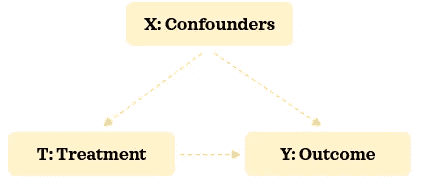

作者图片|混杂因素、治疗和结果之间的关系

## 实验数据📦

> 作为 AB 测试(又名随机实验、对照研究、随机对照试验和许多其他变体)的一部分收集的数据是实验数据。在 AB 测试中，治疗被随机分配给个体，而不是由他们选择。这意味着没有选择偏差，治疗分配不受任何混杂因素的影响。


作者图片|实验数据概述

在 AB 检验中，从总体中随机抽取足够大的代表性样本。然后，AB 测试的参与者被*随机分配*到不同的治疗组:A 组和 b 组。这种*随机分配*有助于将参与者分成相似的组，其中混杂因素是平衡的。当我们对一组人进行治疗而不对另一组人进行治疗时，两组人之间的主要区别在于治疗方法。由于两组在没有治疗的情况下是可比较的，我们可以合理地说两组之间结果的统计学显著差异是由治疗引起的。

## 0.B 观察数据📦

> 任何不是作为 AB 测试的一部分收集的数据都是观察数据。在观察数据中，治疗是由个体选择的，而不是随机分配给他们的。这意味着存在选择偏差，治疗不再独立于混杂因素。


作者图片|观察数据概述

在观察数据中，我们从总体中随机收集有代表性的样本。由于治疗是由个人选择的，因此各组之间的混杂因素可能存在差异。因此，即使在没有治疗的情况下，两组也没有可比性。当有其他移动的部分在起作用时，很难说两组之间结果的统计学显著差异是由治疗引起的。

*如果你想测试你对这两种类型数据的理解，看看汗学院* *的这个小测验。*

更新了数据类型后，是时候学习使用倾向得分匹配从观察数据中进行因果推断的基础知识了。

# 📍 1.倾向得分匹配

倾向得分匹配是一种非实验性的因果推理技术。它试图*在混杂因素上平衡治疗组，使它们具有可比性*，这样*我们可以使用观察数据*得出关于治疗对结果的因果影响的结论。使用倾向评分匹配进行因果分析时，有 5 个关键步骤:

1️⃣收集数据
2️⃣估计倾向得分
3️⃣匹配记录
4️⃣评估匹配
5️⃣评估治疗对结果的影响

让我们熟悉这些步骤，并将它们应用到一个玩具示例中，以便更好地理解。

## 1.1.收集数据📂

这是因果分析最重要的一步。这一步的目的是根据领域专长收集所有可能的混杂因素的数据。如果重要的混杂因素被排除在数据之外，我们将有错误地推断治疗对结果的因果影响的风险。因此，数据收集步骤在因果推断的可靠性和有效性方面起着关键作用。

> ***💡提示:*** 当处理时序数据(即随时间变化的数据)时，时序混杂因素应显示其在治疗前的状态，时序结果应在治疗后获取。例如，网上购物的销售收入是一个时间变量。如果我们决定使用它作为混杂因素，它应该捕捉治疗发生前的销售收入金额。

作为我们的玩具示例，我们将使用可广泛获取的泰坦尼克号数据。我们将尽量减少混淆因素，使事情易于管理和理解。这是我们假设的关系结构:

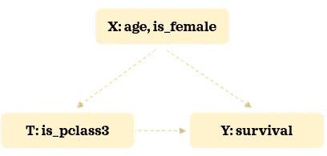

我们将试图了解获得三等舱对存活率的影响。让我们加载必要的库和数据:

```
import numpy as np
import pandas as pd
pd.options.display.float_format = "{:.2f}".formatimport matplotlib.pyplot as plt
import seaborn as sns
sns.set(style='darkgrid', context='talk')from sklearn.preprocessing import StandardScaler
from sklearn.linear_model import LogisticRegression
from sklearn.pipeline import Pipeline
from sklearn.metrics import roc_auc_score, f1_scorefrom causalinference import CausalModeldf = sns.load_dataset('titanic')
df['is_pclass3'] = df['pclass']==3
df['is_female'] = df['sex']=='female'
df = df.filter(['survived', 'is_pclass3', 'is_female', 'age'])\
       .dropna().reset_index(drop=True)
df
```

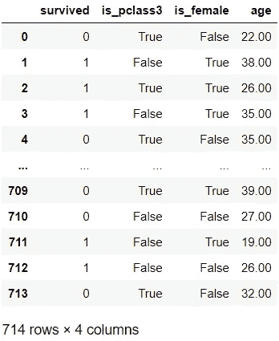

这是治疗组的存活率:

```
TREATMENT = 'is_pclass3'
OUTCOME = 'survived'df.groupby(TREATMENT)[OUTCOME].describe()
```

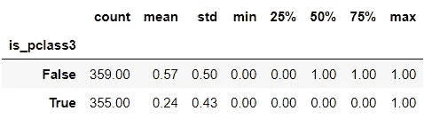

三等舱乘客*(治疗组)*存活率为 24%，而其他舱乘客*(对照组)*存活率为 57%。现在让我们按治疗组检查混杂因素的分布:

```
C_COLOUR = 'grey'
T_COLOUR = 'green'C_LABEL = 'Control'
T_LABEL = 'Treatment'sns.kdeplot(data=df[~df[TREATMENT]], x='age', shade=True, 
            color=C_COLOUR, label=C_LABEL)
sns.kdeplot(data=df[df[TREATMENT]], x='age', shade=True, 
            color=T_COLOUR, label=T_LABEL)
plt.legend();
```

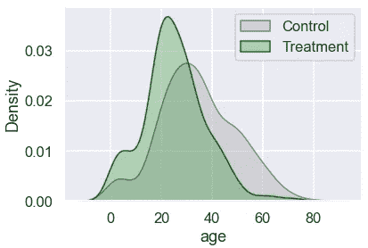

与对照组相比，治疗组有更多的年轻乘客。让我们来看看性别的分布:

```
F_COLOUR = 'magenta'
M_COLOUR = 'blue'F_LABEL = 'Female'
M_LABEL = 'Male'
gender = 100 * pd.crosstab(df[TREATMENT].replace({True: T_LABEL, 
                                                  False: C_LABEL}), 
                           df['is_female'].replace({True: 'Female',
                                                    False: 'Male'}), 
                           normalize='index')
gender['All'] = 100plt.figure(figsize=(5, 4))
sns.barplot(data=gender, x=gender.index.astype(str),  y="All", 
            color=M_COLOUR, label=M_LABEL)
sns.barplot(data=gender, x=gender.index.astype(str),  y='Female', 
            color=F_COLOUR, label=F_LABEL)
plt.legend(loc='center', bbox_to_anchor=(1.3, 0.8))
plt.xlabel('')
plt.ylabel('Percentage');
```

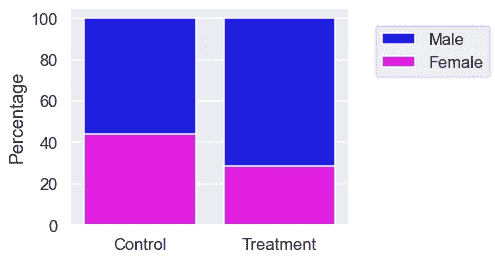

治疗组男性较多。因为混杂因素在两组之间不平衡，所以说存活率的差异是由于这个阶段的治疗是幼稚的。现在，让我们学习如何使各组更具可比性。

## 1.2.估计倾向得分🔨

一旦我们收集了数据，我们就可以建立倾向模型*，在给定混杂因素的情况下预测接受治疗的概率*。通常，逻辑回归用于这种分类模型。让我们建立一个倾向模型:

```
# Build a descriptive model
t = df[TREATMENT]
X = pd.get_dummies(df.drop(columns=[OUTCOME, TREATMENT]))pipe = Pipeline([
    ('scaler', StandardScaler()),
    ('logistic_classifier', LogisticRegression())
])
pipe.fit(X, t)# Predict
threshold = 0.5
df['proba'] = pipe.predict_proba(X)[:,1]
df['logit'] = df['proba'].apply(lambda p: np.log(p/(1-p)))
df['pred'] = np.where(df['proba']>=threshold, 1, 0)
df.head()
```

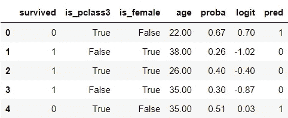

我们没有将数据分为训练和测试部分，因为我们没有建立预测模型。倾向评分告诉我们在给定混杂因素的情况下，个体接受治疗的概率。我们还准备了倾向得分的 logit 变换。让我们来评估这个模型:

```
print(f"Accuracy: {np.mean(df[TREATMENT]==df['pred']):.4f},\
 ROC AUC: {roc_auc_score(df[TREATMENT], df['proba']):.4f},\
 F1-score: {f1_score(df[TREATMENT], df['pred']):.4f}")# Visualise confusion matrix
pd.crosstab(df[TREATMENT], df['pred']).rename(columns={0: False, 
                                                       1:True})
```

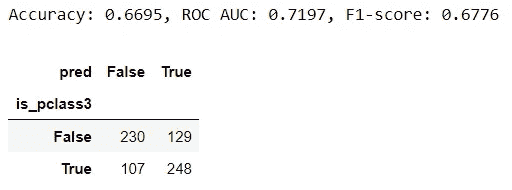

我们将通过治疗组检查倾向评分的分布及其 logit 转换:

```
fig, ax = plt.subplots(1,2, figsize=(10,4))
# Visualise propensity
sns.kdeplot(data=df[~df[TREATMENT]], x='proba', shade=True, 
            color=C_COLOUR, label=C_LABEL, ax=ax[0])
sns.kdeplot(data=df[df[TREATMENT]], x='proba', shade=True, 
            color=T_COLOUR, label=T_LABEL, ax=ax[0])
ax[0].set_title('Propensity')
ax[0].legend(loc='center', bbox_to_anchor=(1.1, -0.3))# Visualise logit propensity
sns.kdeplot(data=df[~df[TREATMENT]], x='logit', shade=True, 
            color=C_COLOUR, label=C_LABEL, ax=ax[1])
sns.kdeplot(data=df[df[TREATMENT]], x='logit', shade=True, 
            color=T_COLOUR, label=T_LABEL, ax=ax[1])
ax[1].set_title('Logit Propensity')
ax[1].set_ylabel("");
```

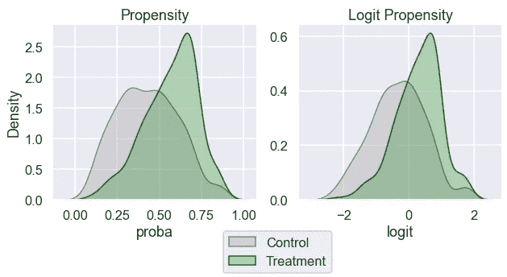

我们可以看到，两组在整个范围内的倾向得分有一些重叠。这是很好的搭配。

## 1.3.匹配记录👀

在本节中，我们将把最相似的对照记录与治疗组中的乘客进行匹配。在一个维度(倾向得分)找到相似的记录比在多个维度(混杂因素)找到要容易得多。这可能会让你想起降维方法。倾向得分是一个平衡得分。这意味着，如果我们根据倾向评分来匹配记录，匹配记录之间的混杂分布可能是相似的。

在下面的脚本中，我们为治疗组中的每个例子找到一个具有最相似倾向得分的对照记录(一对一匹配)。这样做时，我们将对控制记录进行抽样替换。这意味着一些质控记录可以多次与不同的治疗记录匹配，而一些质控记录根本不匹配:

```
# Sort by 'logit' so it's quicker to find match
df.sort_values('logit', inplace=True)
n = len(df)-1for i, (ind, row) in enumerate(df.iterrows()): 
    # Match the most similar untreated record to each treated record
    if row[TREATMENT]:
        # Find the closest untreated match among records sorted 
        # higher. 'equal_or_above would' be more accurate but 
        # used 'above' for brevity        
        if i<n:
            above = df.iloc[i:]
            control_above = above[~above[TREATMENT]]
            match_above = control_above.iloc[0]
            distance_above = match_above['logit'] - row['logit']
            df.loc[ind, 'match'] = match_above.name
            df.loc[ind, 'distance'] = distance_above

        # Find the closest untreated match among records sorted 
        # lower. 'equal_or_below' would be more accurate but 
        # used 'below' for brevity  
        if i>0:
            below = df.iloc[:i-1]
            control_below = below[~below[TREATMENT]]
            match_below = control_below.iloc[-1]
            distance_below = match_below['logit'] - row['logit']
            if i==n:
                df.loc[ind, 'match'] = match_below.name
                df.loc[ind, 'distance'] = distance_below

            # Only overwrite if match_below is closer than match_above
            elif distance_below<distance_above:
                df.loc[ind, 'match'] = match_below.name
                df.loc[ind, 'distance'] = distance_belowdf[df[TREATMENT]]
```

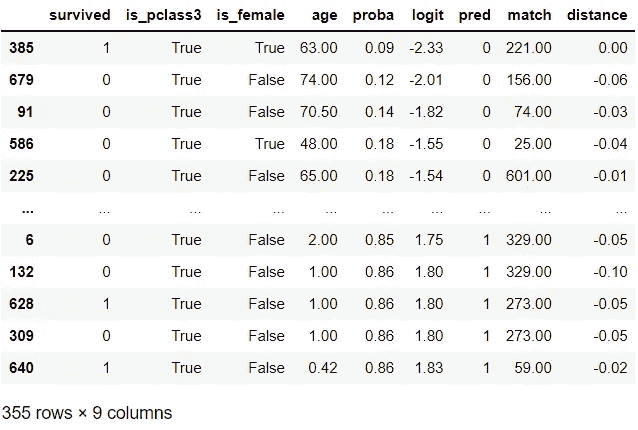

匹配完成！虽然我们在这个例子中做了一个最简单的匹配版本，但值得注意的是，我们可以利用更复杂的匹配技术。我们现在将创建一个名为`matched_df`的新数据集，它包含原始治疗组和一个新的对照组:

```
indices = df[df['match'].notna()].index.\
          append(pd.Index(df.loc[df['match'].notna(), 'match']))
matched_df = df.loc[indices].reset_index(drop=True)
matched_df
```

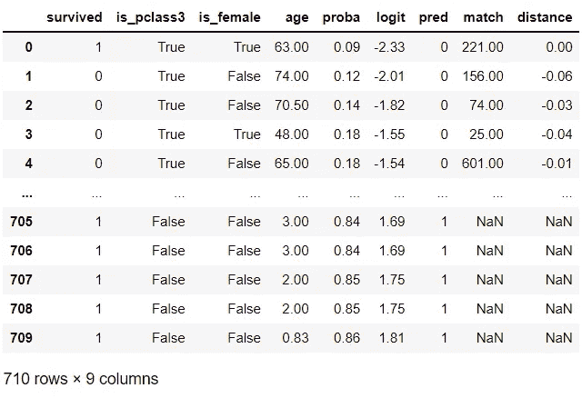

根据混杂因素，新的对照组应该更类似于治疗组。让我们在下一节看看是否是这样。

## 1.4.评估匹配🔍

是时候评价一下搭配有多好了。让我们看看这些组在混杂因素方面是否更具可比性:

```
COLUMNS = ['age', 'is_female', OUTCOME]
matches = pd.merge(df.loc[df[TREATMENT], COLUMNS+['match']], 
                   df[COLUMNS], left_on='match', 
                   right_index=True, 
                   how='left', suffixes=('_t', '_c'))
matches
```

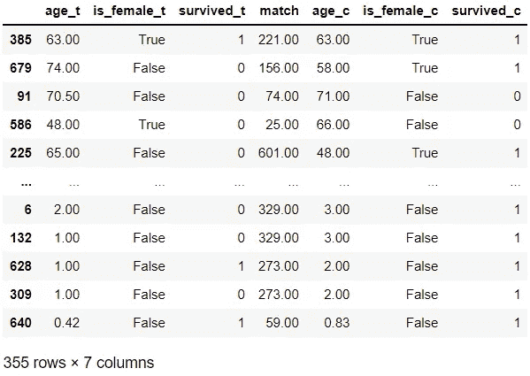

在这 10 个例子中，治疗记录`679`、`586`、`225`似乎与它们的对照匹配不太相似。然而，其余 7 个示例的匹配看起来非常相似。现在让我们检查一下分布情况:

```
for var in ['logit', 'age']:
    print(f"{var} | Before matching")
    display(df.groupby(TREATMENT)[var].describe())
    print(f"{var} | After matching")
    display(matched_df.groupby(TREATMENT)[var].describe())
```

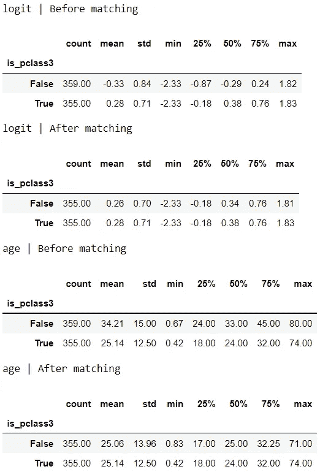

匹配后，各组之间的分布看起来更相似。让我们想象一下分布情况:

```
for var in ['logit', 'age']:
    fig, ax = plt.subplots(1,2,figsize=(10,4))
    # Visualise original distribution
    sns.kdeplot(data=df[~df[TREATMENT]], x=var, shade=True, 
                color=C_COLOUR, label=C_LABEL, ax=ax[0])
    sns.kdeplot(data=df[df[TREATMENT]], x=var, shade=True, 
                color=T_COLOUR, label=T_LABEL, ax=ax[0])
    ax[0].set_title('Before matching')

    # Visualise new distribution
    sns.kdeplot(data=matched_df[~matched_df[TREATMENT]], x=var, 
                shade=True, color=C_COLOUR, label=C_LABEL, ax=ax[1])
    sns.kdeplot(data=matched_df[matched_df[TREATMENT]], x=var, 
                shade=True, color=T_COLOUR, label=T_LABEL, ax=ax[1])
    ax[1].set_title('After matching')
    ax[1].set_ylabel("")
    plt.tight_layout()
ax[0].legend(loc='center', bbox_to_anchor=(1.1, -0.3));
```

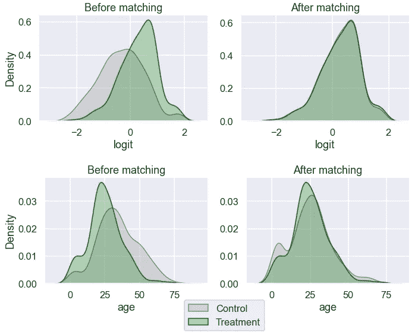

年龄看起来比以前更平衡了。让我们来考察一下性别的分布:

```
print(f"{'is_female'} | Before matching")
display(pd.crosstab(df[TREATMENT], df['is_female'], 
                    normalize='index'))
print(f"{'is_female'} | After matching")
display(pd.crosstab(matched_df[TREATMENT], matched_df['is_female'], 
            normalize='index'))
```

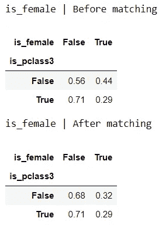

这两个群体之间的性别比例更加相似。

```
fig, ax = plt.subplots(1, 2, figsize=(10, 4))
# Visualise original distribution
sns.barplot(data=gender, x=gender.index.astype(str), y="All", 
            color=M_COLOUR, label=M_LABEL, ax=ax[0])
sns.barplot(data=gender, x=gender.index.astype(str), y='Female', 
            color=F_COLOUR, label=F_LABEL, ax=ax[0])
ax[0].legend(loc='center', bbox_to_anchor=(1.1, -0.3))
ax[0].set_xlabel('')
ax[0].set_ylabel('Percentage')
ax[0].set_title('Before matching')# Visualise new distribution
gender_after = 100 * pd.crosstab(
    matched_df[TREATMENT].replace({True: T_LABEL, False: C_LABEL}), 
    matched_df['is_female'].replace({True: 'Female', False: 'Male'}), 
    normalize='index'
)
gender_after['All'] = 100sns.barplot(data=gender_after, x=gender_after.index.astype(str), 
            y="All", color=M_COLOUR, label=M_LABEL, ax=ax[1])
sns.barplot(data=gender_after, x=gender_after.index.astype(str), 
            y='Female', color=F_COLOUR, label=F_LABEL, ax=ax[1])
ax[1].set_xlabel('')
ax[1].set_title('After matching')
ax[1].set_ylabel('');
```

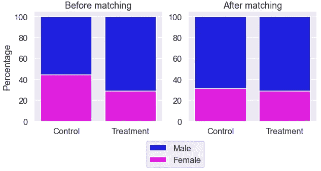

看起来匹配后两组的性别比例更有可比性。

如果我们对匹配不满意，我们可以返回重复前面的步骤并调整它们，直到我们对匹配满意为止。一旦我们对匹配感到满意，并且相信混杂因素在各组之间是平衡的，我们就可以进入下一步来理解治疗的因果影响。

## 1.5.评估治疗对结果的影响💭

现在，是时候熟悉一些与治疗效果相关的术语了，也称为因果效应。看一个有连续结果的小例子可能是最容易熟悉的方法:

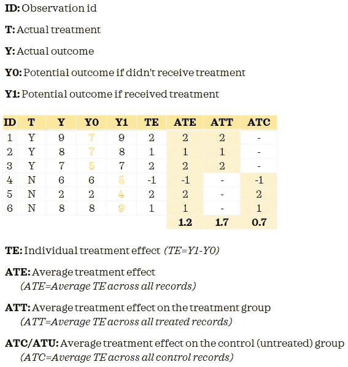

*作者图片|治疗效果概述*

*如果你想了解更多关于治疗效果的信息，请查看麻省理工学院开放课程* *的* [*和普林斯顿大学*](https://ocw.mit.edu/courses/economics/14-386-new-econometric-methods-spring-2007/readings/treatment_effect.pdf) *的* [*的本课程材料。*](https://www.princeton.edu/~ratkovic/public/EpenDay1.pdf)

因果推理的根本问题是我们没有观察到两种可能的结果。我们只知道对照组的 Y0 和治疗组的 Y1。当我们匹配记录时，我们试图用 Y0 代表治疗记录，以便我们可以测量治疗效果。

现在已经理解了这些关键术语，你可能已经猜到我们要估计 ATT。这是因为我们只对处理过的记录进行了匹配。如果我们做了完全匹配，我们可以估计 ate。

以下是治疗组和新对照组之间结果的描述性统计数据:

```
summary = matched_df.groupby(TREATMENT)[OUTCOME]\
                    .aggregate(['mean', 'std', 'count'])
summary
```


让我们估计一下平均治疗效果:

```
c_outcome = summary.loc[False, 'mean']
t_outcome =  summary.loc[True, 'mean']att = t_outcome - c_outcome
print('The Average Treatment Effect on Treated (ATT): {:.4f}'\
      .format(att))
```

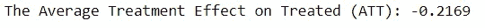

我们也可以用下面的方法来得到 ATT:

```
att = np.mean(matches['survived_t']-matches['survived_c'])
print('The Average Treatment Effect on Treated (ATT): {:.4f}'\
      .format(att))
```

假设我们在分析中考虑了所有的混杂因素，我们可以推断，在获得三等客舱的乘客中，获得三等客舱的乘客的生存机会下降了大约 22%。虽然我们在这个简化的例子中看到了点估计，但更好的方法是看区间估计。

我们已经看了一个简单的手动例子来理解倾向分数匹配背后的直觉。在实践中，使用专用的库，比如 R 中的[causan inference](https://causalinferenceinpython.org/)、[Dow why](https://microsoft.github.io/dowhy/)或 [MatchIt，往往更明智、更实用。例如，使用`causalinference`库，我们可以这样估计治疗效果:](https://cran.r-project.org/web/packages/MatchIt/MatchIt.pdf)

```
y = df[OUTCOME].values
t = df[TREATMENT].values
X = df[['is_female', 'age']]
X = pd.DataFrame(StandardScaler().fit_transform(X), 
                 columns=X.columns).valuesmodel = CausalModel(y, t, X)
model.est_via_matching()
print(model.estimates)
```

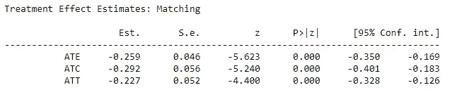

我们可以看到，估计的 ATT 与我们的结果相似，但现在我们有了这个输出的置信区间。此外，我们还有 ATE 和 ATC。


由 [Andrea Cau](https://unsplash.com/@andreacau?utm_source=medium&utm_medium=referral) 在 [Unsplash](https://unsplash.com?utm_source=medium&utm_medium=referral) 上拍摄的照片

因果推理技术可以让我们回答关于因果关系的困难而重要的问题。如果你想了解更多关于倾向分数匹配的知识，这和[这](https://www.youtube.com/watch?v=gaUgW7NWai8)是很好的谈话。

*您想访问更多这样的内容吗？媒体会员可以无限制地访问媒体上的任何文章。如果你使用* [*我的推荐链接*](https://zluvsand.medium.com/membership)*成为会员，你的一部分会费会直接去支持我。*

感谢您阅读这篇文章。如果你感兴趣，这里有我的一些其他帖子的链接:
◼️ [解释 scikit-learn models with shap](/explaining-scikit-learn-models-with-shap-61daff21b12a)
◼️️[k 近邻解释](/k-nearest-neighbours-explained-52c910c035c5)
◼️️ [逻辑回归解释](/logistic-regression-explained-7695f15d1b8b)
◼️️ [比较随机森林和梯度推进](/comparing-random-forest-and-gradient-boosting-d7236b429c15)
◼️️ [决策树是如何构建的？](/how-are-decision-trees-built-a8e5af57ce8?source=your_stories_page-------------------------------------)
◼️️ [管道、柱变压器及特性 Union 说明](/pipeline-columntransformer-and-featureunion-explained-f5491f815f?source=your_stories_page-------------------------------------)

再见🏃 💨