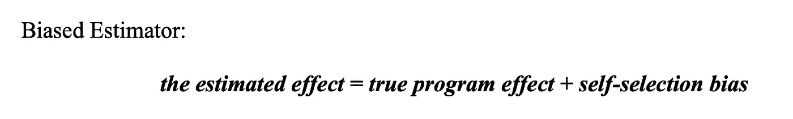
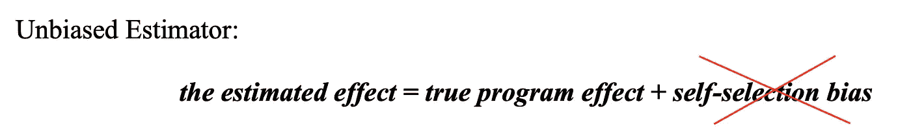
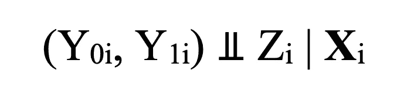
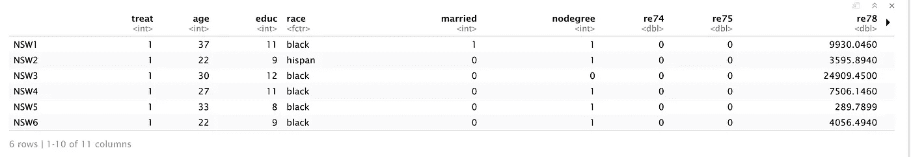
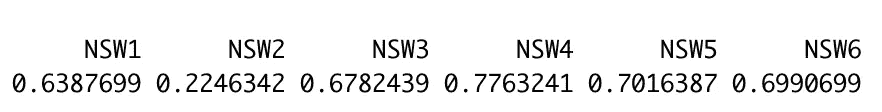
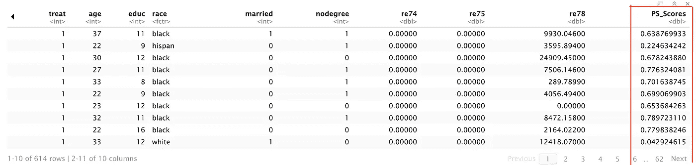
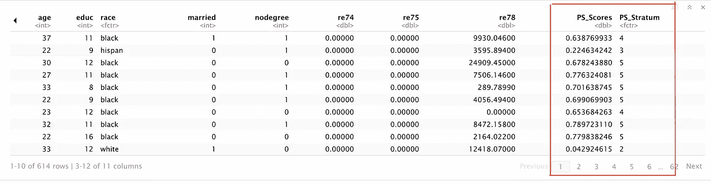

# 观察数据中的倾向评分分层:指南

> 原文：<https://towardsdatascience.com/propensity-score-stratification-in-observational-data-a-tutorial-ef21321eb586?source=collection_archive---------5----------------------->

## 实验和因果推理

## 倾向评分匹配的更好替代方案


Christophe Hautier 在 [Unsplash](https://unsplash.com/s/photos/balance?utm_source=unsplash&utm_medium=referral&utm_content=creditCopyText) 上拍摄的照片

# 介绍

你知道我们每天产生多少新数据吗？在 2021 年，这个数字大约是 2.5 万亿字节的数据。因此，我们并不缺乏数据，而是缺乏使其有用的正确工具。

很容易显示多种因素如何随着对大数据的访问而一起移动。然而，确定这种关系是因果关系还是仅仅是相关关系变得更具挑战性。总的来说，有三种类型的设计可以帮助我们:

1.  *真正的实验设计，又名 A/B 测试，或随机控制试验*
2.  *准实验设计*
3.  *观察设计*

在一系列的博客文章中，我详细阐述了每个类别中的相关主题。例如，我们必须理解[A/A 测试](/an-a-b-test-loses-its-luster-if-a-a-tests-fail-2dd11fa6d241?sk=8d4cebf2d3362704a4121b4518364c36)的价值，避免[常见的陷阱](/online-controlled-experiment-8-common-pitfalls-and-solutions-ea4488e5a82e?sk=736ba64dc8481993cd98e043256c4bf4)，遵循[最佳实践](/a-practical-guide-to-a-b-tests-in-python-66666f5c3b02?sk=069c502acb69d326a3ea559273c7a04f)，并在运行 A/B 测试时小心[用户干扰](/how-user-interference-may-mess-up-your-a-b-tests-f29abfcfccf8?sk=9ff3bbae01ff9951e6eca33e1c75cff4)。

准实验类有各种可用的设计，包括[差异中的差异](/does-minimum-wage-decrease-employment-a-difference-in-differences-approach-cb208ed07327?sk=9b4ec9afcef8bee1041720945cd0dd7d)、[回归不连续设计](/the-crown-jewel-of-causal-inference-regression-discontinuity-design-rdd-bad37a68e786?sk=401520d9e48b64e24aeb0064745b34fe)、[间断时间序列](/what-is-the-strongest-quasi-experimental-method-interrupted-time-series-period-f59fe5b00b31?sk=8ccf52232b23f5be74856768d4af15ce)、[综合控制](/causal-inference-using-synthetic-control-the-ultimate-guide-a622ad5cf827?sk=74c2e04700963a589b03357105ca765b)和工具变量。一个常见的误导性论点是 X/Y/Z 方法是最佳设计。相反，数据科学家必须评估可用的信息，并选择最适合环境的信息。

在最后一类中，倾向得分在使用观察设计获得因果推断中起着核心作用(Rosenbaum，1983)。倾向分分析主要有四种方法: [PS 匹配](/an-ultimate-guide-to-matching-and-propensity-score-matching-644395c46616?sk=e05b5a1a5bc741a2664159b599b56003)，PS 分层，PS 加权，协变量调整。

在之前的[帖子](/an-ultimate-guide-to-matching-and-propensity-score-matching-644395c46616?sk=e05b5a1a5bc741a2664159b599b56003)中，我介绍了我们如何使用 [PS 匹配](/an-ultimate-guide-to-matching-and-propensity-score-matching-644395c46616?sk=e05b5a1a5bc741a2664159b599b56003)来减少治疗组和对照组之间观察到的基线协变量失衡。在今天的帖子中，我们详细阐述了如何在 PS 的基础上对观察结果进行分层，并解释了为什么它是比 [PS 匹配](/an-ultimate-guide-to-matching-and-propensity-score-matching-644395c46616?sk=e05b5a1a5bc741a2664159b599b56003)更好的选择。在实证部分，我们用 R 编码，并用一个真实的例子计算治疗效果。

# 什么是倾向得分

PS 是在 ***观察到*** 协变量的情况下接受治疗的条件概率的比例分数。因此，P.S .是有效检查治疗组和对照组之间协变量平衡的平衡指标。

任何 PS 分析的潜在风险是影响结果变量的*未观察到的协变量的存在。如果未观察到的协变量存在，有三种检验方法(Rosenbaum，2005):*

1.  **构建两个已知在未观察到的协变量上不同的对照组。**
2.  **检查关联的一致性和剂量反应关系。**
3.  **检查不应受治疗影响的变量。**

*请查看 Rosenbaum (2005)以了解更多信息。*

**

*肖恩·斯特拉顿在 [Unsplash](https://unsplash.com/s/photos/balance?utm_source=unsplash&utm_medium=referral&utm_content=creditCopyText) 上拍摄的照片*

# *为什么倾向评分*

*让我们解决房间里的大象:*

> *倾向评分有什么好大惊小怪的？*
> 
> *为什么每一种观察方法都要玩弄它？*

*首先，我们必须了解观察数据的本质，以及为什么很难使用非实验(观察)数据进行因果推断。我们之所以称之为观察数据，是因为数据科学家无法控制或了解治疗分配过程。我们仅仅观察到治疗组中的一些单位和对照组中的其他单位。*

*由于缺乏有效的干预，很难建立可信的因果关系。**在 RCTs 中，我们采用两均数差估计量来量化干预效果，即比较治疗组和对照组之间的平均差异。**但是，我们不能在观测数据中使用同一个估计量，观测数据中可能包含选择偏差。即人们自选进入治疗组，其他人进入对照组。*

*这里有一个例子。*

*经济学家想了解职业培训项目在影响参与者家庭收入方面的有效性。然而，如果我们简单地比较项目参与者和非参与者之间的项目后工资，我们最终会得到一个有偏见的估计，因为那些比平均水平更有积极性的人更有可能参加培训项目。*

*如果我们只是比较差异而不进行调整，我们可能会将共同基础变量(在这种情况下是更好的动机)引起的影响归因于干预效应:*

**

*我自己的截图*

*为了获得一个无偏的估计量，我们必须调整关键协变量的不平衡，减少(甚至消除)选择偏差。*

**

*我自己的截图*

*下一节我们来深挖 PS 分层的原因。*

# *为什么倾向评分分层*

*PS 是一个平衡分数:以 PS 为条件，观察到的协变量在治疗组和对照组之间的分布看起来相似(Austin，2011)。因此，它允许你通过调整分数来调整协变量的不平衡。*

*一些研究人员认为，我们可以根据参与者的 PS 匹配他们，并找到可比较的案例，即 [PS 匹配](/an-ultimate-guide-to-matching-and-propensity-score-matching-644395c46616?sk=e05b5a1a5bc741a2664159b599b56003)。然而，精确匹配过程增加了不平衡、低效、模型依赖、偏差，并且未能减少不平衡(King 和 Nielsen，2019)。相比之下，PS 分层为 PS 匹配提供了更好的替代方案。*

*具体步骤如下:*

```
*1\. Estimate the PS using a logistic regression 
2\. Create mutually exclusive strata based on the estimated PS
3\. Group treated and control units into each stratum 
4\. Within each stratum, we calculate the difference in means between the treated and control 
5\. Weight the means in each stratum and obtain the target estimate*
```

*第 2 步和第 5 步有两个额外的注意事项。**在第二步，研究表明 5 层可以消除未经调整的估计中大约 90%的偏差(罗森鲍姆和鲁宾，1984)。**一个合理的假设是:如果我们尽可能多的增加地层呢？它能更好地降低偏置吗？*

*号码*

***模拟工作表明，5-10 层导致最好的结果，10+层带来的边际收益很小(Neuhä user et al .，2018)** 。此外，还有一个实际的原因:我们拥有的层越多，每个层中的数据点就越少。*

*在第 5 步，PS 分层允许我们估计平均治疗效果( **ATE** )和平均治疗效果( **ATT** )取决于我们如何权衡平均值。*

> ***为了估计 ate，我们按每个地层中的单元数进行加权；***
> 
> ***为了估计 ATT，我们根据每个地层中处理过的单位数量进行加权(Imbens，2004)** 。*

*你可能会对潜在结果框架(POF)符号感到困惑:ATE 和 ATT 实际上是什么意思？*

> *ATE:整个人群的平均治疗效果。*
> 
> *ATT:将接受治疗的受试者与未接受治疗的类似受试者进行比较。*

***从概念上讲，PS 分层被认为是对各层内一组准随机对照试验的荟萃分析(Austin，2011)。**我们可以将治疗分配过程视为以观察到的协变量为条件的随机分配，也称为可忽略假设，这意味着潜在的结果与治疗状态无关(Austin，2011)。*

*在 POF 中，可忽略的假设允许我们获得无偏估计。*

**

*我自己的截图*

**哪里**

*   **Y0i:如果 I 单元没有接受治疗**
*   **Y1i:如果 I 单元接受治疗**
*   **子:治疗条件**

*通常，可忽略的假设在观察研究中不成立。换句话说，治疗组的单位比对照组的单位更有可能接受治疗。然而，PS 分层提供了一个解决方案:以 PS 表示的观测协变量为条件，可忽略假设成立，即条件可忽略假设(CIA)。*

*两组均数差估计量是 ate 的无偏阶层特异性估计量(D'Agostino，1998)。*

**

*我自己的截图*

**其中**

*   **Y0i:如果 I 单元没有接受治疗**
*   **Y1i:如果 I 单元接受治疗**
*   **子:治疗条件**
*   ****Xi*** *:被观测协变量的向量，表示为 PS**

*这就是 PS 分层背后的所有理论。*

*让我们用 r 编码。*

**

*[菠萝供应公司](https://unsplash.com/@pineapple?utm_source=unsplash&utm_medium=referral&utm_content=creditCopyText)在 [Unsplash](https://unsplash.com/s/photos/balance?utm_source=unsplash&utm_medium=referral&utm_content=creditCopyText) 上拍摄的照片*

# *r 实施*

*在本节中，我们使用了 LaLonde (1986)和 Dehejia 和 Wahba (1997)使用的复合数据集。它由两部分组成:国家支持的工作示范(新南威尔士州)中经过处理的数据的子样本和来自收入动态人口调查(PSID)的比较样本。*

> ***出于教学原因，我简化了分析过程，并主要关注如何在 r 中进行倾向评分分层的工作流程。这就是为什么获得的 ATT 与原始论文略有不同。***

*PS 分层的快速回顾:*

```
*1\. Estimate the PS using a logistic regression 
2\. Create mutually exclusive strata based on the estimated PS
3\. Group treated and control units into each stratum 
4\. Within each stratum, we calculate the difference in means between the treated and control 
5\. Weight the means in each stratum and obtain the target estimate*
```

***第 0 步:数据准备***

```
*#install.packages(“MatchIt”)
#install.packages(“optmatch”)library(“MatchIt”)
library(“optmatch”)data(“lalonde”)
head(lalonde)
#?lalonde*
```

**

*我自己的截图*

```
```{r}
sum(lalonde$treat)
```
185*
```

*总治疗人数为 185 人。*

```
```{r}
mean(lalonde[which(lalonde$treat==0),’re78'])
```
6984.17*
```

*对照组的结果变量是 6984.17 美元。*

```
```{r}
mean(lalonde[which(lalonde$treat==1),’re78'])
```
6349.144*
```

*治疗组的结果变量为 6349.144 美元。*

***步骤 1:使用逻辑回归估计 PS***

```
```{r}
PS_logit <- glm(treat ~ age + educ+race+married+nodegree+re74+re75, data = lalonde, family=binomial)
PS_Scores = fitted(PS_logit)
head(PS_Scores)
```
```

**

***第二步:根据估算的 PS 建立互斥地层***

```
```{r}
lalonde$PS_Scores <- PS_Scores
lalonde
```
```

**

```
```{r}
# create strata 
Quintiles <- quantile(lalonde$PS_Scores, prob=seq(from=0,to=1,by=0.2),na.rm=TRUE)
lalonde$PS_Stratum <- cut(lalonde$PS_Scores, breaks = Quintiles, labels = 1:5, include.lowest = TRUE)
lalonde
```
```

**

***第三步&第四步:将处理单元和对照单元分组到各个地层中；在每一层中，我们计算治疗组和对照组之间的平均值差异***

*在 R 中，我们可以通过运行以下代码将步骤 3 和 4 结合在一起:*

```
```{r}
# Fifth Stratum: PS_Stratum = 5diff_5 = mean(lalonde[which(lalonde$treat==1&lalonde$PS_Stratum==5), ’re78'])- mean(lalonde[which(lalonde$treat==0&lalonde$PS_Stratum==5),’re78'])diff_5
```
1364.036*
```

*在第 5 层中，治疗组和对照组之间的结果变量(“re78”)的差异为 1364.036 美元。*

*我们在下面的代码中对剩余的层重复同样的过程:*

```
```{r}
**# Forth Stratum: PS_Stratum = 5** diff_4 = mean(lalonde[which(lalonde$treat==1 & lalonde$PS_Stratum==4),’re78']) — mean(lalonde[which(lalonde$treat==0 & lalonde$PS_Stratum==4),’re78'])
diff_4
841.7422**# Third Stratum: PS_Stratum = 3** diff_3 = mean(lalonde[which(lalonde$treat==1 & lalonde$PS_Stratum==3),’re78']) — mean(lalonde[which(lalonde$treat==0 & lalonde$PS_Stratum==3),’re78'])
diff_3
3167.41**# Second Stratum: PS_Stratum = 2** diff_2 = mean(lalonde[which(lalonde$treat==1 & lalonde$PS_Stratum==2),’re78']) — mean(lalonde[which(lalonde$treat==0 & lalonde$PS_Stratum==2),’re78'])
diff_2
2122.768# First Stratum: PS_Stratum = 1
diff_1 = mean(lalonde[which(lalonde$treat==1 & lalonde$PS_Stratum==1),’re78']) — mean(lalonde[which(lalonde$treat==0 & lalonde$PS_Stratum==1),’re78'])
diff_1
-10467.06```
```

*需要指出的是，第一层的差异似乎是:-10467.06。原因是地层中只有一个经过处理的观测值，从技术上讲，我们应该忽略它。然而，出于教学的原因，我们在分析中保留了它。
**第五步。对每一层的平均值进行加权并获得目标估计值，ATT***

```
```{r}
# the total nunmber of treated cases 
total_treated_n <- nrow(lalonde[which(lalonde$treat==1),])
total_treated_n 
185
```
```

*首先，我们计算了接受治疗的病例总数，共有 185 例。*

```
```{r}
#the number of treated cases in each stratum 
stratum_5_treated_n <- nrow(lalonde[which(lalonde$treat==1 & lalonde$PS_Stratum==5),])
stratum_5_treated_n 
85
```
```

*在地层中，治疗了 85 例。*

```
```{r}
ATT_5 = diff_5*stratum_5_treated_n/total_treated_n
ATT_5
626.7194
```
```

*然后，我们计算地层 5 中的加权处理效果。*

*对状态 1–4 重复相同的程序。*

```
```{r}#the number of treated cases in each stratum 
# stratum 4stratum_4_treated_n <- nrow(lalonde[which(lalonde$treat==1 & lalonde$PS_Stratum==4),])
stratum_4_treated_nATT_4 = diff_4*stratum_4_treated_n/total_treated_n
ATT_4
323.047# stratum 3
stratum_3_treated_n <- nrow(lalonde[which(lalonde$treat==1 & lalonde$PS_Stratum==3),])
stratum_3_treated_nATT_3=diff_3*stratum_3_treated_n/total_treated_n
ATT_3
359.5438# stratum 2
stratum_2_treated_n <- nrow(lalonde[which(lalonde$treat==1 & lalonde$PS_Stratum==2),])stratum_2_treated_n
7# stratum 1
stratum_1_treated_n <- nrow(lalonde[which(lalonde$treat==1 & lalonde$PS_Stratum==1),])
stratum_1_treated_nATT_1= diff_1*stratum_1_treated_n/total_treated_n
ATT_1
- 56.57873```
```

*最后一步，我们把它加起来，得到 ATT:*

```
```{r}
ATT = ATT_1+ATT_2+ATT_3+ATT_4+ATT_5
ATT1333.052
```
```

*使用 PS 分层法，我们发现参加职业培训项目会导致项目后家庭收入增加 1333.052 美元。实验基准是 1794 美元，原论文使用 PS 分层估算**1608**。差距是由一些技术细节造成的。*

**Medium 最近进化出了它的* [*作家伙伴计划*](https://blog.medium.com/evolving-the-partner-program-2613708f9f3c) *，支持像我这样的普通作家。如果你还不是订户，通过下面的链接注册，我会收到一部分会员费。**

*[](https://leihua-ye.medium.com/membership) [## 阅读叶雷华博士研究员(以及其他成千上万的媒体作家)的每一个故事

### 作为一个媒体会员，你的会员费的一部分会给你阅读的作家，你可以完全接触到每一个故事…

leihua-ye.medium.com](https://leihua-ye.medium.com/membership)* 

# *参考*

*奥斯汀，哥伦比亚特区，2011 年。减少观察性研究中混杂效应的倾向评分方法介绍。*多元行为研究*， *46* (3)，第 399–424 页。*

*小达戈斯蒂诺，R.B .，1998 年。在治疗与非随机对照组的比较中减少偏倚的倾向评分方法。*医学统计学*， *17* (19)，第 2265–2281 页。*

*Dehejia，R.H .和 Wahba，s .，1999 年。非实验研究中的因果效应:重新评估训练计划的评估。*美国统计协会杂志*， *94* (448)，第 1053–1062 页。*

*Imbens，G.W .，2004 年。外源性下平均治疗效果的非参数估计:综述。*经济学与统计学回顾*， *86* (1)，第 4–29 页。*

*King，g .和 Nielsen，r .，2019。为什么倾向评分不应用于匹配。*政治分析*， *27* (4)，第 435–454 页。*

*拉隆德，R.J .，1986 年。用实验数据评估训练计划的经济计量评估。《美国经济评论》第 604-620 页。*

*neuhuser，m .，Thielmann，m .和 Ruxton，G.D .，2018。二元结果的倾向分数分层中的层数。医学科学档案:AMS ， *14* (3)，第 695 页*

*罗森鲍姆和鲁宾，1984 年。使用倾向评分子类化减少观察性研究中的偏倚。*美国统计协会杂志*， *79* (387)，第 516–524 页。*

*罗森鲍姆公关公司，2005 年。观察研究中的敏感性分析。*行为科学统计百科*。*

# *喜欢读这本书吗？*

> *请在 [LinkedIn](https://www.linkedin.com/in/leihuaye/) 和 [Youtube](https://www.youtube.com/channel/UCBBu2nqs6iZPyNSgMjXUGPg) 上找到我。*
> 
> *还有，看看我其他关于人工智能和机器学习的帖子。*