# 因果推理中的倾向分数和逆概率加权

> 原文：<https://towardsdatascience.com/propensity-scores-and-inverse-probability-weighting-in-causal-inference-97aa53f3b6ce?source=collection_archive---------3----------------------->

## [Bcn 因果 ALGO](https://towardsdatascience.com/tagged/bcn-causal-algo) ，[动手教程](https://towardsdatascience.com/tagged/hands-on-tutorials)

## 全球概况

来源:[https://pix abay . com/es/photos/horizon tales-edad-pesos-930716/](https://pixabay.com/es/photos/horizontales-edad-pesos-930716/)

这是在[因果 ALGO Bcn](https://medium.com/u/5637a0e9712?source=post_page-----97aa53f3b6ce--------------------------------) 内与[努里亚·科雷亚·马尼亚斯](https://medium.com/u/c05c0c26d946?source=post_page-----97aa53f3b6ce--------------------------------)、[耶稣·塞奎德斯](https://medium.com/u/b3fed4bbda55?source=post_page-----97aa53f3b6ce--------------------------------)、[霍安·卡普德维拉·普约尔](https://medium.com/u/57efda3708cd?source=post_page-----97aa53f3b6ce--------------------------------)和[博尔哈·维拉斯科](https://medium.com/u/cd162631459a?source=post_page-----97aa53f3b6ce--------------------------------)的联合作品。在这里可以找到[núRIA Correa Maas](https://medium.com/u/c05c0c26d946?source=post_page-----97aa53f3b6ce--------------------------------)的动手贴！

在本帖中，我们将讨论两种众所周知的用于计算平均治疗效果(ATEs)的技术:倾向得分分析和逆概率加权。这篇文章假设你已经有了因果推理的基本概念，也就是说，你理解在混杂情况下估计影响的问题。

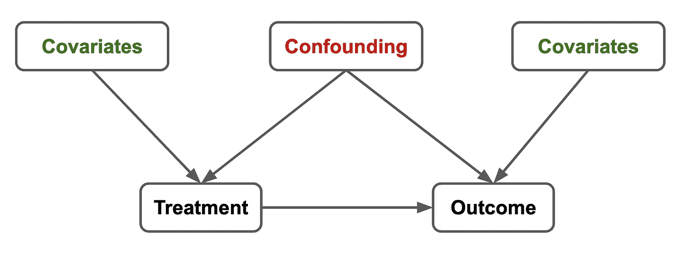

混杂变量是那些影响治疗分布和结果的变量。作者图片

倾向得分分析的主要优势在于它能够将多维问题简化为一维问题。一旦为每个观察结果计算出倾向得分，我们就可以确保我们正确地比较两个可能不同的人群，即治疗组和对照组。此外，治疗的效果只能基于这样的分数进行事后计算。逆概率加权使用不同的数值公式来实现相同的目标，即计算 ate。

# ATEs 提醒

ATEs 代表平均治疗效果。也就是说，当你有两组病人，治疗组和未治疗组时，你想知道哪一组是治疗的结果(例如，康复的概率)。除非你进行随机对照试验(RCT)，否则你不能只看两者之间恢复的差异，因为治疗组和非治疗组可能有非常不同的属性。

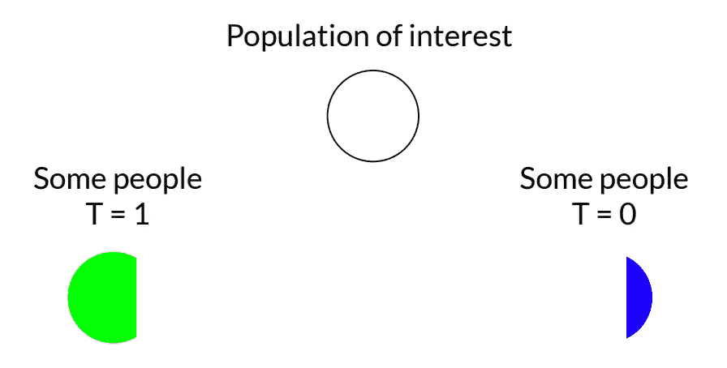

治疗组可能具有不同的属性分布。作者图片

让我们首先通过众所周知的肾结石问题来提醒混淆调整的基本原理。在这个问题中，医生想知道在 A 和 B 两种治疗方法中，哪一种有更好的恢复率。当他们查看数据时，他们发现了这个奇怪的情况。

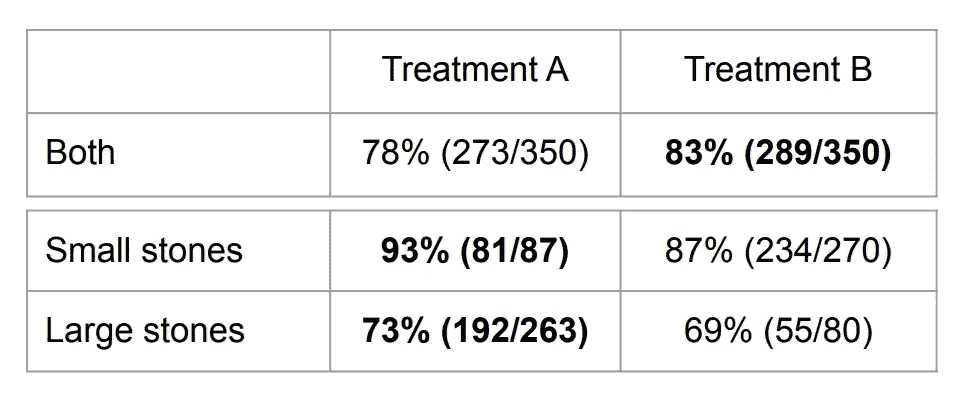

辛普森悖论——肾结石。作者图片

当数据按结石大小分层时，治疗 A 在两种情况下都更好。然而，当综合分析时，治疗 B 更好。原来，医生在分配治疗方案时，之前一直在猜测结石的大小。由于治疗 A 是手术，而治疗 B 是某种药丸，较大的结石(更难治愈)往往主要由治疗 A 来治疗，从而在治疗之间产生分布不平衡。这种动态可以通过有向无环图(DAG)来表示

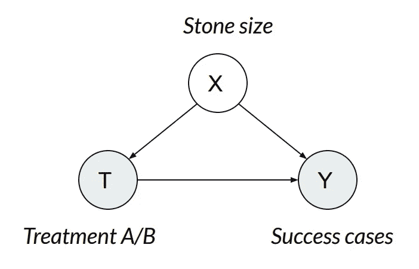

作者图片

在这种情况下，X 是一个变量，但当它是一个向量时，同样的公式也适用，这将是实际情况。为了消除混杂因素(影响治疗和结果的变量)的影响，假设没有混杂因素缺失，我们可以使用以下**调整公式计算 ate。**

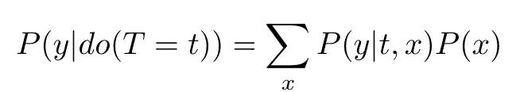

这个公式基本上告诉每个人，而不仅仅是过去发生的特定选择的患者，如果你接受治疗 *t* 会发生什么。正确理解这个公式需要一些时间，我们在这里不做解释。关于这个话题的参考资料可以在[这里](http://bayes.cs.ucla.edu/PRIMER/)找到。

我们的主要目标是知道如果我们给每个人治疗 A 或 B 会发生什么。

# 逆概率加权

正如我们所见，分析数据的主要问题是群体不平衡。这可能会在群体之间产生有偏见的比较。

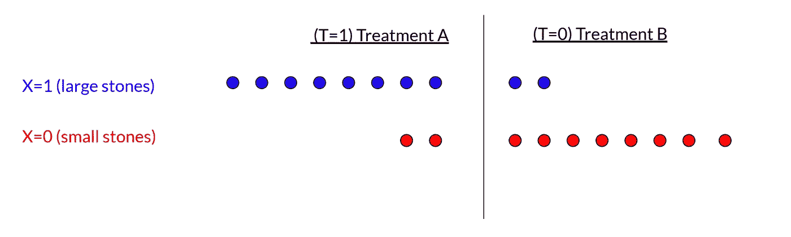

编造数据的动机示例。作者图片

我们能想到的一个想法是，如果我们以某种方式重新加权每一组，使它们**反映大小的全球分布**而不是每个治疗组的大小，会怎么样。例如，对于大石块分组

作者图片

我们可以使用图中所示的重量。这些权重恰恰是倾向得分的倒数，倾向得分是在给定患者属性的情况下，被分配到特定治疗组的概率(我们将在下一节更详细地讨论这一点)。

这种直觉可以正式反映在下面的公式中，其中，乘以倾向得分，我们得到逆概率加权公式

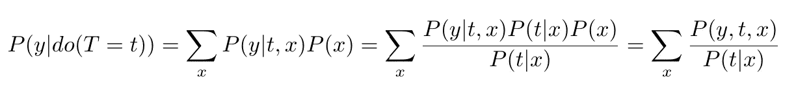

逆概率加权公式

这个公式有一个数字问题。我们必须除以倾向分数。在某些情况下，对于某些 *x* ，可能会发生处理的概率可能很低，很容易增加其方差。所以它并不总是被建议。

# 倾向得分

让我们从另一个角度来看调整公式。回忆

其中 X 是具有所有潜在混杂因素属性向量。假设您想要比较接受治疗和未接受治疗的患者的效果与您想要比较的结果 *y.*

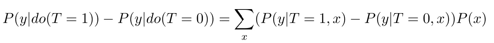

所以前面的公式可以读作取一个具有属性的病人 *x* ，并计算治疗和非治疗的影响

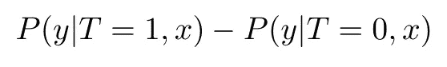

并将这些量与频率加权相加你会看到这些属性 *x* ，即 *P(x)* 。

然而，这种方法有一个问题:每个患者只有一个治疗版本(治疗或未治疗)，因此两个术语中的一个将不可用(当然，除非您有另一个具有完全相同属性的患者，这并不经常发生)。这就是为什么在某些情况下，因果推断问题可以被看作是一个数据缺失问题。

一个近似的解决方案是为每个具有属性 *x* 的患者找到另一个属性 *x'* 尽可能接近的患者。这就是所谓的**匹配**。这个直观的想法到了一个实际问题，主要是定义“尽可能接近”是什么意思。这是因为不同的属性可能会对我们的问题产生不同的影响，并且不清楚如何相应地对它们进行优先级排序。

Rubins 和 Rosenbaum 在“因果效应观察研究中倾向分数的中心作用”(1983)中找到了一个解决方案。要找到一个有可比性的患者，不需要再找一个有相同属性的。找到一个被选中概率相同的就够了！这个量被称为**倾向得分**。

也就是说，对于每组属性 *x* ，您需要计算

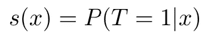

这可以通过逻辑回归(或者，事实上，任何适合你的机器学习模型)来实现。

计算整个人群的倾向得分有助于我们管理**共同支持假设。**同样，对于每个病人我们需要在其他治疗组内找到一个相似的。如果某一组中的某些类型的患者与另一组中的其他患者差异太大，该怎么办？这意味着我们找不到合适的配型，所以我们不能说如果我们做了替代治疗，这个病人会怎么样。

可视化两组的分布，我们可以识别没有适当匹配的区域。

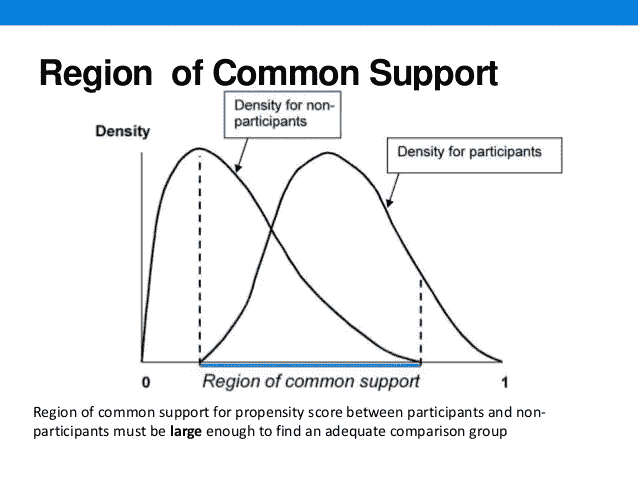

来源:[https://www . slide share . net/ERF _ latest/prevention-score-matching-methods](https://www.slideshare.net/erf_latest/propensity-score-matching-methods)

那些在共同支持之外的患者应该从比较中去除。Rubin 和 Rosenbaum 的论文确保了在这个选择之后，比较是适当的，意思是无偏的，所以可以正式地完成。

倾向得分也可以用来计算 ate。通过一些计算(为简单起见省略)，我们可以看到，治疗和未治疗的差异可以用与以前类似的方式计算，但只使用倾向得分

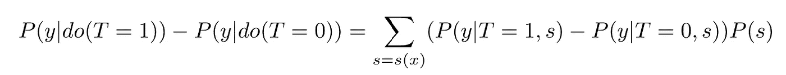

这个公式导致计算 ate 的不同算法，一些算法在 Rubin 和 Rosenbaum 的论文中提出。

*   版本 1:对于每个接受治疗的患者，找到另一个具有相同倾向评分的未治疗患者，并计算结果的差异。平均所有结果。
*   版本 2:对于倾向 p 的每个水平，对具有该水平的治疗和未治疗患者进行采样，并计算差异。平均所有结果。
*   亚分类:Bin 倾向评分，对于每个水平 p，计算平均治疗差异。平均所有结果。

# 结论

*   平均治疗效果可以使用等效公式计算:逆概率加权和倾向得分
*   逆概率加权，因为潜在地除以小概率会遭受大的变化
*   倾向得分可用于找到共同支持的区域
*   倾向得分可以以多种方式用于计算 ate