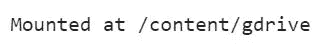
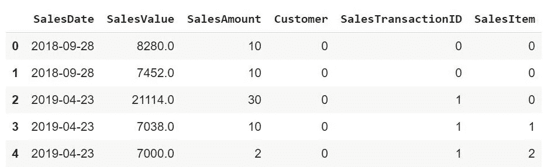
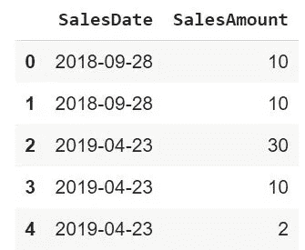
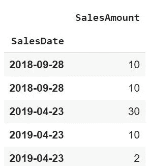
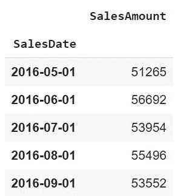
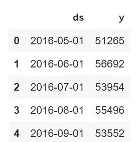
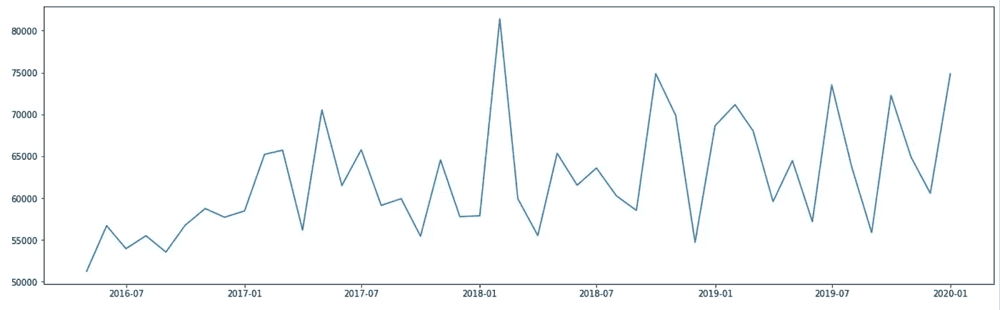
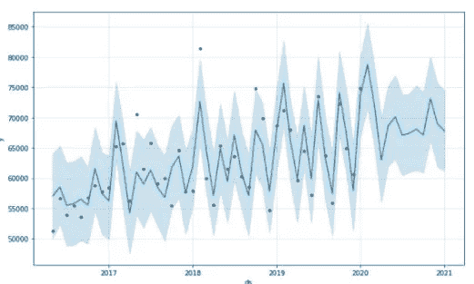
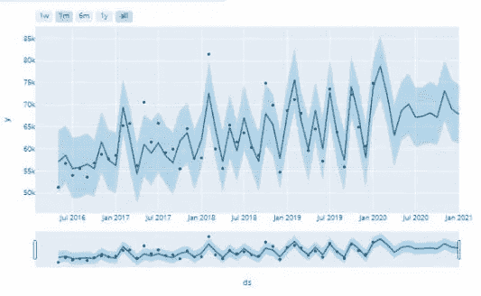
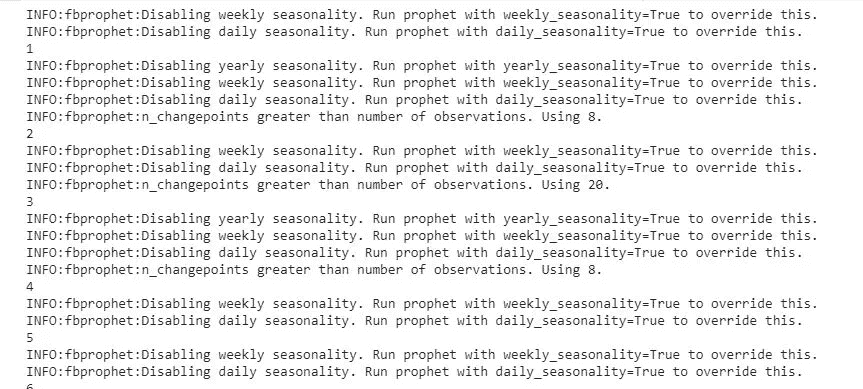

# 循环中的先知

> 原文：<https://towardsdatascience.com/prophet-in-a-loop-a875516ef2f9?source=collection_archive---------22----------------------->

## 一次性预测所有销售项目


[fbhler&or endt，Die verhltnisse，2011，墙板上的木制物品，210 × 440 × 25 c](http://www.boehler-orendt.com/pdfs/Boehler_&_Orendt_Die_Verhaeltnisse.pdf) m(经我的朋友马蒂亚斯·布勒友好许可)

**动机:**

我们将使用脸书的先知来预测每件商品的销售额。已经有很多很棒的教程教你如何使用 Prophet。这篇文章关注的是如何一步到位(循环)地单独预测所有销售项目。

**解决方案:**

首先，我们将导入必要的库:

```
import pandas as pd 
import matplotlib.pyplot as plt 
import seaborn as sns 
from fbprophet import Prophet 
%matplotlib inline
```

如果你想使用谷歌的 Colab，请确保首先安装你的谷歌硬盘:

```
# To be able to access the data stored in Google Drive, we first need to mount our Google Drive so we can load and save files to it.from google.colab import drive
drive.mount(‘/content/gdrive’)#We’ll need to put in a token which Google will generate for us as soon as we click on the link.
```



您将在安装驱动器后收到此消息。

然后我们将看看我们的数据框架(数据可以在我的 [github 库](https://github.com/DAR-DatenanalyseRehberg/DDDD_Data-Driven-Dealings-Development)中找到):

```
data = pd.read_excel('/content/gdrive/MyDrive/DDDDFolder/DDDD.xlsx')  
data.head()
```



因此，我们得到的是每个销售日、客户(例如，客户代码 0 是一个特定的客户)和销售项目(类似于客户，销售项目 0 是一个特定的销售项目)的销售额(按金额和价值)。我们将通过查看过去的销售日期来预测未来的销售额。因此，我们将删除其他列:

```
dfProphet=data.drop(columns=[ 'Customer','SalesItem','SalesTransactionID','SalesValue'])
```



现在我们想对月销售额进行分组。我们首先需要索引销售日期:

```
dfProphet['SalesDate'] = pd.to_datetime(dfProphet['SalesDate'])dfProphet = dfProphet.set_index('SalesDate')dfProphet.head()
```



之后，我们可以使用每月的第一天(月初，毫秒)对每月销售额进行分组:

```
dfMonthly = dfProphet.resample('MS').sum()
#M stands for end of month, MS start of month, D daily and w weekly 
dfMonthly.head()
```



请注意，FB Prophet 据说对每日时间序列效果最好。但是在我们的例子中，我们继续按月销售。

我们必须将 SalesDate 重命名为 ds，将 SalesAmount 重命名为 y(这就是 Prophet 的工作方式)。

```
dfMonthlyProph = dfMonthly.reset_index().dropna()
dfMonthlyProph.columns = ['ds', 'y']
dfMonthlyProph.head()
```



让我们看一下时间线图:

```
fig = plt.figure(facecolor='w', figsize=(20, 6))
plt.plot(dfMonthlyProph.ds, dfMonthlyProph.y)
```



为了进行预测，我们需要通过选择季节性模式和间隔宽度来实例化模型，并通过设置周期和频率 MS(用于月开始)的变量来设置我们想要预测的月数。

之后，我们可以通过实例化模型来绘制实际值和预测值，并绘制预测值:

```
m = Prophet(seasonality_mode='additive',interval_width=0.95).fit(dfMonthlyProph) 
#additive vs multiplicative seasonality, 95% confidence intervalfuture = m.make_future_dataframe(periods=12, freq='MS')
# vs just periods=365 fcst = m.predict(future)
fig = m.plot(fcst)
```



做同样的事情，但是这次是动态的:

```
from fbprophet.plot import plot_plotly
import plotly.offline as py
py.init_notebook_mode()
fig = plot_plotly(m,fcst)#py.iplot(fig)
fig.show(renderer="colab")
```



这张图表想告诉我们什么？蓝线是我们的预测销量(Prophet 在尝试拟合一个模型时预测的，该模型在我们的实际数据点上具有最低的总体误差)。黑点是我们过去的实际销售量。蓝色阴影是我们的置信区间，这意味着模型将估计销售量必须在此范围内。我们可以看到，在 2017 年 5 月，我们面临的第一个实际销售数量不符合模型的置信区间。

# 做循环

到目前为止，我们已经对所有客户的所有销售项目进行了预测。如果我们想要预测特定的客户和/或销售项目组合，我们必须事先进行筛选。

作为一种更方便的方法，现在让我们看看如何在一个循环中实现这一点。我们将对每个销售项目进行预测，并最终将所有销售项目的实际值和预测值导出到一个 Excel 文件中:

```
import pandas as pd
from fbprophet import Prophetdata = pd.read_excel('/content/gdrive/MyDrive/DDDDFolder/DDDD.xlsx')#If you should receive an error "future is not defined" when running #with your data, your SalesDate column in Excel might not be #formatted as date.gData = data.groupby(['SalesItem', 'SalesDate'])['SalesAmount'].sum() #.agg(F.collect_list("SalesAmount")).sort('SalesItem')gData = gData.to_frame().reset_index()
itemlist = gData.SalesItem.unique()
m = Prophet()
fcst_all = pd.DataFrame()  # store all forecasts herefor x in itemlist:
temp = gData[gData.SalesItem == x]
temp = temp.drop(columns=[ 'SalesItem'])
temp['SalesDate'] = pd.to_datetime(temp['SalesDate'])
temp = temp.set_index('SalesDate')
d_df = temp.resample('MS').sum()
d_df = d_df.reset_index().dropna()
d_df.columns = ['ds', 'y']try:m = Prophet(seasonality_mode='additive',interval_width=0.95).fit(d_df)
future = m.make_future_dataframe(periods=12, freq='MS')
except ValueError:
pass
fcst = m.predict(future)
fcst['SalesItem'] = x
fcst['Fact'] = d_df['y'].reset_index(drop = True)
fcst_all = pd.concat((fcst_all, fcst))
print(x)
fcst_all.to_excel('ProphetFc.xlsx', index=False)
```



根据您的数据量，这可能需要一些时间。

恭喜，现在我们在一个数据框架(df)中拥有了每个销售项目的所有实际过去值，包括预测值。如果列 fact 用 y 填充，这意味着该记录是真实的(否则是预测的)。

非常感谢您的阅读！希望这篇文章对你有帮助。请随时在 [LinkedIn](https://de.linkedin.com/in/jesko-rehberg-40653883) 、 [Twitter](https://twitter.com/DAR_Analytics) 或[工作室](https://jesko-rehberg.medium.com/virtual-reality-vr-for-education-a532aa5b6272)与我联系。

<https://jesko-rehberg.medium.com/membership>  

Jupyter 笔记本和数据文件也可以在我的 Github 存储库中找到:[https://github.com/DAR-DatenanalyseRehberg/ProphetInALoop](https://github.com/DAR-DatenanalyseRehberg/ProphetInALoop)