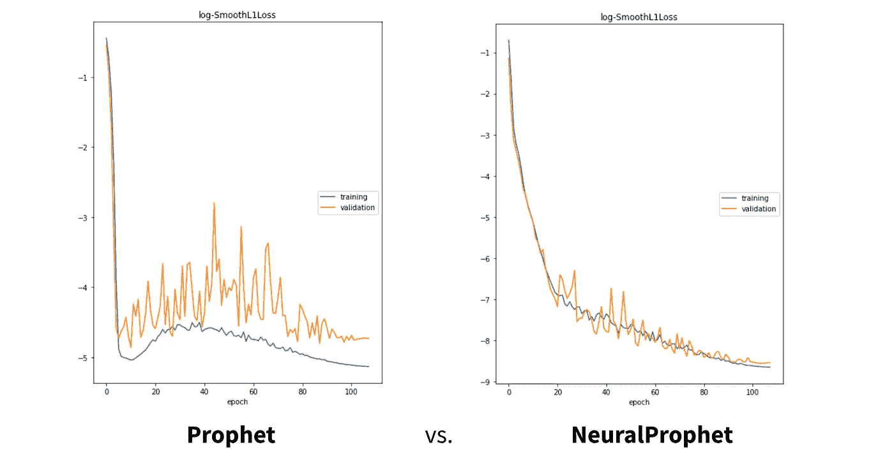
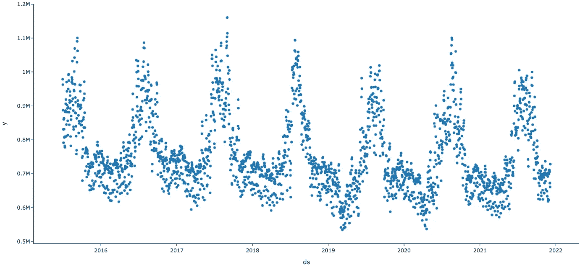
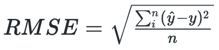
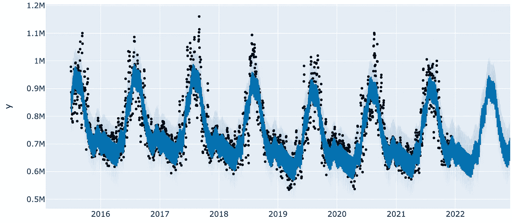
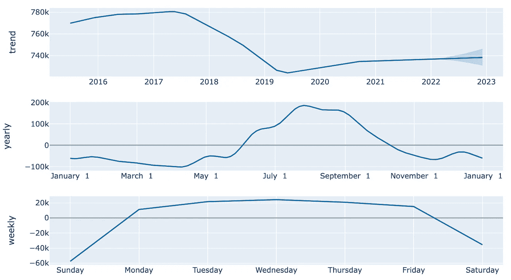
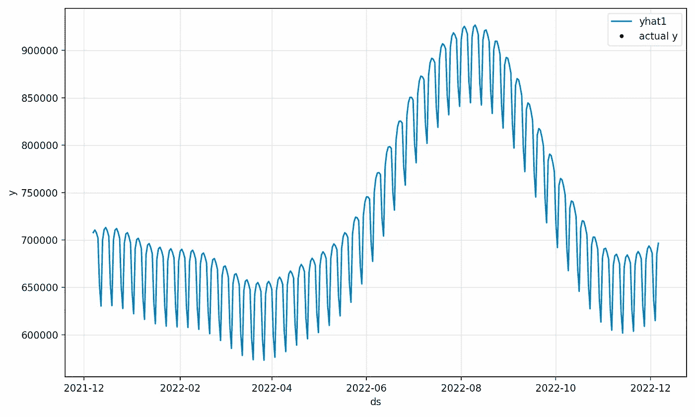
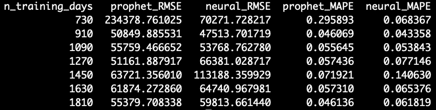

# 先知对神经原植物

> 原文：<https://towardsdatascience.com/prophet-vs-neuralprophet-fc717ab7a9d8?source=collection_archive---------2----------------------->

## 著名先知模型的并排比较

先知模型是有效的，可解释的，并且易于使用。但是哪个更好呢？

在这篇文章中，我们将探索 Prophet 和 Neural Prophet 的实现差异，并进行一个快速的案例研究。这里是代码。



图 Prophet 和 NeuralProphet 算法之间的训练精度示例— [src](https://neuralprophet.com/html/energy_hospital_load.html) 。图片作者。

但在我们开始编码之前，让我们快速覆盖一些背景信息，更多信息可以在[这里](/how-to-develop-interpretable-time-series-forecasts-with-deep-learning-50b27bfcb8a1)找到。

Prophet (2017)是 NeuralProphet (2020)的前身——后者融入了一些自回归深度学习。从理论上讲，NeuralProphet 应该总是拥有与 Prophet 相同或更好的性能，所以今天我们将对这一说法进行测试。

让我们开始吧。

# 基本规则

## 数据

我们将使用加州能源需求的每日时间序列(图 2)。



图 2:加州观察到的电力需求的每日时间序列— [src](https://www.eia.gov/electricity/gridmonitor/dashboard/electric_overview/US48/US48) 。图片作者。

正如你在上面看到的，有很强的年度季节性，在夏季达到高峰，可能是由于空调使用的增加。虽然从这张图表中不太明显，但我们也希望看到每周的季节性-我们的假设是，周末和工作日的用电量会有所不同。

对于像 ARIMA 这样的传统时间序列模型，所有这些季节性要求我们指定*订单*(回顾指数)，对应于我们观察到的任何季节性水平。另一方面，prophet 模型自动将这种正弦运动封装在傅立叶级数中，因此这两种 Prophet 模型都应该有效地利用上述季节性。

最后，再观察一下数据，您会注意到轴名是 *y* 和 *ds* 。我们已经将我们的时间序列存储在一个熊猫数据帧中，该数据帧已经过重组，以适应 Prophet 的规格。使用的确切代码如下…

```
df = read_data() # helper func
df = df[['Local date','D']]
df.columns = ['ds','y']
```

如果你想继续下去，数据是从来源:美国能源信息署(2021 年 12 月)下载的[，也可以在这里](https://www.eia.gov/electricity/gridmonitor/dashboard/electric_overview/US48/US48)[获得](https://github.com/mberk06/DS_academic_papers/blob/master/EnergyTSData/Region_CAL.xlsx)。这里是[版权信息](https://www.eia.gov/about/copyrights_reuse.php)。

## 估价

我们感兴趣的度量将是 RMSE(图 3)。



图 3:均方根误差，其中 y_hat 是我们的预测值，y 是我们的观测值。图片作者。

为了公平地比较我们的两个模型，我们将利用交叉验证(CV)。请注意，传统的 CV 假设我们的数据是可交换的，即我们样本的任何排序都同样可能发生。对于时间序列数据，有一个时间成分，所以不幸的是，完全随机化不能应用。

相反，我们尝试许多不同的截止日期，对所有先前的数据进行训练，并用接下来的 *n* 周期进行测试。这被称为**滚动原点回溯测试**。通过迭代训练和确定样本外精度，我们可以得到模型精度的更稳健的估计。

在我们的案例中，我们从 2017 年 12 月 22 日开始迭代，以 180 天为增量，在 2021 年 12 月 6 日左右结束。

# 竞争者 1:先知

我们的第一个竞争对手是[脸书先知](https://facebook.github.io/prophet/)。这是一种开源算法，自 2017 年问世以来，已经受到了极大的欢迎。它的主要卖点是易于使用，可解释，并且易于与主题专家互动。

介绍完毕，让我们开始[编码](https://github.com/mberk06/DS_academic_papers/blob/master/28_prophet_vs_neural_prophet.py)。

首先，我们将创建我们的模型，并拟合我们的重构数据。

```
m = Prophet()
m.fit(df)
```

很复杂，对吧？接下来，我们将进行预测，并得出一些关键图。

```
# create forecast
future = m.make_future_dataframe(periods=365)
forecast = m.predict(future)# create plots
pred_plot = plot_plotly(m, forecast)
comp_plot = plot_components_plotly(m, forecast)
```

首先，我们创建一个未来 365 个周期的数据框架，在我们的例子中是 365 天。然后，我们相应地进行预测，并将预测值和预测区间一起存储在变量 *forecast* 中。最后，我们创建一个预测图和组件图。让我们依次看一看每一个。

首先，我们有图 4 中的**预测图**。



图 4:365 天的预言者预测图。图片作者。

正如你所看到的，在 2022 年左右，我们的数据停止了，我们的预测开始了，这是由缺乏观测数据(黑点)所表明的。

好吧，这是一张漂亮的照片，但是它并没有告诉我们很多幕后发生的事情。为此，我们将转向组件图(图 5)。



图 5:先知组件图。图片作者。

在上面的图中，我们有三个图表，它们都提供了关于我们的数据的有用结论。首先，我们可以看到，在我们的上图中，趋势在我们数据的持续时间内相当不稳定。从 2017 年年中开始，我们看到电力需求有所下降，但总体降幅并不巨大。第二，根据第二张图表，电力需求在夏季最高，在春季最低。这些观察与我们的直觉一致。第三，周末的消费似乎明显低于工作日。同样，这也符合我们的期望。

谈一个可解释的模型！

Prophet 的组件图是了解幕后发生的事情的一个非常有用的窗口——不再有黑盒。注意 NeuralProphet 也有同样的功能。

但是，一个模型的好坏取决于它的准确性，所以让我们来看看准确性。

使用内置的交叉验证方法，365 预测观察到的 **RMSE 为 48810.12** 。我们的 y 值是几十万，在 60 万到 1.2 万之间，所以 48k 的 RMSE 似乎很低。

让我们看看我们是否可以通过一些深度学习来战胜它。

# 竞争者 2: NeuralProphet

我们的下一个模型是 Prophet 的第二次迭代。它将适合自回归(滞后)数据的深度学习项纳入我们的方程。理论上和[经验上](/how-to-develop-interpretable-time-series-forecasts-with-deep-learning-50b27bfcb8a1?source=user_profile---------0-------------------------------)，NeuralProphet 是一个优越的模型。但是让我们看看这种优势是否适用于我们的能源需求数据集。

让我们得到[编码](https://github.com/mberk06/DS_academic_papers/blob/master/28_prophet_vs_neural_prophet.py)。

首先，与 Prophet 一样，我们需要创建并拟合一个模型。请注意，Prophet 的两次迭代之间的语法非常相似。

```
m = NeuralProphet()
metrics = m.fit(df, freq="D")
```

现在我们已经创建了我们的模型，让我们创建一个预测，并得到一些关键的情节。我们将使用 NeuralProphet，**中的默认参数，这些参数不包含深度学习。**

```
# create forecast
df_future = m.make_future_dataframe(df, periods=365)
forecast = m.predict(df_future)# create plots
fig_forecast = m.plot(forecast)
fig_components = m.plot_components(forecast)
fig_model = m.plot_parameters()
```

和上面的值一样，让我们看看我们的预测图(图 6)。



图 6:神经营养预测图。图片作者。

上面显示的值比先前的预测放大了很多，但两者具有相同的结构。总的来说，他们似乎也有几乎相同的价值观，这是意料之中的，因为他们都在使用没有深度学习的 Prophet。

最后，使用 NeuralProphet 默认参数的内置精度度量是 62162.133594 的 **RMSE。经过一番挖掘，发现这两个库使用了不同的回溯测试函数，因此我们将创建一个自定义函数来进行公平的比较。而且，我们会爆发深度学习。**

# 判决

好了，现在我们对两个库都有了感觉，让我们开始比赛吧。

首先，我们定义自定义回滚测试函数。关键的概念是我们创建许多训练/测试分割，如下所示。

```
train_test_split_indices = list(range(365*2, len(df.index) - 365, 180))train_test_splits = [(df.iloc[:i, :], df.iloc[i:(i+365), :]) 
                     for i in train_test_split_indices]
```

从这里，我们可以迭代`train_test_splits`，训练两个模型，并比较结果。

随着我们的数据建立起来，我们已经准备好在神经营养中进行深度学习了…

```
neural_params =  dict(
    n_forecasts=365,
    n_lags=30,
    yearly_seasonality=True,
    weekly_seasonality=True,
    daily_seasonality=True,
    batch_size=64,
    epochs=200,
    learning_rate=0.03
)
```

如上所示，我们已经通过 *n_lags* 参数激活了自回归功能。我们还添加了一些其他潜在有用的参数，比如设置时期数、季节性类型和学习率。最后，我们将预测范围设定为 365 天。

在通过我们的滚动原点回溯测试运行这两个模型后，我们得到以下 RMSE。注意，出于解释目的，我们还包括了平均绝对百分误差(MAPE)。



图 7: RMSE 和 MAPE 对 Prophet 和 NeuralProphet 进行滚动原点回溯测试。图片作者。

结果相当令人惊讶。

在 730 天的训练中，NeuralProphet 的表现远远超过 Prophet。然而，凭借 910 天和 1090 天的训练数据，NeuralProphet 以微弱优势击败了 Prophet。最后，凭借 1270 天或更长时间的训练数据，Prophet 在准确性上超过了 NeuralProphet。

**在这里，NeuralProphet 在较小的数据集上更好，但 Prophet 在大量训练数据上更好。**

现在，在运行模型之前，我们不会期望这个结果，但是回顾一下，这是有意义的。深度学习方法如此有效的一个原因是它们可以拟合极其复杂的数据。然而，如果提供了太多的噪声数据，它们可能会过度拟合，这使得更简单和“更平滑”的模型表现得更好。

一种可能的解释是，有了足够的训练数据，Prophet 对非常周期性的数据更有效。如果由于季节性的原因，大部分的运动是正弦的(看起来是这样)，那么就很难改进基于傅立叶级数的模型。

如果你对重现结果感到好奇，请查看这里的[代码](https://github.com/mberk06/DS_academic_papers/blob/master/28_prophet_vs_neural_prophet.py)。此外，如果有不正确的执行，请在这里或回购上留下评论。

## 先知与政府

最后，我们将以一个有趣的音符结束。

EIA 每天都会发布一天的预报。出于对我们的年度模型进行对比的好奇，我很快计算了政府预测的 RMSE 和 MAPE。数值分别为 28432.85 和 0.0242。

将这些数字与上表中的数字进行比较，我们的 Prophet 模型的误差大约是两倍，**但是对于 365 天的预测范围。政府正着眼于**未来的一天。****

一个冷静而简单的后续行动将是试图用任何一个先知模型来击败政府。应该不会太难吧？

*感谢阅读！我会再写 24 篇文章，把学术研究带到 DS 行业。查看我的评论，链接到这篇文章的主要来源和一些有用的资源。*