# 保护您的资金:使用 ML/DL 检测信用卡欺诈

> 原文：<https://towardsdatascience.com/protecting-your-money-detecting-credit-card-fraud-with-ml-dl-2c4a9b9a0779?source=collection_archive---------9----------------------->

## 利用机器学习和深度学习检测信用卡欺诈，同时处理不平衡数据

瑞安出生于[Unplash](https://unsplash.com/photos/x8i6FfaZAbs)的照片

2019 年，全球信用卡欺诈损失达**286.5 亿美元***。正如商户风险委员会(Merchant Risk Council)首席执行官朱莉·弗格森(Julie Ferguson)所说，“如果一家小单店企业或一家餐馆突然亏损 1 万美元，这可能就是为该公司发工资和不发工资的区别。”许多公司，如 VISA，正在寻找基于人工智能的解决方案来解决这个问题。使用 ML 检测信用卡欺诈有许多好处，例如更多:*

*   ***高效**数据处理*
*   ***模式识别***
*   ***准确的**预测*

*本文将演示不同的机器学习方法来检测信用卡欺诈。它们包括:*

*   *随机森林分类器*
*   *逻辑回归*
*   *神经网络*

*您可以在此[链接](https://github.com/shayaf84/Credit_Card_Fraud_Detection)处找到该项目的 GitHub 存储库。*

# *检索数据*

*该项目使用来自 kaggle.com“信用卡欺诈检测”数据集的数据。您可以通过链接访问。出于这个项目的目的，我下载了这个文件，并把它放在我的谷歌驱动器中，因为这个文件很大。如果驱动器安装了谷歌合作实验室，就可以很容易地访问它。由于信用卡欺诈依赖于对敏感数据的处理，原始数据无法显示。因此，使用主成分分析(PCA)掩蔽了 28 个特征(V1 — V28)。只有两个变量没有被转换:*

*   ***时间**“表示当前事务和数据集中第一个事务之间经过的秒数*
*   ***金额**，表示交易总额。*

*响应变量 **Class** 有两个值:*

*   *1 .办理诈骗案件*
*   *非欺诈案例为 0*

# *设置环境和上传数据*

*我们将从导入我们将使用的关键包开始，并安装我们的谷歌驱动器，这样我们就可以上传我们的数据集！文件路径将根据存储数据集的文件夹而有所不同。*

*我们将使用的库有:*

*   *Numpy*
*   *熊猫*
*   *Seaborn 和 Matplotlib*
*   *不平衡-学习，Scikit-学习，Tensorflow*
*   *谷歌。Colab(上传文件)*

# *探索性数据分析*

*让我们分析我们的数据！我们可以从查看数据集的前五行开始，并检索其形状。*

*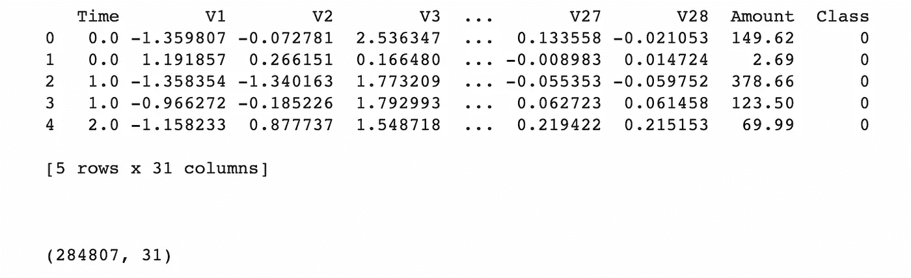*

*作者形象*

*数据集中有 **31 列**，其中 28 列是 PCA (V1 — V28)的输出，以及数量和时间的值。我们的响应变量是 class，0 表示没有欺诈，1 表示有欺诈。数据的形状告诉我们有 284807 个条目和 31 列。*

*接下来，我们可以创建一个 Seaborn countplot 来可视化这两个类的分布。*

*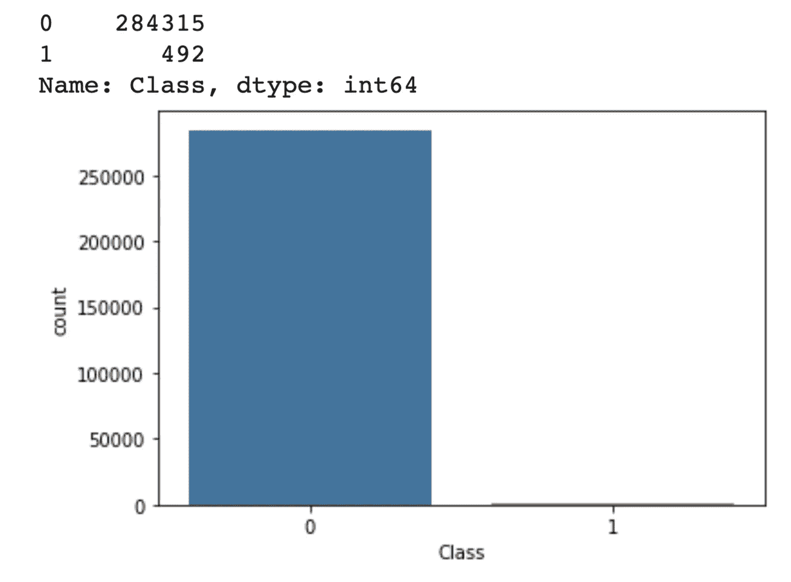*

*作者图片*

*呃……这确实是一个两难的选择。如你所见，我们的数据集是*高度*不平衡的，因为我们绝大多数的数据都在 0 类中。这是个问题，因为**我们必须给两个班的模特同等的训练机会**。*

*接下来，我们可以绘制两个类的数量和时间分布图。我们可以通过索引数据帧来提取我们想要绘制的列。此外，我们可以使用 matplotlib 中的不同函数来调整字体大小、图形大小和轴标题，如下所示。*

*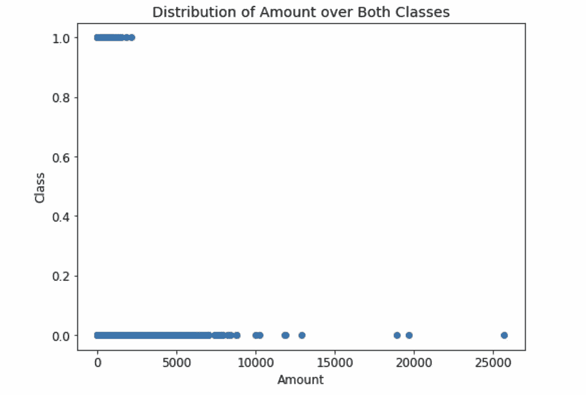**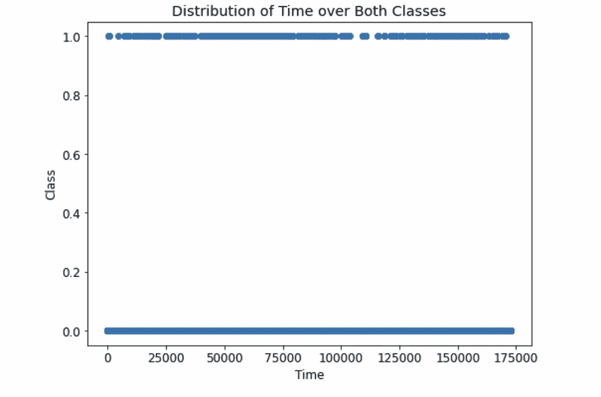*

*作者图片*

*从左边的图中，我们可以看到欺诈性分录往往具有较低的金额值，而非欺诈性分录。同样值得注意的是，非欺诈金额的值分布不均匀，因为该变量的较高值之间存在较大的间隔。*

*就时间而言，这两个类别之间似乎没有区别，因为这些值在欺诈性和非欺诈性条目中是一致的。这是有意义的，因为如前所述，时间特性表示从第一个事务开始经过的秒数。因此，时间变量将继续增加。假设欺诈性交易在时间上并非都与非欺诈性交易相隔离，它们都将具有连续的时间值。*

*另一个我们可以用来分析所有变量之间关系的技术，包括 PCA 转换的变量，是建立一个相关矩阵！*

*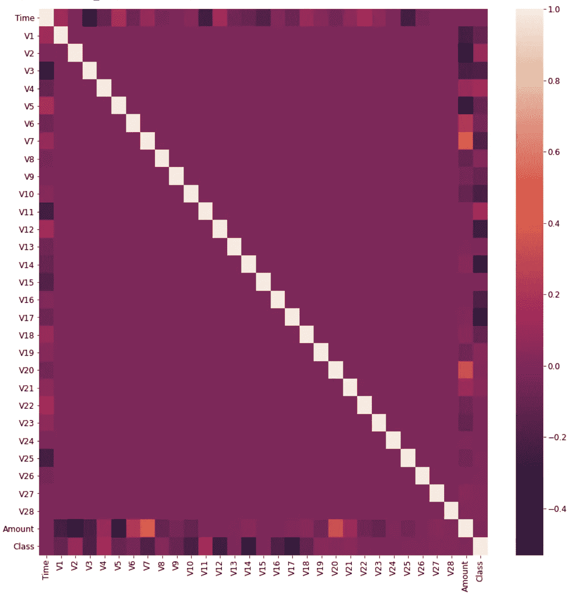*

*作者图片*

*从这个相关性矩阵中，我们可以看到数据集中的特征之间没有**主要*相关性*和**。大多数关系都在-0.2 到 0.2 之间。尽管如此，还是有一些例外，特别是在分析数量特性、V7 和 V20 之间的相关性时。*

*另一个观察是特性和类之间的最小关系。这可以归因于数据的不平衡性质，这可以淡化某些特征的重要性。*

# *分割和标准化我们的数据集*

*现在让我们放弃时间特性。这与分类无关，只是记录时间…然后，我们可以将数据分为训练和测试值，测试规模为 30%**。***

******

***作者图片***

***如果查看数据，您会发现金额值明显高于其他功能的条目。例如，在 data.head()的第一个条目中，amount 值是 149.62，这与 V1 的值(大约为-1.36)有很大的不同。为了解决这个问题，我们将使用**标准定标器。**通过缩放变量，模型的效率会提高。***

# ***用边界 SMOTE 平衡数据***

***现在，我们将需要平衡我们的数据，以确保模型对两个类都有足够的暴露度！这确保了模型不会偏向非欺诈性值，因为目前有超过 280，000 个条目的类别为 0，而只有 492 个欺诈性值。***

***要改变类 1 中值的数量，有两种可能的方法:随机欠采样(减少多数类的条目数量)和合成过采样(为少数类合成生成新条目)。因为我们希望为我们的模型提供尽可能多的数据，所以我们将使用一种称为 [Borderline-SMOTE](https://sci2s.ugr.es/keel/pdf/specific/congreso/han_borderline_smote.pdf) 的技术(Borderline Synthetic Minority over sampling Technique)。使用 Borderline-SMOTE 而不是 SMOTE 的原因是，它综合生成少数类**中不同元素之间的数据，同时忽略异常值**。离群点可以定义为比少数点邻近更多多数点的特征。***

***下面是应用边界平滑的代码。仅平衡训练数据很重要，因为测试系列必须反映真实世界的现场数据。***

***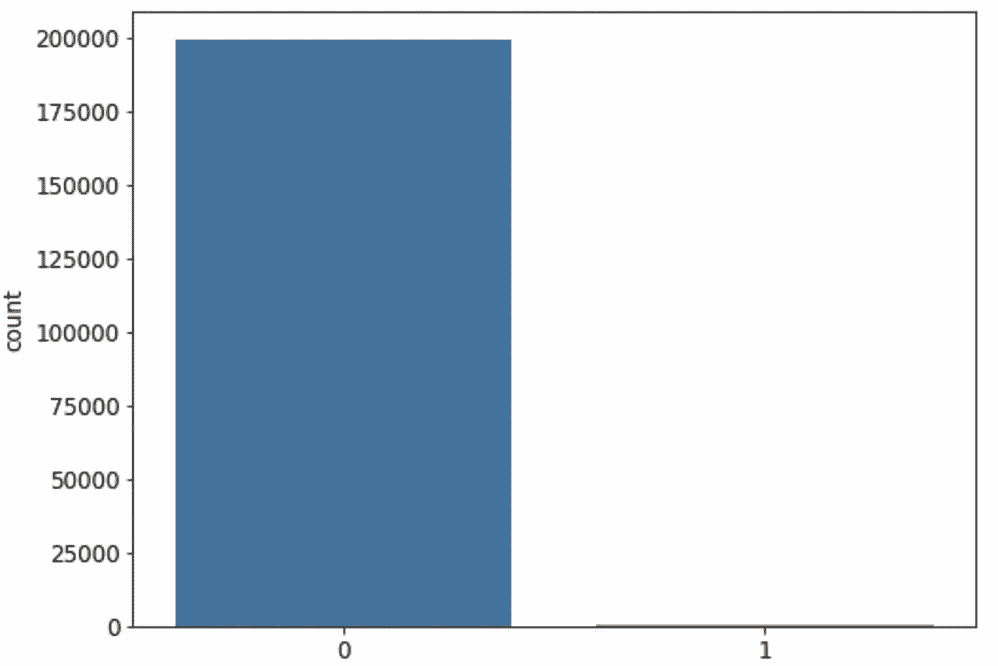******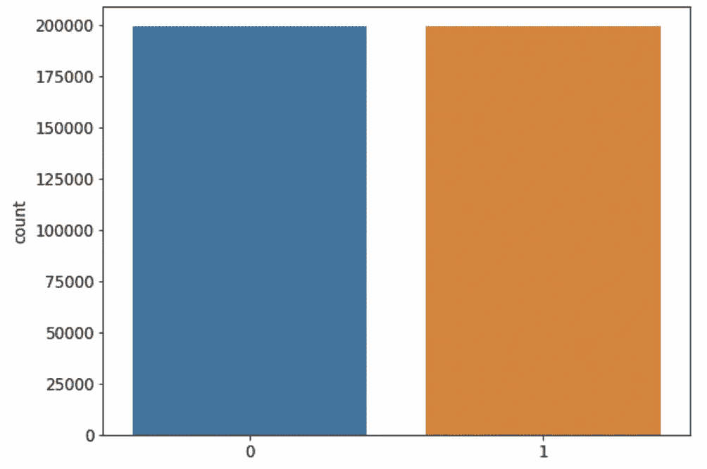***

***(左)过采样前的训练数据分布；(右)过采样后的数据分布***

# ***机器学习模型***

***我们的数据集现在平衡了！这确保了我们的模型可以从每个类中看到相同数量的元素。我们可以建立机器学习模型进行分类。将使用两种模型:***

*   *****随机森林*****
*   *****逻辑回归*****

***在我们开始构建模型之前，定义我们将使用的性能指标是至关重要的。由于我们的验证数据是不平衡的，如果模型每次都预测多数类，那么我们的模型将获得**显著偏斜的准确度，而不考虑少数类。**因此，我们将使用精确度、召回率和 F1 分数。***

***首先，我们将建立我们的随机森林模型，有 15 个估计量。请记住，由于数据集的大小，它将需要几分钟来运行。***

***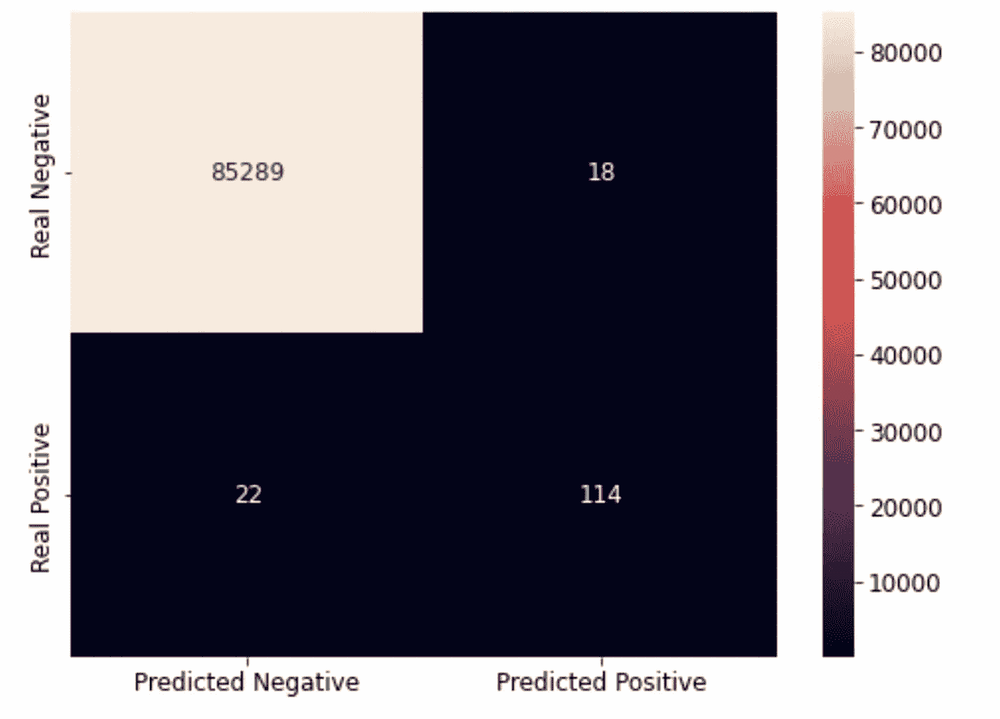******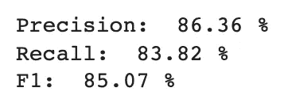***

***四舍五入到两位小数***

***太好了！我们的模型具有很高的精确度和召回率，这意味着它选择的假阳性(精确度)或假阴性(召回率)没有真阳性多！正因为如此，F1 的分数也很高。***

***其次，我们还将建立一个逻辑回归模型来解决这个分类问题。***

***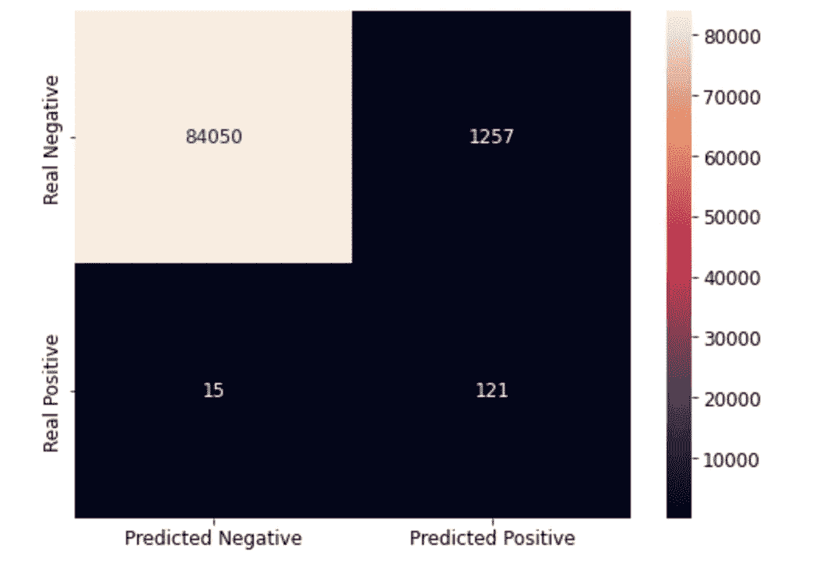******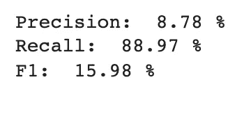***

***四舍五入到两位小数***

***嗯……在这种情况下，虽然召回率很高(模型选择的真阳性比假阴性多)，但精确度却很低，这意味着模型选择的假阳性比真阳性多。因此，F1 分数下降。***

***在比较这两个模型时，评估我们用来比较它们的指标是很重要的。我们的**逻辑回归**模型有一个**更高的召回**(大约 5%)，而**随机森林**分类器有一个**更高的精确度**(大约 78%)。因此，就 F1 分数而言，它是精确度和召回率的调和平均值，**随机森林模型**表现更好。***

# ***神经网络***

***最后，我们还将制作一个具有两个隐层的神经网络来解决这个分类问题。***

***在创建我们的模型之前，定义我们将使用的超参数是很重要的。以下是我使用过的方法，但是你可以随意调整它们，以达到更好的效果。***

***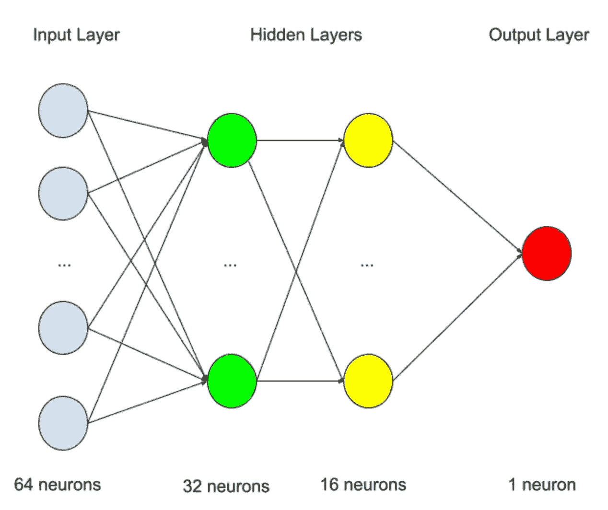***

***我们的神经网络——作者图片***

***如图所示，我们有:***

*   ***具有 **ReLU** 激活的 **64 个神经元**的输入层***
*   ***分别为 **32** 和 **16 神经元**的两个密集隐藏层，每个都有一个 **ReLU** 激活***
*   *****1 神经元**的输出层，具有**s 形**激活***

***此外，我们还有:***

*   ***一个 **Adam** 优化器，其学习率为 **1e-4** ，衰减率为 **1e-6*****
*   *****二元交叉熵**和**精度和召回指标**丢失***

***模型将在 **5 个时期**进行训练***

***下面是我用来创建模型的代码，用的是 Tensorflow 的 Keras 模块。***

***现在我们已经建立了模型，让我们运行它来看看我们的结果！***

***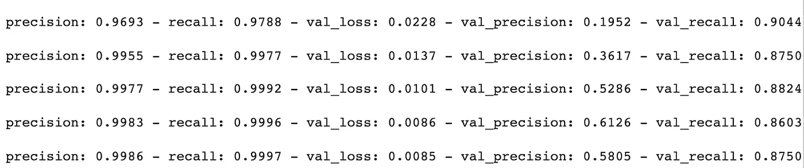***

***模型的输出***

***我们可以看到，我们的验证精度从大约 **19.52** 到 **61.26%** ，而验证召回率从 **86.03** 到 **90.44%。**纪元 4 的验证召回率最高，纪元 1 的验证精度最高。该模型没有过度拟合，因为精度和召回率的值仍在增加。您可以随意更改历元数，以查看模型在更长时间内的表现！但是请注意，这将需要更长的时间来训练…***

***ML/DL 带来的 ***速度*** 和 ***准确性*** 在打击信用卡诈骗中如这个简单的例子**所示。**2019 年，Visa 通过其人工智能系统防止了约 250 亿美元的信用卡欺诈。Kount 的平台 AI 能够以快至 250 毫秒的速度返回风险率。通过利用机器学习和深度学习的力量，我们可以努力打击这种盗窃行为。***

***希望你喜欢阅读这篇文章！欢迎在 Linkedin 上加我，关注更多内容！***

# ***文献学***

***[1] Anon， [Visa 利用人工智能防止了约 250 亿美元的欺诈](https://www.businesswire.com/news/home/20190617005366/en/Visa-Prevents-Approximately-25-Billion-in-Fraud-Using-Artificial-Intelligence) (2019)，商业资讯***

***[2] L .哥伦布，[人工智能如何防范支付欺诈](https://www.forbes.com/sites/louiscolumbus/2019/09/05/how-ai-is-protecting-against-payments-fraud/?sh=518f57044d29) (2019)，福布斯***

***[3] N. Lee，[信用卡诈骗将因 Covid 疫情而增加，专家警告](https://www.cnbc.com/2021/01/27/credit-card-fraud-is-on-the-rise-due-to-covid-pandemic.html) (2021)，美国消费者新闻与商业频道***

***[4]机器学习小组— ULB，[信用卡欺诈检测](https://www.kaggle.com/mlg-ulb/creditcardfraud)(2021 年更新)，Kaggle***

***[5] S. Goswami，[类不平衡，SMOTE，临界 SMOTE，ADASYN](/class-imbalance-smote-borderline-smote-adasyn-6e36c78d804) (2020)，走向数据科学***