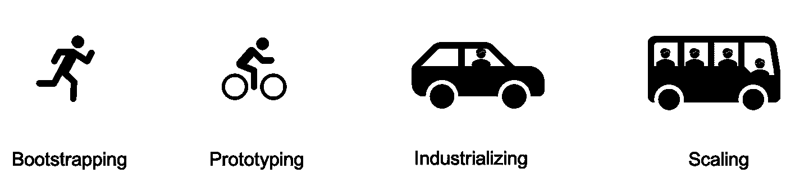
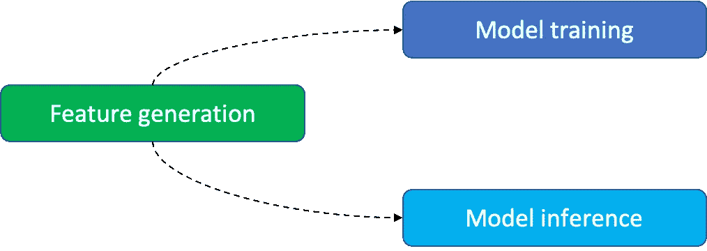

# 全球规模行业中的原型机器学习解决方案

> 原文：<https://towardsdatascience.com/prototyping-machine-learning-solutions-in-globe-scale-industries-fff46ad8ade0?source=collection_archive---------22----------------------->

## [行业笔记](https://towardsdatascience.com/tagged/notes-from-industry)

## 如何使用一些可重复的技术在全球范围的行业中有效地构建机器学习解决方案的原型

现代全球产业中的很多问题，比如 H&M、宜家、GAP、麦当劳等等。，更好地通过机器学习(ML)解决方案来解决。即使是在供应链、营销、销售等方面的个位数百分比改善。，是成本节约或收入增加的主要原因。在一家全球性公司中，基于 ML 的产品开发非常复杂，通常需要重复许多次，以优化分布在许多部门的数十到数百个业务流程，从而影响全球数百万客户。虽然使用随机流程推出五个案例是可能的，但如果没有适当的流程，几乎不可能比这多几十到几百倍。

图 1:理解产品开发阶段的一个很好的心智模型。图片由作者提供。

在高层次上，基于 ML 的产品开发有四个不同的阶段(见图 1)。首先，当一个团队探索问题和解决方案时，它就是在自举。第二，当团队实现一个解决方案来测试该方法的可行性时，团队正在构建原型。第三，当团队在一个简单的环境中优化系统交付的解决方案时，它就是工业化的。最后，当团队在一个更复杂、更大规模的环境中改进交付的解决方案时，它是可伸缩的。虽然一个阶段中解决方案的核心设计可以很容易地转移到下一个阶段，但是实现的细节可能会发生巨大的变化。因此，执行策略和实现策略的团队应该改变，除非领域的知识应该在团队中根深蒂固，这应该是涉众的情况，而不是技术团队的情况。

虽然从自举走向工业化可能很诱人，但跳过原型制作并不是一个好主意。原型应该表明，解决一个想法是不可行的，因为不同的原因，如缺乏足够的数据，缺乏良好的验证机制等。，这有助于组织确定工业化的优先顺序。此外，它还找出了核心解决方案的构建模块，这有助于在工业化过程中优先考虑优化工作。因此，组织关注如何系统地进行原型开发是很重要的，这依赖于遵循一些易于遵循的方法，这些方法由可以日复一日重复的技术解决方案支持。在这篇文章中，我们提出了一个原型机器学习解决方案的系统方法。

# 一种机器学习原型的方法

## 设计文件

设计文档旨在帮助团队有效地计划、执行和与涉众沟通。一个团队应该从两个简单的设计文档开始:

*   一页纸
*   系统图

一页纸包括关于业务问题的形成和解决方案的评估标准的信息。一页纸包括以下内容:

*   商业案例定义
*   利益相关者和资源
*   性能指标和验证标准
*   解决方案优化指标和验证标准
*   原型截止日期和里程碑

系统图包含技术开发的关键元素，帮助团队有效地计划开发工作。系统图包括以下内容:

*   关键数据表
*   显示关键算法步骤和输入输出工件的管道
*   关键基础设施组件

在开始时，留下未知的组件是好的，这些组件应该随着团队的进展而被填充。我们建议在计划讨论和演示时使用这些文档。

## 敏捷的工作方式

就采用敏捷原则而言，敏捷的工作方式是必须的。敏捷例程如何执行并不重要，但是原则贯穿于某种正式/非正式的例程。

这基本上意味着利益相关者必须从一开始就参与进来，并且应该经常协商以引导开发朝着正确的方向发展。因为工作的本质是探索性的，所以保持需求的灵活性并采用看板风格的工作流比 scrum 风格的工作流更好。

## 管道开发

图 2:机器学习原型中的关键管道。图片由作者提供。

如图 2 所示，重要的是以三个独立的依赖管道的形式考虑原型解决方案:特征生成、模型训练和模型推理。特征生成流水线获取输入数据表，并使用相关数据边界(例如，日期、地理位置等)生成特定大小的特征表。管道不仅应该用于为模型训练生成特征，还应该用于推理。模型训练管道对训练特征执行步骤，以生成模型及其性能仪表板。模型推理管道对推理特征执行步骤，以生成预测目标及其性能仪表板。

虽然实现一个笔记本来管理它们很诱人，但这不是一个好主意。通常在解决方案探索过程中，某些步骤比其他步骤需要迭代更多次。例如，找到一个好的训练算法可能需要比特征生成更多的迭代。为不同类型的活动保持独立的管道使得迭代变得容易和有效。

如果执行管道中的步骤需要很长时间，并且从某个任务重新启动 dag 是有益的，则每个管道应该被设计为任务的有向非循环图。

## 流程改进

选择度量标准来改进原型制作过程。我们建议采用的两个指标是利益相关方接受的*延迟*和*移交持续时间*。对前者的关注应该支持可重用组件的开发，例如性能度量的标准化、管道库、假设检验机制等。对后者的关注应该能够采用最佳实践，例如代码/系统测试和验证、文档、归档等。

## 将旅程存档

将代码和输入/输出数据存档，用于每项工作的测试和验证。此外，对于每一项工作，保持一个主要学习的日志，即成就，陷阱和错误。代码(和数据)将有助于重用一些解决方案，只需很小的修改或不需要修改。该杂志将有助于未来的工作规划和优先次序。

# 注意

我有几句告诫的话。

首先，做一些好事可能很诱人，例如，维护高质量的代码。然而，我们建议把注意力放在球上，专注于团队的力量，也就是说，测试一个想法。早期优化是一个错误，不是团队的责任。

第二，一个人需要在跑步之前学会如何走路。我建议任何团队在前三四次做他们认为合适的事情。模式应该从这些经历中浮现出来，这应该激发可重用的设计。

最后，预计会有偏差，因为每个团队的旅程都是不同的。本文或其他地方分享的方法旨在启发一种特定的思维方式。然而，每个团队的实现现实都是独一无二的。

最重要的是，保持原型。