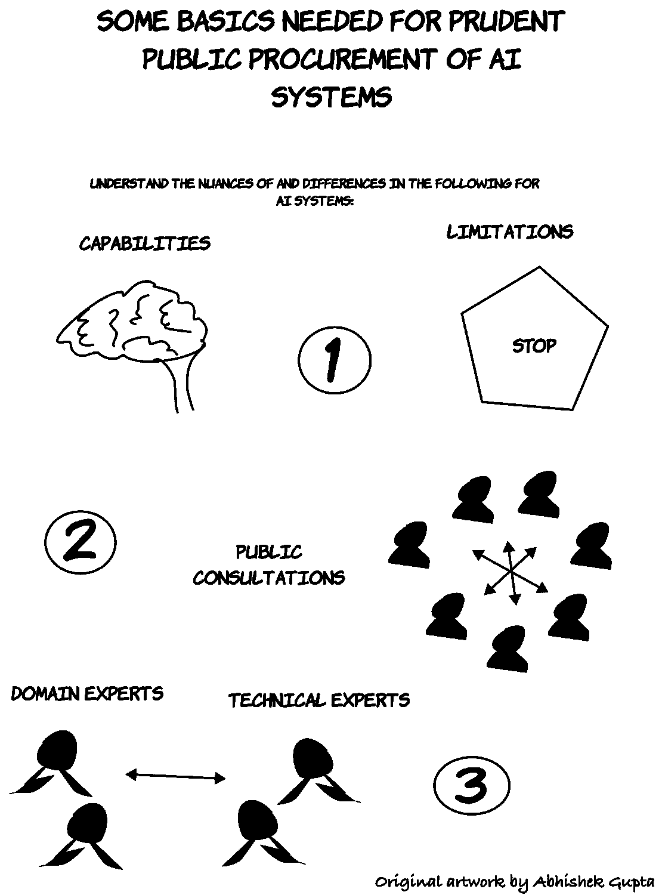

# 公共部门谨慎采购人工智能产品

> 原文：<https://towardsdatascience.com/prudent-public-sector-procurement-of-ai-products-779316d513a8?source=collection_archive---------38----------------------->

*本文与蒙特利尔人工智能伦理研究所人工智能伦理研究员* [*穆里亚姆·法西*](https://www.linkedin.com/in/muriamfancy/) *合著*

使用人工智能系统来简化通常是劳动密集型和时间密集型的服务正在被政府认可在多个部门实施。然而，采购这些系统和部署它们的方式有重大的影响。由于对这些系统的影响以及如何正确衡量其风险的理解存在差距，政府往往会采购和部署有偏见、高风险的解决方案，有可能对公众造成重大伤害。

# 当事情变得糟糕透顶时…

*照片由* [*杰斯温·托马斯*](https://unsplash.com/@jeswinthomas?utm_source=unsplash&utm_medium=referral&utm_content=creditCopyText) *上* [*下*](https://unsplash.com/s/photos/students?utm_source=unsplash&utm_medium=referral&utm_content=creditCopyText)

最近的一个案例证明了这一点，即英国联邦政府部署了一个有缺陷的人工智能系统，该系统不成比例地影响了参加 A-level 课程的学生；根据历史数据给学生打分，教师的评估和系统提供的评估之间的差异导致许多学生的大学录取通知书被取消。

在这种情况下，一个潜在的担忧是，人工智能系统在其训练阶段没有代表性的数据，并且该系统的操作对公众的透明度很低，这进一步降低了信任。尽管存在所有这些缺陷和公众的愤怒，但对于受到这一体系影响的学生，却没有明确的问责框架。

# 在为公众部署这种系统时，我们如何避免造成这种负面后果？

*照片由* [*乔恩·泰森*](https://unsplash.com/@jontyson?utm_source=unsplash&utm_medium=referral&utm_content=creditCopyText)*[*拍下*](https://unsplash.com/s/photos/asking-questions?utm_source=unsplash&utm_medium=referral&utm_content=creditCopyText)*

*一种方法是授权监管者在采购阶段提出正确的问题。像这样的案例表明，在人工智能系统的风险、透明度和复杂性方面存在着巨大的知识缺口。这种理解的缺乏表现在不明智的政策上，这些政策要么过度监管，要么监管不足。*

> *具体来说，在这种情况下，缺乏对系统透明度的要求以及忽视问责制和追索机制的建立加剧了英国的危机。*

# *我们如何问正确的问题？*

**

*提出正确的问题需要对人工智能系统的能力有一个基础的理解，这种理解超越了对系统可能实现的目标的低估和高估的二分法。*

*让来自研究和行业的技术专家参与进来，对于创建一个有足够能力带来公共福利的监管生态系统至关重要。目前，采购干事没有能力评价利用人工智能的系统的影响。NHSX 最近的指导方针为采购医疗解决方案的官员提供了一些指导。虽然这些在引用医疗保健领域的现有法规方面很好，但对于明确引用特定领域法规的其他领域，也需要类似的指导原则(如果存在)。*

*对人工智能的具体使用及其在该领域中的局限性的全面提升，甚至比只是对人工智能系统如何运行的总体认识更重要。我们之所以做出这种区分，是因为相同的技术可能用于不同的领域，取得不同程度的成功，因此了解特定领域的应用对于采购人员做出明智的决策至关重要。*

# *以上我都做到了，我准备好了吗？*

*这需要持续不断的努力，因为该领域的变化速度非常快，而且能力状况也在不断变化。*

*用与特定领域的需求一致的责任和义务的需求来补充这一点也是必不可少的。最后，推动这些系统的开发者远离知识产权保护作为一种不披露的方式也很重要。如果没有能力审计系统的内部运作，我们就有可能让监管者成为制造商心血来潮的傀儡，而在很大程度上，制造商为了保持竞争优势和放弃对用户的责任，会倾向于最大限度地减少信息披露。*

**

**照片由* [*杰森·哈夫索*](https://unsplash.com/@jasonhafso?utm_source=unsplash&utm_medium=referral&utm_content=creditCopyText) *上* [*下*](https://unsplash.com/s/photos/canada?utm_source=unsplash&utm_medium=referral&utm_content=creditCopyText)*

*一种方法是让联邦政府制定一个风险评估框架，类似于加拿大政府在衡量将部署在公共部门的人工智能系统的风险时所创建的框架。特别是如果国家专注于维护民主、人权和透明制度，建立风险框架将有助于监管者理解公众的潜在担忧，以及是否有政策或法律保护公民免受部署此类制度的潜在后果。*

*未能围绕解决方案的风险提出正确的技术问题是由政府而不是系统制造商承担的负担，正如美国好事达公司部署保险费定价模型的案例所示。令人遗憾的是，监管者不仅装备不足，而且在实施处罚和做出决定方面也效率低下，这使得好事达可以在其他州重试他们的混淆技术，他们可以在这些州躲过监管审查。*

# *与公众合作会有所帮助！*

**

**照片由* [*埃德温·安德拉德*](https://unsplash.com/@theunsteady5?utm_source=unsplash&utm_medium=referral&utm_content=creditCopyText)*[*拍下*](https://unsplash.com/s/photos/questions?utm_source=unsplash&utm_medium=referral&utm_content=creditCopyText)**

**第二步是直接与公众合作，这是增强监管者权力的补充方案。这可以包括公众咨询、公众成员确定应用领域，以及让公众参与围绕系统滥用及其负面后果的数据收集。一项类似于道德漏洞奖金的提案可以帮助监管机构更好地了解系统可能出现问题的地方，并创建一个证据库，推动监管机构提出艰难的问题，并限制这些公司的市场力量。**

**监管者通常不是直接受到这些系统影响的利益相关者，这使得他们很难预测潜在的风险。公众咨询可以以研讨会、会议或由有实际经验的人组成的工作组等形式存在，以便更好地确定这些影响。**

# **让我们避免参与戏剧和符号化**

**但是，公开协商的象征性是需要避免的。被称为“参与剧场”的我们需要确保来自这些咨询的反馈被有意义地合并，并在这种系统的设计、开发和部署过程中被跟踪。公众咨询的重要性在于建立信任和展示透明度。通过公众参与获得信任表明，公民将更多地参与利用这些系统，并显示出政府的能力水平，如果监管机构继续采购人工智能系统供公众使用，这将是长期的重要因素。**

> ****你可以在这里了解更多我的作品:**[**https://ATG-abhishek . github . io**](https://atg-abhishek.github.io/)**