# Ptpython:更好的 Python REPL

> 原文：<https://towardsdatascience.com/ptpython-a-better-python-repl-6e21df1eb648?source=collection_archive---------9----------------------->

## 一个 Python 交互式 Shell，具有自动完成、自动建议、Docstring、历史插入等功能！

# 动机

你有没有想过用 Python Shell (REPL)快速尝试一下脑子里冒出来的一些想法？您可能不想打开一个新的 Jupyter 笔记本，只使用几行代码进行实验。

但是您也可能不愿意使用经典的 Python shell，因为它不像 Jupyter Notebook 那样支持自动完成或 docstring。您也无法在按下 Enter 键后修复代码中的错误。

如果能把自己枯燥的 Python 外壳变成如下图的多功能外壳呢？

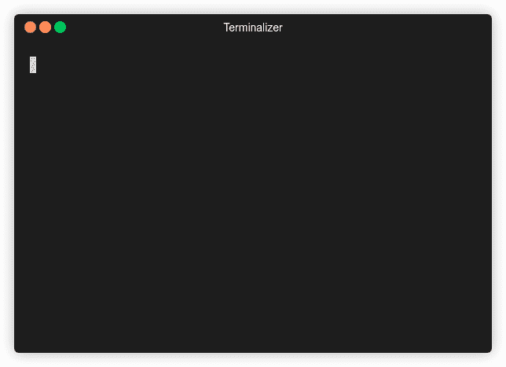

作者 GIF

这就是 ptpython 派上用场的时候。

# Ptpython 是什么？

[Ptpython](https://github.com/prompt-toolkit/ptpython) 可以认为是更好的 REPL。要安装 ptpython，请键入:

```
pip install ptpython
```

然后键入:

```
ptpython
```

…开始使用 ptpython。

# 输入特征

## 输入验证

如果你在一个经典的 Python shell 上犯了一个错误并按下了 Enter 键，你将无法返回去修复这个错误。

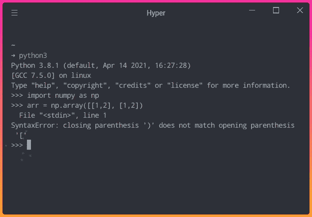

作者图片

幸运的是，ptpython 允许您在点击 Enter 按钮时验证输入。在下面的 GIF 中，我错过了一个右括号并收到一个错误，但我可以返回并修复我的代码，直到不再有错误！


作者 GIF

## 基于历史的自我暗示

你曾经希望得到基于历史的建议吗？这可以用 ptpython 来完成。

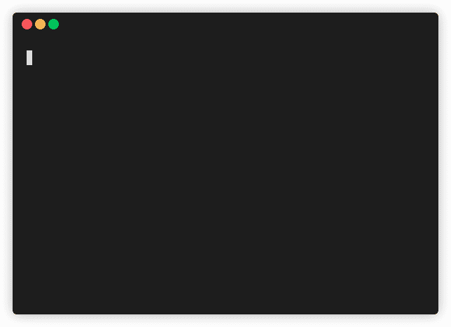

作者 GIF

默认情况下，此功能不启用。但是您可以通过按 F2 键访问菜单来启用它。然后使用向右或向左箭头打开“自动建议”功能。最后，按回车键隐藏菜单。

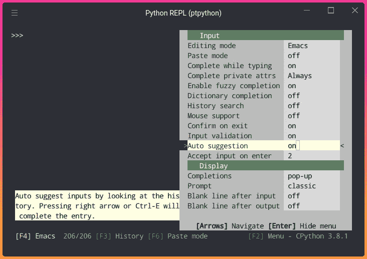

作者图片

现在，您应该可以在键入时看到基于历史的建议。要接受建议，只需按右箭头。

## 打字时完成

您还可以在键入点(`.`)后查看属于特定类的所有方法，如下所示:


作者 GIF

使用向下箭头找到某个建议，然后继续键入代码的其余部分。

## 从历史记录中插入

您也可以通过按 F3 来访问历史记录。使用向上或向下箭头找到要复制的代码行，然后键入空格来选择要插入的代码。

每当你选择完代码，按回车键，这些代码行将被粘贴到你当前的 shell 中！


作者 GIF

请注意，代码将按照执行顺序插入。

## 粘贴模式

您是否曾经希望编辑粘贴在 Python shell 上的代码？经典的 Python shell 不允许您这样做。

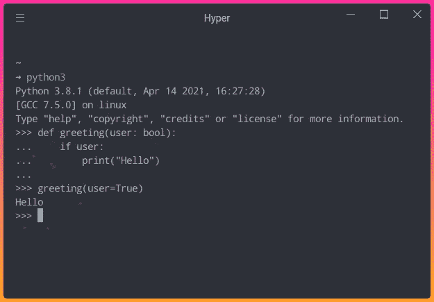

作者图片

Ptpython 允许您编辑粘贴的代码，直到您满意为止:


作者 GIF

若要打开粘贴模式，请按下 F6。当粘贴模式开启时，当您按下 Enter 键时，代码**将不会被执行**。当您准备好执行代码时，再次按 F6 关闭粘贴模式，然后按两次 Enter。

# 显示特征

## 查看签名和文档字符串

Ptpython 允许您查看 python 函数或类的参数，如下所示:

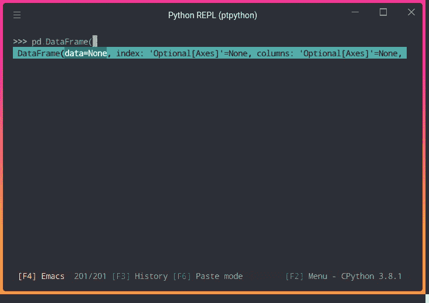

作者图片

您还可以查看类或函数的文档字符串。要启用此功能，请按 F2，然后打开“显示文档字符串”功能。

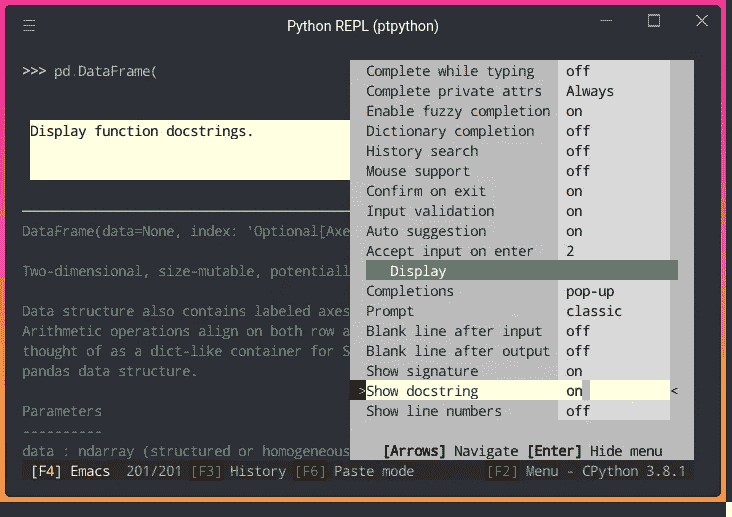

作者图片

现在你可以看到你正在使用的函数或类的 docstring！

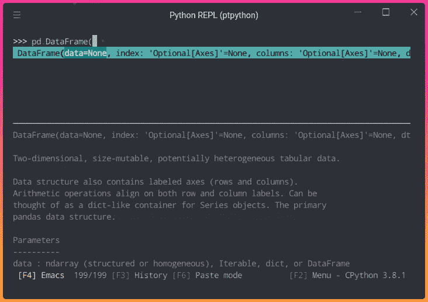

作者图片

## 突出显示匹配的括号

Ptpython 还通过突出显示匹配的附加项，使区分括号变得更加容易。

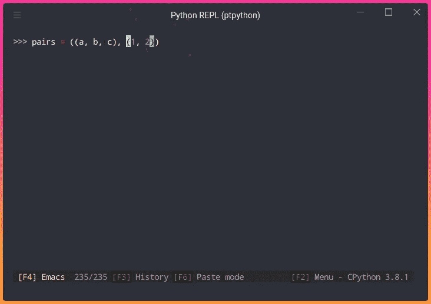

作者图片

## 在输入或输出后添加一个空行

如果想增加可读性，还可以在输出后增加空行。

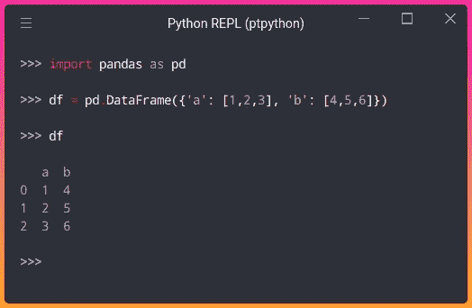

作者图片

要启用此功能，请按 F2，然后打开“输入后空行”和“输出后空行”。

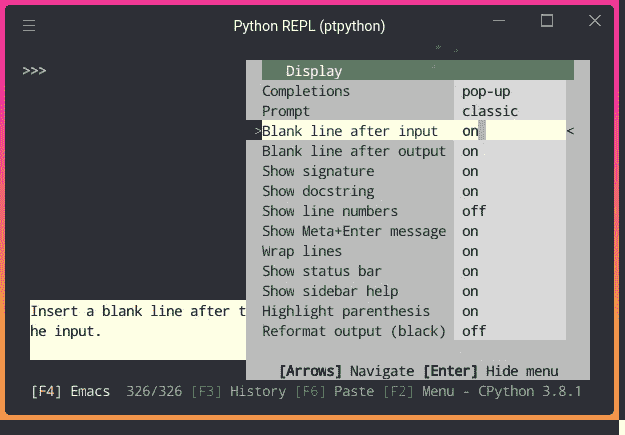

作者图片

# 颜色特征

## 语法突出显示

Ptpython 还支持如下漂亮的语法高亮！

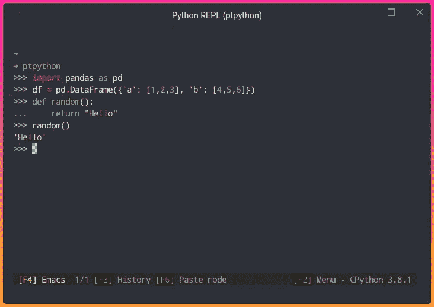

作者图片

您可以通过按右箭头来更改主题，直到找到您喜欢的主题。

总共有 39 个主题可用。如果你想和 Sublime Text 有相同的主题，选择 Monokai 主题。

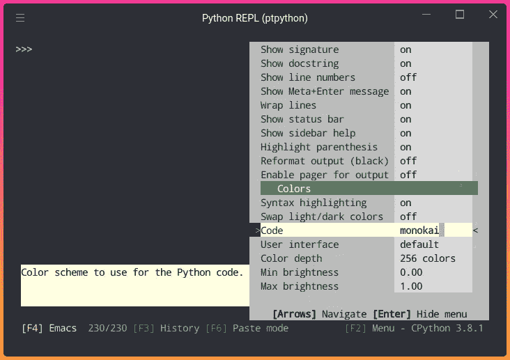

作者图片

# IPython 的神奇命令

Ptpython 也支持 IPython。运行`ptipython`，获得一个漂亮的交互式 shell，拥有 IPython 提供的所有功能，包括神奇的命令！

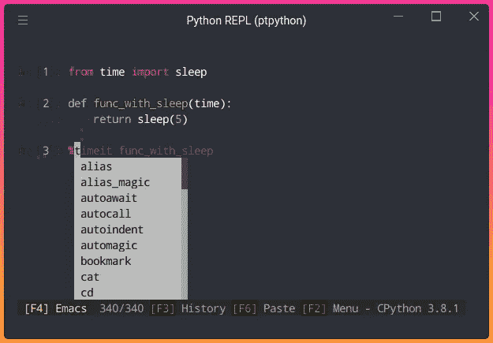

作者图片

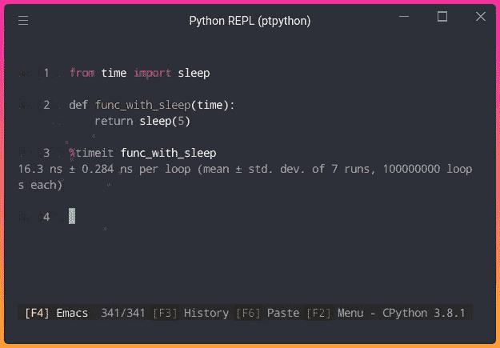

作者图片

# 永久更改配置

当您退出当前 ptpython shell 时，您对该 shell 设置所做的更改将被撤消。

要永久更改配置，将[该文件](https://gist.github.com/khuyentran1401/b5325ff1f3bfe1e36bf9131a0b8cd388)复制到`$XDG_CONFIG_HOME/ptpython/config.py`。在 Linux 上，这是:`~/.config/ptpython/config.py`。

将配置文件复制到您的本地目录后，您应该已经启用了我上面展示的所有特性。您可以根据自己的喜好随意更改配置文件。

# 结论

恭喜你！您刚刚学习了什么是 ptpython 以及它如何有所帮助。在本文中，我只介绍了一些我最喜欢的特性，所以我鼓励您安装 ptpython 并亲自尝试一下。

我喜欢写一些基本的数据科学概念，并尝试不同的算法和数据科学工具。你可以在 [LinkedIn](https://www.linkedin.com/in/khuyen-tran-1401/) 和 [Twitter](https://twitter.com/KhuyenTran16) 上联系我。

如果你想查看我写的所有文章的代码，请点击这里。在 Medium 上关注我，了解我的最新数据科学文章，例如:

[](/2-tools-to-automatically-reload-when-python-files-change-90bb28139087) [## 当 Python 文件改变时自动重新加载的 2 个工具

towardsdatascience.com](/2-tools-to-automatically-reload-when-python-files-change-90bb28139087) [](/3-tools-to-track-and-visualize-the-execution-of-your-python-code-666a153e435e) [## 3 个跟踪和可视化 Python 代码执行的工具

towardsdatascience.com](/3-tools-to-track-and-visualize-the-execution-of-your-python-code-666a153e435e) [](/pywebio-write-interactive-web-app-in-script-way-using-python-14f50155af4e) [## PyWebIO:使用 Python 以脚本方式编写交互式 Web 应用

### 在没有 HTML 和 JS 知识的情况下，用几行 Python 代码构建 Web 应用程序！

towardsdatascience.com](/pywebio-write-interactive-web-app-in-script-way-using-python-14f50155af4e) [](/how-to-get-a-notification-when-your-training-is-complete-with-python-2d39679d5f0f) [## 使用 Python 获得通知的 3 种方式

### 现在，您可以在等待培训完成的同时从事其他项目

towardsdatascience.com](/how-to-get-a-notification-when-your-training-is-complete-with-python-2d39679d5f0f)