# 使用 R 接口“h2o”可扩展机器学习平台的 PUBG 获胜者排名预测

> 原文：<https://towardsdatascience.com/pubg-winner-ranking-prediction-using-r-interface-h2o-scalable-machine-learning-platform-f7054c9cb435?source=collection_archive---------30----------------------->

## 基于 PUBG 的机器学习和深度学习算法预测排名

照片由 [Unsplash](https://unsplash.com?utm_source=medium&utm_medium=referral) 上的 [Onur Binay](https://unsplash.com/@onurbinay?utm_source=medium&utm_medium=referral) 拍摄

## **要点**

1.  PUBG 代表 PlayerUnknown 的 Battlegrounds，是一款在线多人游戏。
2.  排名对于了解不同玩家在游戏中的地位非常重要。
3.  PUBG 是一款多人游戏，支持多种平台，每天都有大量玩家在线。
4.  本研究使用的算法是机器学习范畴的线性回归、随机森林和深度学习范畴的深度神经网络。

## **简介**

PUBG 代表 PlayerUnkown 的 Battlegrounds，这是一款多人游戏，可在 Windows、Android、IOS 等各种平台上使用。游戏有不同的模式，三种不同的模式是经典，街机和 EvoGround。在经典游戏中，玩家将会得到不同的地图，从 Erangel，Miramar，Sanhok 和 Vikendi。在街机模式中，有战争、迷你区、快速比赛和狙击手训练。全球有 5.55 亿玩家在各种不同的平台上玩 PUBG，这个庞大的数字带来了排名的难度。Battle Royal 的基本比赛是 100 个人打一场比赛，只有 1 个赢家(可以吃鸡饭)。根据不同的属性对这些玩家进行排名变得很困难，因为一些玩家可能有不止一个相似的排名。这就是机器学习&深度学习派上用场的地方，它通过分析各种属性，了解每种属性之间的相似性，根据训练好的模型预测球员的排名。用于训练和测试目的的数据集来自 Kaggle，ka ggle 是一个开源平台，用于收集与不同用例相关的数据，其中他们将各种匹配(SOLO、SQUAD、DUO)与所有不同的属性集相结合，以理解用例。

[https://www . ka ggle . com/c/pubg-finish-placement-prediction/data](https://www.kaggle.com/c/pubg-finish-placement-prediction/data)

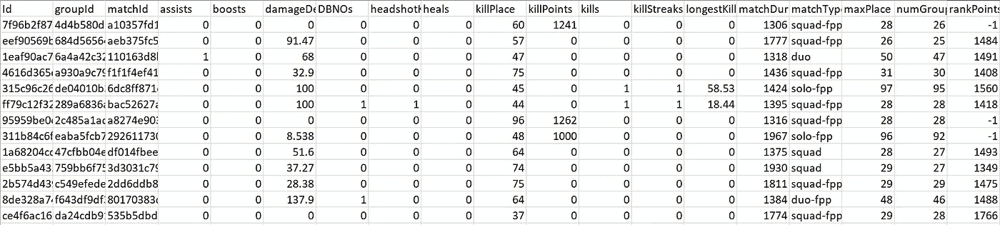

包含 29 种不同属性的训练数据集-按作者分类的图片

## **方法论**

论文的这一部分讨论了用于获得期望输出的不同方法，这些方法在实验结果中进行了解释。该方法分为 3 个小节，分别是:

## A.线性回归

线性回归是一种使用最佳拟合线进行预测的机器学习算法，该算法中使用的目标属性始终是数字。为这种类型的回归绘制的数据基于 Y 轴上的因变量和 X 轴上的自变量，如下所示，关于这两个轴，将创建满足这些值的最佳拟合线或平面或斜率。斜率周围的点是实际值，斜率是预测值。

因变量和自变量的线性回归图-图片由作者提供

**B .随机森林算法**

随机森林或随机决策森林使用打包和提升方法，这是集成学习的一部分，可用于基于用例的回归和分类目的。决策树是来自多个树的单个树，这些树一起构成了多个决策的森林，与基于所有可用树的投票的单个决策树相比，它给出了更好的结果。随机森林层次结构包括各种级别，如根节点、叶节点、子节点、父节点等。随机森林或随机决策森林的工作基于关于输出的多数表决，每棵树都有一些输出，并且最终输出基于输出的平均值，这给出了准确的结果。这些形成了基于训练数据的判断的更好的扩展，与其他模型相比，其给出了更好的准确性，视觉表示可以在下面观察到。

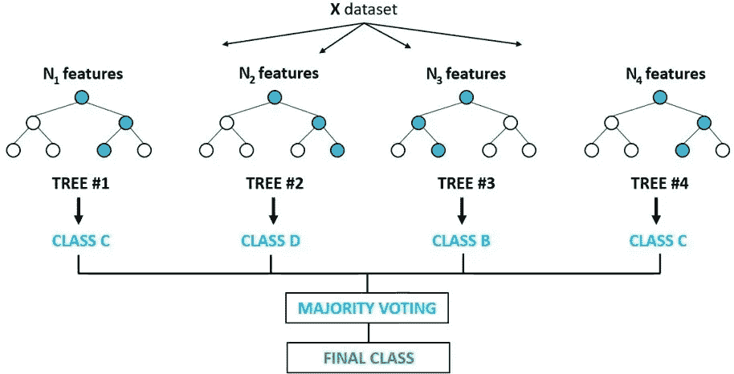

随机森林算法与最终类-图像作者

**C .深度神经网络**

1.  *非深度前馈神经网络*

神经网络是深度学习算法的一部分，它由 3 层组成。第一层是输入层，这一层由输入节点组成，通过分配一些权重和偏置来传递值。第二层是隐藏层，这一层可以取决于神经网络是深度的还是非深度的，对于非深度神经网络，隐藏层的数量通常是 1 或 2。最后一层是输出层，这一层给出输入和隐藏层的输出值，这取决于输出节点的数量。

单层前馈神经网络-作者图片

*2。深度前馈神经网络*

深度神经网络与非深度神经网络相同，不同之处在于隐含层数。深层神经网络的隐含层在 2-8 层之间，隐含层越大，神经网络越复杂。这种类型的网络通常用于解决复杂的问题。深度神经网络的结构与非深度相同，具有输入层、隐藏层和输出层。

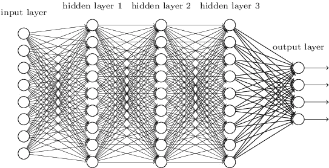

多层前馈神经网络-作者图片

## 文献评论

这篇研究论文的实验部分由各种测试和通过执行迭代获得的结果组成。本文的实验结果包括在 29 个属性的 Kaggle 数据集上进行的各种算法迭代和不同的探索性数据分析，其中训练数据集的大小为 446966，测试数据集的大小为 1934174。实验的系统架构如下所示。

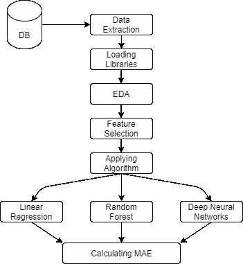

公共建筑-作者图片

探索性数据分析用于理解与目标变量相关的属性的可视化表示，这将有助于根据特征的重要性做出更好的判断。第一个 EDA 是为了了解在哪个视角下玩游戏的玩家数量，PUBG 中的视角是 FPP 或 TPP，可以从下图中观察到，FPP 代表第一人称视角，TPP 代表第三人称视角，这将用户的视角从广角变为窄视角——基于从不同视角直接聚焦武器。

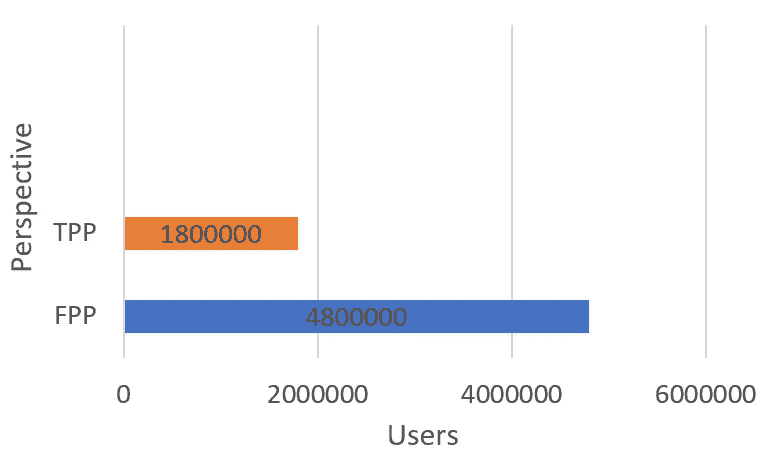

TPP VS FPP 用户视角-作者图片

从图中可以看出，大多数玩家玩 FPP 视角，很少玩家玩 TPP 视角，因为 TPP 提供了一个非常窄的屏幕，很难瞄准。第二次 EDA 是为了了解玩家最常玩的游戏类别，PUBG 提供了三个类别，分别是单人、双人和小队，如下图所示。

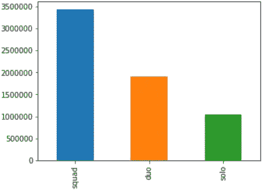

单人对小队对双人用户-作者图片

从 Fig 可以观察到，大部分玩家都是在小队的类别下玩，然后是双人组，最少的人玩单人。

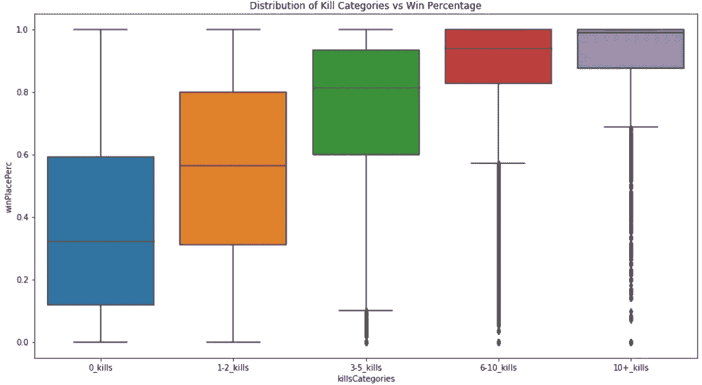

杀死类别 vs 获胜位置预测-作者图片

上图中的方框图显示了与获胜预测相关的杀戮分布，可以看出，获胜预测随着杀戮的增加而增加，接近 3-5 次杀戮有利于 0.8%的获胜预测，而在一场比赛中超过 10 次杀戮可以获得 100 %的获胜率。另一个 EDA 是绘制玩家在游戏中获得的武器的直方图(单人、双人和小队的总数)。该图显示了玩家获得的武器数量及其分布情况。从下图可以看出，武器数量在 0 到 15 之间，平均每个用户有 8 件武器。

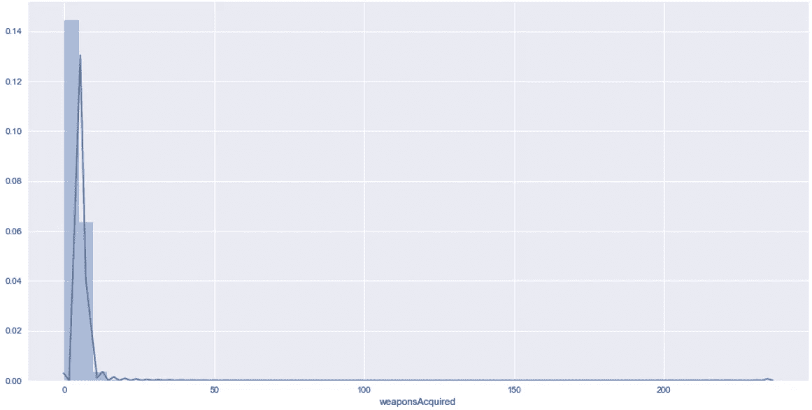

获得的武器与作者预测的地点-图像

完成最终的 EDA 是为了理解与每个属性相关的属性的相关性，并借助于相关性矩阵对其进行可视化。数据集的相关矩阵可以在下图中看到。

作者发布的相关矩阵-图像

相关矩阵显示了数据集中的属性是如何相互关联的，要么是高度相关，要么是最不相关。在上面的图 10 中，正 1 (+1)表示高相关性，负 1 (-1)表示低相关性。有了这个 EDA，通过可视化从数据中提取重要信息。下一步是提取模型将要训练的重要特征，如果根据重要性选择这些特征，与随机传递给模型进行训练的特征相比，这些特征可以给出更好的结果。

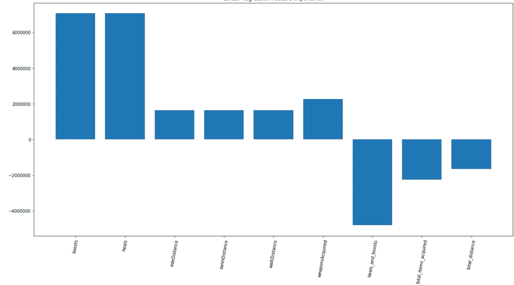

线性回归算法的重要特性-作者图片

上图显示了在线性回归算法上创建模型时需要考虑的重要特性，可以观察到，boost & heal 等特性在总和方面最有价值，而 heal & boost 等特性在总和方面价值较低。这种观察显示了选择哪个特征来为算法建模以获得更好的结果。类似地，对神经网络进行第二特征选择，用于选择与随机选择相比可以增加模型准确性的更好的特征。这种特征选择可以从下图中观察到，该图显示了基于训练数据集的特征。总和作为另一个参数。

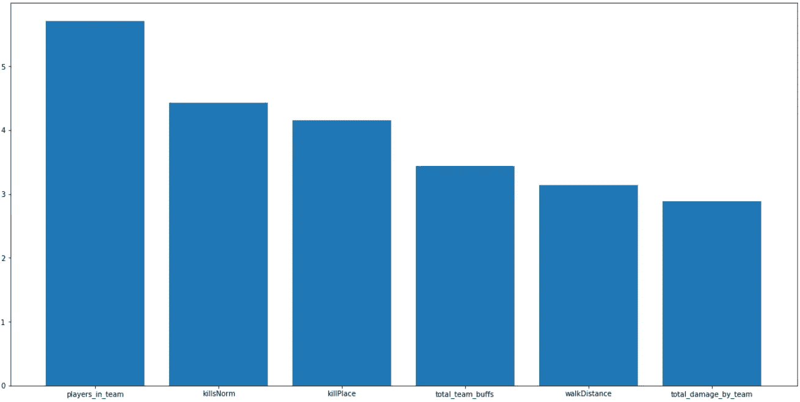

深度神经网络重要特征-作者图片

> 下一步是应用机器学习和深度学习算法，并检查它如何帮助预测用户的胜率。本研究中使用的线性回归是多变量线性回归，这种多变量的使用是因为从特征提取中提取的特征不同。多变量线性回归的等式可以从下面观察到，它显示了 x、y 和 z 方面的特征，w1、w2 和 w3 作为模型将尝试学习的权重。用于优化权重的多元线性回归的损失函数是均方误差(MSE ),后面是下面所示的公式，该公式显示了 f (x，y，z)的获得值与实际值的损失函数。
> 
> 本文采用了两种神经网络，一种是基于非深度神经网络，另一种是基于深度神经网络，通过超参数优化来提取最佳节点数。为超参数优化传递的参数是。

## 纪元[10，20，50，60，100]

## 批量大小[10，20，30，40]

## 交叉验证=5

> 用于优化结果、也用于解决消失梯度问题的优化器是整流器激活函数，该特定激活函数用于根据线性数据给出结果，以便从数据集中预测获胜者。在反向传播的帮助下，使用随机梯度下降(单个训练数据)进行学习，可以从(3)中观察到整流器的公式。

## **f(x) = max (0，x) (3)**

> 为了理解训练和验证期间的数据损失，使用 MAE，MAE 代表平均绝对误差，它计算在适当数据的预测期间发生的绝对总误差，可以观察到 MAE 的公式，它显示了相对于实际值和所得值除以数字的绝对误差。

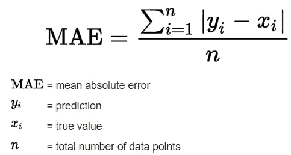

MAE 公式-作者图片

在许多游戏场景中，一些玩家可能是骗子，他们可能使用无效的游戏方法来获得排名和增加经验值，也有一些玩家可能是 AFK(远离键盘)。数据集中的玩家总数如下所示。

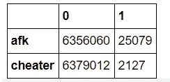

AFK vs 骗子

表 II 显示了使用所有算法对训练数据集的 PUBG 数据集进行排名预测时所使用的算法的 MAE。

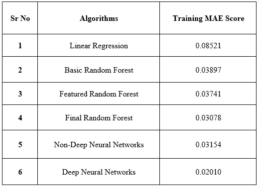

训练数据集的 MAE 按作者分类的图像

表 III 显示了使用所有算法对验证(测试)数据集的 PUBG 数据集进行排名预测时所使用的算法的 MAE。

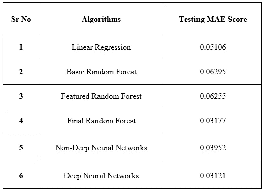

用于测试数据集的 MAE 作者提供的图像

从上表 II 和 II 可以看出，深度神经网络算法获得了最低的 MAE，对于训练数据集是 0.02012，对于测试数据集是 0.03121。MAE 的基本工作是出现的误差越少，对数据越好，根据这个概念，可以观察到，对于线性回归算法获得了最高的 MAE，对于训练数据是 0.08521，对于测试数据是 0.06295，这是对于基本随机森林算法获得的。在 R 编程的 H2O 软件包的帮助下，排序预测中使用的所有算法的 MAE 的可视化表示可以在下面的图中看到。

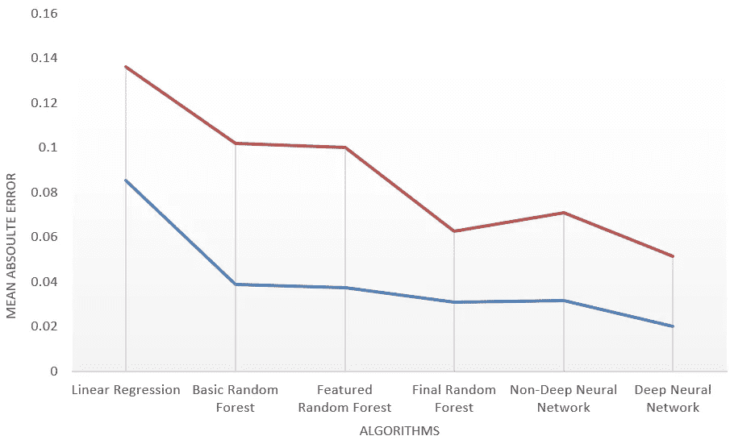

MAE 与使用的算法-图片由作者提供

## 结论

该研究旨在基于机器学习和深度学习算法评估 PUBG 玩家的排名，并以更好的方式进行 EDA 来分析数据集。本研究中使用的算法是线性回归、随机森林和深度神经网络，计算 MAE(平均绝对误差)以检查哪种特定算法最适合庞大的数据集。对训练和测试数据集都进行了该评估，由此观察到深度神经网络表现良好，训练数据集的 MAE 值分别为 0.02012，测试数据集的 MAE 值为 0.03121。对于训练数据集和测试数据，线性回归获得了最高的 MAE 值，其为 0.08521；对于 n_estimators=40，max_features=Sqrt 的基本随机森林，获得了最高的值。平均每人杀死 0.9248 个玩家，99%的玩家杀死 7.0 个或更少，而有记录以来最多的是单场比赛杀死 72 个玩家。最佳算法是深度神经网络，测试数据误差值最低。

## 参考

[1]丁，雍。"公共广播电视运营模式研究."MATEC 会议网。第 173 卷。EDP Sciences，2018。

[2] Rokad，Brij 等，“在玩家未知的战场上适者生存。”arXiv 预印本 arXiv:1905.06052 (2019)。

[3]德索萨、朗姿、马尼什和迪克夏。" PUBG 成瘾测验(PAT)的编制和验证."(2019).

[4]马穆尔佩特，马杜里亚·曼朱纳斯。"使用人工神经网络的 PUBG 赢家位置预测."

[5]梅尔哈特、戴维、丹尼尔·格拉维纳和圣乔治·扬纳卡基斯。"通过观察者的眼睛预测每时每刻的接触:PUBG 在 Twitch 上流动."数字游戏基础国际会议。2020.

## 在你走之前

研究论文:[https://ieeexplore.ieee.org/document/9396823](https://ieeexplore.ieee.org/document/9396823)