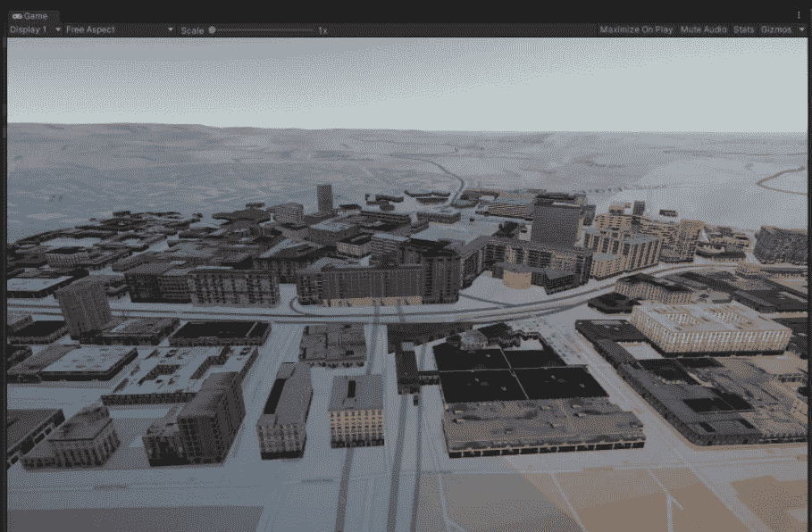
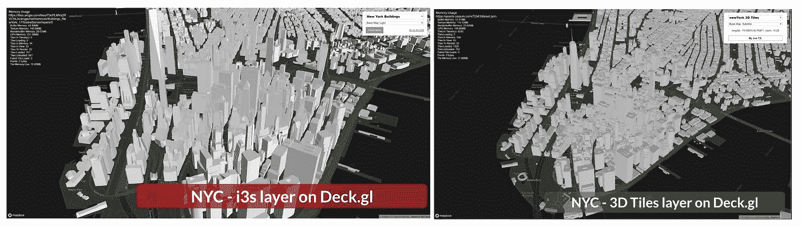
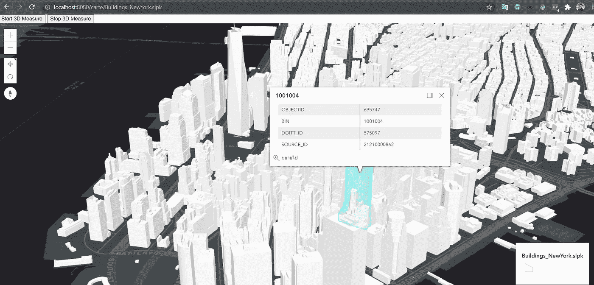
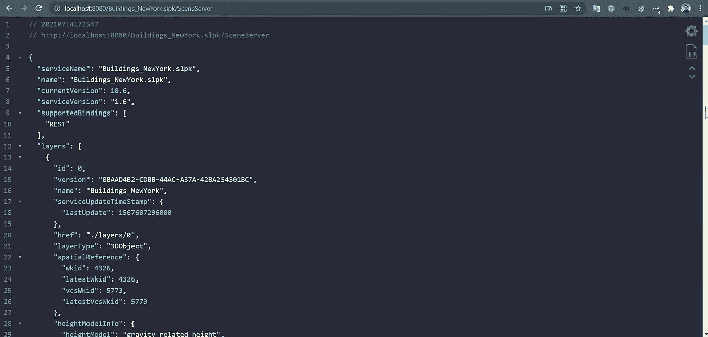

# 用 Python 发布 I3S 场景图层服务

> 原文：<https://towardsdatascience.com/publish-i3s-scene-layers-service-with-python-fecc50b18548?source=collection_archive---------29----------------------->

## 本地 3D 模型流服务-不使用 ArcGIS Enterprise



**斯图加特的 3D 建筑模型—在 Unity3D 中加载 I3S 场景图层服务**(作者)

在最近的地理数据科学项目中，3D 地理可视化工具在多个应用领域发挥了重要作用，如城市规划、室内/室外行人导航、环境模拟、文化遗产或设施管理[1]。近年来，ESRI 开发了 I3S 或索引 3D 场景层，这是场景层的交付格式规范。它旨在用于表示不同类型的 3D 数据，如 3D 建筑模型、集成网格、点云等等。I3S 的优势在于它能够通过 web 以高性能和可扩展性传输大型 3D 数据集。[2]此外，开放地理空间联盟(OGC)已批准 I3S 作为社区标准，并于 2017 年 9 月公开发布[3]。就个人而言，我喜欢使用 I3S，因为它易于使用，并且该服务可由 ArcGIS for JavaScript 或其他 web 可视化库(如 Deck.gl)或游戏引擎(如 Unreal Engine 或 Unity3D)使用。



**作者在 Deck.gl Web 客户端加载 I3S 中的纽约市 3D 建筑模型(左)和 3D 瓷砖(右)**

## 但是，没有 ArcGIS 它就无法发布…

根据 ESRI [4]的说法，您可以通过使用 ArcGIS 工具(ArcGIS Pro 或 ArcGIS Online 订阅)发布托管场景图层来创建流式 3D 模型服务。但是，没有 ArcGIS Enterprise 就无法创建服务。这给许多没有 ArcGIS 套件并依赖其他产品系列或开源解决方案的项目/组织带来了问题。

## 可选择的解决方案

在本帖中，我想分享一个不使用 ArcGIS Enterprise 工具发布 SLPK 或 I3S 服务的解决方案。还好有个工具叫“Quick _ SLPK _ Server”；这里是作为回购[托管的](https://github.com/CrashedBboy/Quick_SLPK_Server)。这不是 ESRI 的官方工具，但在我的数据集上测试后，我喜欢它。它非常有效。所以，让我们一起尝试使用这个工具来托管 SLPK (i3s)服务。

**克隆快速 SLPK 服务器项目**

```
$ **git clone** [**https://github.com/CrashedBboy/Quick_SLPK_Server**](https://github.com/CrashedBboy/Quick_SLPK_Server)
```

**下载开源 SLPK 服务**

在本文中，我将使用纽约市 LoD2 从[这里](http://www.arcgis.com/home/item.html?id=44039155906640438c906d47fac50301)。在我的上一篇文章中，有大量的开源 3D 数据:

[](/open-source-3d-semantical-building-models-in-2020-f47c91f6cd97) [## 2020 年开源 3D 语义建筑模型

### 开源 3D 城市模型的完整列表(2020 年 10 月更新)

towardsdatascience.com](/open-source-3d-semantical-building-models-in-2020-f47c91f6cd97) 

准备好 SLPK 层后，只需将它放在文件夹`**Quick_SLPK_Server\slpk**`中，在那里您可以克隆 repo。

## 运行 SLPK 服务器

您可以简单地用下面的命令运行服务器

```
**$ pip install bottlepy** # install dependency
**$ python quick_slpk_server.py** # run server
```

该实现包括用 ArcGIS4JS 开源工具编写的可视化客户端，您可以通过下面的示例 URL 访问其内容:

```
URL Pattern > *http://<host>:<port>/carte/<slpk_name>*
For Example > [http://localhost:8080/carte/Buildings_NewYork.slpk](http://localhost:8080/carte/Buildings_NewYork.slpk)
```



**作者从快速 SLPK 服务器**加载纽约市的 3D 建筑模型

您还可以通过下面的示例 URL 访问此 SLPK 服务器的索引 3D 场景图层。这使您可以灵活地将此数据图层集成到您需要的任何可视化客户端，例如 Deck.gl，而无需依赖 ArcGIS 套件。

```
URL Pattern *http://<host>:<port>/carte/<slpk_name>/SceneServer*
For Example [http://localhost:8080/Buildings_NewYork.slpk/SceneServer](http://localhost:8080/Buildings_NewYork.slpk/SceneServer)
```



**作者从快速 SLPK 服务器**加载 I3S 服务—纽约市

## 结论

本文简要介绍了如何在不依赖 ArcGIS 套件的情况下使用 Python 托管和发布 I3S 场景图层服务，ArcGIS 套件为您提供了将此数据图层集成到任何可视化客户端或项目的灵活性。我希望这篇文章对您有所帮助，并且能够将这种技术应用到您的项目中。

**平安健康！**

## 参考

[1] Esri (2019): **场景图层服务和打包标准**([https://github.com/Esri/i3s-spec](https://github.com/Esri/i3s-spec))

[2]https://www.ogc.org/standards/i3s(2017):**索引 3D 场景图层(I3S)标准**()

[3] Esri (2021): **发布托管场景图层**[https://enterprise . ArcGIS . com/en/portal/latest/use/Publish-scenes . htm](https://enterprise.arcgis.com/en/portal/latest/use/publish-scenes.htm)