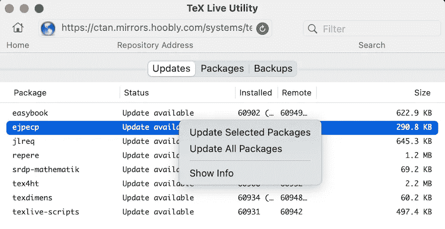
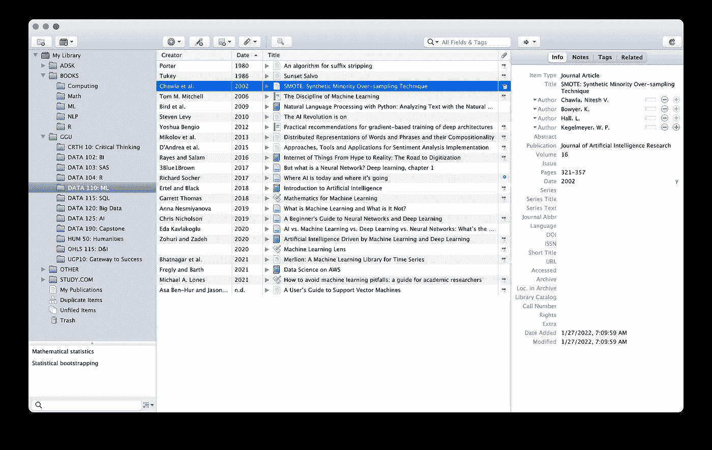
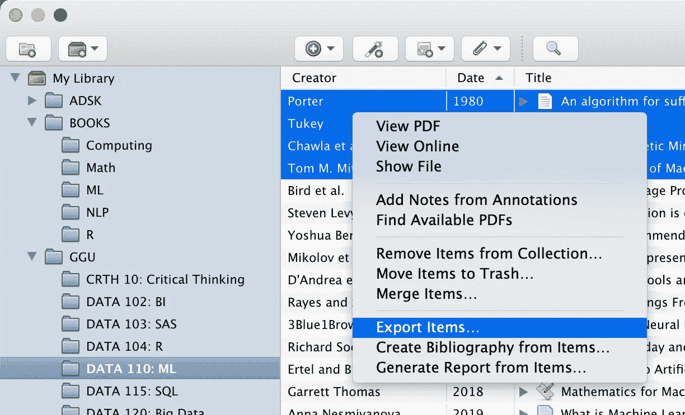
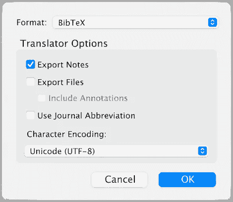
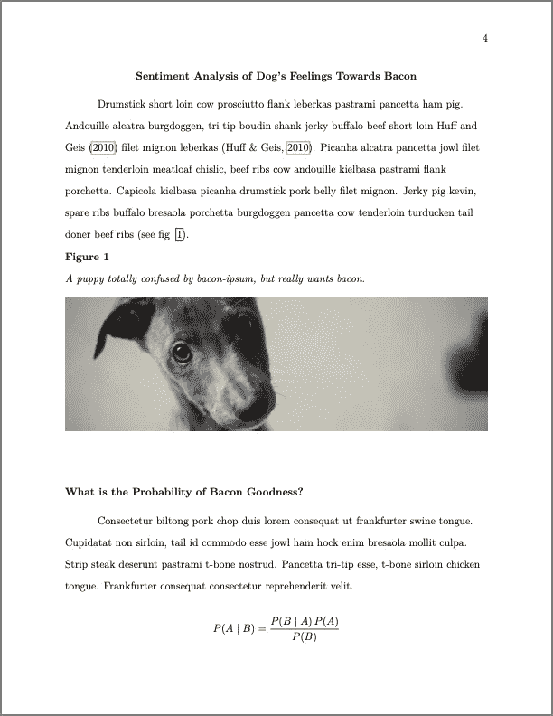

# 在你的下一篇论文中使用 LaTeX 简化你的学术生活

> 原文：<https://towardsdatascience.com/publishing-an-apa-paper-with-latex-836a70b2f48f?source=collection_archive---------13----------------------->

## 用 LaTeX 出版 APA 论文


克里斯·亚瑟·科林斯在 [Unsplash](https://unsplash.com?utm_source=medium&utm_medium=referral) 上的照片

# 概观

当你刚刚开始的时候，使用 LaTeX 写一篇论文可能是一个乏味的过程；然而，我发现它是控制发布过程运行的强大工具。我发现的一些优势:

1.  文档-代码以及版本控制。
2.  能够与您的代码库集成，无缝更新。
3.  预建的模板，完美地格式化基于一个标准，如美国心理学协会或 [APA 格式](https://apastyle.apa.org/style-grammar-guidelines/paper-format)。
4.  能够插入先进的排版，如数学方程式。

我想记录我最终使用的过程。希望对你有帮助！

# 乳胶是什么？

LaTeX 是一个用于文件制作的软件系统。LaTeX 没有使用图形编辑器，而是使用纯文本和一种*标记*语言编写。与 [TeX](https://en.wikipedia.org/wiki/TeX) 排版系统结合后，文档被编译成输出格式。

# 安装 LaTeX

首先，您需要安装 LaTeX。我运行的是 Mac，因此我使用的是 MacTeX 发行版。你可以在这里下载:[https://www.tug.org/mactex/](https://www.tug.org/mactex/)。

我发现这个发行版很完整，也很容易管理。提供了一个安装程序，其中包含创作和发布 TeX 文档所需的一切。它还兼容英特尔或 Arm(苹果硅)处理器。

# 更新 TeX 分布

安装软件后，您需要确保所有适当的软件包都是最新的。您可以通过启动 **TeX Live 实用程序**并运行 *Update All Packages* 命令来实现这一点。



作者图片

# VS 代码和 LaTeX

接下来是您的创作环境。MacTeX 发行版确实附带了一个编辑器，但是它非常简单。幸运的是，VS Code 有一个很棒的扩展，可以让你直接在你喜欢的编辑器中编写文档，并在编辑时自动发布文档。

从 [VSCode 市场](https://marketplace.visualstudio.com/items?itemName=James-Yu.latex-workshop)安装**乳胶车间**扩展。

# 基于云的替代方案

还有一个很好的基于云的解决方案叫做**。APA 模板甚至可以让你更快地开始。查看背页的[了解更多信息。缺点是你没有与你的编码环境集成。](https://www.overleaf.com/)**

# APA 模板

我承认，用 LaTeX 从头开始构建 APA 格式的文档将是一种与接下来的体验非常不同的体验。幸运的是， *Daniel A. Weiss* 创建了一个很棒的 APA 模板，支持第 7 版，包含在 TeX Live 发行版中。只要你已经如上所述更新了你的包，它应该是无缝的。

请务必查看文档(PDF)。它清楚地显示了如何使用模板，并将帮助您进一步定制。

# APA 文件的构建模块

TEX 文档的几个部分创建了一篇论文所需的所有组件。我将用代码示例逐一介绍它们。

# 文档标题

首先用任意名称创建一个新文档，并添加扩展名`.tex`。在最上面插入这几行。注意`\begin{document}`和`\end{document}`标签。论文的其余部分将落在这两者之间。

```
\documentclass[stu]{apa7}
\usepackage[american]{babel}
\usepackage{csquotes}
\usepackage{caption}
\usepackage[style=apa,sortcites=true,sorting=nyt,backend=biber]{biblatex}
\DeclareLanguageMapping{american}{american-apa}
\addbibresource{bibliography.bib}

\begin{document}

\end{document}
```

我们可以看到`documentclass`被设置为使用`{apa7}`模板和选项`stu`，选项`stu`是一个关于格式化为**学生论文**和期刊文章的定义。此外，还有`\addbibresource{}`定义，我将在后面介绍，它将帮助我们在文档中添加适当格式的引用。

# 标题页和摘要

添加一个**标题页面**和**摘要**页面简直易如反掌。只需将这个插入到`begin`和`end`标签之间。

```
\title{Capstone Project}

\authorsnames{Brian Roepke}
\authorsaffiliations{Data Analytics, Golden Gate University}
\course{DATA190}
\professor{Dr. Professor Data}
\duedate{August 21, 2021}

\abstract{
  Bacon ipsum dolor amet jerky burgdoggen turkey...
}

\maketitle
```

您还会注意到，编译器将开始创建您的第一个 PDF！每次更改后，您都会看到 PDF 更新。关于 VS 代码集成的一个伟大的事情是你可以并排预览 PDF，看着你的修改出现。只需打开侧面的*预览分割器窗口*，您应该会看到一个带有封面、摘要和论文首页的 PDF。**魔法**！

# 正文和章节

接下来，我们可以撰写论文。总体结构是在`\maketitle`标签下添加你的第一个介绍页面，然后是几个小节和子小节。

```
\maketitle
Tongue sausage ground round capicola pork pancetta brisket, strip steak...

\newpage

\section{Sentiment Analysis of Dog's Feelings Towards Bacon}

Drumstick short loin cow prosciutto flank leberkas pastrami pancetta...

\subsection{Other Sources of Bacon Goodness}
Consectetur biltong pork chop duis lorem consequat...
```

这里发生了什么事？

*   `\newpage`确实如此——在文档中放置一个分页符，并允许您在新的一页上开始一个部分。
*   `\section`是根据 APA 的二级标题。它是**左对齐，粗体，标题案例标题**
*   `\subsection`是第三级标题。它的 ***左对齐，粗体斜体，标题案例标题***
*   `\subsubsection`是第四级标题，以此类推。支持五个级别。查看文档以获取信息。

# 数字

接下来是如何插入插图的示例，通过使用以下语法的文本引用来完成:

(见图`~\ref{fig:my_fig}`)

然后在文档中的任何地方，用相应的匹配`label`创建图形。随着文稿的增长，您会发现对图像位置的附加控制很重要。在描述选项的 [StackExchange](https://tex.stackexchange.com/questions/8652/what-does-t-and-ht-mean) 上有一个很棒的答案。

```
\begin{figure}[!ht]
  \centering
  \caption{A puppy confused by bacon-ipsum, but really wants bacon.}
  \includegraphics[width=\textwidth]{dog.jpg}
  \label{fig:my_fig}
\end{figure}
```

# 引文

添加引用也非常容易。在文档的头中，我们已经定义了`\addbibresource{bibliography.bib}`。以此名称创建一个文件，然后可以使用 BibTeX 格式向其中添加引用，如下所示:

```
@book{huff2010lie,
  title={How to Lie with Statistics},
  author={Huff, D. and Geis, I.},
  isbn={9780393070873},
  url={https://books.google.com/books?id=5oSU5PepogEC},
  year={2010},
  publisher={W. W. Norton}
}
```

然后，当在你论文的正文中引用时，你像这样添加引用:

```
Andouille alcatra burgdoggen, tri-tip boudin shank jerky buffalo beef short loin \textcite{huff2010lie} filet mignon leberkas \parencite{huff2010lie}.
```

输出如下所示，显示文本和经典引文。

*and ouille alcatra burgdogen，tri-tip boudin shank 牛肉干水牛牛腰肉哈夫和盖修(2010)菲力牛排 leberkas(哈夫&盖修，2010)。*

## 使用参考经理

如果你使用像 [EndNote](https://endnote.com/) 或 [Zotero](https://www.zotero.org/) 这样的引用管理器，你可以将你的整个引用列表导出为 BibTex 并粘贴到`.bib`文件中。我在学术研究的大部分时间里都在使用 EndNote，但最近我换成了 Zotero，因为它非常棒，而且可以免费使用。这里有一个如何导出引用的快速流程。



作者图片

从 Zotero 界面，突出显示您希望导出的项目，并选择`Export items...`菜单选项。



作者图片

接下来，选择`BibTex`选项并保存文件。从这里，您可以将它们移动到`bibliography.bib`文件中。确保移除`file:`键值对。



作者图片

# 与您的项目代码集成

我上面提到过，一起使用 **LaTeX** 和 **VS Code** 的一个好处就是自动与你的代码集成。您可以在 LaTeX 文档中的图像引用中直接引用从 Python 保存的图像。

如果你正在使用`matplotlib`，在你的绘图后添加这两行:

```
plt.tight_layout()
plt.savefig('images_path/img_name.png', dpi=300);
```

然后在 LaTeX 文档中引用该图像。每次你的剧情更新，你都不用担心更新的问题。

# 结论



作者图片

当你开始的时候，这似乎是一个令人生畏的任务。通过学习一些基础知识并利用这里使用的 APA 模板，您可以轻松地发布专业的论文和文章。在你的下一个任务或项目中尝试一下吧！为了方便起见，如果你想看整个项目，我已经把源代码贴在了 GitHub 上。

尽情享受吧！

如果你喜欢阅读这样的故事，并想支持我成为一名作家，可以考虑报名成为一名媒体成员。一个月 5 美元，让你可以无限制地访问成千上万篇文章。如果你使用[我的链接](https://medium.com/@broepke/membership)注册，我会赚一小笔佣金，不需要你额外付费。