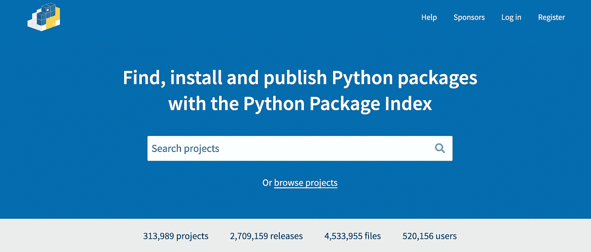
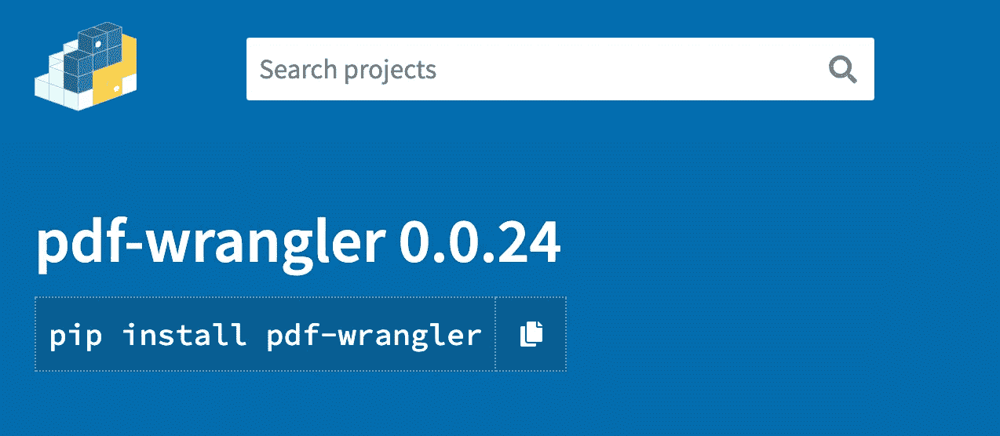

# 将开源 Python 包发布到 PyPI

> 原文：<https://towardsdatascience.com/publishing-open-source-python-packages-to-pypi-4a1458416572?source=collection_archive---------33----------------------->

## 造了很酷的东西？通过将它发布到 PyPI，使它易于访问！


由[在](https://unsplash.com/@hiteshchoudhary?utm_source=medium&utm_medium=referral) [Unsplash](https://unsplash.com?utm_source=medium&utm_medium=referral) 上拍摄的照片

# Python 包索引(PyPI)

Python 包索引是可用于 Python 编程的软件库的存储库。PyPI 使得分发和访问不属于标准 Python 库的有用项目变得容易。

将自己的开源项目发布到 PyPI 非常简单。在本文中，我们将介绍如何:

*   为 PyPI 准备好您的包
*   手动构建您的包并上传到 PyPI
*   在发布之前用 [TestPyPI](https://test.pypi.org/) 测试你的包
*   版本控制
*   使用 CircleCI 将存储库的主分支与 PyPI 同步

我将使用我的一个存储库作为例子: [pdf-wrangler](https://github.com/happilyeverafter95/pdf-wrangler) ，一个用于更简单的 pdf 提取的 PDFMiner 包装器。这个项目在 PyPI 上的[这里](https://pypi.org/project/pdf-wrangler/)托管。



截图来自[https://pypi.org/](https://pypi.org/)

# 为 PyPI 准备您的包

首先，您需要在根目录下创建一个`setup.py`文件来提供关于您的包的一些信息。这是`pdf-wrangler.`的`setup.py`文件的第一次迭代

最关键的字段是:

*   **name:** 出现在 PyPI 上的包的名称(这个名称必须是惟一的，所以要确保没有同名的包存在)
*   **版本:**这是您的软件包的唯一版本
*   安装要求:这指定了你的包的依赖关系
*   **python _ requires:**python 版本需求
*   **url:** 链接到项目代码库所在的位置

在这里，我也导入自述文件作为详细描述。简短和详细的描述都将显示在 PyPI 页面上。

# 构建并上传您的包

一旦我们创建了`setup.py`文件，我们就可以开始构建和上传了。

## 建设

“构建”过程为您的包创建一个源归档文件和 wheel，由以下命令启动:

```
python setup.py sdist bdist_wheel
```

这将创建一个`dist`目录，其中包含上传所需的所有文件。您应该使用`.gitignore`将这个目录从您的存储库中排除，这样它就不会使您的代码混乱。

## 上传

首先，我们需要[在 PyPI 上创建一个账户](https://pypi.org/account/register/)。我建议在 TestPyPI 上创建一个帐户，这样你可以在上传之前在一个单独的索引上测试你的包。

**注意:**新版本一旦发布，就没有办法覆盖，所以要确保你发布的所有东西都经过了适当的测试！

根据它的文档， [twine](https://pypi.org/project/twine/) 是一个“在 PyPI 上发布 Python 包的工具”。使用`twine`，我们可以在安装后从命令行发布包。

```
pip install twine
```

要上传到**测试**索引，在根目录下运行以下命令:

```
twine upload --repository-url https://test.pypi.org/legacy/ dist/*
```

准备好上传到实际的 PyPI 索引后，在根目录下运行以下命令:

```
twine upload dist/*
```

`twine upload`命令将提示您使用您的 PyPI 用户名和密码进行身份验证。一旦通过认证，`twine`将上传并分享您可以找到您的包裹的网址(您也应该能够通过在 PyPI 上的谷歌搜索轻松找到您的包裹)。



截图来自[https://pypi.org/project/pdf-wrangler/](https://pypi.org/project/pdf-wrangler/)

# 版本控制

如果您尝试上传同一个版本两次，您将会遇到此错误，告诉您每个版本必须是唯一的:

```
HTTPError: 400 Client Error: File already exists. See https://pypi.org/help/#file-name-reuse for url: https://upload.pypi.org/legacy
```

如前所述，版本在`setup.py`文件中指定。每次我们想上传一个新版本的包，我们必须改变版本。

有两种常用的版本化方案:

## **日期方案**

您可以使用发布日期来版本化您的软件包。例如，从今天开始的新版本将是`pdf_wrangler==20210704`

使用日期进行版本控制的缺点是，它不会考虑同一日期单位的多个版本。

## 基于序列的方案

对于基于序列的方案，每个版本都是由点分隔的数值序列。最常用的格式是:

```
MAJOR.MINOR.MICRO
```

*   重大变更是软件的重大修订，通常会以一种不总是向后兼容的方式彻底改变 API /现有特性
*   次要是指较小(但相当大)的更改，如功能改进，当最终用户升级时，这些更改几乎没有风险
*   微小的改变通常是为修复错误而保留的

# 用 PyPI 同步主/主分支

如果您想要将您的主分支与 PyPI 同步，以便您不需要手动构建和上传您的发行版，您将需要一个 CI/CD 工具来执行我们前面运行的命令。[这里的](https://github.com/happilyeverafter95/pdf-wrangler/blob/main/.circleci/config.yml)是`pdf-wrangler`使用 CircleCI 的一个例子。

之前，我们通过以下方式手动上传了包:

*   构建新的发行版(记住版本也需要更新)
*   使用`twine`上传到 PyPI

我们可以通过 CircleCI 构建和部署步骤自动运行这些命令。我们可以利用有用的 CircleCI 环境变量，比如`CIRCLE_BRANCH`,这样我们就可以只同步主分支的变更。

让我们看一下`build-and-test`工作流程中的每一步:

*   `Run tests`使用`pytest`执行我们的测试，这样我们就可以放心地发布变更
*   `init .pypirc`跟踪使用我们的 PyPI 帐户进行身份验证所需的必要环境变量；密码(这是一个秘密)作为一个秘密环境变量保存在 CircleCI 项目设置中
*   `create packages`为主分支上的变更构建分发包
*   `upload to pypi`执行`twine`命令对主分支进行修改(确保`twine`作为项目依赖项的一部分安装)

如您所见，发布您自己的开源 Python 包并不困难。希望这对你有帮助！

# 感谢您的阅读！

[通过 Medium](https://medium.com/@mandygu) 关注我的最新动态。😃

作为一个业余爱好项目，我还在[www.dscrashcourse.com](http://www.dscrashcourse.com/)建立了一套全面的**免费**数据科学课程和练习题。

再次感谢您的阅读！📕