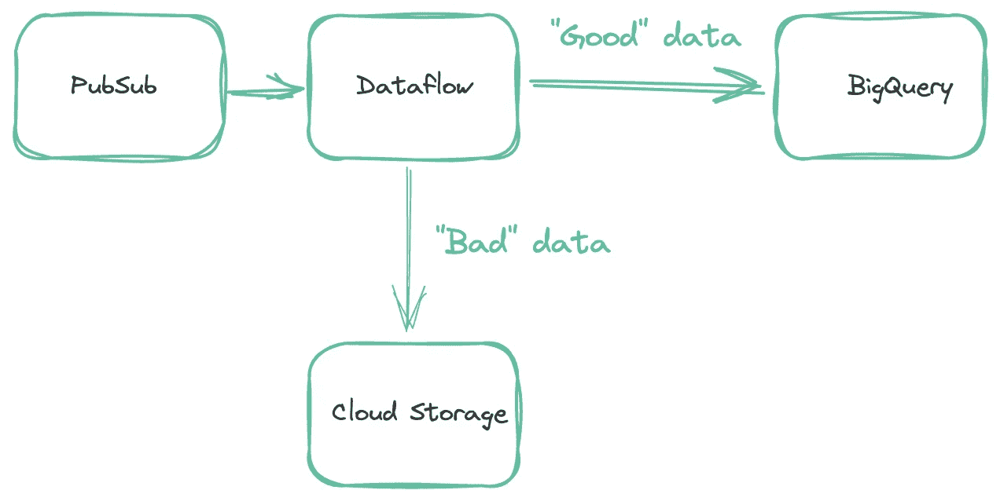
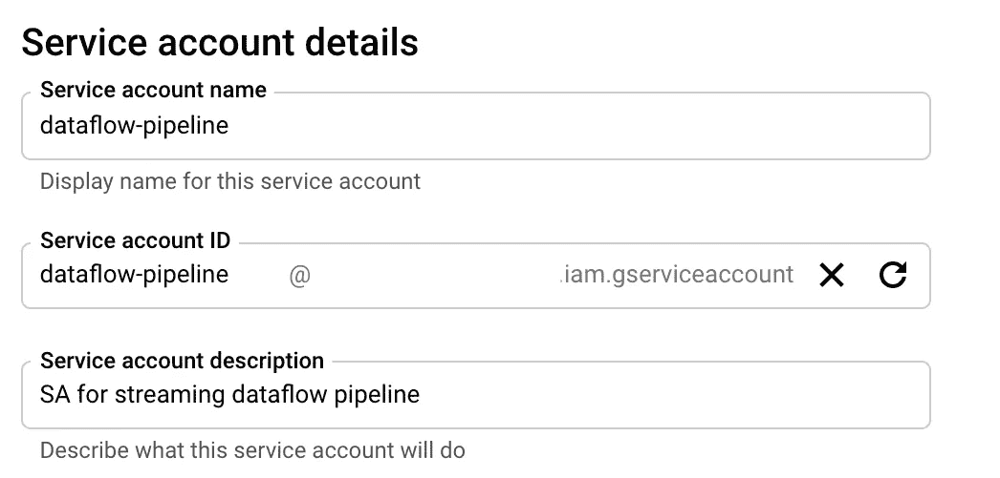
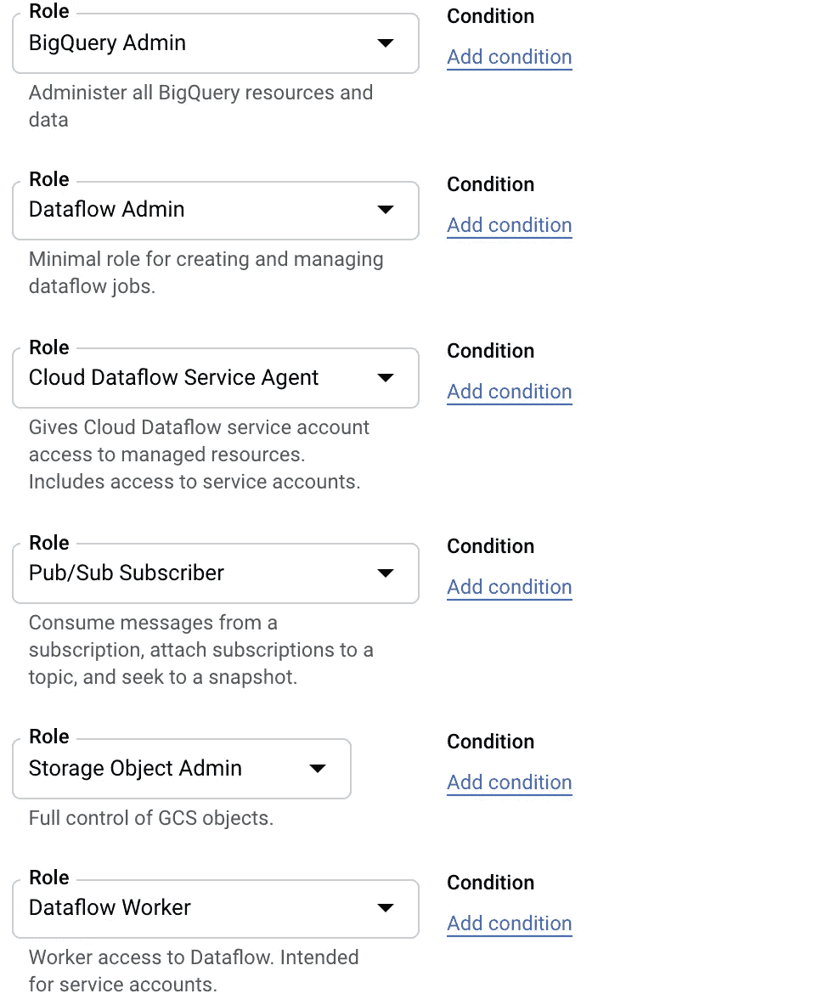
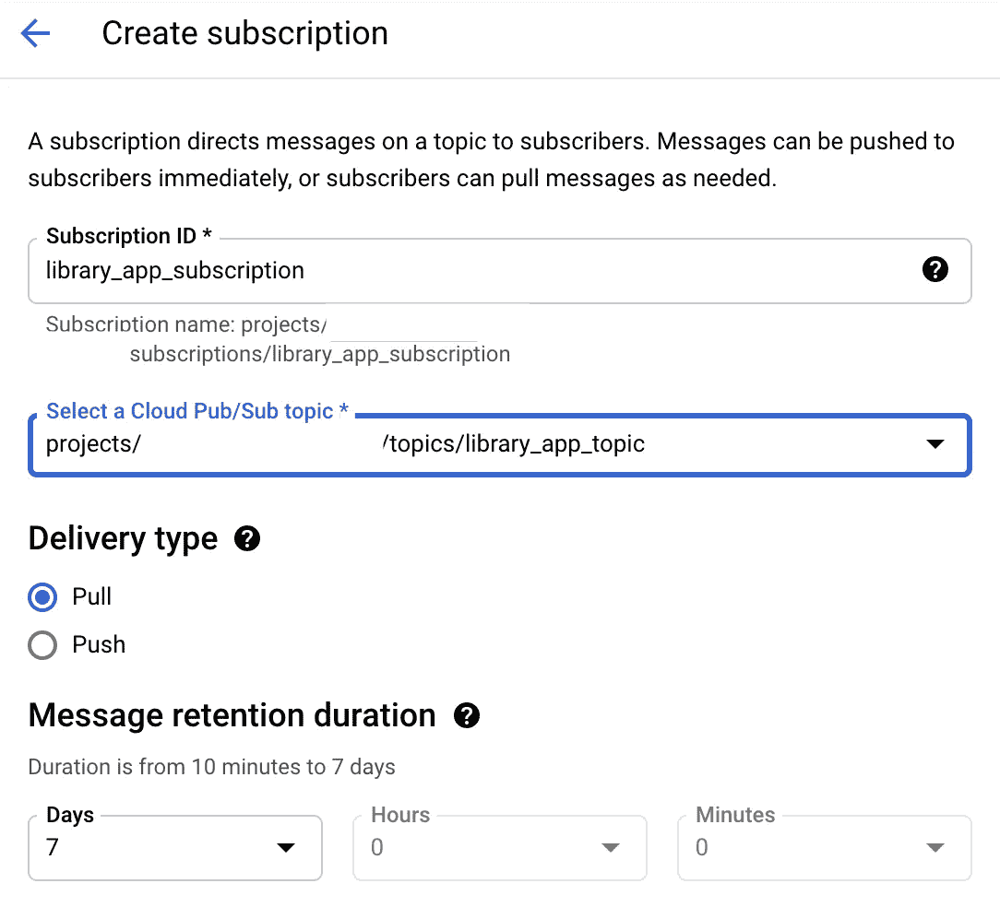
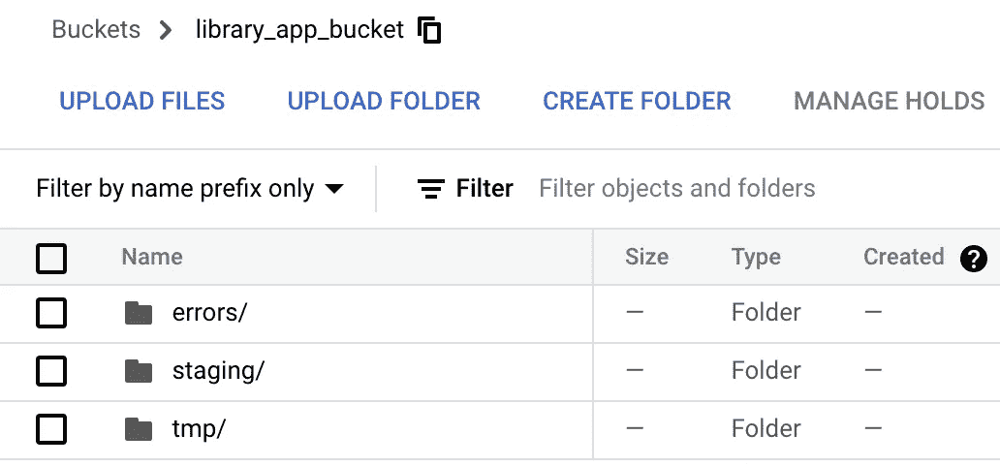
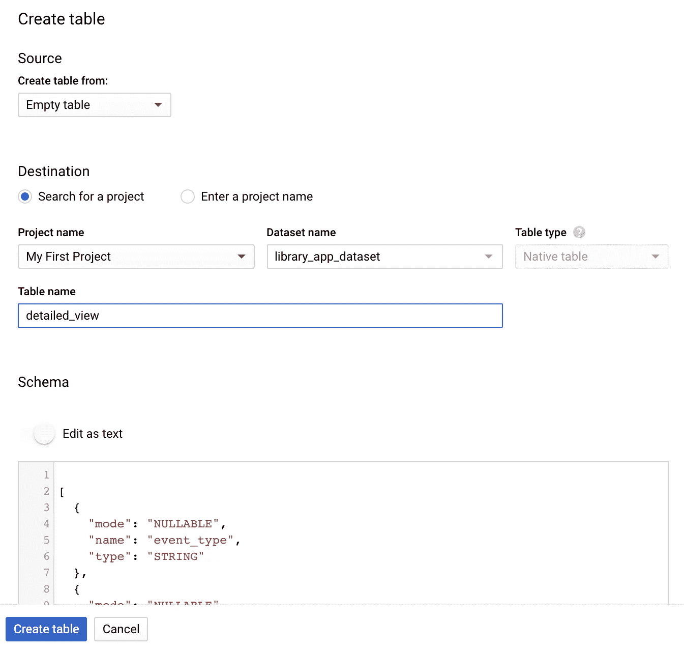
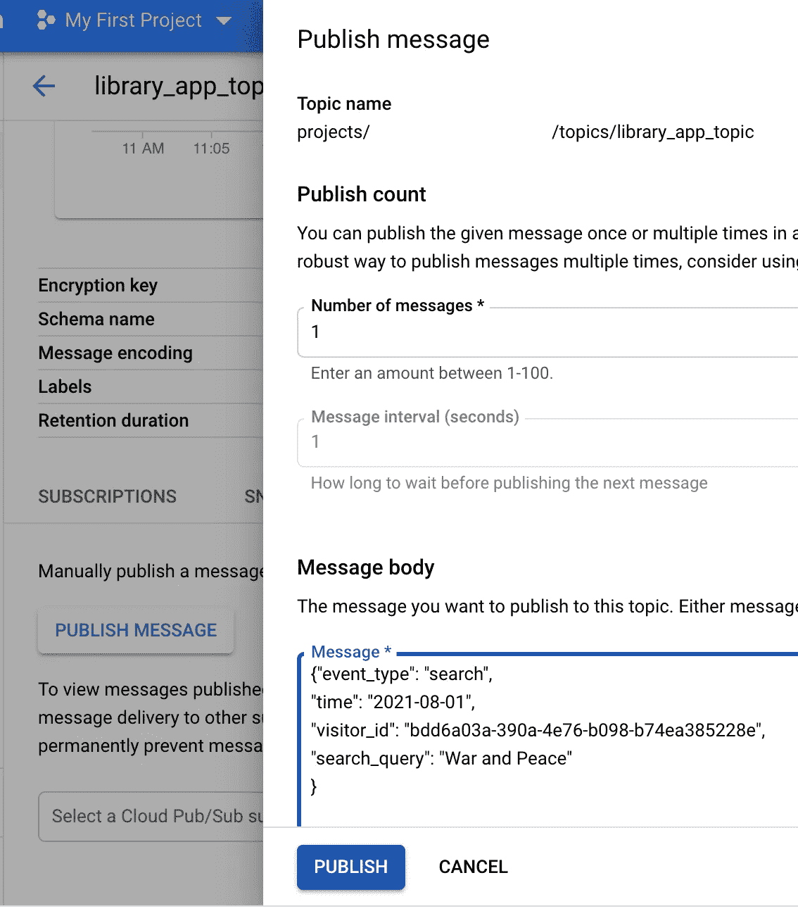
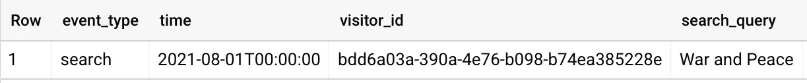
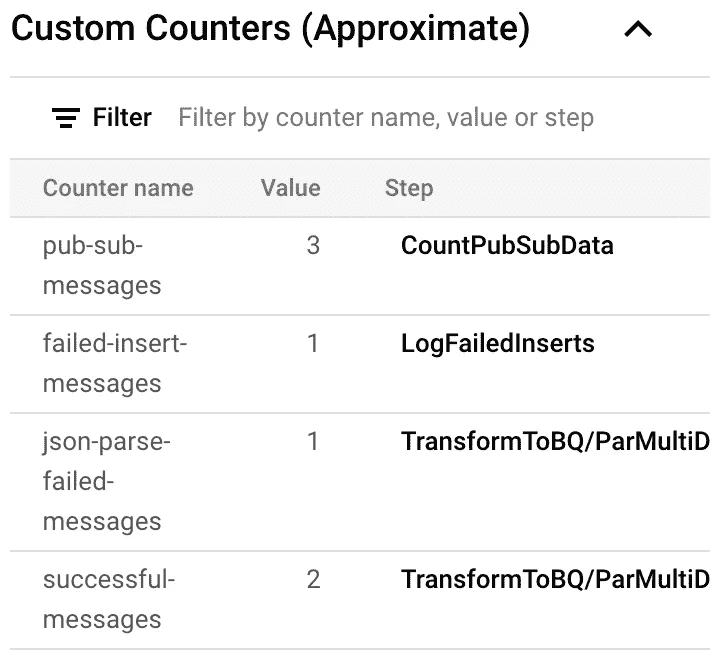

# 从 PubSub 到 BigQuery:如何使用数据流、Apache Beam 和 Java 构建数据管道

> 原文：<https://towardsdatascience.com/pubsub-to-bigquery-how-to-build-a-data-pipeline-using-dataflow-apache-beam-and-java-afdeb8e711c2?source=collection_archive---------31----------------------->

## 了解如何在 GCP 创建数据管道

我最近参与了一个项目，该项目要求我从 Google PubSub 收集数据，并将其加载到不同的 BigQuery 表中。在这个过程中，我面临了许多挑战，所以我想分享一下我在谷歌云平台中构建完整数据管道的经验。

# **问题陈述**

假设我们在 GCP 的项目中有一个从后端向 PubSub 发送各种事件的库应用程序。事件是应用程序的任何用户迭代。仅为了演示，我们希望收集以下事件:

*   **detailed_view** ，当用户打开一个有图书详情的页面时
*   **搜索**，当用户搜索一本书时
*   当用户将某本书添加为收藏时

每种事件类型都有不同的结构，应该保存到 BigQuery 中单独的表中，以便进一步分析。我们得到 JSON 格式的事件，JSON 中的 *event_type* 参数定义了事件需要写入的表。

**详细 _ 查看**事件示例:

```
{“event_type”: “detailed_view”,“time”: “2021–08–01”,“visitor_id”: “bdd6a03a-390a-4e76-b098-b74ea385228e”,“book”: {“id”: “1231234”}}
```

**搜索**事件示例:

```
{“event_type”: “search”,“time”: “2021–08–01”,“visitor_id”: “bdd6a03a-390a-4e76-b098-b74ea385228e”,“search_query”: “War and Peace”}
```

**添加到收藏夹**事件示例:

```
{“event_type”: “add_to_favorite”,“time”: “2021–08–01”,“visitor_id”: “bdd6a03a-390a-4e76-b098-b74ea385228e”,“book”: {“id”: “1231234”},“rating”: 5}
```

我总结了下图的问题。


管道架构(图片由作者提供)

因此，你可以看到黑盒将为我们做所有的魔术，我们不需要做任何事情。

开个玩笑，真希望能这么简单。

您可能会说，好吧，太好了，但是如果数据突然以不同的结构出现或者出现在一个损坏的 JSON 中，该怎么办呢？我们都知道数据工程师的生活充满了痛苦和不断变化的数据结构。如果有人在没有任何通知的情况下从后端更改了模式，该怎么办？我们如何识别它是否发生过？我们如何在不停止管道的情况下保持和保存这样的数据，直到应用了某种修复？

因此，我们需要一个解决方案，它可以根据特定条件将输出数据流并行存储到不同的数据存储中，并且能够收集由于某种原因无法进入 BigQuery 的行。所以解决方案是 [Dataflow](https://cloud.google.com/dataflow) ，这是谷歌基于 Apache Beam 的完全托管的数据处理服务。它提供了所有需要的功能，以及无服务器方法和水平可扩展性。你可以阅读 Apache Beam [文档](https://beam.apache.org/documentation/)了解更多细节。

我想提及三个基本概念:

1.  这是一个开源模型，用于创建批处理和流数据并行处理管道，可以在不同的运行程序上执行，如 Dataflow 或 Apache Spark。
2.  Apache Beam 主要由 p 集合和 p 变换组成。PCollection 是一个无序的、分布式的、不可变的数据集。PTransforms 是对作为数据管道阶段的 PCollections 的操作。Apache Beam 允许对 PTransforms 的输入和输出进行分支数据处理。
3.  p 集合可以是有界的(固定大小的数据集)或无界的(无限大小的数据集)。如果从 PubSub 读取数据，那么您的 PCollection 是无限的。

在下图中，你可以看到最终的管道架构。



管道架构(图片由作者提供)

既然我们已经对数据管道有了一个概念，现在是时候让它发挥作用了。如上图所示，我们在中间有一个数据流作业，包括以下步骤:

1.  不断地从应用程序后端发布的 PubSub 中读取 JSON 事件。
2.  在 PTransform 中处理 JSON 事件。
3.  将它们加载到 BigQuery。目的地根据 JSON 事件中的 event_type 字段而不同。
4.  收集所有插入失败的行，并将它们上传到云存储桶。
5.  统计所有“好”数据和“坏”数据，并以指标形式呈现出来

# 流模式还是批处理模式？

在将数据导入 BigQuery 之前，我们需要选择适合自己的模式。数据可以在*批处理*模式下作为大块数据加载，也可以在*流*模式下加载，这意味着实时批处理更小，但价格更高。

如何做出选择？

BigQuery 使用[加载作业](https://cloud.google.com/bigquery/docs/loading-data)来接收数据。对于这个过程，谷歌有[配额](https://cloud.google.com/bigquery/quotas#load_jobs)，这是选择摄取方法时必须考虑的。

1.  您的项目每天可以对每个表进行多达 1，500 次操作(如加载、复制、查询),包括目标表每天失败的作业。
2.  您的项目每天可以运行多达 100，000 个装载作业。失败的加载作业计入此限制。
3.  总请求负载必须小于 10MB。

另一个需要考虑的重要事情是 Apache Beam 的行为，即将**批处理模式**中的**无界数据**加载到 BigQuery 中。如果这样的加载失败，那么 Apache Beam 将重试 1000 次。你可以从它们的源代码[代码](https://github.com/apache/beam/blob/e76b4db30a90d8f351e807cb247a707e7a3c566c/sdks/java/io/google-cloud-platform/src/main/java/org/apache/beam/sdk/io/gcp/bigquery/BigQueryIO.java)本身看到证明:

没有参数可以更改这个默认值，因此这意味着如果您每天至少两次对同一个表进行两次错误加载，您将会超出加载作业配额:

1 * 1000 次重试+ 1 * 1000 次重试= 2000 次重试> 1500 次配额

对于项目级别 100，不正确的负载总数将超过定额。

在我看来，如果你使用具有无界数据的数据流(像 PubSub ),并且你的管道在生产中是高度加载的，并且使用许多表，那么使用流模式是更安全的，尽管更昂贵。否则，如果达到了该表的作业配额，那么该表的所有其他作业(如查询或复制)将在一天内无法进行。如果达到项目的作业配额，所有表的所有作业都将被阻塞。

当然，您可以在接收数据之前检查所有结构和类型，但这也不能保证管道的安全。

因此，在本教程中，我将向您展示如何在流模式下加载数据。

# 设置您的本地机器

1.  阿帕奇光束需要 [JDK](https://www.oracle.com/java/technologies/javase/javase8-archive-downloads.html) (Java SE 8 (8u202 及更早)。不要忘记设置 [JAVA_HOME](https://docs.oracle.com/cd/E19182-01/821-0917/inst_jdk_javahome_t/index.html) 环境变量。
2.  本教程的所有代码甚至更多都可以在我的 [GitHub](https://github.com/olgazju/blog_pubsub_to_bigquery_dataflow_pipeline) 上找到。
3.  你可以安装 IntelliJ，但是为了简单起见，我将使用命令行。

# 设置 Google 云

## 1.项目

如果没有，在谷歌云平台中创建一个[项目](https://cloud.google.com/resource-manager/docs/creating-managing-projects#console)。将[计费账户](https://cloud.google.com/billing/docs/how-to/modify-project)与您的项目链接，如果它没有链接的话。

## 2.服务帐户

在云控制台中，转到[服务帐户页面](https://console.cloud.google.com/iam-admin/serviceaccounts)。选择您的项目并点击*创建服务帐户*。然后你会被要求提供细节。



服务帐户详细信息

授予此服务帐户我们数据管道所需的以下权限:

*   云数据流服务代理
*   数据流管理(用于创建作业)
*   数据流工作者
*   BigQuery 管理员
*   发布/订阅用户
*   存储对象管理

为了简单起见，我采用了管理员角色，但是您可以使用更精确的角色，例如 BigQuery 数据集级访问和特定于存储的存储桶访问。



服务帐户角色

然后，您应该创建并下载 SA 的 JSON 密钥。在“服务帐户”页面上:

*   点击*按键选项卡*
*   点击*添加键*下拉菜单
*   选择*创建新键*
*   选择 JSON 作为键类型
*   点击*创建*

点击*创建*在您的计算机上下载 JSON 格式的服务帐户密钥文件。

您可以将 SA 密钥文件的路径添加到 GOOGLE_APPLICATION_CREDENTIALS 环境变量中。

```
export GOOGLE_APPLICATION_CREDENTIALS=<path to sa file>
```

## 3.数据流 API

在云控制台启用[数据流 API](https://console.cloud.google.com/marketplace/product/google/dataflow.googleapis.com)

## 4.私人谷歌访问

数据流工人要求[私人谷歌访问](https://cloud.google.com/vpc/docs/configure-private-google-access#configuring_access_to_google_services_from_internal_ips)你所在地区的网络。进入 [VPC 网络](https://console.cloud.google.com/networking/networks/list)页面，选择您的网络和地区，点击【编辑】选择上的 ***进行私人谷歌访问，然后*保存*。***


## 5.公共订阅

创建一个 [PubSub](https://cloud.google.com/pubsub/docs/admin) 主题和一个“拉”订阅:在我们的例子中是 *library_app_topic* 和*library _ app _ subscription*。



创建订阅

## 6.云存储

在云控制台[中创建](https://console.cloud.google.com/storage/browser)*library _ app _ bucket*云存储 bucket，里面还有另外三个: *tmp* 、 *staging* 和 *errors* 。Dataflow 将使用此存储桶进行部署，并保存未在 BQ 中接收的数据。



创建存储桶

## 7.BigQuery

我将展示如何创建 *detailed_view* 表，以便您可以轻松地对其他表重复相同的过程。
在 [BigQuery](https://console.cloud.google.com/bigquery) 中，在美国位置创建 *library_app_dataset* ，因为我们将在这个位置运行我们的数据流作业。然后从数据集中点击*添加表格*。



在 BigQuery 中创建一个表

选择源作为*空表*。在表名字段中写下 *detailed_view* ，然后点击*编辑为模式部分下的文本*。
在下面插入这个 JSON，点击*创建表格*按钮。

```
[
  {
    "mode": "NULLABLE",
    "name": "event_type",
    "type": "STRING"
  },
  {
    "mode": "NULLABLE",
    "name": "time",
    "type": "STRING"
  },
  {
    "mode": "NULLABLE",
    "name": "visitor_id",
    "type": "STRING"
  },
  {
      "fields": [
        {
          "mode": "NULLABLE",
          "name": "id",
          "type": "STRING"
        }
    ],
    "mode": "NULLABLE",
    "name": "book",
    "type": "RECORD"
  }
]
```

您可以在我的 GitHub [存储库](https://github.com/olgazju/blog_pubsub_to_bigquery_dataflow_pipeline/tree/main/bq_schemas)中找到所有表的所有模式。

最后，在对 *search* 和 *add_to_favorite* 表重复所有步骤后，您应该会在 BigQuery 中的 *library_app_dataset* 数据集下看到它们。

# 让我们编码

你可以在我的 [GitHub](https://github.com/olgazju/blog_pubsub_to_bigquery_dataflow_pipeline) 上找到所有代码。克隆它然后运行。/gradlew build。不要忘记为您的 SA 设置带有 JSON 键的 GOOGLE_APPLICATION_CREDENTIALS 环境变量。

这里我将只解释管道代码。

首先，我们需要从 Apache Beam 创建一个管道对象，该对象将包含所有数据和数据处理步骤。要配置数据管道选项，您可以创建自己的类(在我们的示例中为 MyOptions ),该类扩展了 DataflowPipelineOptions 和 DirectOptions 类。您可以从命令行使用这些选项来设置资源，例如，发布订阅名称和其他参数。

然后我们从 PubSub 订阅中读取无界数据。Apache Beam 中有一个 PubsubIO 类，为云发布/订阅流提供预先编写的 PTransforms。

因此，我们有了数据流管道中的第一步—**readpublibsubscription**。

然后我们需要检查 JSON 是否正确:让我们编写自定义的 PTransform，然后在管道代码中使用它作为 **TransformToBQ** 步骤。

在 Apache Beam 的 ParDo 和 DoFn PTransforms 的帮助下，我们用 processElement 函数扩展并覆盖了 PTransform 类。这个函数用 JSON 获取一个字符串，然后在 SUCCESS_TAG 和 [side output](https://beam.apache.org/documentation/programming-guide/#additional-outputs) FAILURE_TAG 下产生主输出。

SUCCESS_TAG 包括通过所有检查并成功转换为 [TableRow](https://developers.google.com/resources/api-libraries/documentation/bigquery/v2/java/latest/com/google/api/services/bigquery/model/TableRow.html?is-external=true) 对象的消息。

FAILURE_TAG 表示一个键值变量，其中键是故障类型:

*   “TooBigRow”，大于 10Mb 的 JSON 消息(这是有效负载大小的一个限额。我们不想被这些信息所困)
*   “JsonParseError”，在 JSON 解析期间导致各种错误的 JSON 消息

可以添加更多的副输出，并将 IOException 拆分为更详细的异常。

然后我们收集成功处理的数据，并在 Apache Beam 的 BigQueryIO 类的帮助下将其流式传输到 BigQuery 中，**WriteSuccessfulRecordsToBQ**步骤。

*用方法(BigQueryIO。*定义流模式。

*skipInvalidRows* 表示如果一组数据中存在无效行，则跳过它们，不要使所有数据组失败。这仅在流模式下有效。

在摄取过程中，我们从 *event_type* 字段的行中获取目标表的动态定义。

*withExtendedErrorInfo* 允许我们将所有失败的插入保存在一个单独的 PCollection 中，并在 **MapFailedInserts** 步骤中定义错误。

在下面的代码中，我们从 FAILURE_TAG PCollection 和 failedInserts 中获取所有数据，然后[将其合并到一个 PCollection 中。
展平后，我们需要应用](https://beam.apache.org/documentation/transforms/python/other/flatten/)[窗口](https://beam.apache.org/documentation/programming-guide/#windowing)和[触发器](https://beam.apache.org/documentation/programming-guide/#triggers)在**窗口错误**步骤中创建某个时间间隔的数据块，并在 **WriteErrorsToGCS** 步骤中将其作为一个文件写入云存储桶。因为在这种情况下我们不关心数据的顺序，所以我们可以使用 GlobalWindows。

然后运行管道。

# 添加指标

作为管道的结果，我们在 BigQuery 中拥有所有“好的”数据，在 bucket 中拥有所有“坏的”数据。让我们创建一些[指标](https://beam.apache.org/documentation/programming-guide/#metrics)。我们将使用 Apache Beam 中的计数器度量类。

因此，您可以简单地在特定位置对每个指标使用 inc()操作，然后在数据流作业中查看这些指标。
例如，让我们计算一下管道中有多少失败的插入。取*failed inserts*p collection 并应用 metric . failed insertmessages . Inc()；对于 processElement 中的每个元素。因此，failedInsertMessages 包含当前失败的插入次数。

# 在本地计算机上运行管道

一旦你设置了环境和 GOOGLE_APPLICATION_CREDENTIALS 变量，并且有了你的代码，你就可以在本地机器上用 [DirectRunner](https://beam.apache.org/documentation/runners/direct/) 首先运行管道。

转到 gradlew 文件所在的文件夹，首先构建代码

```
./gradlew build
```

然后用这个命令运行它(不要忘记写下你的项目名而不是<project_name>):</project_name>

如果一切正常，您将在命令行中看到以下几行:

```
<==========---> 80% EXECUTING [3m 15s]
> :app:run
```

如你所见，代码的编写提供了在不同的 GCP 项目中使用 BigQuery、PubSub 和 Dataflow 的可能性。

# 在数据流上运行管道

用 DirectRunner 检查我们的管道后，我们可以用 [DataflowRunner](https://beam.apache.org/documentation/runners/dataflow) 在数据流中运行它。这与上一段中的命令几乎相同，但是 runner 参数是 DataflowRunner(不要忘记写下您的项目名称，而不是< project_name >)。

参数*enablestreamingine*允许使用[流媒体引擎](https://cloud.google.com/dataflow/docs/guides/deploying-a-pipeline#benefits-of-streaming-engine)。数据流的流媒体引擎将管道执行从工作虚拟机中移出，并移入数据流服务后端，这意味着消耗的 CPU 和其他资源更少。

在自动缩放期间，数据流会自动选择运行您的作业所需的工作实例的适当数量，参数 *maxNumWorkers* 会限制这个数量。

参数 *usePublicIps=false* 意味着出于安全原因，您的数据流实例将没有公共 IP。

数据流的部署需要时间。最后你会看到如何取消工作的信息。

```
17663 [main] INFO org.apache.beam.runners.dataflow.DataflowRunner - To cancel the job using the 'gcloud' tool, run:> gcloud dataflow jobs --project=<your_project> cancel --region=us-central1 2021-09-23_04_34_38-9136796642874199393
```

在云控制台中，转到[数据流作业页面](https://console.cloud.google.com/dataflow/jobs)并查看您的数据流作业。您应该会在名称附近看到一个绿色圆圈，表示作业正在成功运行。

如果您不打算使用该作业，请不要忘记将其取消。

# 测试管道并检查指标

让我们向 PubSub 主题发布一些“好”数据。在云控制台中打开 PubSub [页面](https://console.cloud.google.com/cloudpubsub/topic/list)，选择我们的主题，然后点击发布消息。



将下面这个 JSON 插入到*消息体*部分，点击*发布*按钮

```
{"event_type": "search",
"time": "2021-08-01",
"visitor_id": "bdd6a03a-390a-4e76-b098-b74ea385228e",
"search_query": "War and Peace"
}
```

然后转到[大查询页面](https://console.cloud.google.com/bigquery)并检查*搜索*表中的数据。

```
SELECT * FROM `library_app_dataset.search`
```

查询结果中有我们的“战争与和平”事件。



你可以从我的 [GitHub](https://github.com/olgazju/blog_pubsub_to_bigquery_dataflow_pipeline/tree/main/data) 中尝试更多的测试数据。

让我们检查一下我们的管道如何处理“坏”数据。

## JSON 中断

```
{"event_type": 
 "add_to_favorite","time": 
}
```

所以这个 JSON 坏了，它应该在一分钟内出现在*错误*桶中，其名称采用下一种格式:

library _ app _ bucket/errors/JsonParseError/2021–09–23/error-13:10:09–0/1

如果您下载这个文件，您将会看到它包含了我们损坏的 JSON

## 错误的模式

让我们以 add_to_favorite 事件为例，将评级从数字更改为某个字符串，并将其推送到主题。

```
{"event_type": "add_to_favorite",
"time": "2021-08-01",
"visitor_id": "bdd6a03a-390a-4e76-b098-b74ea385228e",
"book": {"id": "1231234"},
"rating": "this is a string"
}
```

因此，由于类型不兼容，这个 JSON 不能被 BQ 接收，我们很快就会在错误桶中看到它，格式如下:

library _ app _ bucket/errors/failed inserts/2021–09–23/error-13:19:47–0/1

如果您打开该文件，您可以检查是否存在与我们推送至 PubSub 主题相同的 JSON。

# 是时候检查我们的指标了

在数据流中运行管道并在 PubSub 中获得第一条消息后，您可以在谷歌云控制台中打开数据流作业页面，并在作业信息下看到一个新的“自定义计数器”部分。在下图中，您可以看到 PubSub 中有三条消息，其中两条已成功处理，但其中一条在接收过程中失败。我们看到一条无法解析的消息。



韵律学

# 结论

总之，现在您已经知道如何将数据流用于典型的 ETL 数据管道，您还可以更深入地研究 Apache Beam 世界。在本教程中，除了保存“坏”数据之外，我们没有处理太多的“坏”数据，但是添加一些机制用于进一步处理是可能的。
就这些，感谢阅读。
你可以在 [Twitter](https://twitter.com/olgazju_dev) 和 [LinkedIn](https://www.linkedin.com/in/olgabraginskaya/) 上关注我。