# 用 CatBoost 给它打气

> 原文：<https://towardsdatascience.com/pump-it-up-with-catboost-828bf9eaac68?source=collection_archive---------29----------------------->

## 数据挖掘和简单的入门模型


sofiya kirik 在 [Unsplash](https://unsplash.com/?utm_source=unsplash&utm_medium=referral&utm_content=creditCopyText) 上拍摄的照片

# **简介**

这篇文章是基于竞争[驱动的数据](https://www.drivendata.org/competitions/7/pump-it-up-data-mining-the-water-table/)发表的关于坦桑尼亚水泵的文章。比赛信息由坦桑尼亚水利部通过一个名为 Taarifa 的开源平台获得。坦桑尼亚是东非最大的国家，人口约 6000 万。一半的人口无法获得干净的水，2/3 的人口卫生条件差。在贫困家庭中，家庭往往不得不花几个小时步行去水泵取水。数十亿美元的外国援助正被提供给坦桑尼亚以解决淡水问题。然而，坦桑尼亚政府无法解决这个问题。相当一部分水泵完全失灵或实际上不起作用；其他的需要修理。坦桑尼亚的水资源部同意 Taarifa 的观点，他们发起了 DrivenData 竞赛。

# **数据**

该数据具有许多与水泵相关的特征。与地理位置、创建和管理地理位置的组织相关的数据，以及关于地区、地方政府区域的一些数据。此外，还有关于结帐类型、付款类型和数量的信息。供水点分为功能性、非功能性和功能性但需要维修。竞赛的目标是建立一个预测供水点功能的模型。

建模数据有 59400 行和 40 列，没有单独文件中的标签。

这个竞争使用的度量是*分类率*，它计算提交中的预测类与测试集中的实际类相匹配的行的百分比。最大值为 1，最小值为 0。目标是最大化*分类率*。

# **探索性数据分析**

以下一组关于水点的信息用于分析:

*   amount_tsh —总静压头(水点可用水量)
*   date_recorded —输入行的日期
*   出资人——谁为油井出资
*   gps_height —井的高度
*   安装者——安装油井的组织
*   经度 GPS 坐标
*   纬度 GPS 坐标
*   wpt_name —水点的名称(如果有)
*   num _ private 无信息
*   盆地—地理水域盆地
*   子村—地理位置
*   区域—地理位置
*   区域代码-地理位置(编码)
*   地区代码—地理位置(编码)
*   lga —地理位置
*   病房—地理位置
*   人口—油井周围的人口
*   公开会议—对/错
*   recorded_by —输入该行数据的组
*   scheme _ management——谁在运营供水点
*   scheme _ name——谁运营供水点
*   允许—如果水点是允许的
*   建造年份——供水点建造的年份
*   提取类型—水点使用的提取类型
*   提取类型组—水点使用的提取类型
*   extraction _ type _ class-water point 使用的提取类型
*   管理——如何管理水点
*   管理组—如何管理水点
*   付款——水的价格
*   付款类型—水的价格
*   水质——水的质量
*   质量组—水的质量
*   数量——水的数量
*   quantity_group —水的数量(复制质量)
*   来源——水的来源
*   source _ type 水的来源
*   source _ class 水的来源
*   水点类型—水点的种类
*   水点类型组—水点的类型

首先，让我们看看目标——这些类的分布并不均匀。

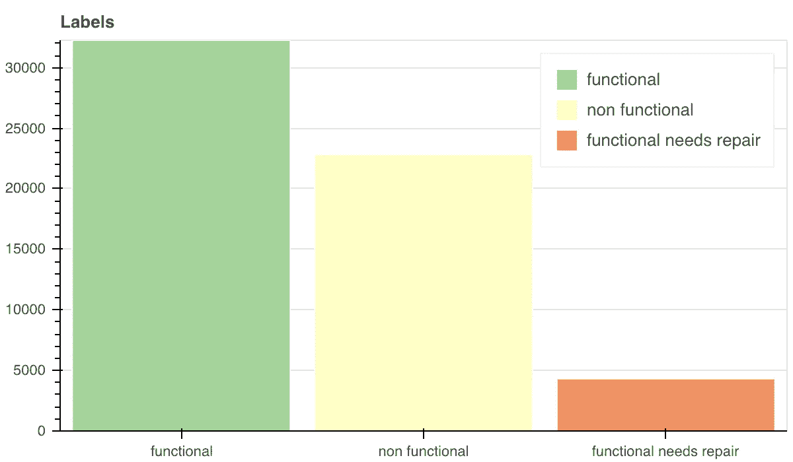

值得注意的是，需要修理的水泵标签数量很少。有几种方法可以缓解阶级不平衡的问题:

*   欠采样
*   过采样
*   什么都不做，使用库的功能来构建模型

让我们看看水泵是如何分布在全国各地的。

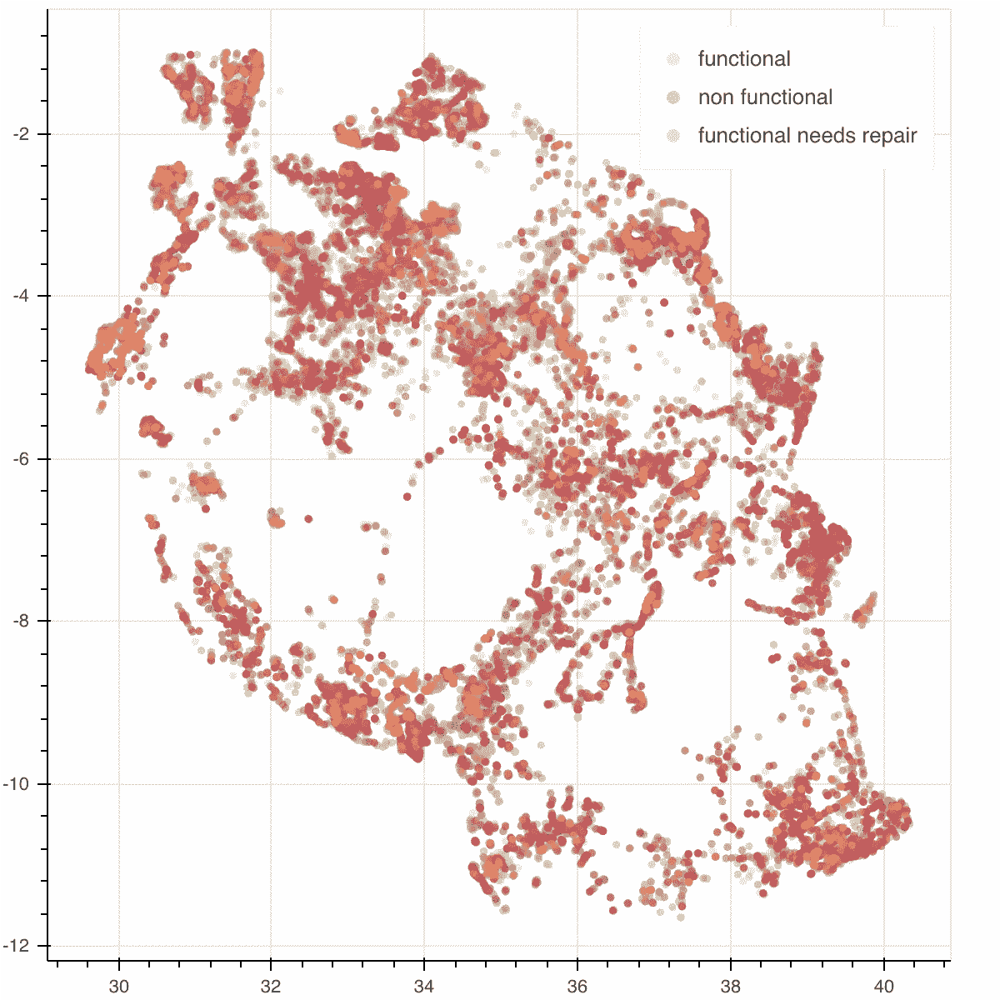

某些要素包含空值。

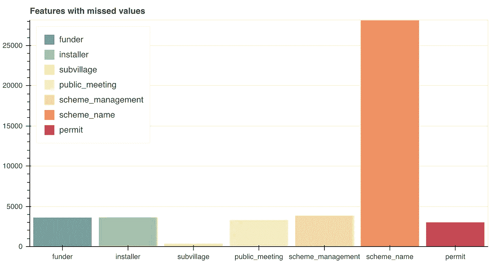

我们可以看到很少几行有缺失值，其中 *scheme_name* 的数量最多。

下面的热图表示变量之间的存在/不存在关系。值得注意的是*许可证、安装方*和*出资方*之间的相关性。

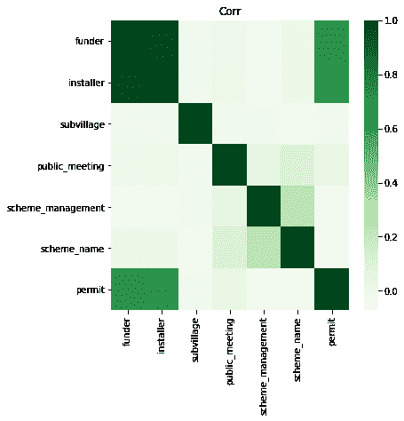

让我们在树状图上看到这些关系的概貌。

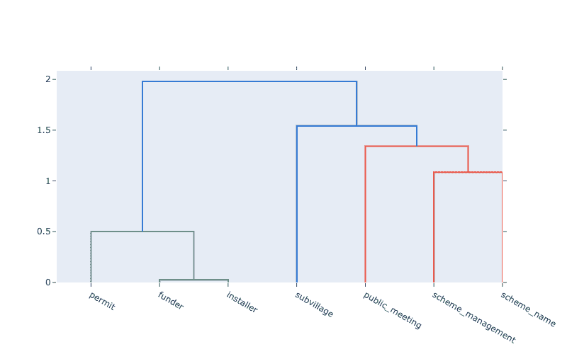

在水泵的特性中，有一项是显示水量的。我们可以检查水量与泵的状况( *quantity_group)* 之间的关系。

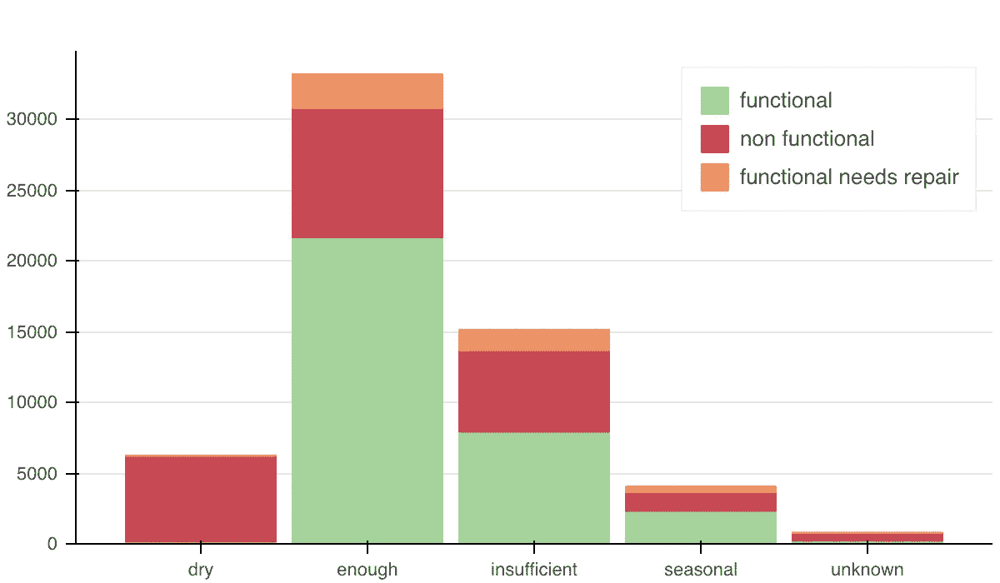

可以看出，有许多水量充足的井没有发挥作用。从投资效率的角度来看，把重点放在修复这个特殊群体放在第一位是合乎逻辑的。此外，观察到大多数干式泵不工作。通过找到一种解决方案，让这些井再次充满水，它们可能会发挥作用。

水质会影响水泵的状况吗？我们可以看到按 *quality_group* 分组的数据。

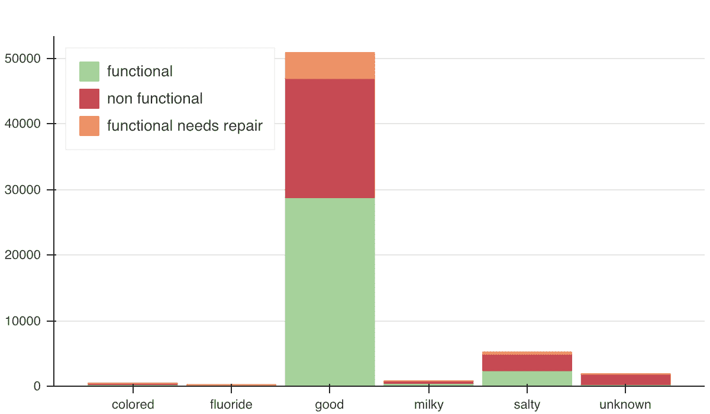

不幸的是，这个图表提供的信息不多，因为优质水源的数量占优势。让我们试着只对水质较差的水源进行分组。

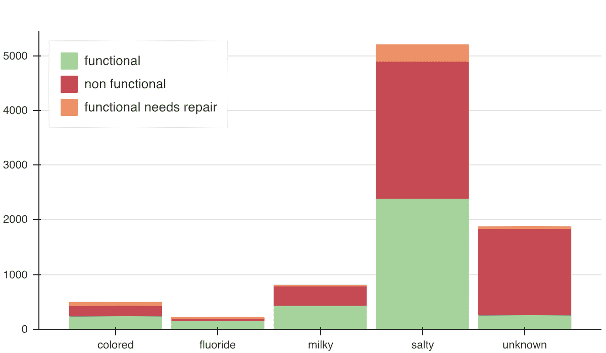

大多数质量组未知的泵无法运行。

水点还有另一个吸引人的特征——它们的类型( *waterpoint_type_group* )。

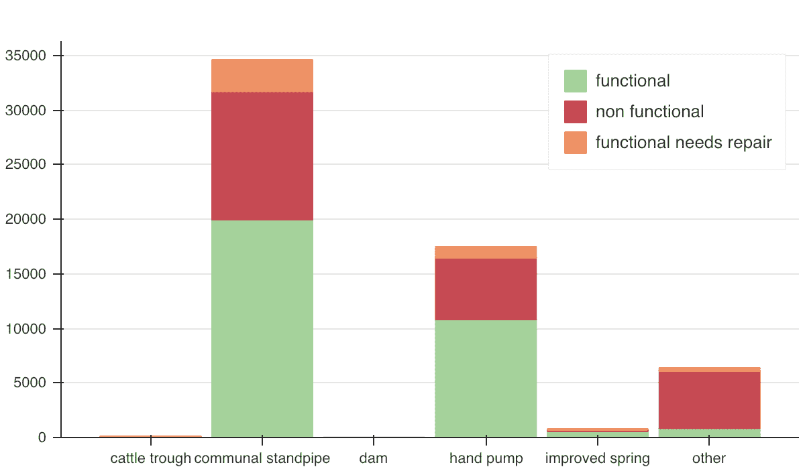

通过 waterpoints 对数据的分析表明，带有*其他*类型的组包含许多不工作的泵。它们过时了吗？我们可以检查泵的制造年份。

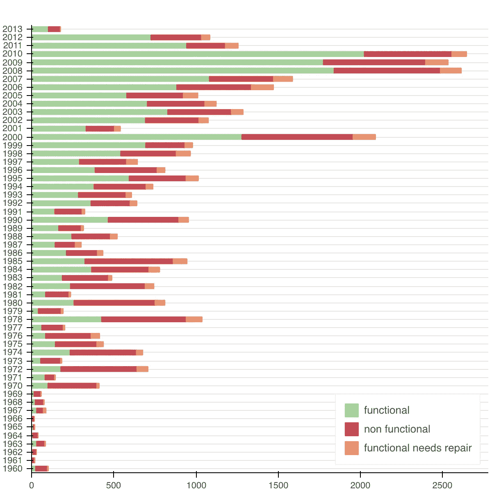

一个合理的预期结果——供水点越老，它不起作用的可能性就越大，大多数是在 80 年代以前。

现在，我们将尝试从有关资助组织的信息中获得见解。井的状况应与资金相关。只考虑那些资助超过 500 个水点的组织。

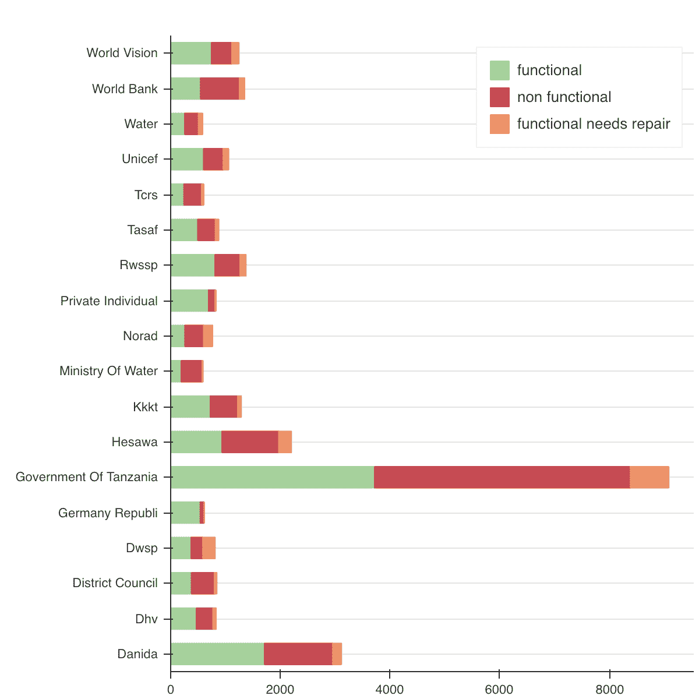

丹麦国际开发署——坦桑尼亚和丹麦在油井资金方面的合作，尽管他们有许多工作用水点，但破损的百分比非常高。RWSSP(农村供水和卫生方案)、Dhv 和其他一些项目的情况类似。应该指出的是，由德意志共和国和私人出资的大部分水井大多处于工作状态。相比之下，大量由国家出资的水井并没有发挥作用。中央政府和区议会设立的大多数供水点也不工作。

让我们考虑这样一个假设:水的纯度和井所属的水池会影响其功能。首先，我们来看看水盆。

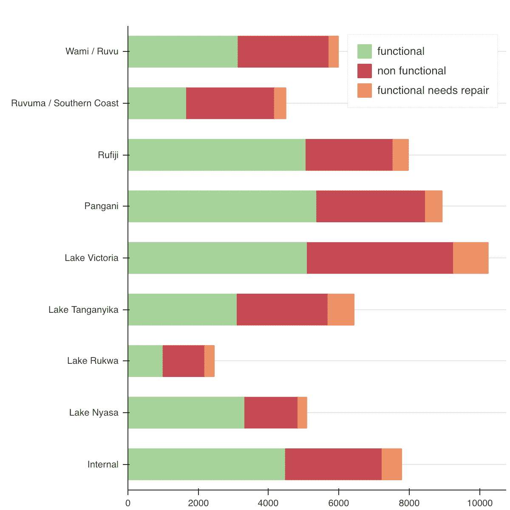

两个盆地非常突出——鲁本和鲁夸湖。那里断水点的数量占大多数。

众所周知，有些井不是免费的。我们可以假设，付款可以积极地影响保持泵正常工作。

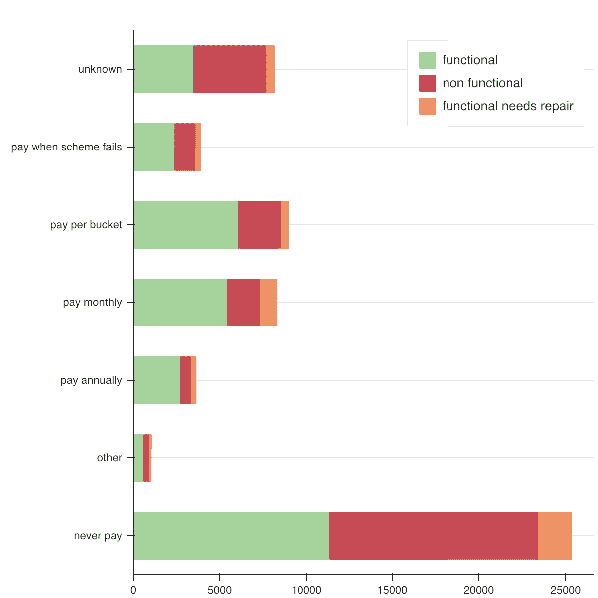

这个假设被完全证实了——支付水费有助于保持水源处于工作状态。

除了分类参数之外，数据还包含数字信息，我们可以查看这些信息，也许会发现一些有趣的东西。

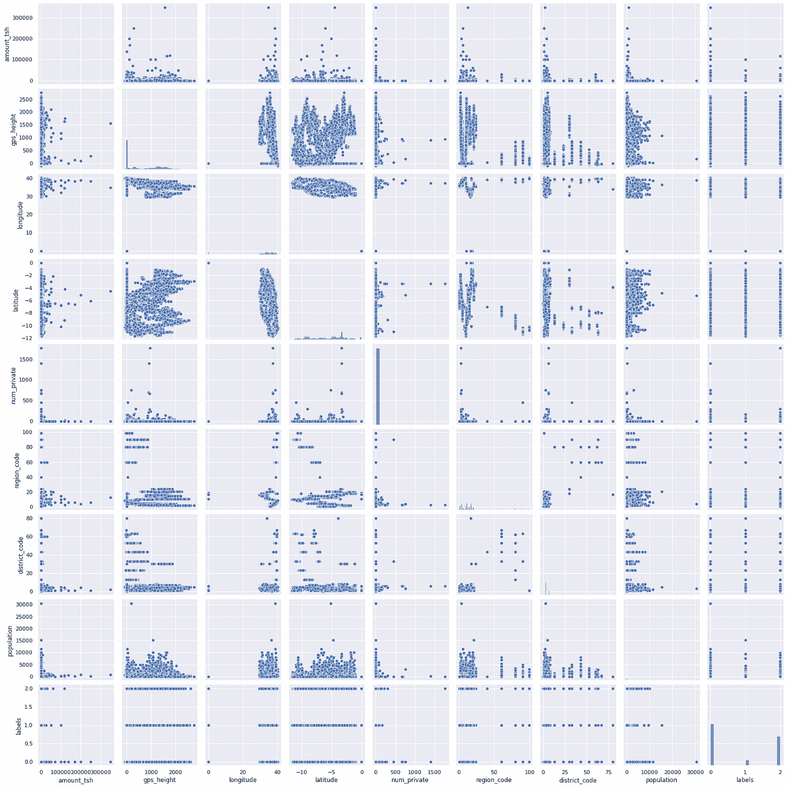

部分数据填充了 0 值，而不是真实数据。我们还可以看到 *amount_tsh* 在可工作的水点(label = 0)更高。此外，您应该注意 *amount_tsh* 特性中的异常值。作为一个特征，人们可以注意到海拔的差异，以及相当一部分人口生活在平均海平面以上 500 米的事实。

# 数据清理

在开始创建模型之前，我们需要清理和准备数据。

*   *安装程序*功能包含许多不同大小写、拼写错误和缩写的重复内容。让我们先把所有的东西都用小写字母。然后，使用简单的规则，我们减少错误的数量，并进行分组。
*   清理后，我们用“其他”项目替换出现次数少于 71 次(0.95 分位数)的任何项目。
*   我们通过类比*出资方*特征来重复。截止阈值是 98。
*   数据包含类别非常相似的要素。让我们只选择其中之一。由于数据集中没有太多的数据，我们将该特征保留为最小的类别集。删除*方案 _ 管理、数量 _ 组、水质、支付 _ 类型、提取 _ 类型、用水点 _ 类型 _ 组、区域 _ 代码。*
*   将异常值的*纬度*和*经度*值替换为相应*区域代码的中值。*
*   替换缺失值的类似技术适用于*子列*和*方案名称*。
*   *public_meeting* 和 *permit* 中的缺失值被替换为中间值。
*   对于*子监督*、*公开 _ 会议*、*方案 _ 名称*、*允许、*我们可以创建不同的二进制特征来显示缺失值。
*   *方案 _ 管理*、*数量 _ 组*、*水质 _ 质量*、*地区 _ 编码*、*支付 _ 类型*、*提取 _ 类型*、*用水点 _ 类型 _ 组*、*日期 _ 记录*、*_ 记录者*可以删除，不是重复信息就是无用。

# **造型**

该数据包含大量的分类特征。最适合获得基线模型的，在我看来是 [CatBoost](https://catboost.ai/) 。这是一个高性能的开源库，用于决策树的梯度提升。

我们不会选择最优参数，让它成为家庭作业。让我们写一个函数来初始化和训练模型。

```
def fit_model(train_pool, test_pool, **kwargs):
    model = CatBoostClassifier(
        max_ctr_complexity=5,
        task_type='CPU',
        iterations=10000,
        eval_metric='AUC',
        od_type='Iter',
        od_wait=500,
        **kwargs
    )return model.fit(
        train_pool,
        eval_set=test_pool,
        verbose=1000,
        plot=False,
        use_best_model=True)
```

对于评估，选择 AUC 是因为数据是高度不平衡的，这种指标是这种情况下最好的。

对于目标度量，我们可以写我们的函数。

```
def classification_rate(y, y_pred):
    return np.sum(y==y_pred)/len(y)
```

由于数据很少，因此将数据集分成*训练*和*验证*部分并不重要。在这种情况下，最好使用 OOF (Out-of-Fold)预测。我们不会使用第三方库；让我们试着写一个简单的函数。请注意，将数据集分割成折叠必须分层。

```
def get_oof(n_folds, x_train, y, x_test, cat_features, seeds): ntrain = x_train.shape[0]
    ntest = x_test.shape[0]  

    oof_train = np.zeros((len(seeds), ntrain, 3))
    oof_test = np.zeros((ntest, 3))
    oof_test_skf = np.empty((len(seeds), n_folds, ntest, 3)) test_pool = Pool(data=x_test, cat_features=cat_features) 
    models = {} for iseed, seed in enumerate(seeds):
        kf = StratifiedKFold(
            n_splits=n_folds,
            shuffle=True,
            random_state=seed)          
        for i, (train_index, test_index) in enumerate(kf.split(x_train, y)):
            print(f'\nSeed {seed}, Fold {i}')
            x_tr = x_train.iloc[train_index, :]
            y_tr = y[train_index]
            x_te = x_train.iloc[test_index, :]
            y_te = y[test_index]
            train_pool = Pool(data=x_tr, label=y_tr, cat_features=cat_features)
            valid_pool = Pool(data=x_te, label=y_te, cat_features=cat_features)model = fit_model(
                train_pool, valid_pool,
                loss_function='MultiClass',
                random_seed=seed
            )
            oof_train[iseed, test_index, :] = model.predict_proba(x_te)
            oof_test_skf[iseed, i, :, :] = model.predict_proba(x_test)
            models[(seed, i)] = modeloof_test[:, :] = oof_test_skf.mean(axis=1).mean(axis=0)
    oof_train = oof_train.mean(axis=0)
    return oof_train, oof_test, models
```

为了减少对分裂随机性的依赖，我们将设置几个不同的种子来计算预测。

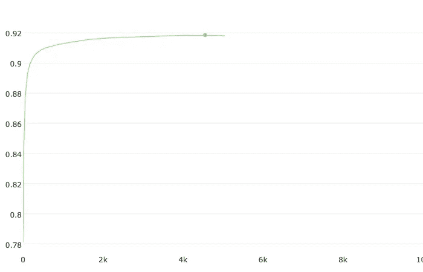

其中一个折叠的学习曲线

学习曲线看起来令人难以置信的乐观，模型应该看起来不错。

考虑到模型特性的重要性，我们可以确保没有明显的漏洞。

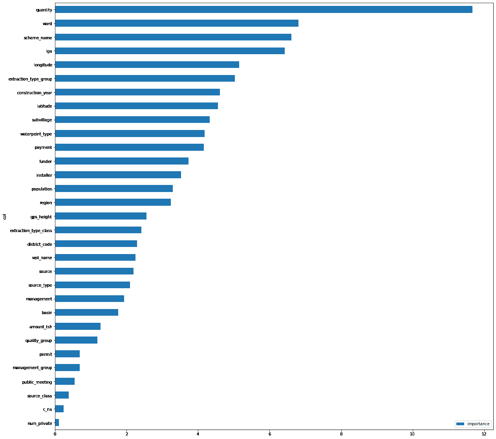

其中一个模型中的特征重要性

平均预测后:

```
*balanced accuracy: 0.6703822994494413
classification rate: 0.8198316498316498*
```

这个结果是在比赛网站上传预测时得到的。

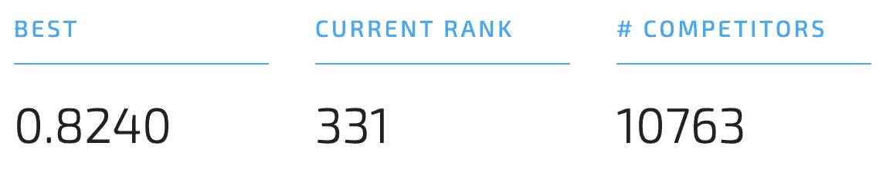

考虑到在撰写本文时，top5 的结果仅提高了大约 0.005，我们可以说基线模型是好的。

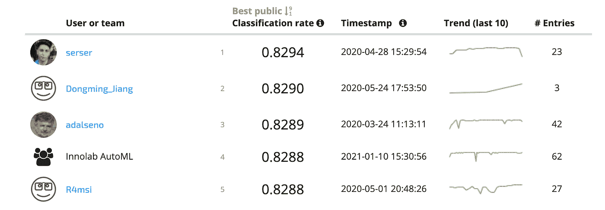

# **总结**

在这个故事中，我们:

*   熟悉数据，寻找能够引发特征生成想法的见解；
*   清理和准备提供的数据以创建模型；
*   决定使用 CatBoost，因为大部分特征是分类的；
*   为 OOF 预测编写了一个函数；
*   获得了基线模型的优秀结果。

正确的数据准备方法和选择正确的工具来创建模型，即使不增加额外的功能，也能产生很好的结果。

作为一项家庭作业，我建议添加新的功能，选择模型的最佳参数，使用其他库进行梯度增强，并从结果模型中构建集成。

文章中的代码可以在这里查看[。](https://github.com/sagol/pumpitup/blob/main/oof_model.ipynb)