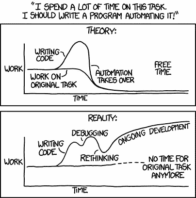
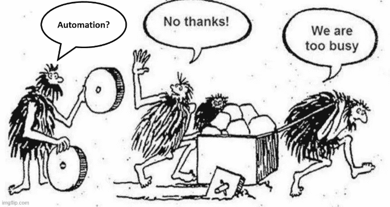

# 纯粹主义者与实用主义者——为什么我们都同意自动化

> 原文：<https://towardsdatascience.com/purist-v-pragmatist-why-we-can-both-agree-on-automation-cc2f011fd34a?source=collection_archive---------31----------------------->

## 我们都在努力寻找可持续的解决方案，然而我们却坐在意大利面条式的代码上，我们的未来不可避免地…意大利面条式的代码在云中。


拉夫(拉维)凯登在 [Unsplash](https://unsplash.com?utm_source=medium&utm_medium=referral) 上的照片

我们见过这两个人物。喜欢对“未来数据管道”、“现代数据架构”、“最佳实践”进行理论化的纯粹主义者，都被 PowerPoint 巧妙地置于死地。他是一个真正坚持规则的人。让我们称他为固执的史蒂夫。您满怀期待地等待着下一次架构会议，届时您将会对我们接下来要实现的内容感到激动和惊讶。另一方面，英雄、实干家、在凌晨 2 点工作以将数据投入生产的人(或女孩)。姑且称她为务实审慎。她能编辑的是一个完全不同(也更可怕)的幻灯片。把她所知道的放进 PowerPoint，快速浏览一下，你可能会得到类似韦斯·克雷文电影的东西。

这两个人不会深情地谈论对方，至少在私下里不会。

普鲁登斯指责史蒂夫不能实施务实的解决方案，史蒂夫指责普鲁登斯造成了可怕的不可持续的混乱局面。

我经常发现自己是这两种角色之间的沟通者。作为一名顾问，我曾与许多史蒂夫谈论可持续发展和架构良好的解决方案，但我也曾谨慎地坐在战壕中，负责交付，将解决方案投入生产。在开发和生产的中途，我们似乎有一个模糊地带，在那里我们拿出了胶带。“最佳实践”并不能完成工作。对话慢慢地从“我们需要坚持好的概念设计”转变为“我们需要在下周之前将它投入生产，否则业务将会终止”。在此之前，我们使用锤子和钉子来精心构建史蒂夫提出的解决方案。在这个转折点之后，普律当丝带来了她信任的伙伴，胶带先生。

那么，我们如何朝着同一个方向努力呢？我非常欣赏前同事的一篇文章，关于数据架构师(纯粹主义者)如何会犯错误，以及对交付负责如何是关键的先决条件。这就是让两个角色坐在同一张桌子旁的原因。确保纯粹主义者负责将架构良好的解决方案投入生产，从而为史蒂夫的词汇增加一点实用主义。

既然我们坐在同一张桌子旁，让我们开始说同一种语言。我将把重点放在我相信双方都会同意并欣赏的一个方面……**自动化。**

Steve 会同意，构建模式、寻找可重复的组件和自动化可重复的组件绝对符合纯粹主义者的心态。凭经验，普鲁登斯知道她经常不断地重复某些测试、某些过程，以便提炼、修改并准备好最终的解决方案。

首先，我们需要回答核心问题——什么可以自动化？如果答案是“没什么，因为一切都是定制的”，我真的希望你和我一样颤抖。只要再快速浏览一遍韦斯·克雷文的幻灯片，就能确定你完全被吓到了。

只有可重复的任务可以自动化。我提倡一种不断发现、模板化、模块化和改进模式的环境。持续改进。推动这种文化的是纯粹主义者的角色，而测试任何新模式以确保其可行性的是实用主义者的角色。正如对交付负责会让史蒂夫更多地参与，一点点总体责任会迫使谨慎变得谨慎，并成为自动化的倡导者。

在这一点上，史蒂夫确信无疑。我们唯一需要说服普鲁登斯的是，尽管目前一切都是定制的，但其中隐藏着可重复的模式。谨慎需要确凿的事实和例子，我现在不会详细说明，但可能是一个很好的后续主题。

自动化的反对者通常会分享这样的画面:



图片来源:[xkcd.com](https://xkcd.com/1319/)

他们并没有完全错。这就是迷因的现实。它们之所以有趣，只是因为其中有一定的真实性。

自动化需要大量的训练。如果你没有纪律性，一旦时间压力出现，你总是会退回到以前的方式。比起不做英雄，你肯定更讨厌低效和重复的工作。

停下来反省一下——问问自己 ***我讨厌低效率吗？*对我自己来说，我会这样重新表述这个问题:我是否不断地发现自己处于这样一种情况下:“我真的认为我们几个月前就解决了这个问题，为什么我们又在想这个问题？”这种感觉让我心烦意乱，它让我烦躁不安，让我恼火，让我讨厌。那些曾与我共事的人知道，在这个阶段，我变得极其迂腐，几乎像机器人一样。必须的。求解。效率低下。现在。**

建立基础的时间可能比预期的要长，可重复模式的识别和模板化将比第一次手工做的时间要长。也许是第二次，也许是第三次，也许…好吧，好吧，你明白我的意思了。沿着这条线的某个地方，自动化将会超过手工，但是只有当你有纪律坚持这个过程。

史蒂夫绝对讨厌低效率，我相信普鲁登斯也是，她可能太喜欢当英雄了。(另一天的主题)。一旦我们在对低效率的憎恨上达成一致，我们需要相信有足够多的低效率是我们可以解决的，隐藏的模式(或明显的模式)是我们可以提取、重复并最终自动化的。不要像下图中的家伙一样，现在腾出时间是为了以后腾出时间。



由 [imgflip](https://imgflip.com/memegenerator/122160104/No-thanks-we-are-too-busy) 生成的图像

另一方面，自动化是不可避免的。我相信来自业务和 IT 的需求创造了足够的动力。数据工程师已经筋疲力尽，呼吁采用更好的方法。我们应该朝着它努力，而不是试图与之斗争，以及如何使它变得更好。

在我与客户的交谈中，数据运营、开发运营、CI/CD 这些术语每次都会出现。自动化是数据运营和开发运营的重要支柱。我不能总是问我的客户这是他们真正需要的还是他们的史蒂夫建议的，但需求是明确的。工具需要能够与詹金斯，GitHub 等集成。一切都应该是可脚本化的。我们希望设计漂亮的前端，但我们希望命令行界面操作和部署。

我们的方法和工具包需要补充我们的文化，而不是相反。我们需要一种训练有素而又务实的文化，并辅以我们的方法和软件。让人们做我们擅长的事情——为有趣的问题提出创造性的解决方案。让计算机做它们擅长的事情——重复和并行处理。

意大利面条代码不需要成为我们的命运。为了找到隐藏的模式，让我们有纪律和纯粹的天真开始解开它。然后务实的去迭代，持续改进知道 100%不是目标。

一天结束时，史蒂夫和普鲁登斯都有他们想花更多时间陪伴的家庭。自动化将有助于实现这一目标。这是他们能达成一致的第二件事。

```
1\. Thomas, J., 2021\. *The rise and fall of data architecture*. [online] ITWeb. Available at: <https://www.itweb.co.za/content/o1Jr5Mx9AxPqKdWL> [Accessed 24 November 2021].
2.WIRE, B., 2021\. *Data Engineers Are Burned Out and Calling for DataOps*. [online] Businesswire.com. Available at: <https://www.businesswire.com/news/home/20211019005858/en/Data-Engineers-Are-Burned-Out-and-Calling-for-DataOps> [Accessed 24 November 2021].
```