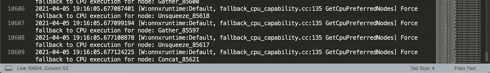

# 使用 ONNX 将 GPT-尼奥(及其他)投入生产

> 原文：<https://towardsdatascience.com/putting-gpt-neo-and-others-into-production-using-onnx-1204541e8ff2?source=collection_archive---------19----------------------->

## 了解如何使用 ONNX 将 torch 和 tensorflow 模型投入生产。将推理速度提高 2.5 倍。


Marc-Olivier Jodoin 在 [Unsplash](https://unsplash.com?utm_source=medium&utm_medium=referral) 上拍摄的照片

**注*:全笔记本可用*** [***此处***](https://github.com/oborchers/Medium_Repo/blob/master/Putting%20GPT-Neo%20into%20Production%20using%C2%A0ONNX/ONNX-Export.ipynb) ***。***

**更新*:如果你在很远的将来(截至 2021 年 4 月)读到这篇文章，那么这篇文章的底层代码可能会因为底层库的变化而被弃用。***

## 介绍

使用变压器已经成为最新 NLP 应用的新标准。想想 BERT 或 GPT3，我们可以有把握地得出结论，几乎所有的 NLP 应用都从类似变压器的模型中受益匪浅。然而，这些模型通常部署起来非常昂贵，并且需要特殊的硬件来运行。在本文中，您将了解什么是 ONNX，以及如何将 torch 和 tensorflow transformers 模型移植到 ONNX。您还将学习如何定制 torch 实现，以及如何在以后导出它。具体来说，我们将了解:

1.  简单导出[Bert-base-nli-stsb-mean-tokens](https://huggingface.co/sentence-transformers/bert-base-nli-stsb-mean-tokens)
2.  自定义导出[Bert-base-nli-stsb-mean-tokens](https://huggingface.co/sentence-transformers/bert-base-nli-stsb-mean-tokens)
3.  用 ORT-CustomOps 导出[通用语句编码器](https://tfhub.dev/google/universal-sentence-encoder-large/5)
4.  试图用 1.3B 参数导出[GPT-尼奥](https://huggingface.co/EleutherAI/gpt-neo-1.3B)

## ONNX 是什么？

当我很久以前开始使用变形金刚时，我的第一次体验是使用[伯特即服务](https://github.com/hanxiao/bert-as-service)。虽然 BaaS 仍然是一个不错的库，但现在在 GPU 上部署自己的模型并为其提供一个小的 REST API 已经相当简单了。通常，这将通过一个或多个框架来完成，如 torch 或 tensorflow。但是这在实践中有严重的局限性。

这就是 ONNX 发挥作用的地方。笔**笔**笔【欧洲】笔**笔**网络**笔**交换的目标是提供不同参与者之间的互操作性。互操作性意味着:

1.  跨框架共享模型(例如，torch 到 tensorflow)
2.  跨各种硬件(例如，CPU、GPU、FPGA 等)共享模型

这对社区有好处。还有你的血压。尝试在同一个 GPU 上使用两个不同的框架部署模型。这是一种痛苦。
(你好黑暗我的老朋友……)

在幕后，ONNX 提供了一种定制的文件格式，这是一种由节点组成的计算图，节点本身由基本操作符组成。ONNX 持有大量深度学习和机器学习相关的核心 op，还提供使用定制 op 的能力。引用他们的[主页](https://onnx.ai/about.html):

> ONNX 提供了可扩展计算图模型的定义，以及内置操作符和标准数据类型的定义。
> 每个计算数据流图被构造为形成非循环图的节点列表。节点有一个或多个输入和一个或多个输出。每个节点都是对一个操作员的调用。该图还有元数据来帮助记录其用途、作者等。

如果你想了解 ONNX 的更多信息，微软和 NVIDIA 有一个非常好的演示，你可以在这里找到。请记住，这个演示文稿来自 2019 年，两年内会有很多变化。

在开始使用 ONNX 之前，有三个主要组件与我们的目的相关:

*   [ONNX](https://github.com/onnx/onnx) :提供图形格式和操作定义
*   [ONNX 运行时](https://github.com/microsoft/onnxruntime):提供可用于在您的硬件上部署模型进行推理的运行时。它包含了 *ExecutionProviders* ，使我们能够使用各种方法加速操作，例如 CPU、Cuda 或 TensorRT。
*   ONNX 运行时工具:提供对已经转换的 ONNX 变压器模型进行额外优化的功能。我们不会在这里使用它，但是请记住它是存在的！

## 预赛

要继续下去，您将需要相当多的库。我建议在开始之前构建自己的 Docker 映像，它支持最新的 NVIDIA 驱动程序，甚至可能支持 TensorRT。

从 NVIDIAs `[nvcr.io/nvidia/tensorrt:20.12-py3](https://docs.nvidia.com/deeplearning/tensorrt/container-release-notes/rel_20-12.html#rel_20-12)` image 开始是个好主意。根据您想走多远，您甚至可能想从头开始构建 ONNXRuntime(推荐)。这是我的 [Dockerfile](https://github.com/oborchers/Medium_Repo/blob/master/onnxruntime-issues/Dockerfile) 你可以用它工作。

这个脚本需要适应您的配置，可能不适合您。它已经在装有 V100 的容器上进行了测试。这个构建让您可以从 ONNX 运行时访问 CPU、CUDA、TensorRT 执行提供程序。我们也在使用最新开发版本的`transformers`库，即`4.5.0.dev0`来访问 get 尼奥。

## 1.简单出口

*注:完整笔记本可用* [***此处***](https://github.com/oborchers/Medium_Repo/blob/master/Putting%20GPT-Neo%20into%20Production%20using%C2%A0ONNX/ONNX-Export.ipynb) *。* 我们要看的第一个模型是来自句子变形金刚[库](https://github.com/UKPLab/sentence-transformers)的`bert-base-nli-stsb-mean-tokens`模型。该型号也可在[轮毂](https://huggingface.co/sentence-transformers/bert-base-nli-stsb-mean-tokens)上获得。它本质上是一个 BERT 模型，被训练来产生良好的句子嵌入，在相似性搜索中也表现良好。为了转换模型，让我们使用`convert_graph_to_onnx`中的变形金刚库中已经可用的方法(参见[这里的](https://github.com/huggingface/transformers/blob/master/src/transformers/convert_graph_to_onnx.py))。用于导出的代码如下所示:

接下来，我们只需要加载模型，创建一个推理会话。此外，我们传递一些会话选项、首选的执行提供程序，并加载导出的模型:

看起来不错！模型正在加载，一切都很好。如果比较速度的话，基本的`nlp`流水线形式`transformers`运行在编码`span="Hello my friends!"`的 *10ms* 左右。这模拟了在线推理，这可能是最常见的用例。另一边，ONNX 型号运行在 *2.8ms* 。这比 V100 增加了**2.5 倍**，只需几行代码，无需进一步优化。请记住，对于批量编码，这些值可能会有很大的不同。

理论上，您现在可以将模型从 [ONNX 运行时工具](https://github.com/microsoft/onnxruntime/tree/master/onnxruntime/python/tools/transformers)放到前面提到的优化器中。但是**注意**:如果您使用`use_gpu=True`运行优化器，那么请确保您安装了 ONNX 运行时**而没有 tensort，**因为如果启用了 tensort 执行提供程序，导出[将不会工作](https://github.com/microsoft/onnxruntime/issues/6080)。

如果仔细观察，您会发现打印语句中生成的形状是错误的。返回的是两个形状为(1，6，768)和(1，768)的数组的列表。理论上，我们期望返回的形状为(1，768 ),因为我们使用的是句子编码器。

这种行为是由于句子转换器库需要在令牌嵌入之上的管道中添加一个额外的平均池层。说实话，如果我们想要一个统一的部署框架，并且不要在事后摆弄 numpy 或 torch，那么事后添加层并不是一个优雅的解决方案，这违背了我们的目的。

在我们检查自定义导出之前，让我们先来看看基准:

*   SentenceTransformer CUDA:每个循环 12.3 毫秒 1.4 毫秒(平均池化)
*   ONNX CUDA (V100):每循环 2.21 毫秒 77 秒
*   ONNX tensort(V100， [ExecutionProvider](https://github.com/microsoft/onnxruntime-openenclave/blob/openenclave-public/docs/execution_providers/TensorRT-ExecutionProvider.md) ):每个循环 3.86 ms 181 s

坦率地说，我们在这里看到的结果很奇怪。我已经在这里开了一个问题[，因为我无法从 TensorRT 得到任何加速。](https://github.com/microsoft/onnxruntime/issues/7230)

## 2.定制出口

添加自定义层需要我们理解所使用的`convert`函数内部发生了什么。剧透:这很简单(对 pytorch 来说)。 [convert](https://github.com/huggingface/transformers/blob/335c0ca35c159f88d73198bdac928e61a4d480c7/src/transformers/convert_graph_to_onnx.py#L277) 函数调用两个方便的函数，即`transformers.pipeline`对象上的`infer_shapes`和`ensure_valid_input`。之后，所有推断出的形状加上产生的`torch.nn.Module`对象被传递给`torch.onnx.export`函数。文档提供了一个关于如何正确使用导出功能的很好的例子。对于理解导出函数来说，最重要的是以下参数:

1.  input_names:底层 torch 模型的`forward`函数的参数。必须按正确的顺序。
2.  输出名称:输出图层的名称。
3.  dynamic_axes:定义哪些是动态的，以及它们以何种方式是动态的(将来会更有意义)。
4.  参数:将通过模型的一组示例输入。

这些参数是从上面提到的便利函数中导出的。所以让我们快速地把它们包起来，这样我们就可以随心所欲地摆弄它们了:

将`print_transformers_shape_inference`应用于感兴趣的 BERT 模型，我们得到以下形状:

```
Inferred shapes for sentence-transformers/bert-base-nli-stsb-mean-tokens
Input names: ['input_ids', 'token_type_ids', 'attention_mask']
Output names: ['output_0', 'output_1']
Dynamic Axes:
{
    "attention_mask": {
        "0": "batch",
        "1": "sequence"
    },
    "input_ids": {
        "0": "batch",
        "1": "sequence"
    },
    "output_0": {
        "0": "batch",
        "1": "sequence"
    },
    "output_1": {
        "0": "batch"
    },
    "token_type_ids": {
        "0": "batch",
        "1": "sequence"
    }
}
Tokens:{
    'input_ids': tensor([[ 101, 2023, 2003, 1037, 7099, 6434,  102]]), 
    'token_type_ids': tensor([[0, 0, 0, 0, 0, 0, 0]]),  
    'attention_mask': tensor([[1, 1, 1, 1, 1, 1, 1]])
}
Ordered input names: ['input_ids', 'attention_mask', 'token_type_ids']
Arguments: (
    tensor([[ 101, 2023, 2003, 1037, 7099, 6434,  102]]), 
    tensor([[1, 1, 1, 1, 1, 1, 1]]), 
    tensor([[0, 0, 0, 0, 0, 0, 0]])
)
```

通过一些解释，这完全说得通。`output_0`引用`pooler_output`，`output_1`引用返回的`BaseModelOutputWithPoolingAndCrossAttention`的`last_hidden_state`。`input_ids`、`token_type_ids`和`attention_mask`都是动态的，并且是记号赋予器函数的输出。

让我们继续建立一个简单的 torch 模型，它继承了 BERT 模型。我们唯一增加的是令牌嵌入的加权求和以及防止零除误差的箝位。

最后检查一下，模型产生的输出与原始模型大致相同，我们可以继续了。

在导出我们的新模型之前，唯一要做的事情是修改我们之前导出的`dynamic_axes`和`output_names`。这是因为我们现在有了一个不同的输出层，它也是动态的(根据批处理大小)。我们可以使用身份层的名称来更好地识别输出层。

太好了！现在，我们已经准备好了新的 ONNX 模型，可以用它进行推理了。输出形状现在是(1，768)预期的形状，几乎等于原始模型，绝对公差为 1e-6。此外，新模型运行在*2.4 毫秒*，所以我们没有失去任何速度，并获得了一个适当的端到端模型。

很明显，这个过程可以根据你的喜好进行定制。也可以在此基础上训练自己的分类器，并以同样的方式将其添加到编码器中。

我们已经创建了前两个 ONNX 模型。干得好！让我们做点不同的事情。

## 3.使用 ort 自定义操作进行导出

这一部分特别关注[通用句子编码器 5](https://tfhub.dev/google/universal-sentence-encoder-large/5) ，这是一个我长期以来一直在使用的模型，我非常喜欢它。它速度快，性能好，而且相对较小。谢天谢地，有了`tf2onnx`T10 库。`tf2onnx`是一个从 tensorflow 模型生成 ONNX 文件的导出工具。由于使用 tensorflow 总是令人愉快的，我们不能直接导出模型，因为模型定义中包含了标记器。不幸的是，核心 ONNX 平台还不支持这些字符串操作。

幸运的是，ONNXRuntime CustomOps [库](https://github.com/microsoft/ort-customops)来帮忙了。该库也由 ONNX 团队维护，并为扩展 ONNX 基本功能的额外自定义操作提供支持。您将需要安装 CMake > 3.17.0，以便使用`pip install git+https://github.com/microsoft/ort-customops.git`编译和安装该文件。

安装完 CustomOps 库后，我们[将](https://tfhub.dev/google/universal-sentence-encoder-large/5)USE 下载到某个文件夹，并为`tf2onnx`库提供一个输出路径。除此之外，我们可以直接导出模型:

`tf2onnx`库提供了一些其他的强大功能。例如，`--signature_def`参数允许您部分导出具有多个签名的模型，例如[使用 v3](https://tfhub.dev/google/universal-sentence-encoder-qa/3) 进行 QA。点击查看参数[。](https://github.com/onnx/tensorflow-onnx/blob/master/tf2onnx/convert.py)

由于底层图形和额外 Ops 的不同，现在运行使用的推理略有不同。我们必须将自定义 Ops 库路径传递给 ONNX SessionOptions 对象。

我们剧目中的另一个模特:-)

## 4.试图导出[GPT-尼奥](https://huggingface.co/EleutherAI/gpt-neo-1.3B)

现在我们开始真正有趣的东西。GPT-尼奥刚刚在变形金刚图书馆发布。它本质上是 OpenAI 的 GPT3 架构的开源变体。[型号](https://github.com/EleutherAI/gpt-neo)有两种架构:1.3B 和 2.7B，代表内部参数的数量。这些型号可通过[型号中枢](https://huggingface.co/EleutherAI)获得。注意:从今天起你需要`transformers-4.5.0.dev0`，因为 GPT-尼奥不包括在当前的 Pypi 包中。

我们从复制本教程第 2 步中的简单导出开始。这可能有点奇怪，可能不适合您的环境，因为这一步丢弃了所有输出，除了`logits`。但是我们可以看到一些真实世界的数字，在真实硬件上的推理速度。截至发布日期(2021 年 4 月 5 日),变形金刚库提供的完整形状推断似乎没有达到预期效果，因此我们需要稍微调整一下。我们只在它周围包装一个自定义层，返回逻辑。加载模型需要 3 分钟，因为我们必须使用外部数据格式来补偿大的模型大小。再次运行之前的相同推理:

*   变形金刚 CUDA:每循环 114 毫秒 20 毫秒
*   ONNX CUDA (V100):每循环 314 毫秒 4.15 毫秒
*   ONNX TensorRT (V100， [ExecutionProvider](https://github.com/microsoft/onnxruntime-openenclave/blob/openenclave-public/docs/execution_providers/TensorRT-ExecutionProvider.md) ):初始化时出现异常:/workspace/ONNX runtime/ONNX runtime/core/providers/tensor rt/tensor rt _ execution _ provider . cc:777 subgraph collection _ t ONNX runtime::TensorrtExecutionProvider::getsupported list(subgraph collection _ t，int，int，const ONNX runtime::graph viewer&，bool *)const[ONNXRuntimeError]:1:FAIL:tensor rt input:67

好吧，所以，这是相当不满意的。我不想让您失望，但是我想在我们能够正确地导出模型之前，模型中还有更多的优化工作要做。对我来说，不清楚是什么导致了这个问题。但是，如果我们查看日志，我们可以看到正在发生的事情:

> 在 Op 类型的注册表中找不到 CUDA 内核:Pad 节点名:Pad_4368
> 在 Op 类型的注册表中找不到 CUDA 内核:Pad 节点名:Pad_3801
> 在 Op 类型的注册表中找不到 CUDA 内核:LessOrEqual 节点名:LessOrEqual_7094
> 强制回退到节点的 CPU 执行:Gather_5
> 强制回退到节点的 CPU 执行:Unsqueeze_17
> 强制回退到节点的 CPU 执行:Slice_37
> 强制

这些信息成千上万。我们总共有 10609 条这样的消息:



这里的关键是:导出到 ONNX 是一件好事。如果你的模型不使用那么多目前不支持的操作，那么它们中的许多运行在一个 CPU 上。虽然总的来说这不容易避免，但是优化一个模型从它的第一行代码开始。从一开始就记住你想如何优化它。与失踪的 Ops 生命相关的问题[在这里](https://github.com/microsoft/onnxruntime/issues/7238)。

## 结论

在本文中，我们深入探讨了 ONNX 以及如何从 pytorch 和 tensorflow 中导出模型。您现在可以直接从 pytorch 定制和导出模型。您还可以将 tensorflow 模型从带有自定义 ops 的检查点导出到 ONNX。此外，您还学会了沿途寻找特殊案例。

## 附加说明

本帖笔记本 [***此处***](https://github.com/oborchers/Medium_Repo/blob/master/Putting%20GPT-Neo%20into%20Production%20using%C2%A0ONNX/ONNX-Export.ipynb) 。

## 文学

1.  ONNX 主页:[https://onnx.ai/about.html](https://onnx.ai/about.html)