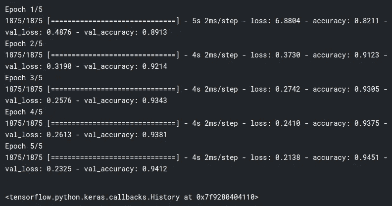

# 将您的模型投入生产

> 原文：<https://towardsdatascience.com/putting-your-models-into-production-5ae3191722b9?source=collection_archive---------38----------------------->

## 使用 TensorFlow 服务将深度学习模型投入生产的指南


来源( [Unsplash](https://unsplash.com/) )

你已经辛苦工作了无数个小时，试图让你的模型恰到好处。您已经努力清理了数据，精心设计了特性，并尽最大能力调整了超参数。一切终于就绪，现在您可以向全世界展示您的模型了。只有一个问题:您的模型被困在您的本地机器中，无法访问外部世界。

这就是大多数机器学习模型的命运。事实上，大约 87%的产品从未投入生产。大量的资源(更不用说宣传了)投入到实际的模型构建过程中，但实际上，这仅占用数据科学家大约 14%的时间。一个经常被忽视的步骤是将这些模型实际部署到生产中。本文将关注服务于的 [Tensorflow，这是一个用于将 Tensorflow 模型部署到生产中的系统。](https://github.com/tensorflow/serving)

**张量流发球**

使用 TensorFlow 服务的最简单方法是使用 Docker 图像。Docker 是一个开发、运输和运行应用程序的平台；使得用很少的设置快速传递内容成为可能。如果您在本地机器上安装了 Docker，您可以通过在终端上运行以下命令来下载映像:

```
docker pull tensorflow/serving
```

否则可以去 [Docker 网站](https://docs.docker.com/get-docker/)获取。

由于我们不会关注模型构建过程，因此我们将使用 Keras 创建一个简单的序列模型，并在 MNIST 数据集上进行训练。

带有一个隐藏层的简单模型。

**模特培训**

定义模型后，让我们使用`sparse_categorical_crossentropy`作为我们的损失、`adam`作为我们的优化器、`accuracy`作为我们的度量来编译它。

编译模型。

最后，让我们在模型上调用`fit`方法来拟合我们的数据，对它进行 5 个时期的训练，并传入测试图像作为验证数据。

使模型符合数据。



模型训练输出。

训练完模型后，我们将把它保存到机器上指定的导出路径中。

保存训练好的模型。

上面我们创建了一个`MODEL_DIR`变量和一个版本号来跟踪我们的模型版本。如果我们想要在将来更新我们模型的版本，我们可以在保存它的时候改变版本号。在这种情况下，我们的模型将保存在名为`mnist_model/1`的目录中。如果我们检查这个目录，我们会看到一个`saved_model.pb`文件和一个`variables`文件夹。

`saved_model.pb`文件是一个 protobuf 文件，存储实际的 Tensorflow 模型。`variables`目录包含一个[训练检查点](https://www.tensorflow.org/guide/checkpoint)，用于重新加载保存的模型。

**运行我们的 Docker 容器**

之后，我们将在机器上运行 docker 命令来服务模型。

用 docker 服务模型。

这里发生了很多事情，所以让我们进一步分解这个命令。

*   **docker** -运行 docker 的命令。
*   **运行** -在新容器中运行命令。
*   **-p 8501:8501** -在特定端口上运行 docker 命令(在我们的例子中，容器上的端口 8501 将被映射到主机上的端口 8501)。
*   **- mount type=bind，source=…，target=…** - 这将模型从我们的本地机器挂载到容器中。我们指定了一个`source`和一个`target`，前者是模型在本地机器上的绝对路径，后者是我们希望模型放在容器中的位置。
*   **-e MODEL _ NAME**-**这里我们设置一个环境变量，当我们执行 [REST](https://en.wikipedia.org/wiki/Representational_state_transfer) 请求时，我们将使用它来调用我们的模型。模型名称可以是您想要的任何名称。**
*   ****-t tensor flow/serving**-**这是我们指定想要使用的图像的地方。这里我们使用之前下载的`tensorflow/serving`图片。****

****运行该命令后，请务必等待，直到您在终端上看到如下消息:****

```
**2021-04-13 02:25:32.041325: I tensorflow_serving/model_servers/server.cc:391] Exporting HTTP/REST API at:localhost:8501 ...**
```

******做出推理请求******

****然后，带有我们模型的容器将在我们机器的端口 8501 上运行。此时，我们已经准备好发送对新数据进行预测的请求。我们可以编写一个简单的 python 脚本来发送 POST 请求并进行预测。****

****发送进行新预测的请求。****

****我们创建一个 JSON 变量，包含测试数据中的前 10 幅图像。在此之后，我们使用`requests`库发送 post 请求并获得数据预测。然后，我们将模型预测与地面实况标签进行比较，并查看模型是否按预期执行。我们已经使用 TensorFlow 服务成功部署了我们的模型！****

******结论******

****我们讨论了使用 TensorFlow 服务的模型部署。通过使用 Docker 映像，我们可以轻松地在容器中部署我们的模型，而不是在本地安装 TensorFlow 服务。一旦我们训练了我们的模型，让我们的容器启动并运行，我们就使用 python 脚本对新数据的预测进行 post 请求。****

****感谢您的阅读！****

****您可以通过以下渠道与我联系:****

*   ****[中等](https://zito-relova.medium.com/)****
*   ****[LinkedIn](https://www.linkedin.com/in/zrelova/) 。****
*   ****[Github](https://github.com/zitorelova)****
*   ****[卡格尔](https://www.kaggle.com/zitorelova)****