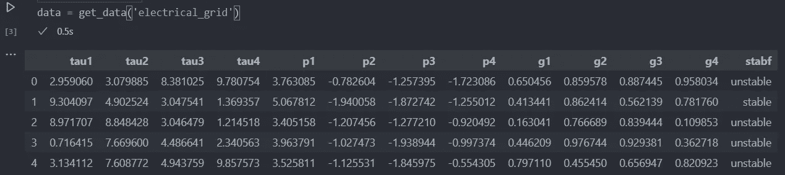
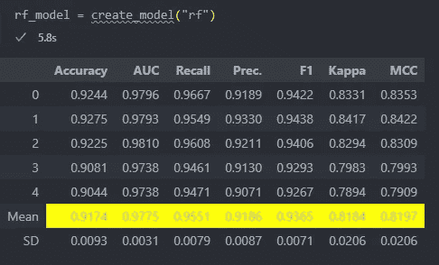
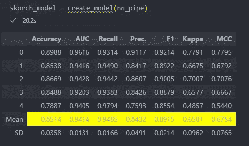
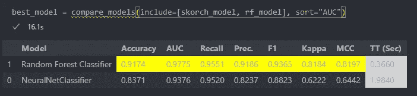
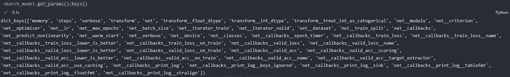
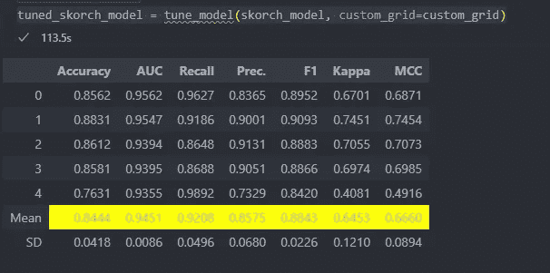
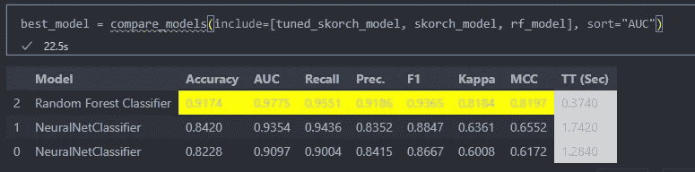

# PyCaret + SKORCH:使用最少的代码构建 PyTorch 神经网络

> 原文：<https://towardsdatascience.com/pycaret-skorch-build-pytorch-neural-networks-using-minimal-code-57079e197f33?source=collection_archive---------9----------------------->

## 用 Pycaret 构建 PyTorch 神经网络的低代码指南


照片由 [Danist Soh](https://unsplash.com/@danist07?utm_source=unsplash&utm_medium=referral&utm_content=creditCopyText) 在 [Unsplash](https://unsplash.com/s/photos/build?utm_source=unsplash&utm_medium=referral&utm_content=creditCopyText) 上拍摄

几乎在每个机器学习项目中，我们都训练和评估多个机器学习模型。这通常涉及编写多行导入、许多函数调用、打印语句来训练单个模型并比较模型间的结果。当用交叉验证循环比较不同的模型或者组装模型时，代码变得一塌糊涂。随着时间的推移，当我们从分类模型转移到回归模型时，情况会变得更加混乱，反之亦然。我们最终将代码片段从一个地方复制到另一个地方，造成混乱！我们可以通过导入 [PyCaret](https://pycaret.org/) 轻松避免这种混乱！

PyCaret 是一个低代码的机器库，它允许你在给定一个回归或分类问题的情况下，通过一个统一的 API 来创建、训练和测试 ML 模型。PyCaret 还提供了机器学习项目中的各种步骤，从数据准备到模型部署，只需最少的代码。它可以与遵循 Scikit-Learn API 的任何模型/库一起工作，如 Scikit-Learn Models、Xgboost、LightGBM、CatBoost 等。总而言之，该库是一个易于使用的生产力助推器，可以实现快速实验，并帮助您更多地关注手头的业务问题。

现在，如果您想将神经网络添加到您的待试模型列表中，该怎么办？，您需要用 PyTorch 之类的框架编写用于训练和测试循环的代码片段，将 NumPy 数组转换为张量，或者反过来让现有的东西工作或编写一套全新的评估函数。一个小的类型错误最终会改变你已经写好的代码的一部分，这可能会产生更多你没有预料到的问题。您最终会花更多的时间更新代码，而不是尝试不同的模型和解决问题。

如果您可以将相同的 PyCaret 与神经网络一起使用，只需进行非常小的更改，会怎么样？

是的，你没听错！SKORCH 让这一切成为可能！SKORCH 是 PyTorch 的 Scikit-Learn 包装器，它使得用类似 sklearn 的 API 训练神经网络成为可能，这正是 PyCaret 所期望的！

许多参考资料都在解释如何使用 [Pycaret 用一行代码构建 ML 模型](https://pycaret.readthedocs.io/en/latest/tutorials.html)！以及使用 [SKORCH 构建神经网络](https://skorch.readthedocs.io/en/latest/user/tutorials.html)的教程和示例。建议在进入本博客的下一部分之前浏览这些教程。这个包含代码的[笔记本](https://github.com/pranaymodukuru/pycaret-with-skorch/blob/main/pycaret-skorch-example.ipynb)可以并行引用。

在这篇博客中，我们将看到

*   如何使用 SKORCH 建立神经网络
*   如何用 PyCaret 训练神经网络
*   如何用 PyCaret 调整神经网络

在这些步骤中，我们还将看到如何使用 PyCaret 的 oneliners 将神经网络的性能与其他模型进行比较。

在本教程中，我们将使用“electrical_grid”数据集。这是一个包含 12 个输入特征和一个目标变量的二元分类问题。该数据集在 PyCaret 自带的内置数据集中可用，可以通过导入和调用 get_data 函数来访问，如下所示

```
from pycaret.datasets import get_data
data = get_data('electrical_grid')
```

笔记本中的输出应该是这样的，



PyCaret 的电网数据(图片由作者提供)

# 如何用 SKORCH 构建神经网络

## PyTorchModel

斯科奇与 PyTorch 模型合作；我们可以创建一个简单的模型，就像使用纯 PyTorch 时一样。我们将构建一个如图所示的三层 MLP，第一层有 12 个输入，因为数据中有 12 个要素，两个类都有两个输出。

```
import torch.nn as nnclass Net(nn.Module):
    def __init__(self, num_inputs=12, num_units_d1=200, num_units_d2=100):
        super(Net, self).__init__() self.dense0 = nn.Linear(num_inputs, num_units_d1)
        self.nonlin = nn.ReLU()
        self.dropout = nn.Dropout(0.5)
        self.dense1 = nn.Linear(num_units_d1, num_units_d2)
        self.output = nn.Linear(num_units_d2, 2)
        self.softmax = nn.Softmax(dim=-1) def forward(self, X, **kwargs):
        X = self.nonlin(self.dense0(X))
        X = self.dropout(X)
        X = self.nonlin(self.dense1(X))
        X = self.softmax(self.output(X))
        return X
```

## 斯科奇分类器

现在我们已经定义了网络架构，我们必须用 SKORCH 实例化一个 sklearn 兼容的神经网络，这是通过从 skorch 导入 NeuralNetClassifier 来完成的。我们正在进行分类工作。

```
from skorch import NeuralNetClassifiernet = NeuralNetClassifier(
    module=Net,
    max_epochs=30,
    lr=0.1,
    batch_size=32,
    train_split=None
)
```

需要传递的最重要的参数是采用 nn 名称的模块。模块定义的，在这种情况下，我们传递 Net 给它。类似地，我们可以传递其他参数 max_epochs 来指示训练模型的次数，以及“lr”优化器的学习速率 batch_size。设置小批量大小。我们将坚持使用 Skorch 中使用的默认 SGD 优化器，并且可以将其更改为任何自定义优化器，如这里的[所解释的](https://skorch.readthedocs.io/en/latest/user/neuralnet.html#optimizer)。

Skorch 默认使用 5 重交叉验证。因此，每次分割有 80%的训练样本和 20%的验证样本。这可以通过传递 train_split=None 来禁用，我们将这样做，因为我们将使用 PyCaret 来训练模型，py caret 已经使用交叉验证来训练模型。

# 如何用 PyCaret 训练神经网络

## 数据帧转换器

现在我们已经初始化了一个 SKORCH NN 模型，我们可以用 PyCaret 来训练这个模型。这里我们必须记住的一件事是 PyCaret 天生适合熊猫。DataFrames，但是在 Skorch 模型中，它无法将数据直接传递给模型。(更多关于它的内容[这里](https://github.com/pycaret/pycaret/issues/700#issuecomment-757488589))因此，我们需要用一个 sko rch . helper . data frame transformer 构造一个 sklearn 管道 nn_pipe，将 PyCaret 传递的输入转换成除模型之外所需的格式。感谢[孵化器 Shokuhou](https://github.com/pycaret/pycaret/issues/700#issuecomment-879700610) 发现了这一点。

```
from skorch.helper import DataFrameTransformernn_pipe = Pipeline(
    [
        ("transform", DataFrameTransformer()),
        ("net", net),
    ]
)
```

## PyCaret 设置

现在我们终于准备好了我们的模型，可以训练它了，因为我们已经决定使用 PyCaret 来训练模型，而不是 Skorch API。让我们快速了解一下 PyCaret。在使用 PyCaret 训练任何模型之前，我们需要通过调用 setup 函数来启动一个实验，该函数执行所有的预处理步骤，当然，可以借助传递给函数的参数来控制这些步骤。

```
from pycaret.classification import *target = "stabf"
clf1 = setup(data = data, 
            target = target,
            train_size = 0.8,
            fold = 5,
            session_id = 123,
            log_experiment = True, 
            experiment_name = 'electrical_grid_1', 
            silent = True)
```

我们传递数据、目标列名、train_size、交叉验证中使用的折叠数作为设置的主要参数。我们将 log_experiment 设置为 True，以跟踪 MLFlow 的实验，并设置一个 experiment_name，以便我们可以在稍后阶段返回并引用结果。此外，我们将把 silent 参数设置为 True，以避免设置阶段的“按 enter 继续”步骤。

## PyCaret 训练 ML 模型

为了训练一个 ml 模型，我们可以用我们想要训练的模型的缩写来调用 create_model 函数。在这种情况下，我们可以使用 create_model("rf ")来训练一个随机的森林分类器。

```
model = create_model("rf")
```

现在，PyCaret 使用默认参数实例化 RandomForestClassifier，并在五个折叠上训练模型，并打印结果，如下所示。



作者图片

经过训练的 RandomForestClassifier 现在存储在变量模型中，我们将在后面使用它。

## PyCaret 火车斯科奇模型

现在我们已经知道 PyCaret 是如何工作的，让我们来训练我们已经实例化的 Skorch 模型。Pycaret 的好处是 create_model 接受任何 Sklearn API 兼容的对象。因此，我们可以将上面创建的 nn_pipe 传递给 create_model 函数，如下所示。



作者图片

同样，create_model 采用 skorch 模型，在五折上训练模型，并打印结果。并且被训练的 skorch 模型现在被保存在变量 skorch_model 中。

## 比较模型

现在我们可以通过将它们作为一个列表传递给 PyCaret 中的 compare_models 函数来比较这两个模型。“比较模型”功能现在将在交叉验证折叠上训练两个模型，并记录平均 cv 分数，以在所需指标上比较模型。我们可以通过向 sort 参数传递一个字符串来设置所需的度量；让我们在例子中使用“AUC”。

```
best_model = compare_models(include=[skorch_model, rf_model], sort="AUC"
```



作者图片

# 如何用 SKORCH 调整神经网络

## 设置超参数网格

现在我们知道了如何训练神经网络，让我们看看如何调整超参数。在这种情况下，我们将调整隐藏密集层中的神经元数量、学习速率、优化器和历元数量。为此，我们需要创建一个自定义的超参数网格，如下所示。

```
custom_grid = {
	'net__max_epochs':[20, 30],
	'net__lr': [0.01, 0.05, 0.1],
	'net__module__num_units_d1': [50, 100, 150],
	'net__module__num_units_d2': [50, 100, 150],
	'net__optimizer': [optim.Adam, optim.SGD, optim.RMSprop]
	}
```

请注意，模块名和参数由双“__”分隔，因为这是 NeuralNetClassifier 期望传递参数的方式，以便它可以实例化所需的模块。同样，这里的“net”表示我们从 NeuralnetClassifier 创建的 Net 变量，“module”表示我们为 Pytorch 模型创建的 Net 模块。

如果想知道模型的参数列表，可以通过执行 estimator.get_params()来查看。按键()。其中，估计量是变量 skorch_model，在本例中是 skorch_model.get_params()。keys()打印以下输出，



作者图片

请注意，参数 net__module__num_units_d1/2 没有出现在打印输出中，因为它们不是 skorch_model 的参数，而是 net 的参数；因此，需要用 net__module__**对它们进行设置。

## 调谐

在设置了超参数网格之后，我们必须从 pycaret 调用 tune_model 函数，并传入模型和 custom_grid 作为调优的参数。在这里，我们也可以从 PyCaret 支持的各种调优算法/库中进行选择，这些算法/库在[文档](https://pycaret.readthedocs.io/en/latest/api/classification.html#pycaret.classification.tune_model)中列出。

```
tuned_skorch_model = tune_model(skorch_model, custom_grid=custom_grid)
```

就是这样！现在将开始模型调整。要有耐心；根据网络大小、数据集大小等，这可能需要一些时间。调整完成后，您将再次看到交叉验证分数，如下所示。



作者图片

tune_model()函数返回已调优的模型，该模型现在在 tuned_skorch_model 变量中可用。

## 比较模型

同样，我们可以通过将这些模型作为列表传递给 PyCaret 中的 compare_models 函数来比较它们。

```
best_model = compare_models(include=[tuned_skorch_model, skorch_model, rf_model], sort="AUC")
```



作者图片

不幸的是，没有将模型名称作为参数传递的选项。因此，tuned_skorch_model 和 skorch_model 都被命名为 NeuralNetClassifier(由 PyCaret 自动识别)。我假设第二行是优化的模型，第三行是未优化的模型。

此外，这篇博客主要展示了我们如何使用 Skorch 和 Pycaret 来用最少的代码构建 PyTorch 模型。它并不特别关注于提高模型性能。

**注:**

1.  在这里，compare_models 函数在 create_model 或 tuned_model 之后使用，但是 pycaret 建议将 compare_models 用作比较所有可用模型的第一步。但这里的目的是说明如何使用 Skorch+Pytorch。因此，在这种情况下，处理方式不同。一般来说，为了在训练后比较不同的模型，我们可以编写一个自定义的包装器函数。我们可以传递一个模型列表和要评估的数据来获得比较分数。

# MLFlow 仪表板

因为我们已经在 PyCaret 设置中将 log_experiment 设置为 True，所以所有的实验都用 MLFlow 记录，而不需要我们做任何事情！瞧啊。要查看所有实验，请在工作目录中打开一个终端，并键入 mlflow ui。通过点击终端中显示的 URL，您应该可以在浏览器中看到这一点。


作者图片

上图是我们在笔记本上运行的所有实验。

# 结论

我们看到了 Skorch 和 PyCaret 如何用最少的代码训练神经网络，并利用相同的 API 训练传统的 ML 模型和神经网络。此外，我们可以用一行代码比较所有模型的性能，并用一个参数保存所有保存到 MLFlow 中的指标！我强烈推荐阅读官方的 [PyCaret](https://pycaret.org/) 和 [Skorch](https://github.com/skorch-dev/skorch) 文档，了解更多关于如何使用这些神奇的库并使 ML 实验更容易！

# 参考

1.  [https://pycaret.org/](https://pycaret.org/)
2.  [https://www . analyticsvidhya . com/blog/2020/05/py caret-machine-learning-model-seconds/](https://www.analyticsvidhya.com/blog/2020/05/pycaret-machine-learning-model-seconds/)
3.  [https://github.com/skorch-dev/skorch](https://github.com/skorch-dev/skorch)
4.  [https://towards data science . com/s korch-py torch-models-trained-with-a-scikit-learn-wrapper-62b 9a 154623 e](/skorch-pytorch-models-trained-with-a-scikit-learn-wrapper-62b9a154623e)