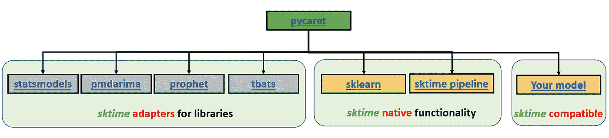
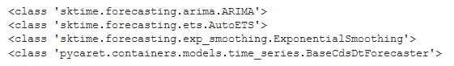
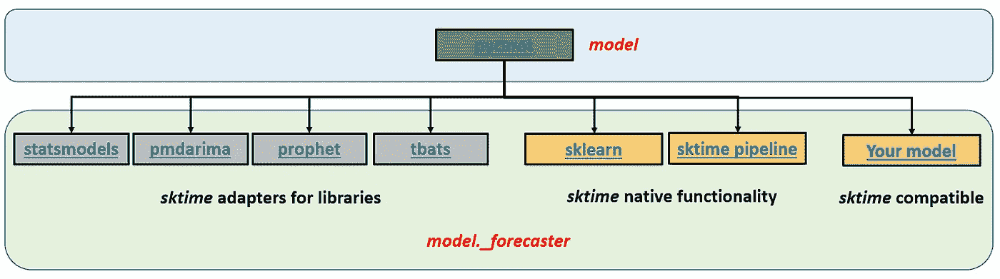
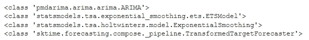
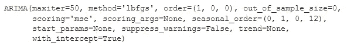
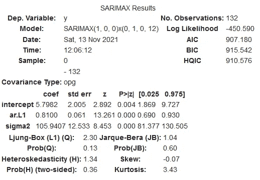
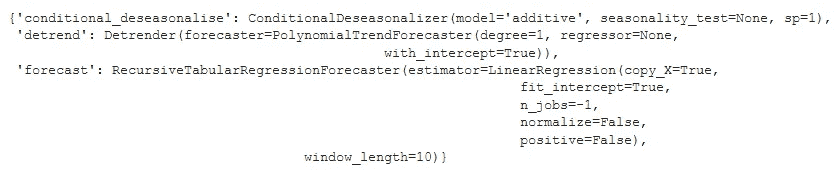

# PyCaret 时序模块架构概述

> 原文：<https://towardsdatascience.com/pycaret-time-series-module-architecture-overview-57336a2f39c7?source=collection_archive---------19----------------------->

## 在引擎盖下寻找


在 PyCaret 时间序列模块的引擎盖下看——照片由 [Alison Ivansek](https://unsplash.com/@aliivan?utm_source=medium&utm_medium=referral) 在 [Unsplash](https://unsplash.com?utm_source=medium&utm_medium=referral) 上拍摄

# 📚概观

理解任何软件包的底层架构都有助于确保我们尽可能地使用它。这并不意味着一个人必须了解其中的每一行代码，但有时，只是有一个概述会有所帮助。

本文旨在提供对`pycaret`时间序列模块的架构概述，并展示在评估使用`pycaret`开发的模型时，这些信息可能会派上用场的例子。

# 📖建议的先前阅读

如果你还没有这样做，我推荐下面的短文。它讲述了`pycaret`如何使用基于回归的预测模型(我们将在本文后面讨论)

👉[用于时间序列预测的简化回归模型](https://github.com/pycaret/pycaret/discussions/1760)

# 📗体系结构

`pycaret`时间序列模块建立在`sktime`之上，后者是时间序列分析的统一框架。`sktime`的目标是做时间序列分析，就像`sklearn`做机器学习一样。如果你愿意，你可以在这里阅读更多关于它的内容，但是这并不是本文所必需的，因为我将给出一个快速的概述。

`sktime`提供了一个框架来:

1.  使用简化回归技术创建带有`sklearn`回归变量的时间序列模型(参见建议的上一篇阅读)。
2.  用类似于`sklearn`提供的转换创建模型管道。
3.  使用适配器连接到其他时序包(如`[statsmodels](https://github.com/alan-turing-institute/sktime/blob/v0.8.1/sktime/forecasting/base/adapters/_statsmodels.py#L17)`、`[pmdarima](https://github.com/alan-turing-institute/sktime/blob/v0.8.1/sktime/forecasting/base/adapters/_pmdarima.py#L14)`、`[tbats](https://github.com/alan-turing-institute/sktime/blob/4e06cb0231cdabb74bf88d0cb4f2b721fc863fe3/sktime/forecasting/base/adapters/_tbats.py#L18)`、`[prophet](https://github.com/alan-turing-institute/sktime/blob/v0.8.1/sktime/forecasting/base/adapters/_fbprophet.py#L19)`等)。
4.  允许用户使用[扩展模板](https://github.com/alan-turing-institute/sktime/blob/v0.8.1/extension_templates/forecasting.py)创建他们自己的预测模型。



PyCaret 时序模块:架构概述[图片由作者提供]

虽然用户可以直接使用`sktime`库来创建模型，但是管理工作流和模型比较过程仍然需要手动处理(类似于在`sklearn`中直接构建模型)。令人欣慰的是，`pycaret`通过将这些模型、管道和适配器包装在如下所示的方便的框架中，提供了一种用几行代码实现这一点的方便方法。

```
#### Create different types of models ----

# ARIMA model from `pmdarima`
arima_model = exp.create_model("arima")

# ETS and Exponential Smoothing models from `statsmodels`
ets_model = exp.create_model("ets")
exp_smooth_model = exp.create_model("exp_smooth")

# Reduced Regression model using `sklearn` Linear Regression
lr_model = exp.create_model("lr_cds_dt")
```

因此，当你在`pycaret`中创建一个时间序列模型时，你会得到一个`sktime`适配器、管道或者一个你自己开发的`sktime`兼容模型。

```
#### Check model types ----
print(type(arima_model))      # sktime `pmdarima` adapter 
print(type(ets_model))        # sktime `statsmodels` adapter
print(type(exp_smooth_model)) # sktime `statsmodels` adapter
print(type(lr_model))         # Your custom sktime compatible model
```



[图片由作者提供]

但是，人们可以从这些模型中提取出比肉眼看到的更多的信息。例如，如果您使用`pycaret`创建的模型名为`model`，那么通过调用`model._forecaster`可以轻松提取底层包装库模型、`sktime`管道或您的自定义`sktime`兼容模型。



模型对象和可用方法[作者图片]

```
#### Access internal models using `_forecaster` ----
print(type(arima_model._forecaster))
print(type(ets_model._forecaster))
print(type(exp_smooth_model._forecaster))
print(type(lr_model._forecaster))
```



[图片由作者提供]

从这一点开始，您可以使用本地库方法/函数或者`sktime`包装器来提取关于您的模型的有价值的信息。

```
#### What hyperparameters were used to train the model? ----
print(arima_model)

#### Access statistical fit properties using underlying `pmdarima`
arima_model._forecaster.summary()

#### Alternately, use sktime's convenient wrapper to do so ---- 
arima_model.summary()
```



ARIMA 模型参数[图片由作者提供]



ARIMA 模型统计摘要[图片由作者提供]

例如，上面的图像向我们展示了 ARIMA 模型是按照截距的要求建立的。拟合得出截距值为 5.798。我们将在另一篇文章中讨论这些统计细节(见建议的下一篇文章)，但现在，只要知道这些信息可以很容易地访问。

类似地，我们可以使用类似于`sklearn`中的方法提取关于管道的信息。

```
#### sktime pipelines are similar to sklearn.
#### Access steps using `named_steps` attribute
print(lr_model._forecaster.named_steps.keys())
```


模型管道步骤[图片由作者提供]

因此，这个模型实际上是一个包含 3 个步骤的管道——一个条件去理性化器，接着是去渲染器，然后是实际预测器。您可以通过调用`named_steps`来获得关于这些步骤的更多细节。例如，我们可以看到预测器实际上是使用`sklearn` `LinearRegression`的基于回归的模型。这就是我们在构建`lr_cds_dt`模型时所要求的(`lr`代表线性回归，`cds`代表条件反季节器，`dt`代表 Detrender)。

```
#### Details about the steps ----
pprint(lr_model._forecaster.named_steps)
```



模型管道细节[图片由作者提供]

# 🚀结论

虽然`pycaret`提供了一个低代码环境来创建和管理建模工作流，但是如果我们深入观察，还有更多的事情可以做。这篇文章只是触及了可能性的表面。在以后的文章中，我们将看看如何使用`pycaret`来理解底层模型的工作，比如 ARIMA。在那之前，如果你愿意在我的社交渠道上与我联系(我经常发布关于时间序列分析的文章)，你可以在下面找到我。暂时就这样了。预测快乐！

🔗[领英](https://www.linkedin.com/in/guptanick/)

🐦[推特](https://twitter.com/guptanick13)

📘 [GitHub](https://github.com/ngupta23)

*喜欢这篇文章吗？成为* [***中等会员***](https://ngupta13.medium.com/membership) *继续* ***无限制学习*** *。如果您使用下面的链接，* ***，我将收取您的一部分会员费，您无需支付额外费用*** *。*

<https://ngupta13.medium.com/membership>  

# 📗资源

*   <https://nbviewer.ipython.org/github/ngupta23/medium_articles/blob/main/time_series/pycaret/pycaret_ts_architecture.ipynb>**【Jupyter Notebook】(可在 Google Colab 中打开)包含本文代码**

# **📖建议下一次阅读**

**[使用 PyCaret 的时间序列模块了解 ARIMA 模型—第一部分](https://medium.com/p/692e10ca02f2)**

**[向 PyCaret 添加自定义时间序列模型](https://github.com/pycaret/pycaret/discussions/1867)**