# Pydash:缺少 Python 实用程序的厨房水槽

> 原文：<https://towardsdatascience.com/pydash-a-bucket-of-missing-python-utilities-5d10365be4fc?source=collection_archive---------9----------------------->

## 以函数的方式使用 Python

# 动机

你有没有试过像这样展平嵌套数组？

如果您发现很难展平这样的嵌套数组，您会很高兴找到一个像这样的优雅解决方案:

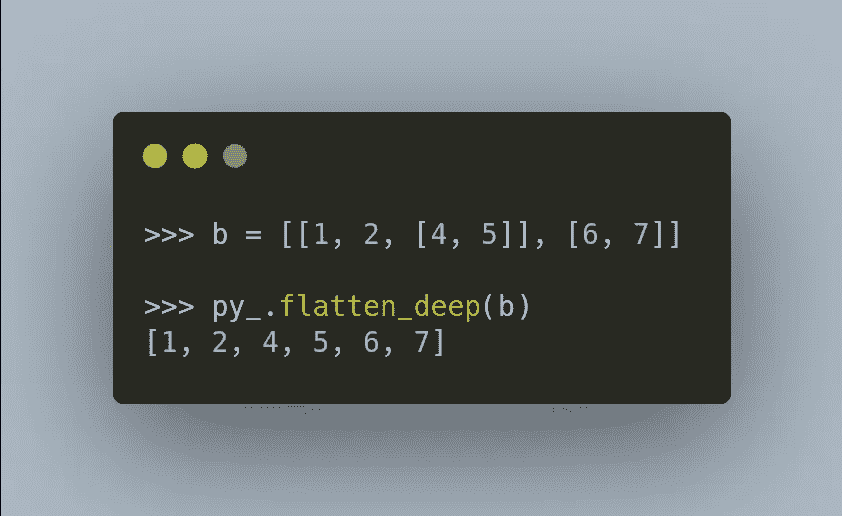

作者图片

…或者在一行代码中获得深层嵌套字典的对象——如下所示。

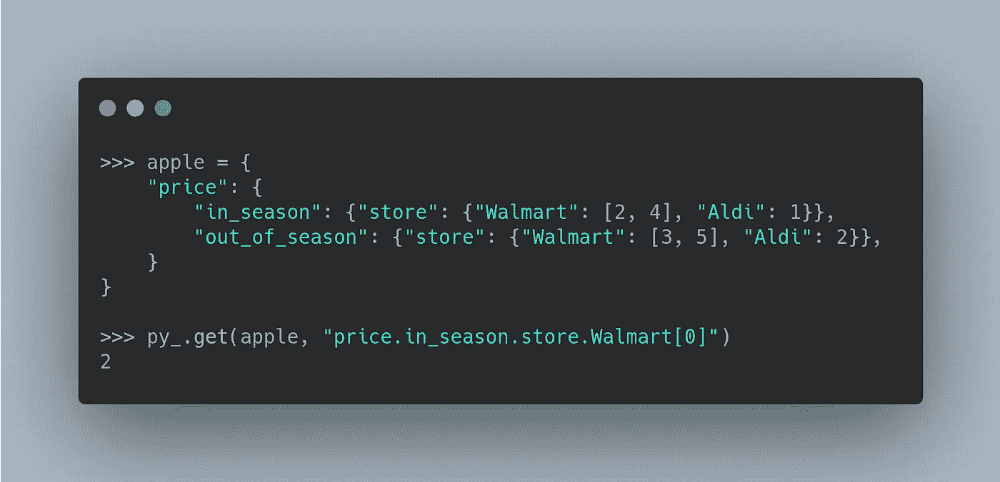

作者图片

如果您正在寻找一个提供有用的工具来处理上述 Python 对象的库，pydash 将是您的首选库。

# pydash 是什么？

Pydash 是 Python 实用程序库的厨房水槽，用于以函数方式做“事情”。

要安装 pydash，请确保您的 Python 版本≥ 3.6，然后键入:

```
pip install pydash
```

从导入 pydash 开始:

# 目录

## 展平 Python 列表

您可以使用`py_.flatten`方法展平嵌套的 Python 列表:

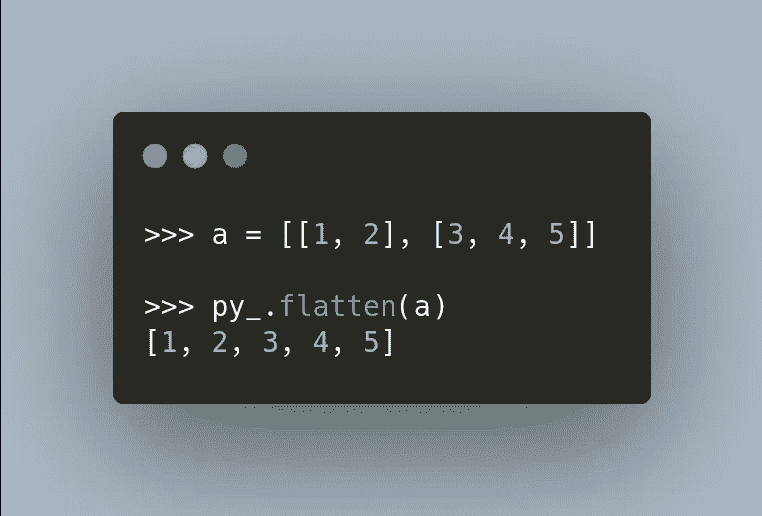

作者图片

如果你的列表像下面这样嵌套很深怎么办？

这时`py_.flatten_deep`方法就派上用场了:


作者图片

## 将元素分成组

如果你能展平一个列表，你能把一个展平的列表变成一个嵌套的列表吗？是的，这可以用`py_.chunk`方法来完成:

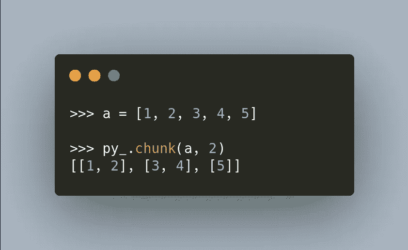

作者图片

不错！列表中的元素被分成两个一组。

# 词典

## 省略字典的属性

要从字典中省略一个属性，我们可以使用`py_.omit`方法:

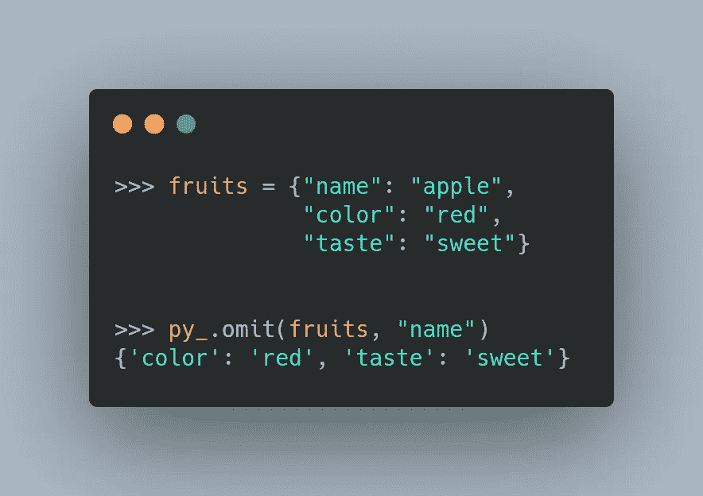

作者图片

## 获取嵌套字典的属性

你如何从`Walmart`中得到`apple`的`price`,也就是像下面这样的嵌套字典中的`in season`?

通常，您需要使用许多括号来获取这些信息:

```
[2, 4]
```

如果可以用点符号代替括号不是很好吗？这可以通过`py_.get`方法完成:

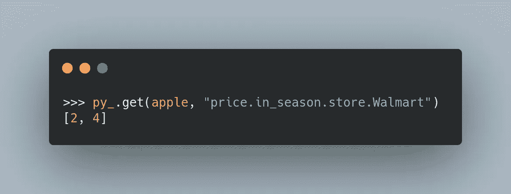

作者图片

酷！您也可以使用`[index]`获得数组中的元素:

```
2
```

# 词典列表

## 使用函数查找项目索引

要使用函数获取列表中元素的索引，请使用`py_.find_index`方法:

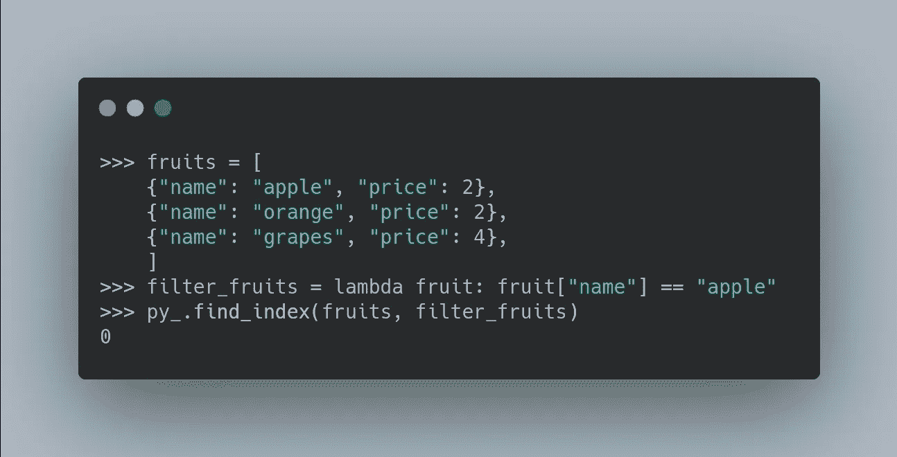

作者图片

## 查找具有匹配样式的对象

`py_.find_index`方法允许您获取匹配特定模式的对象的索引。但是，如果您想获得列表中的项目而不是索引，该怎么办呢？

这可以通过`py_.filter`方法完成:

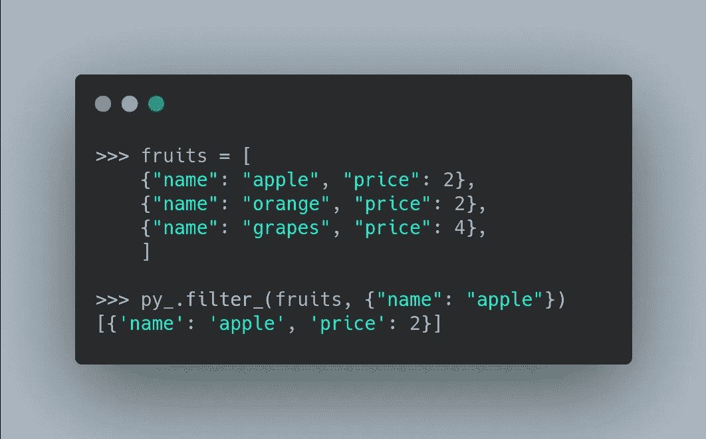

作者图片

## 获取嵌套对象值

有时你的字典列表可以像下面这样嵌套。怎么才能得到`apple`的`taste`属性？

幸运的是，这可以通过`py_.map_`方法轻松实现:

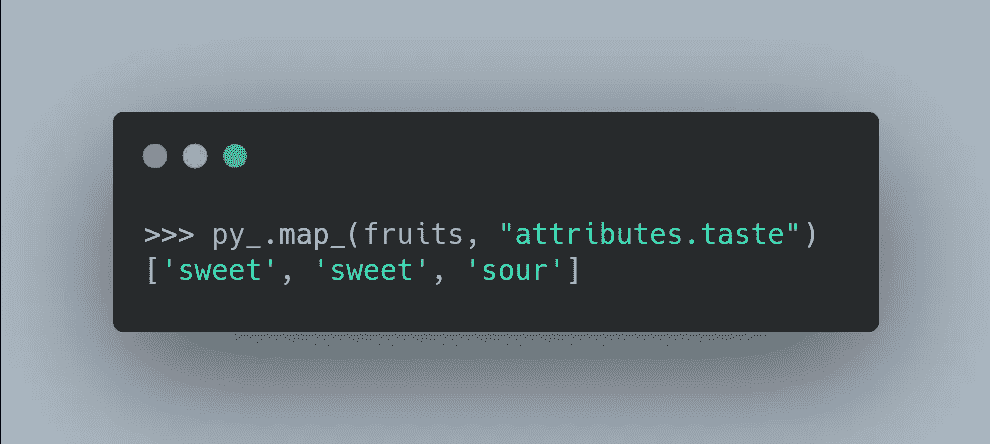

作者图片

# 执行一个函数 n 次

您可以使用`py_.times`方法执行一个函数 n 次。这个方法是 for 循环的一个很好的替代方法。

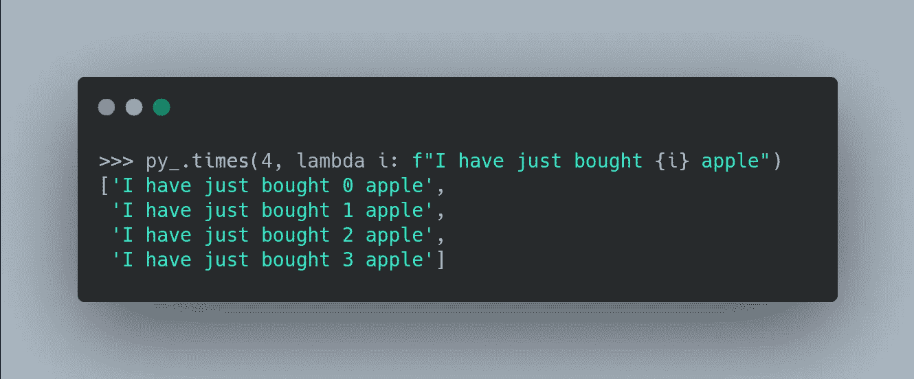

作者图片

# 链接

## 皮达什的方法

有时，您可能希望对一个对象应用几种方法。不用写几行代码，可以一次应用所有方法吗？

这就是方法链派上用场的时候。要在对象中应用方法链接，使用`py_.chain`方法:

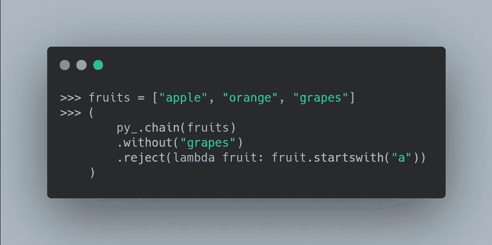

作者图片

请注意，运行上面的代码不会给我们提供值:

```
<pydash.chaining.Chain at 0x7f8d256b0dc0>
```

只有当我们将`.value()`添加到链的末尾时，才会计算出最终值:

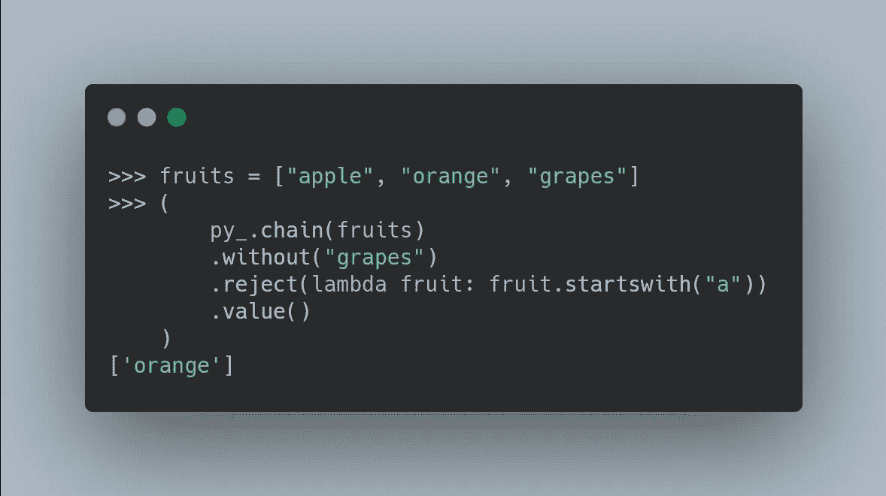

作者图片

这叫[懒评](https://www.tutorialspoint.com/functional_programming/functional_programming_lazy_evaluation.htm)。惰性求值保留对表达式的求值，直到需要它的值，这样可以避免重复求值。

## 定制方法

如果你想用你自己的方法而不是 pydash 的方法，使用`map`方法:

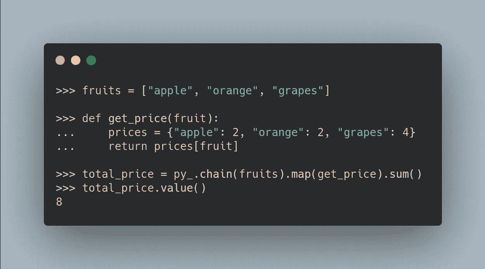

作者图片

## 树立价值观

要用另一个值替换链的初始值，使用`plant`方法:

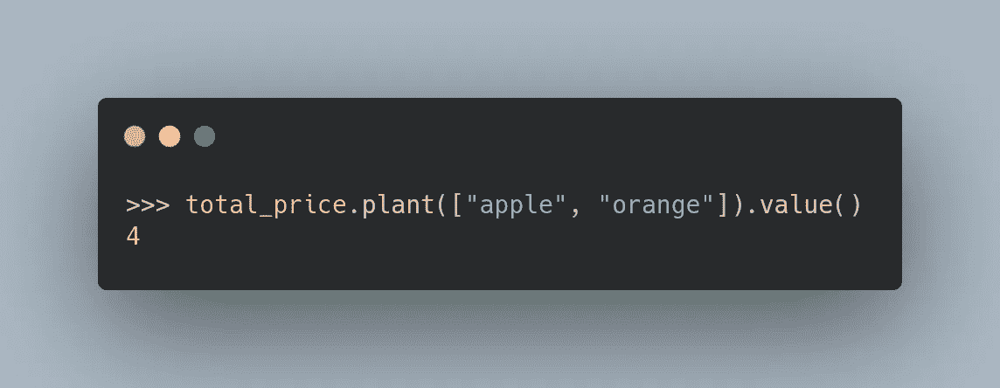

作者图片

酷！我们用相同的链条将`['apple', 'orange', 'grapes']`替换为`['apple', 'orange']`！

# 结论

恭喜你！您刚刚学习了如何使用 pydash 有效地操作 Python 对象。我希望这篇文章能为您的 Python 工具包添加一些更有用的工具。

pydash 提供了很多很酷的方法，我无法在本文中一一介绍。我鼓励你去看看 [pydash 的 API 参考](https://pydash.readthedocs.io/en/latest/api.html?highlight=find_index#pydash.arrays.find_index)。

在 Github repo 中，您可以随意使用本文的代码:

[](https://github.com/khuyentran1401/Data-science/blob/master/python/pydash.ipynb) [## khuyentran 1401/数据科学

### 有用的数据科学主题以及代码和文章的集合- khuyentran1401/Data-science

github.com](https://github.com/khuyentran1401/Data-science/blob/master/python/pydash.ipynb) 

我喜欢写一些基本的数据科学概念，并尝试不同的算法和数据科学工具。你可以在 LinkedIn 和 Twitter 上与我联系。

如果你想查看我写的所有文章的代码，请点击这里。在 Medium 上关注我，了解我的最新数据科学文章，例如:

[](/3-python-tricks-to-read-create-and-run-multiple-files-automatically-5221ebaad2ba) [## 自动读取、创建和运行多个文件的 3 个 Python 技巧

### 用 Python 和 Bash For Loop 自动化枯燥的东西

towardsdatascience.com](/3-python-tricks-to-read-create-and-run-multiple-files-automatically-5221ebaad2ba) [](/python-clean-code-6-best-practices-to-make-your-python-functions-more-readable-7ea4c6171d60) [## Python 干净代码:让 Python 函数更具可读性的 6 个最佳实践

### 停止编写需要 3 分钟以上才能理解的 Python 函数

towardsdatascience.com](/python-clean-code-6-best-practices-to-make-your-python-functions-more-readable-7ea4c6171d60) [](/3-advance-techniques-to-effortlessly-import-and-execute-your-python-modules-ccdcba017b0c) [## 轻松导入和执行 Python 模块的 3 种技巧

### 如何让你的 Python 模块对用户友好

towardsdatascience.com](/3-advance-techniques-to-effortlessly-import-and-execute-your-python-modules-ccdcba017b0c) [](/3-tools-to-track-and-visualize-the-execution-of-your-python-code-666a153e435e) [## 3 个跟踪和可视化 Python 代码执行的工具

towardsdatascience.com](/3-tools-to-track-and-visualize-the-execution-of-your-python-code-666a153e435e)