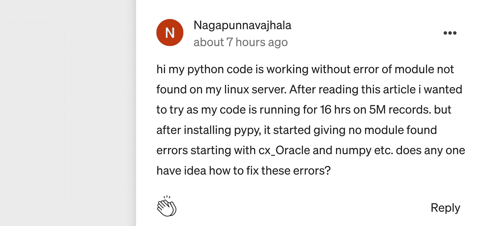

# PyPy 比 Python 快，但代价是什么？

> 原文：<https://towardsdatascience.com/pypy-is-faster-than-python-but-at-what-cost-12739bf2b8e9?source=collection_archive---------12----------------------->

## 学习机

## 提示:绝对不适合数据科学项目

美国宇航局在 [Unsplash](https://unsplash.com?utm_source=medium&utm_medium=referral) 拍摄的照片

</run-your-python-code-as-fast-as-c-4ae49935a826>  

在过去的几天里，上面链接的故事在“媒体趋势”排行榜上排名第一。当我第一次偶然发现它时，它只有不到 100 次鼓掌。现在它有成千上万个这样的问题，我觉得有必要把事情搞清楚。

这个故事的核心思想是使用 PyPy 而不是普通的 Python。这将用 PyPy 替换默认的 CPython 解释器，PyPy 据说比 Python 快得多，而且“没有任何改变”

然后作者给出了一个用 Python 和 PyPy 测量在一个循环内将 0 到 100，000，000 之间的整数相加所需时间的例子。这里，Python 需要 9.28 秒，而 PyPy 需要 0.22 秒。

但是作者忽略了一个重要的东西。

> 它不支持一些机器学习库。

考虑到 TDS 出版了它，这是一件奇怪的事情。

一些读者可能会兴奋地认为，如果 9.28 秒和 0.22 秒的比较成立，他们可以将机器学习模型的训练时间缩短 40 倍以上。

在现实中，这是他们大多数人都会经历的。

作者对文章的评论截图。

原因是大多数机器学习库使用 PyPy 不支持的 C API。

有些人请求对流行的 ML 库提供 PyPy 支持，但是他们似乎没有任何进展。下面是 2019 年开放的关于 PyTorch 的 PyPy 支持的 GitHub 问题。

<https://github.com/pytorch/pytorch/issues/17835>  

这是 GitHub 的另一个问题，关于 2015 年 TensorFlow 的同一问题。

<https://github.com/tensorflow/tensorflow/issues/252>  

Scikit-learn 在他们的 FAQ 中声明[他们对 PyPy 有“实验支持”,但当前最先进的机器学习模型很可能会使用 PyTorch、TensorFlow 甚至 Transformers 包，而不是 scikit-learn。](https://scikit-learn.org/stable/faq.html#do-you-support-pypy)

也就是说，我认为在您的数据科学项目中使用 PyPy 是不可行的，甚至是不可能的。

您必须检查您的项目使用的所有包是否都受 PyPy 支持。关于 Python 包与 PyPy 兼容性的完整列表，您可以访问下面的页面。

  

# 结论

目前，还不能使用 PyPy 作为 Python 数据科学项目的解释器。至少现在是这样。

很多机器学习库，如 Torch 和 TensorFlow，都依赖于与 C 库的兼容性，而 PyPy 在撰写本文时还不支持 C 库。

对我来说，我使用 Python 编写小脚本来实现自动化、抓取网站和机器学习。在所有用例中，我看不出 PyPy 在较小的任务中有什么不同，缺乏对机器学习库的支持绝对是一个障碍。

其他用例实际上可能受益于 PyPy，但是您需要在替换常规 Python 之前评估您的代码。使用 PyPy 意味着限制您的代码使用一组受支持的包，而不是 Python 可用的完整包。

回顾过去，PyPy 在几年前不支持熊猫和 NumPy，但是现在它支持它们。因此，将来有可能会有更多的库支持 PyPy 或被 PyPy 支持，但肯定不是在不久的将来。

感谢阅读！这里有一些我的其他故事，你可能会喜欢。

<https://medium.com/swlh/the-one-tool-that-every-machine-learning-engineer-should-master-68aecd920b0>  </maybe-its-time-to-upgrade-your-terminal-experience-a9e12b2af77>  </5-things-i-learned-from-my-first-time-working-with-big-data-a6193deb982f>  

《学习机》是一系列关于我学到的东西的故事，我认为这些故事很有趣，值得分享。有时也是关于机器学习的基础。 [*获得定期更新*](https://chandraseta.medium.com/subscribe) *上新故事和* [*成为中等会员*](https://chandraseta.medium.com/membership) *阅读无限故事。*

<https://chandraseta.medium.com/membership> 