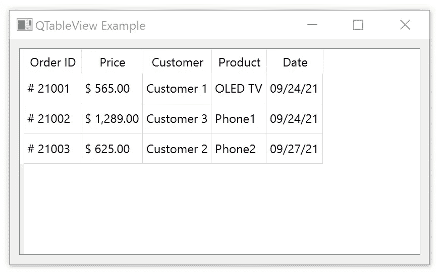
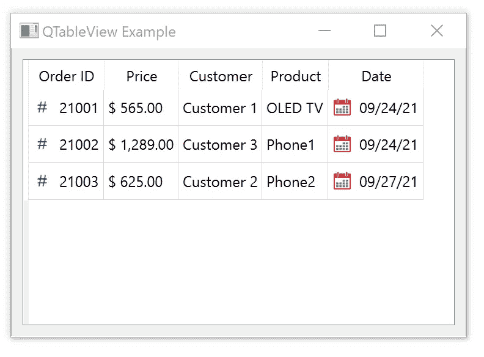

# PyQt 和关系数据库:数据格式 2

> 原文：<https://towardsdatascience.com/pyqt-relational-databases-data-format-2-2203505f778?source=collection_archive---------21----------------------->

## 数据

## 用 PyQt 轻松呈现关系数据库数据。不需要 SQL 查询。


作者和 Unsplash 提供的图像

今天，我们将深入探讨数据格式化。

我们将讨论视图使用的条目数据角色，以向模型表明它需要哪种类型的数据。

再举几个数据格式的例子，并在最后给你一点奖励，这将有助于你理解表格数据格式。

## 本文是 PyQt &关系数据库系列的一部分:


斯特凡·梅洛

## PyQt &关系数据库系列

[View list](https://melo-stefan.medium.com/list/pyqt-relational-databases-series-9ded67b27631?source=post_page-----2203505f778--------------------------------)6 stories

## 表格演示

到目前为止我们学到了什么？很多。

然而，它可能看起来有点像，因为我们编写了相对较少的代码行。它适合于开发人员，因为它表明生产力的快速增长。

现在，你知道如何通过避免 SQL 查询知识来使你的生活变得更容易。没有编译任何 SQL 查询，您可以用关系数据库(在本例中是 SQLite 数据库)中的数据填充您的表。

并且您理解了*模型-视图-控制器*设计模式，并且您能够通过 PyQt 有效地使用它。

这些技能都是通过`QAbstractTableModel`进行模型定制支持的。

> 控制数据表示模型提供了使数据可读的无限可能性。

例如，我们已经指出了货币和精度，这是定价数据的两个基本属性。

## 项目数据角色

> 演示模型还能为我们做什么？

强烈推荐玩玩。你会学到很多，你会发现可能性是无穷无尽的。

最好的方法是从角色开始。角色代表一个`Qt.ItemDataRole`枚举。

模型中的每一项都有一组与之相关联的数据元素，每一项都有自己的角色。自定义模型应该返回这些类型的数据。

可以把它们想象成物品特征，基于这些特征，系统理解我们想要对物品做什么。

根据角色效果，有通用角色、描述外观和元数据的角色、可访问性角色和可用的用户角色。

今天我们将使用`DisplayRole`和`DecorationRole`。然而，当我们需要他们的时候，我们会再回来的。

## 更改“ID”和“日期”格式

让我们多学一点。

这个`DisplayRole`很有用。

在我们的示例中，我们将格式化 ID 号列并更改日期格式。我们开始吧！

很直白。我们将在子类`QAbstractTableModel`的`data()`方法中添加几行代码。

```
def data(self, index, role):
    value = self._model.record(index.row()).value(index.column())
    if role == Qt.ItemDataRole.DisplayRole:
 **if isinstance(value, int) and index.column() == 0:
            return f'# {value}'**        if isinstance(value, int) and index.column() == 1:
            return "${: ,.2f}".format(value)
 **if isinstance(value, str) and index.column() == 4:
            date_object = date.fromisoformat(value)
            return date_object.strftime('%x')**        return value
```

我们在上面添加了几行粗体字。在第一列中，我们添加了“#”符号。

对于日期列，我们需要一些导入:

```
**from datetime import date
from time import strftime**
```

因为我们的`value`只是一个纯文本(ISO 格式)，所以我们创建了`date_object`。

我们需要它来方便格式转换。下面一行返回转换为本地格式的日期中的纯文本。

只添加了 7 行代码，表就变了，结果就在这里。



作者图片

## 装饰

正如承诺的，这是最后的一点奖金。

它展示了一种`DecorationRole`的力量。

有时候，用一些装饰让桌子看起来更有吸引力是很有用的。它显示了两种不同的情况。

如果您查看第一列，您会注意到我们在一个整数订单号前面添加了一个标签“#”符号。

> 在将数据写入模型的情况下，我们会将项目转换为字符串，这在将数据写入数据库时可能会出现问题。

为了避免这种不必要的转换，最好使用装饰。我们必须删除`DisplayRole`部分中第 0 列的整个`if`语句。

```
def data(self, index, role):
    value = self._model.record(index.row()).value(index.column())
    if role == Qt.ItemDataRole.DisplayRole:        if isinstance(value, int) and index.column() == 1:
            return "${: ,.2f}".format(value)
        if isinstance(value, str) and index.column() == 4:
            date_object = date.fromisoformat(value)
            return date_object.strftime('%x')        return value **if role == Qt.ItemDataRole.DecorationRole:
        if isinstance(value, int) and index.column() == 0:
            return QtGui.QIcon('data/icons/hashtag_icon.png')
        if isinstance(value, str) and index.column() == 4:
            return QtGui.QIcon('data/icons/calendar.png')**
```

然后我们只在`DecorationRole`部分实现两个`if`语句。

第一个用于第 0 列，添加 hashtag 符号装饰，另一个用于第 4 列，添加日历图标装饰。



作者图片

## 关系数据库数据表示

关注数据呈现总是很重要的。

PyQt 使得保持数据库源不变变变得容易，并且仍然提供了很多机会来使数据呈现对用户具有吸引力。

***如果你想阅读更多这样的内容，成为会员:***

[](https://melo-stefan.medium.com/membership) [## 通过我的推荐链接加入 Medium-Stefan Melo

### 作为一个媒体会员，你的会员费的一部分会给你阅读的作家，你可以完全接触到每一个故事…

melo-stefan.medium.com](https://melo-stefan.medium.com/membership) 

***或者你可以订阅我下面的简讯。谢谢你。***