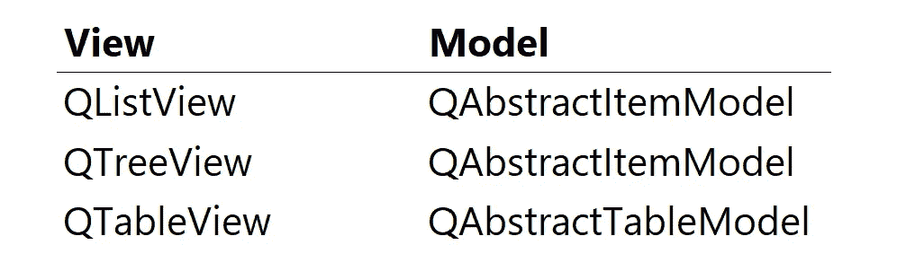
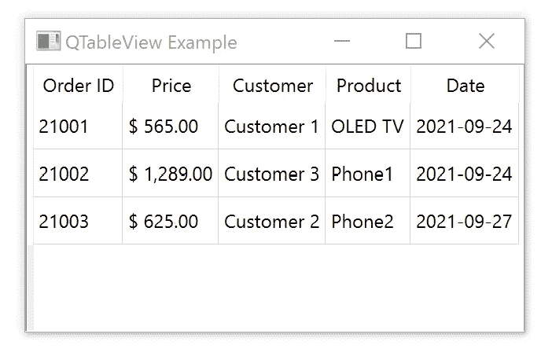

# PyQt 和关系数据库—数据格式

> 原文：<https://towardsdatascience.com/pyqt-relational-databases-data-format-36907b427b8?source=collection_archive---------11----------------------->

## 数据

## PyQt 为关系数据库数据表示提供了一种方便的方式。


按作者排列图像，按像素排列背景

## 模型-视图设计模式

`QTableView`小部件是向用户呈现数据的一种方便灵活的方式。

此外，它可以有效地处理关系数据库，并且不用强调它完全符合模型-视图-控制器设计模式。

我们已经知道如何连接到数据库并从关系表中显示数据。

最有价值的好处是我们不需要 SQL 语言专业知识。众所周知，掌握 SQL 查询是一项长期任务。

## 为什么数据格式很重要

现在，让我们使我们的数据对人眼更有吸引力。

数据格式在数据科学中起着重要的作用。人们必须知道他们面对的是什么数据。没有正确的格式，数据就不能得到有效的利用。

## 本文是 PyQt &关系数据库系列的一部分:


斯特凡·梅洛

## PyQt &关系数据库系列

[View list](https://melo-stefan.medium.com/list/pyqt-relational-databases-series-9ded67b27631?source=post_page-----36907b427b8--------------------------------)6 stories

## PyQt 中的 MVC

*模型-视图-控制器* (MVC)是一种*软件设计模式*，通常用于开发用户界面，以分离内部信息表示(*模型*)和它们如何呈现(*视图*)之间的逻辑。

*控制器*接受输入并将其转化为模型或视图的指令。

PyQt 将视图和控制器合并成一个元素。当视图和控制器元素结合成一个时，结果就是*模型-视图*设计架构。

PyQt 有不同的模型类和各自的视图类。下表显示了匹配的模型基础。



## 自己展示你的数据

为了更好地控制数据的显示方式，我们将定制模型。

在模型-视图架构中，要编写一个*定制模型*，我们必须子类化一个适当的抽象模型。

对于我们的例子来说，`QAbstractTableModel`正是我们所需要的。然而，`QAbstractTableModel`是一个*抽象基类*，对于其他编程语言来说，它被称为*接口*。直接用的话就不行了。定制表格需要实现的最小方法是`data`和`rowCount`。

`data`方法返回表格数据。而`rowCount`方法必须返回数据源的维度。

## 修改前面的代码

为了从我们的`data`方法返回一些数据，我们需要修改我们已经拥有的代码。数据将来自我们的关系数据模型。否则，我们将失去关系表的功能。

因此，我们没有使用`view.setModel(model)`，而是使用了一个新的模型`view.setModel(presentation_model)`，它将从我们现有的关系表`model`中获取数据。修改后的代码如下所示:

```
class MainWindow(QMainWindow):
    def __init__(self, parent = None):
        super().__init__(parent) self.setWindowTitle('QTableView Example') # Setup the model
        model = QSqlRelationalTableModel(self)
        model.setTable('orders')
        model.setRelation(2, QSqlRelation('customers', 'CustomerID', 'Customer'))
        model.setRelation(3, QSqlRelation('products', 'ProductID', 'Product'))
        model.setRelation(1, QSqlRelation('products', 'ProductID', 'Price'))
        model.select() # Create the presentation model, which gets data from relational table model
        **presentation_model = MyTableModel(model)** # Setup the view
        view = QTableView(self)
        **view.setModel(presentation_model)**
        view.resizeColumnsToContents()
        self.setCentralWidget(view)
```

## 展示模型

但是这个神秘的`MyTableModel`班是什么？它从哪里来？这是我们新的`QAbstractTableModel`子类。让我们创造它。

```
class MyTableModel(**QAbstractTableModel**):
    def __init__(self, **model**):
        super().__init__(model) self._model = model # Create the data method
    def data(self, **index**, **role**):

        if role == Qt.ItemDataRole.DisplayRole:
            value = self._model.record(index.row()).value(index.column())
            if isinstance(value, int) and index.column() == 1:
                # Format the currency value
                return "${: ,.2f}".format(value)
            return value # Create the headerData method
    def headerData(self, **section**: int, **orientation**: Qt.Orientation, **role**: int):
        if role == Qt.ItemDataRole.DisplayRole and orientation == Qt.Orientation.Horizontal:
            return self._model.headerData(section, orientation, role=role) # Create the rowCount method
    def rowCount(self, parent: QModelIndex) -> int:
        return self._model.rowCount() # Create the columnCount method
    def columnCount(self, parent: QModelIndex) -> int:
        return self._model.columnCount()
```

让我们来评论一些重要的细节:

*   一定不要忘记导入几个模块:
    `from PyQt6.QtCore import QAbstractTableModel, QModelIndex, Qt`
*   `__init__`构造函数只接受一个参数`model`。
    我们将它存储在`self._model`中，以便在我们的方法中访问它。
*   `data`方法首先寻找显示`role`。当找到它时，我们得到`value`并检查需要格式化的列。最后，该方法为演示返回一个格式化的`value`。
*   `headerData`方法寻找`role`和`orientation`。当方向为`horizontal`时，返回可用的表头。因为我们没有定义行标题，所以行标题是隐藏的。
*   尽管我们已经创建了`rowCount`和`columnCount`方法，但它们目前什么也做不了。但是，我们稍后会用到它们。

## 结论

只要对代码稍加更新，我们就可以用我们喜欢的任何方式格式化数据。结果如下:



接下来，我们将看看其他一些格式，并开始修改数据。

***如果你想阅读更多这样的内容，成为会员:***

[](https://melo-stefan.medium.com/membership) [## 通过我的推荐链接加入 Medium-Stefan Melo

### 作为一个媒体会员，你的会员费的一部分会给你阅读的作家，你可以完全接触到每一个故事…

melo-stefan.medium.com](https://melo-stefan.medium.com/membership) 

***或者你可以订阅我下面的简讯。谢谢你。***