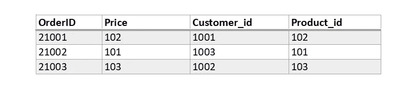
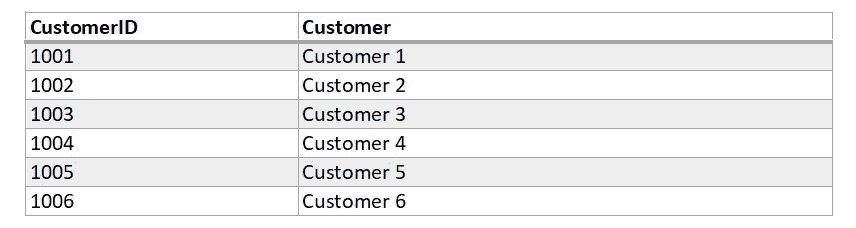
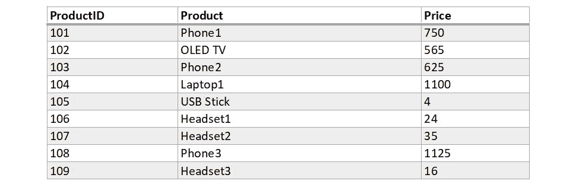
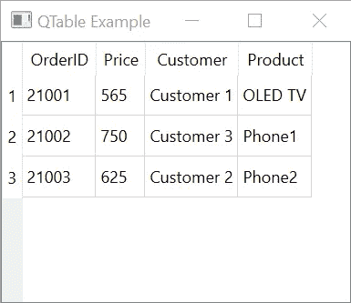

# PyQt &关系数据库

> 原文：<https://towardsdatascience.com/pyqt-relational-databases-e6bdbed7ebdf?source=collection_archive---------13----------------------->

## 易于使用的全功能部件，用于处理关系数据库数据。


照片由[西格蒙德](https://unsplash.com/@sigmund?utm_source=medium&utm_medium=referral)在 [Unsplash](https://unsplash.com?utm_source=medium&utm_medium=referral) 上拍摄

Python 是一种简单易学、功能强大的编程语言。

您可以获得复杂的输出，并且与其他语言相比，您需要编写的代码行要少得多。

然而，当涉及到 GUI 应用程序开发时，您可能会遇到困难。尤其是当你需要处理巨大的数据集时。

本文是 PyQt &关系数据库系列的一部分:


[斯特凡·梅洛](https://melo-stefan.medium.com/?source=post_page-----e6bdbed7ebdf--------------------------------)

## PyQt &关系数据库系列

[View list](https://melo-stefan.medium.com/list/pyqt-relational-databases-series-9ded67b27631?source=post_page-----e6bdbed7ebdf--------------------------------)6 stories

***如果你想阅读更多这样的内容，成为会员:***

<https://melo-stefan.medium.com/membership>  

***或者你可以订阅我下面的简讯。谢谢你。***

## 为什么选择 PyQt？

python 中 GUI 的第一个问题是选择合适的框架。

对于数据库应用，我强烈推荐 PyQt。它保存了大量的样板代码，并且它的数据库支持是广泛的。

为此，我已经尽可能避免第三方模块导入。这种方法最重要的优点是在包更新时与代码无关。

因此，维护工作大大减少。除了 python 的内部模块之外，这里唯一需要的包是 PyQt。

注意:我假设您熟悉

*   *PyQt 安装*
*   *框架的基本用法*
*   *SQLite 数据库*
*   *关系数据库基础*

## 关系数据库

理解关系数据库至少由两个表组成是很重要的，这是最简单的情况。为了避免我们的例子看起来无聊，我们将有三个表。

***关系数据库*** 根据特定标准将数据分组到表格中。一些表可以相互关联；它们是联系在一起的。

这些链接基于*共享的*数据。与其挑战定义，不如让我们看一个相关表的例子。

## 我们的例子

为了保持简单，我们将使用 SQLite 数据库。这个决定背后有多种理由。

SQLite 是一个快速、小型、独立、高度可靠、功能全面的 SQL 数据库引擎。

数据库存储在单个磁盘文件中。任何人都可以出于任何目的访问它，`sqlite3`模块是 python 的内置模块。

我们用一些数据创建主表“订单”:



表格“订单”

现在，我们有了一个基本的*订单预订系统*来玩。这个表很难看，因为它包含了非人类可读的值。是的，的确！

尽管`OrderID`、`Customer_id`和`Product_id`值有意义——它们是 id，但是在`Price`列和`Product_id`列中有相同的奇怪值。

这不是意外。表`orders`中的`Price`值不是实际价格。是对`products`表中`Product_id`的引用。每当`Product_id`改变时，将`Product_id`值赋给`Price`是开发者的责任。

我们还有`customers`和`products`表格，如下所示。这些表格保存了`orders`表格所需的信息(值)。



表“客户”



表“产品”

## 应用程序设置

让我们现在开始编码。首先，我们导入不可避免的模块。

```
import sys
from PyQt6.QtWidgets import QApplication, QMainWindow, QMessageBox, QTableView
from PyQt6.QtSql import QSqlDatabase, QSqlRelation, QSqlRelationalTableModel
```

这里我想说明一下，我用的是 PyQt6。然而，该代码将与 PyQt5 一起工作，没有任何问题。

接下来，我们将包含运行 PyQt 应用程序所需的典型代码片段。没什么特别的。

```
if __name__ == "__main__":
    app = QApplication(sys.argv)
    form = MainWindow()
    form.show()
    app.exec()
```

这里我们创建了`app`，PyQt `QApplication`类的一个实例，`form`是`MainWindow`类的一个实例；我们稍后会创建它。

我们确保表单会显示出来，并执行`app`。

接下来，我们将创建一个返回布尔值的函数`createConnection()`。

该函数将处理数据库连接，并在一切正常且数据库连接稳定时返回`True`。

```
*# Type hint for return value*
def createConnection() -> bool:
    *# SQLite type database connection instance*    
    con = QSqlDatabase.addDatabase('QSQLITE') 
    *# Connect to the database file*
    con.setDatabaseName('testDB.db')
    *# Show message box when there is a connection issue*
    if not con.open():
        QMessageBox.critical(
            None,
            'QTableView Example - Error!',
            'Database Error: %s' % con.lastError().databaseText(),
        )
        return False
    return True
```

我们不希望应用程序在没有正确的数据库连接的情况下启动。

验证链接的最佳时机是在 GUI 完全启动之前。所以我们必须修改上面的应用程序初始化代码。

```
if __name__ == "__main__":
    app = QApplication(sys.argv)
    **if not createConnection():
        sys.exit(1)**
    form = MainWindow()
    form.show()
    app.exec()
```

## 创建图形用户界面

是时候为方便的数据呈现编写我们想要的 GUI 了。

我们已经准备好了应用程序的主窗体(窗口)。你可以在上面的`form = MainWindow()`中看到，这个`MainWindow`类的实例名为`form`。尽管如此，我们还是没有`MainWindow`级！

我们现在就做点什么。这是最吸引人的部分。

我现在可以透露，我们将使用`QTableView`小部件。它有我们需要的魔力。

```
*# Inherit from QMainWindow*
class MainWindow(QMainWindow):
    def __init__(self, parent = None):
        super().__init__(parent)
        *# Set the window title*
        self.setWindowTitle('QTable Example')
        *# Create the model*
        model = QSqlRelationalTableModel(self)
        *# Set the table to display*
        model.setTable('orders')
        *# Set relations for related columns to be displayed*
        model.setRelation(1, QSqlRelation('products', 'ProductID', 'Price'))
        model.setRelation(2, QSqlRelation('customers', 'CustomerID', 'Customer'))
        model.setRelation(3, QSqlRelation('products', 'ProductID', 'Product'))
        model.select() *# Setup the view
        # Create the view = a table widget*
        view = QTableView(self)
        *# Set the data model for table widget*
        view.setModel(model)
        *# Adjust column widths to their content*
        view.resizeColumnsToContents()
        *# Add the widget to main window*
        self.setCentralWidget(view)
```

## SqlRelationalTableModel

上面的代码显示了整个应用程序的 GUI 设置。注释解释了每一步的细节。

然而，我想澄清和分析模型的`setRelation()`方法和`QSqlRelation`对象的使用。

让我们看看我们在这里做了什么，除了链接到 GUI 本身的行。我们将关注我们的数据模型。

PyQt 包括几个我们可以有效使用的模型对象。在视图中，我们使用关系表；`SqlRelationalTableModel`类完全适合。我们将使用的模型完成了所有我们需要的艰苦工作。

`setRelation()`方法需要两个参数:`column`和`relation`。该方法指定`column`(外键)的行为由`relation`对象定义。

让我们以第一种情况为例:

```
model.setTable(‘orders’) 
model.setRelation(1, QSqlRelation('products', 'ProductID', 'Price'))
```

行为是`orders`表中的列 1 映射到`products`表中的字段`ProductID`，视图应该向用户显示`products` ' `Price`字段。

## 结论

使用 QSqlRelationalTableModel，我们很好地避免了 SQL 语言知识和其他用于构造复杂 SQL 查询的样板代码。



作者图片

接下来，我们将使我们的表格小部件更吸引人。