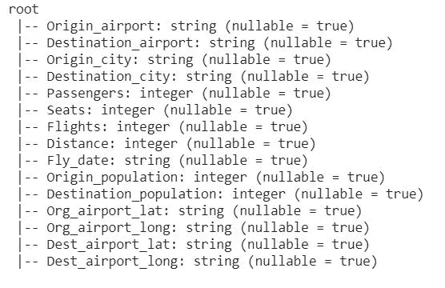
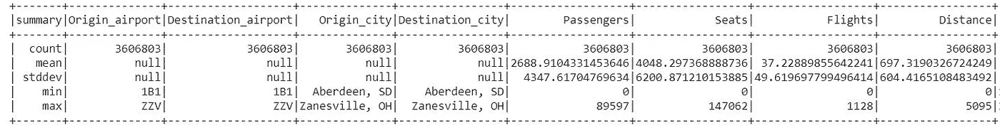
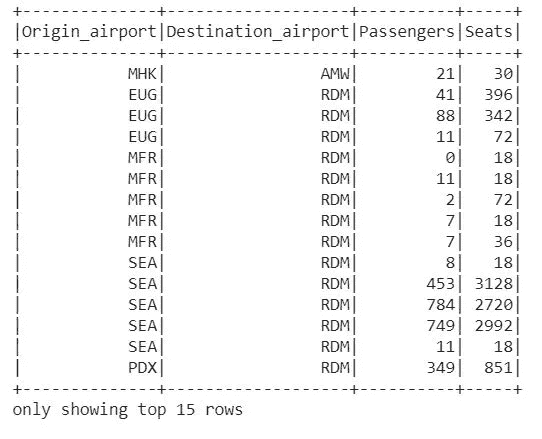
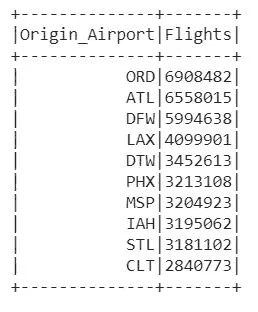
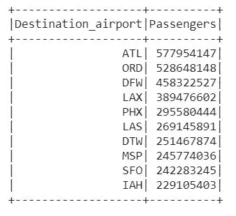
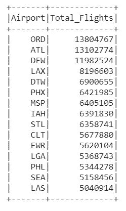
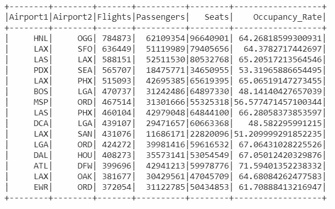
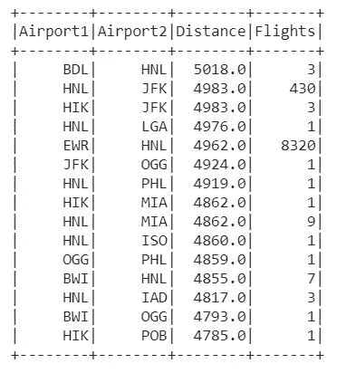
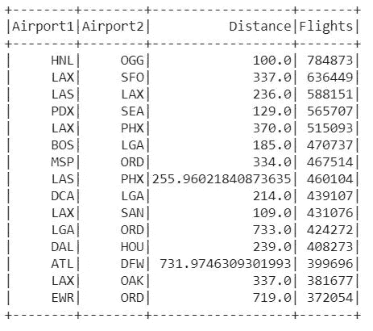

# 机场数据的 PySpark 分析

> 原文：<https://towardsdatascience.com/pyspark-analysis-on-airport-data-6d10aaf9cbb1?source=collection_archive---------15----------------------->

## 使用大数据平台 PySpark 和 Google Collaboratory 笔记本分析机场和航班数据


在 [Unsplash](https://unsplash.com/s/photos/big-data?utm_source=unsplash&utm_medium=referral&utm_content=creditCopyText) 上由 [Carlos Muza](https://unsplash.com/@kmuza?utm_source=unsplash&utm_medium=referral&utm_content=creditCopyText) 拍摄的照片

大数据是大量复杂数据集和数据量的集合，包括海量数据、数据管理功能、社交媒体分析和实时数据。大数据是指无法通过简化的处理方法处理的数据，因为要处理的数据非常庞大。大数据也被定义为处理大量数据的系统，以非常短的延迟实时产生结果。Apache Spark 是一个统一的分析引擎，主要用于大规模处理。 [Apache Spark](https://spark.apache.org/) 的一些主要优势是处理速度、易用性、平台通用性以及可以与之集成的工具包。

PySpark 是在 Apache Spark 上工作的 Python API。使用 [PySpark](https://www.gangboard.com/blog/what-is-pyspark#:~:text=PySpark%20is%20the%20Python%20API%20written%20in%20python%20to%20support%20Apache%20Spark.&text=Apache%20Spark%20is%20written%20in,in%20parallel%20and%20batch%20systems.) 的主要优势是它可以很容易地与 Java、R 和 Scala 集成。数据科学家可以利用 RDD 以更高的速度在分布式集群上工作，以部分方式存储数据。磁盘持久化和强大的缓存有助于进一步提高处理速度。在本文中，我们讨论了如何在 Google Collaboratory 笔记本上使用 [PySpark](https://www.gangboard.com/blog/what-is-pyspark#:~:text=PySpark%20is%20the%20Python%20API%20written%20in%20python%20to%20support%20Apache%20Spark.&text=Apache%20Spark%20is%20written%20in,in%20parallel%20and%20batch%20systems.) 来分析包含大约 360 万行和 15 个特征的巨大数据集。

[](https://github.com/ojaashampiholi/Airport_Analysis_PySpark) [## ojaashampiholi/Airport _ Analysis _ py spark

### 这个项目的重点是执行探索性分析的航班在美国使用 PySpark 是运行在谷歌 Colab…

github.com](https://github.com/ojaashampiholi/Airport_Analysis_PySpark) 

# 在 Google Colab 上安装和初始化 PySpark

1.  下载 JRE 无头版到笔记本。

```
!apt-get install openjdk-8-jdk-headless -qq > /dev/null
```

2.下载 Spark with Hadoop 安装 zip 文件并解压缩以备后用。

```
!wget -q https://downloads.apache.org/spark/spark-3.0.2/spark-3.0.2-bin-hadoop2.7.tgz

!tar xf spark-3.0.2-bin-hadoop2.7.tgz
```

3.设置 Javahome 和 Sparkhome 变量。

```
import os 
os.environ["JAVA_HOME"] = "/usr/lib/jvm/java-8-openjdk-amd64" os.environ["SPARK_HOME"] = "/content/spark-3.0.2-bin-hadoop2.7"
```

4.安装并初始化 findspark 库。

```
!pip install -q findspark**import** **findspark**
findspark.find()
findspark.init()
```

5.创建 Spark 和 SQLContext 会话。

```
**from** **pyspark.sql** **import** SparkSession

spark = SparkSession.builder\
        .master("local")\
        .appName("Colab")\
        .config('spark.ui.port', '4050')\
        .getOrCreate()

**from** **pyspark.sql** **import** SQLContext
sqlContext = SQLContext(spark)
spark
```

以上步骤可以在[笔记本](https://github.com/ojaashampiholi/Airport_Analysis_PySpark/blob/main/Airport_Analysis_PySpark.ipynb)中找到。一旦我们完成了必要的安装并建立了分析环境，数据就是开源的，可以在 Kaggle 上找到，标题是[美国机场数据集](https://www.kaggle.com/flashgordon/usa-airport-dataset)。该项目使用截至 2021 年 3 月 31 日可在 link 上获得的数据集。下载后，我们可以将 CSV 数据读取到 pyspark，并注册它的表格形式，以便与 SQLContext 一起使用。

```
df = spark.read.csv("./Airports2.csv", header=True, inferSchema=True)df.registerTempTable('df')
```

# 初步分析和见解

任何数据分析师对数据集进行初步分析的第一步都是计算行数、数据方案和要素的统计描述。

```
df.printSchema()
```



[**数据模式**](https://github.com/ojaashampiholi/Airport_Analysis_PySpark/blob/main/query_images/schema.JPG)

```
df.describe().show()
```



[**统计分析**](https://github.com/ojaashampiholi/Airport_Analysis_PySpark/blob/main/query_images/describe.JPG)

完成上述步骤是为了获得对数据的基本见解，它们帮助数据分析师确定需要应用于数据的预处理步骤，以将数据转换为正确的格式。为了更好地理解数据，我们可以看一下前几行数据。Spark 转换和动作可用于数据的子集化。

## 数据子集

```
df.select("Origin_airport","Destination_airport","Passengers","Seats").show(15)
```



[**数据子集**](https://github.com/ojaashampiholi/Airport_Analysis_PySpark/blob/main/query_images/subset.JPG)

## 数据集合

```
airportAgg_DF = df.groupBy("Origin_airport").agg(F.sum("Passengers"))
airportAgg_DF.show(10)
```


[**汇总数据**](https://github.com/ojaashampiholi/Airport_Analysis_PySpark/blob/main/query_images/aggregate.JPG)

# 研究问题和 SQL 解决方案

完成所有初步分析后，我们将继续回答一些问题，这些问题可以使用 SQLContext 用 SQL 查询来表达。下面简要讨论了研究问题及其相应的答案。以下问题的代码解决方案可以在这里找到。

## **查找航班起飞次数最多的机场**



我们可以看到，在航班起飞方面，受欢迎的机场依次是芝加哥奥黑尔机场、哈兹菲尔德-杰克逊亚特兰大机场、达拉斯/沃斯堡机场和洛杉矶国际机场。

## **找到到达旅客人数最多的机场**



我们可以看到，就到达旅客人数而言，受欢迎的机场依次是亚特兰大哈兹菲尔德-杰克逊机场、芝加哥奥黑尔机场、达拉斯/沃斯堡机场和洛杉矶国际机场。

## **寻找航班流量最多的机场**



我们可以看到，就航班数量而言，受欢迎的机场依次是芝加哥奥黑尔机场、哈兹菲尔德-杰克逊亚特兰大机场、达拉斯/沃斯堡机场和洛杉矶国际机场。

## **找到客流量最多的机场**


我们可以看到，就乘客数量而言，受欢迎的机场依次是达拉斯/沃思堡机场、哈兹菲尔德-杰克逊亚特兰大机场、芝加哥奥黑尔机场和洛杉矶国际机场。

## **查找最受欢迎路线的占用率**



热门航班的上座率在 48%到 71%之间，平均为 60%。这意味着尽管有许多航班在机场之间运行，但大多数航班在客运方面效率不高。此外，减少和重新安排一些航班以提高客座率可以帮助航空公司降低燃料成本，同时也有助于通过减少碳足迹来保护环境。

## **查找长途旅行的航班数量**



我们可以从输出中观察到，在大多数情况下，长途飞行的频率较低。然而，有趣的是，有许多航班在夏威夷—檀香山(檀香山国际机场)和纽约(约翰·肯尼迪国际机场和纽瓦克自由国际机场)之间运行，即使两地之间的距离相当远。

## **查找航班最多的航线的平均距离**



我们可以看到，除了少数例外情况，中距离航线(100-300 英里)的航班数量最多。即使机场之间的距离是 725 英里，芝加哥(ORD)和纽约(LGA EWR)之间的航线仍然非常繁忙。我们在这里看到的另一个有趣的例子是，即使距离约为 720 英里，亚特兰大(ATL)和达拉斯/沃斯堡(DFW)之间的航班也是一项受欢迎的服务。

# **未来工作**

输出表可以保存为单独的 CSV 文件，并可用于使用 Python 或 Tableau 可视化数据，以创建交互式仪表盘，从而帮助人们选择航班并相应地计划他们的假期。一个应用程序可以包含一个使用 Apache AirFlow 的工作流，该工作流每天刷新数据并更新已经在仪表板上创建的图表。