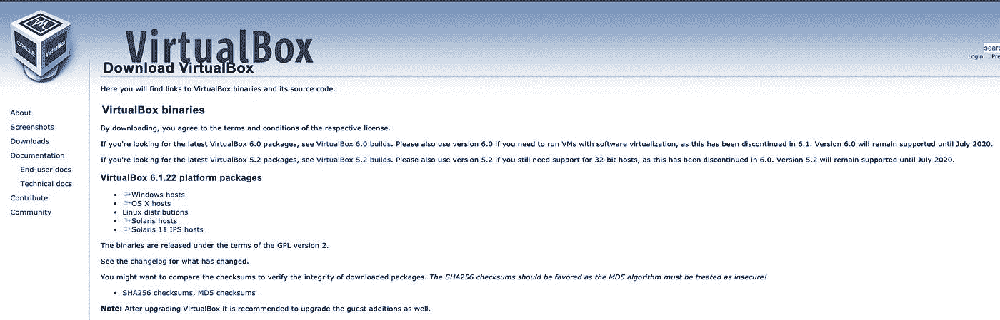
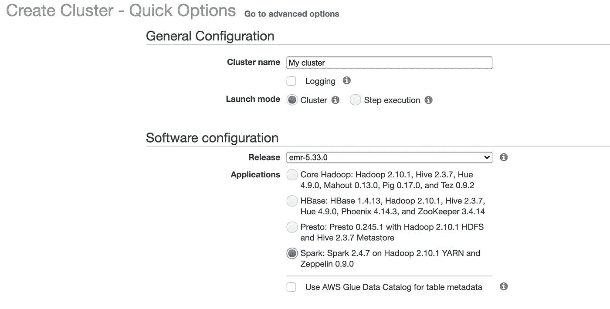

# Pyspark 安装指南

> 原文：<https://towardsdatascience.com/pyspark-installation-guide-140aee9aab87?source=collection_archive---------47----------------------->

## 设置 Pyspark 的全面指南


照片由[seli̇m·阿尔达·埃里希马兹](https://unsplash.com/@selimarda?utm_source=unsplash&utm_medium=referral&utm_content=creditCopyText)在 [Unsplash](https://unsplash.com/s/photos/pipeline?utm_source=unsplash&utm_medium=referral&utm_content=creditCopyText) 上拍摄

如果您需要为数据科学应用程序设置 PySpark 环境的完整指南，请留下来；PySpark 功能，以及有待探索的最佳平台。

# Pyspark 是什么？

Pyspark 是一种健壮的语言，如果您想创建更具可伸缩性的管道和分析，就必须考虑学习这种语言。据数据工程师 Chris Min 称，Pyspark 基本上支持用 Python 编写 spark 应用程序，并以分布式方式高效处理数据。Python 不仅是一门伟大的语言，还是一个一体化的生态系统，可以执行探索性的数据分析，为数据平台创建 ETL，并构建 ML 管道。你也可以说 PySpark 不亚于一个完整的库，可以在单个/集群机器上用于大量的大型数据处理，此外，它甚至不需要 Python 中的线程或多处理模块就可以处理所有这些并行处理。

# Spark 是数据工程的真正交易


照片由[丹尼尔·史密斯](https://unsplash.com/@smudgern6?utm_source=unsplash&utm_medium=referral&utm_content=creditCopyText)在 [Unsplash](https://unsplash.com/s/photos/engineering?utm_source=unsplash&utm_medium=referral&utm_content=creditCopyText) 上拍摄

根据[国际数据科学与分析杂志](https://rdcu.be/clqD9)的报道，Spark 作为一个通用集群计算框架的出现是真实的，它拥有 Python、Scala 和 Java 语言集成的 API。它令人印象深刻的高级内存编程模型和用于结构化数据处理的库、可伸缩 ML 和图形分析增加了它在数据科学行业中的功能。事实上，不可否认的是，在数据处理的某一点上，用 Pandas 进行扩展是很困难的。成为一名数据工程师需要处理大量的大型数据，如果你精通 Spark，这并不是什么大不了的事情。

# 数据科学家为什么要学 spark？


[西格蒙德](https://unsplash.com/@sigmund?utm_source=unsplash&utm_medium=referral&utm_content=creditCopyText)在 [Unsplash](https://unsplash.com/?utm_source=unsplash&utm_medium=referral&utm_content=creditCopyText) 上拍照

作为一名数据科学家，学习 Spark 可以改变游戏规则。对于大型数据处理，Spark 比 Pandas 好得多，但在使用上没有太大的不同，所以改用它不是什么大问题，当您在数据工程操作中获得真正的好处时也是如此。Spark 有各种问题的解决方案，它是一个完整的库集合，可以非常有效地执行逻辑。Spark 确保您获得非常干净和高效的操作体验，在某种程度上甚至比 Pandas 更好，尤其是在处理大型数据集时。Spark 以其高效的高性能分析和用户友好的结构为您所用。

# 探索 Pyspark 设置的所有选项

我也有这篇文章的视频版本，如果你感兴趣的话，可以在我的 youtube 频道上看这个视频

[Pyspark 安装指南](https://youtu.be/Ql_jfk3UnHE)作者 [Anuj Syal](https://www.youtube.com/channel/UCO8XsgcjqArk_mAd1VGBMfg?sub_confirmation=1)

下面是一组您可以考虑用来建立 PySpark 生态系统的各种选项。下面列出了您可以考虑的所有最佳平台:

# 在 Ubuntu 上本地设置 Spark 和 Python

*   安装 Java

```
sudo apt install openjdk-8-jdk
```

*   从`[https://spark.apache.org/downloads.html](https://spark.apache.org/downloads.html)` linux 版本下载 spark
*   设置环境变量`sudo nano /etc/environment`

```
JAVA_HOME="/usr/lib/jvm/java-8-openjdk-amd64"
#Save and exit
```

*   测试`echo $JAVA_HOME`并查看路径以确认安装
*   打开 bashrc `sudo nano ~/.bashrc`，在文件末尾添加`source /etc/environment`
*   这应该可以在 ubuntu 上建立 Java 环境
*   安装 spark，在步骤 2 中下载 spark 后，用以下命令安装

```
cd Downloads
sudo tar -zxvf spark-3.1.2-bin-hadoop3.2.tgz
```

*   为 spark `sudo nano ~/.bashrc`配置环境，并添加以下内容

```
export SPARK_HOME=~/Downloads/spark-3.1 .2-bin-hadoop3.2 export PATH=$PATH:$SPARK_HOME/bin export PATH=$PATH:~/anaconda3/bin export PYTHONPATH=$SPARK_HOME/python:$PYTHONPATH export PYSPARK_DRIVER_PYTHON="jupyter" export PYSPARK_DRIVER_PYTHON_OPTS="notebook" export PYSPARK_PYTHON=python3 export PATH=$PATH:$JAVA_HOME/jre/bin
```

*   保存并退出
*   测试端子中的类型`pyspark`

**没有 ubuntu？使用 VirtualBox**

使用 VirtualBox 在本地安装 Ubuntu。VirtualBox 基本上可以让你在自己的物理计算机上构建一台虚拟计算机。您可以探索 VirtualBox 来设置 Spark 和 Python:(大约 20-30 分钟)

*   从下载 [Virtualbox](https://www.virtualbox.org/wiki/Downloads) 开始。



*来自 Virtualbox 下载的截图*

*   下载 Ubuntu ISO [图片](https://ubuntu.com/download/desktop/thank-you?version=20.04.2.0&architecture=amd64)
*   在 VirtualBox 中，点击新建并设置 ubuntu 64 位环境
*   传入所需的 CPU 内核、内存和存储
*   指向下载的 ubuntu 映像

# 在 Mac 上本地设置 Spark 和 Python

*   确保安装并更新了家酿软件，如果没有，请点击此[链接](https://brew.sh/)或键入终端

```
/usr/bin/ruby -e "$(curl -fsSL https://raw.githubusercontent.com/Homebrew/install/master/install)"
```

*   打开终端并安装 Java

```
brew install java
#to check if java installed?
brew info java
```

*   安装 scala

```
brew install scala
```

*   安装 Spark

```
brew install apache-spark
```

*   安装 python

```
brew install python3
```

*   设置环境 bashrc 打开文件`sudo nano .bashrc`
*   添加以下环境变量

```
#java
export JAVA_HOME=/Library/java/JavaVirtualMachines/adoptopenjdk-8.jdk/contents/Home/
export JRE_HOME=/Library/java/JavaVirtualMachines/openjdk-13.jdk/contents/Home/jre/
#spark
export SPARK_HOME=/usr/local/Cellar/apache-spark/2.4.4/libexec
export PATH=/usr/local/Cellar/apache-spark/2.4.4/bin:$PATH
#pyspark
export PYSPARK_PYTHON=/usr/local/bin/python3 
export PYSPARK_DRIVER_PYTHON=jupyter
export PYSPARK_DRIVER_PYTHON_OPTS='notebook'
```

*   这将配置 pyspark 设置，以测试终端中的类型`pyspark`

# 用 docker 和 jupyter 笔记本在本地设置(我的首选方法)

**docker 是什么？**

Docker 是一个开发、发布和运行应用程序的开放平台。想了解更多关于 docker 的知识，可以查看这个[链接](https://docs.docker.com/get-started/overview/)

用 docker 和 jupyter notebook 设置 Spark 是一项非常简单的任务，只需要几个步骤就可以帮助 PySpark 在 Jupyter Notebook 上运行。遵循下面提到的步骤:

*   安装[对接器](https://docs.docker.com/get-docker/)
*   通过 [jupyter](https://hub.docker.com/u/jupyter) 使用预先存在的 docker 映像“[jupyter/pyspark-notebook](https://hub.docker.com/r/jupyter/pyspark-notebook)
*   拉图像

```
docker pull jupyter/pyspark-notebook
```

*   码头运行

```
docker run -d -p 8888:8888 jupyter/pyspark-notebook:latest
```

*   到 [localhost:8888](http://localhost:8888/) 新建一个笔记本，用`import pyspark`运行 cell

# 数据块设置

Databricks 是一个统一的分析平台，基本上在云中有 Spark 集群，管理得非常好。这是一个易于使用的环境，鼓励用户在完全集成的工作空间中学习、协作和工作。任何 spark 代码都可以轻松调度，没有任何麻烦，因为数据块本身就支持 pyspark

*   开始[创建一个 databricks 帐户](https://databricks.com/try-databricks)(这通常由 databricks 管理员完成)。并将其链接到您首选的云提供商。欲了解更多信息，请查看此[视频](https://www.youtube.com/watch?v=3fqfWYBXj2A)

[数据砖块教程](https://youtu.be/3fqfWYBXj2A)作者[阿努杰·塞亚尔](https://www.youtube.com/channel/UCO8XsgcjqArk_mAd1VGBMfg?sub_confirmation=1)

*   您必须从创建 Databricks 集群开始。
*   通过`import pyspark`创建一个数据块笔记本并进行测试

# AWS EC2 上的 Spark 和 Python

Amazon EC2 是 AWS 提供的虚拟机，这些虚拟机预装了操作系统软件 ami，但其余的依赖项需要单独安装。

*   转到 AWS 控制台和 EC2
*   选择 Ubuntu AMI
*   遵循选项 1 中的步骤

**避免这样做，使用其他选项**

# AWS Sagemaker 笔记本电脑上的 Pyspark

Amazon SageMaker 于 2017 年推出，是一个基于云的机器学习平台，它是完全管理的，并将您的环境从开发、培训和部署中分离出来，让您可以单独扩展它们，同时帮助您优化您的支出和时间。点击几个按钮就可以轻松旋转 Sagemaker 笔记本。Amazon sage maker Notebook instance 是一个运行 Jupyter Notebook 环境的机器学习(ML)计算实例。它带有预配置的 Conda 环境，如 python2、python3、PyTorch、TensorFlow 等

*   登录到您的 aws 控制台并转到 Sagemaker
*   点击笔记本，左侧为笔记本实例
*   点击创建笔记本实例，给它一个名字，并选择所需的配置
*   选择实例类型，也许从小型的 ml.t2.medium 开始，也许以后可以构建一个强大的实例
*   单击“创建”并等待几分钟，然后单击“打开 jupyterlab”转到笔记本
*   创建一个新笔记本，并编写以下代码片段来运行 pyspark

```
import sagemaker_pyspark 
from pyspark.sql import SparkSession, DataFrame 
classpath = ":".join(sagemaker_pyspark.classpath_jars()) spark = SparkSession.builder.config( "spark.driver.extraClassPath", classpath ).getOrCreate()
```

*   如果你有兴趣了解更多关于 Sagemaker 的信息，一定要看看我之前的[视频](https://youtu.be/95332cm5ROo)，[11 分钟内 Sagemaker](https://youtu.be/95332cm5ROo)

[AWS Sagemaker 在 11 分钟内](https://youtu.be/95332cm5ROo)由 [Anuj Syal](https://www.youtube.com/channel/UCO8XsgcjqArk_mAd1VGBMfg?sub_confirmation=1)

# AWS EMR 集群设置

亚马逊 EMR 可能是运行 Spark 的最佳地点之一，它可以帮助你非常容易地创建 Spark 集群，因为它配备了各种功能，如亚马逊 S3 连接，这使它变得非常快和超级方便。此外，与 EC2 现货市场和 EMR 的集成操作管理了扩展。

准确地说，EMR 是一个管理良好的大数据服务，使数据科学家能够在使用 Python、Scala 和 Pyspark 编写的数据科学应用程序的工作中获得帮助。它为 Spark 确保了一个方便的集群设置，让数据科学家有一个开发和可视化的平台。

*   转到 AWS 控制台并搜索 EMR
*   点击创建一个集群
*   在常规配置中为其命名，在软件配置中选择 Spark 应用程序



*   在硬件配置中，选择实例类型，可以从 m1.medium 开始，并选择集群中的实例数量
*   在 Security 中，选择 EC2 密钥对，通常由管理员创建，如果没有，您可以按照右边的步骤创建编程访问密钥供集群使用


*   保留 rest 选项的默认值，并创建集群
*   之后，创建一个 EMR 笔记本，并选择新创建的集群来执行您的工作

# 结论:

Spark 是一个完整的分析引擎，可以帮助数据科学家进行冗长的数据处理操作，这些操作在熊猫身上是相当困难的。因此，学习 PySpark 这个健壮的库可以在数据工程师的工作过程中给予他们很大的帮助。现在您已经了解了各种平台，这些平台使您能够使用管理良好的云来建立 Spark 集群，您可以自己探索它们。

# 在 Linkedin 和 Twitter 上关注我

如果你对类似的内容感兴趣，点击 Medium 上的“关注”按钮，或者在 Twitter 和 Linkedin 上关注我

【https://anujsyal.com】最初发表于[](https://anujsyal.com/pyspark-installation-guide)**。**