# PySpark 神经网络从零开始

> 原文：<https://towardsdatascience.com/pyspark-neural-network-from-scratch-8a19ebad3904?source=collection_archive---------8----------------------->

## [实践教程](https://towardsdatascience.com/tagged/hands-on-tutorials)

## 一个简单的教程，学习如何使用 PySpark 实现一个浅层神经网络(3 个完全连接的层)。

照片由[杰米街](https://unsplash.com/@jamie452?utm_source=medium&utm_medium=referral)在 [Unsplash](https://unsplash.com?utm_source=medium&utm_medium=referral) 拍摄

# 序

本文不打算提供神经网络的数学解释，而只是解释如何使用 Python 中的 Spark (MapReduce)逻辑应用数学方程来运行它。为了简单起见，这个实现只使用 rdd(没有数据帧)。

同样，我假设您的机器上安装了 Spark，您可以运行 spark-submit 或 PySpark Jupyter-Notebook。

本教程中提供的所有代码都可以在这个 [GitHub](https://github.com/MarvinMartin24/PySpark-Neural-Network) 资源库中获得。

<https://github.com/MarvinMartin24/PySpark-Neural-Network>  

为了以防万一，这里有一些资源可以设置您的机器来运行代码:

*   在 Mac 上用 Jupyter 笔记本安装[Spark](https://medium.com/@roshinijohri/spark-with-jupyter-notebook-on-macos-2-0-0-and-higher-c61b971b5007)
*   在 Linux 上用 Jupyter 笔记本安装[Spark](https://sicara.ai/blog/2017-05-02-get-started-pyspark-jupyter-notebook-3-minutes)
*   在 Windows 上安装[Spark with Jupyter Notebook](https://naomi-fridman.medium.com/install-pyspark-to-run-on-jupyter-notebook-on-windows-4ec2009de21f)

此外，在整篇文章中，我将根据我以前的一篇文章来解释三层神经网络背后的数学原理。我将提供的大多数数学公式都是在这里摘录和讨论的:

<https://medium.com/swlh/mathematics-behind-basic-feed-forward-neural-network-3-layers-python-from-scratch-df88085c8049>  

# 为什么是火花？(而不是 Tensorflow 或 Pytorch)

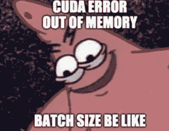

作者在 imgflip.com 创建的 Gif

如果你已经熟悉深度学习，你可能已经遇到了 GPU/CPU 内存限制。当您试图提供太多资源无法处理的输入数据(通过大批量或大输入要素空间)时，通常会出现这种情况。

因此，根据前面的陈述，向您的模型提供几百千兆字节的输入几乎是不可能的。这对于主要使用 CPU 计算的机器学习算法(线性回归、SVM、逻辑回归、朴素贝叶斯等等)来说更是如此。

Spark 是处理大量数据的强大解决方案。它允许在计算机网络(通常称为集群)上分布计算。Spark 有助于在一个循环中多次分析一组数据的迭代算法的实现。Spark 广泛应用于机器学习项目。

您可能已经知道，TensorFlow 或 Pytorch 等著名的库一般用于构建神经网络。使用这些库的好处之一是 GPU 计算，它通过允许并行计算来加速训练。

Spark 的最新版本也允许使用 GPU，但在本文中，我们将只关注 CPU 计算(像神经网络的大多数 scratch 实现一样)以保持简单。本文提出了一个用于学习目的的实现，它不适合工业需求。

# 分类任务

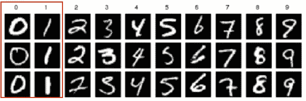

MNIST 数据集样本，*作者图片*

对于本教程，我们将尝试解决众所周知的 MNIST 手写数字分类任务。MNIST 数据集有 60，000 个样本的训练集和 10，000 个样本的测试集。

每个图像都是手写数字(从 0 到 9)，灰度为 28x28。我们 Spark 神经网络的目标是检测图像中的数字。

由于使用浅层全连接神经网络进行图像分类是一项相当困难的任务，因此我们将仅尝试对 0 和 1 的图像进行分类(以获得二元分类器)。在仅选择 0 和 1 图像之后，我们获得 12665 个训练样本和 2115 个测试样本。

# 模型架构

在这一节，我们将定义我们的神经网络的架构(例如，隐藏层的数量，每层神经元的数量，激活函数，损失函数)。为了避免复杂的数学或复杂的模块实现，本文提出了一个 3 层神经网络(只有 1 个隐藏层)。

该模型可以被看作如下:

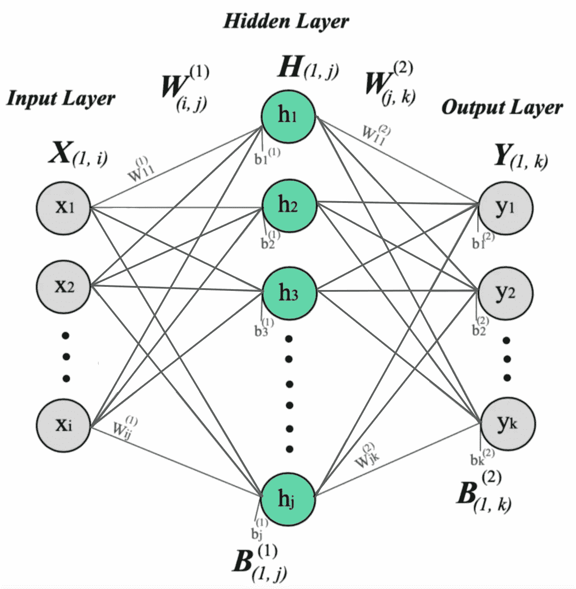

*作者图片*

其中 **X** 为输入层(有 I 个神经元)， **H** 为隐藏层(有 j 个神经元)， **Y** 为输出层(有 k 个神经元)。这个模型有 4 个参数: **W(1)，W(2)，B(1)，B(2)** 。

当我们使用 MNIST 图像作为输入数据时，我们有 **i =784** (28x28)，那么 j 隐藏神经元的数量是任意选择的，这里我们可以使用 **j=64** ，最后输出神经元的数量 **k = 2** ，因为我们有 2 个可能的数字要预测(0 和 1)。

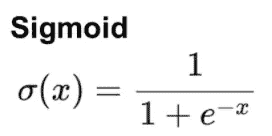

乙状结肠激活功能，*作者图片*

为了激活隐藏和输出神经元，我们将使用 sigmoid 激活函数。

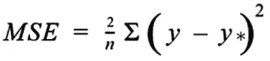

MSE 损失函数，*作者图片*

最后，为了计算一批训练数据的训练误差，我们将使用一个称为均方误差(MSE)的损失函数。

# 数学

如前所述，本文不打算解释神经网络背后的数学，但这里有一个向前和向后传播公式的概述。更多详情，请看我之前在第一节提到的[文章](https://medium.com/swlh/mathematics-behind-basic-feed-forward-neural-network-3-layers-python-from-scratch-df88085c8049)。

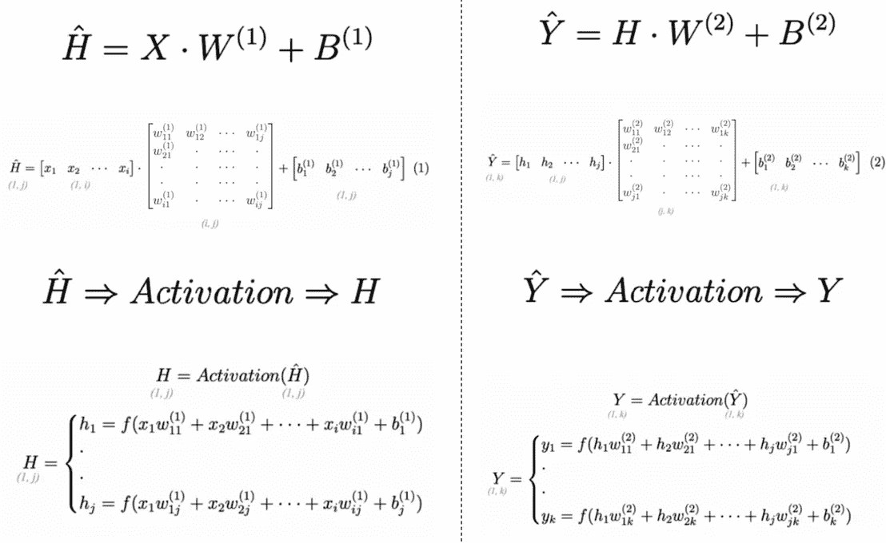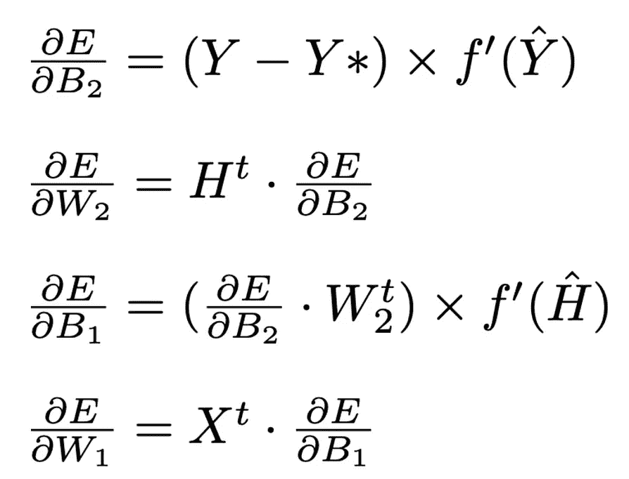

前向(左)和后向(右)传播方程，*作者图片*

**符号**:

*   e 是使用 MSE 对一批训练数据计算的误差。
*   f 和 f’分别是激活函数和激活函数的导数(sigmoid 和 sigmoid 素数)。
*   H^和 h 分别是激活前后的隐藏神经元。
*   Y^和 y 分别是激活前后的输出神经元。
*   y 是模型的预测值
*   Y*是标签(期望的输出)

在训练期间，我们使用**小型批量梯度下降**更新模型参数 W(1)、W(2)、B(1)、B(2)，使用以下等式:

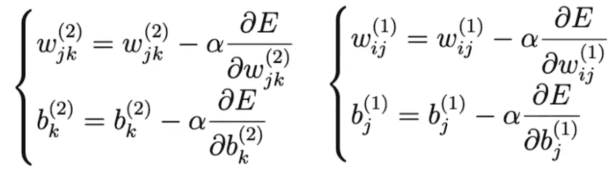

*作者图片*

Alpha 是学习率(我们将使用 0.1)，在代码实现中，我们通过训练数据批次的大小来标准化梯度。

*注意:与库不同，本文的实现不允许在不改变数学公式或实现的情况下添加额外的层。*

# 基于 RDDs 的神经网络训练

以通常的 Python 方式只使用 Numpy 来应用下面的等式是非常简单的，它只需要 Numpy 矢量化运算，但是当涉及到将计算分布到几台机器时，我们就不能再使用这种逻辑了。

## 弹性分布式数据集(RDD)

使用 Spark 的数据集使用 **RDDs** (弹性分布式数据集)存储。RDD 是跨集群节点划分和分布的元素“集合”。借助 RDD，Spark 可以执行迭代和交互式任务，同时保持集群的可伸缩性和容错能力。

我们的 MNIST 数据集通常会作为 rdd 加载(用于训练集和测试集)。rdd 是使用键值对来构造的。因此，在我们的实现中，我们可以将 **train_rdd** 和 **test_rdd** 定义如下:

## MapReduce

这些 rdd 使用两个主要操作来处理:**映射**和**归约**操作。

**→地图操作**

**映射**操作将分批分解计算。群集的驱动程序会将这些批处理中的每一个发送到群集中的不同计算机(取决于群集的资源和配置)。通过这种方式，群集中的每台计算机都能够计算分配给它的数据块的向前和向后传播。

通过查看数学部分的公式，我们可以看到，要计算给定输入的向后传播，我们需要一些向前传播的数据。

通过这种实现，我们在等式中观察到的链式法则可以通过连续执行映射操作来实现:

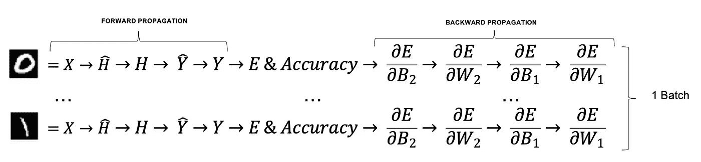

*作者图片*

在上图中，每个箭头代表一个映射转换。这些映射操作是对来自集群中不同计算机的每个输入图像并行执行的。这意味着，如果我们想要增加我们的训练集，我们只需要扩大群集中的资源，就能够计算所有训练图像的梯度。

为了阐明这一步，下面是另一个提供更多粒度的图表:

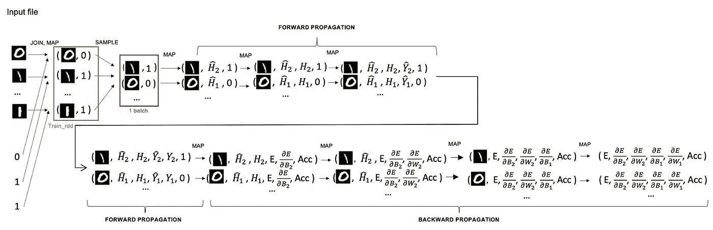

*作者图片*

我们可以看到，我们的原始元组**(图像，标签)**一次又一次地进化映射操作，以最终获得成本、精度以及相对于每个单个训练图像的参数的误差梯度。

注意 **E** 是使用 MSE 计算的单个输入图像的误差。同样地， **Acc** (精度)在这个阶段是表示对同一单个图像的预测成功的布尔值(0 表示错误，1 表示正确预测)。

**→减少操作**

一旦在聚类上计算了前向和后向传播，就应该对结果进行汇总，以获得平均成本、平均精度以及成本在参数上的平均梯度。
这种聚合在训练数据集上执行，并产生如下定义的单个输出元组:

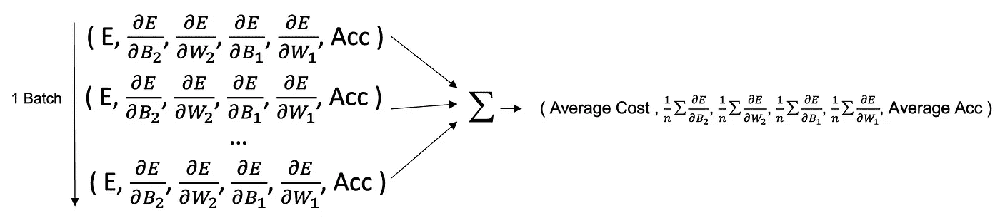

*作者图片*

使用 Spark，这种聚合可以通过使用应用于最终 RDD(由贴图产生)的不同方法来实现。在本文提出的实现中，我们使用了**。reduce()** 分别对所有元组的每个元素求和。其他方法比如。聚合()或。treeAggregate()也广泛用于这种操作(事实上，它们甚至可以比简单的 reduce 方法更加优化)。

最后一个“归约”操作(被认为是 RDD 操作)生成一个包含 6 个项目的 python 列表(成本、B2 的梯度、W2 的梯度、B1 的梯度、W1 的梯度、精度)。所得到的平均梯度可以直接用于使用梯度下降来更新参数，并且可以在训练结束时存储成本和精度用于可视化目的。

# **代码示例**

本节提供了说明上述理论解释的代码。大多数数学公式都嵌入在函数中，以使代码更容易阅读。

算法的核心位于单个 FOR 循环内部(负责历元的迭代)。我们可以看到 8 个**映射**操作，随后是单个**减少**操作(第 95 行到第 105 行)，允许计算小批量梯度，从而计算梯度下降。

请注意，小批量是使用**创建的。样品()**法。该方法返回 **RDD** (train_rdd)的采样子集， **False** 参数表示给定子集不会被多次采样， **0.7** 表示整个训练集的 70%被随机采样以构成小批量(70%相当大，意味着梯度几乎是在训练集上计算的，例如，全批量梯度下降)。训练集越大，这个比率应该越低。

# 培训结果

运行上面这段代码后，我们得到了有希望的结果:

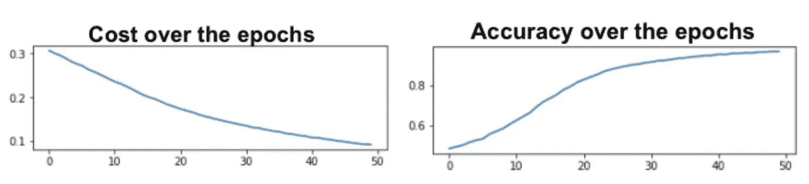

*作者图片*

正如您在上面的图中看到的，我们的成本缓慢但稳定地下降，而准确性在训练数据集的各个时期成比例地增加。

是时候在测试数据集(存储在 **test_rdd** 中)上测试我们的模型了。要做到这一点，非常简单，因为我们现在有了参数 W(1)，W(2)，B(1)，B(2)。代码如下所示:

在第 7 行，使用**。map，**我们简单地将运行前向传播的 predict()函数应用于所有测试示例，并使用**。减少**我们汇总指标(真阳性、假阳性、假阴性、真阴性)。

我们获得了以下指标:

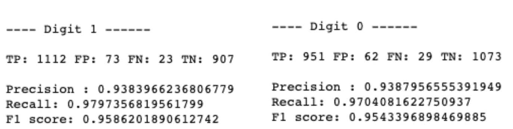

*作者图片*

都在 90%以上，说明我们成功训练了我们的模型！

来自 GIPHY 捕获的 Gif

# 丰富

这个实现是为了学习，熟悉 PySpark 和 MapReduce。所以很多方面都可以改进。

**可能的 Spark 改进:** →使用分区，使用 mapPartitions 或 mapPartitionWithIndex 在小批量上运行计算。这种做法会少一些不恰当的洗牌(主要是由于。样本)。
→使用树聚合在分区上进行更优化的聚合(小批量)
→减少映射操作的数量(因为在底层，当一个动作被触发时，映射操作被合并)。

**可能的神经网络改进:** →使用更模块化的方法更容易地添加层(创建类似 PyTorch 或 Keras 的顺序模型)。
→使用更先进的技术(正则化技术、用于图像分类的 CNN、更好的优化器等等)。

# 结论

神经网络本身可能很难理解，即使使用简单的 python。能够将其扩展到像 Spark 这样更具可扩展性的系统是一个伟大的项目，可以帮助更好地理解其背后的复杂概念。

了解这些技术可能面临的限制也很重要，尤其是在扩展方面。

请随时在评论区与我分享您的反馈和想法💻🔥💻。

谢谢大家！