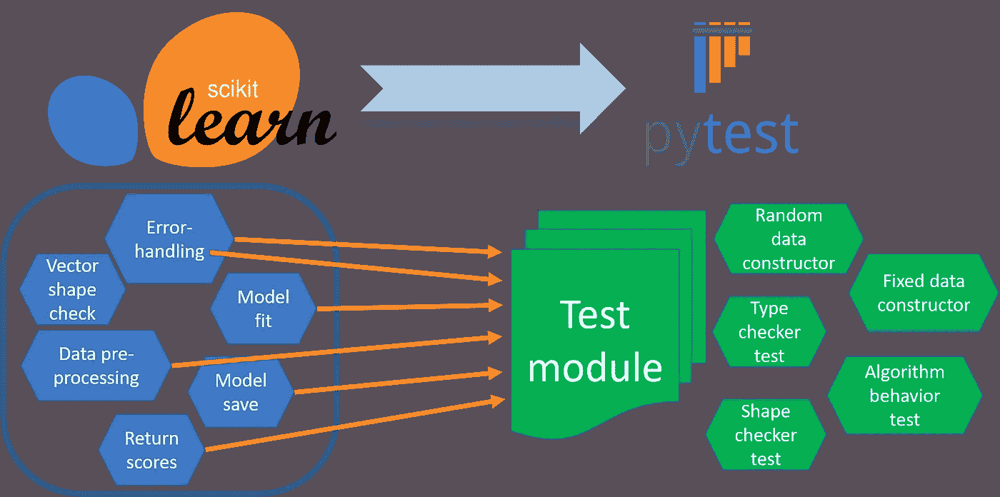
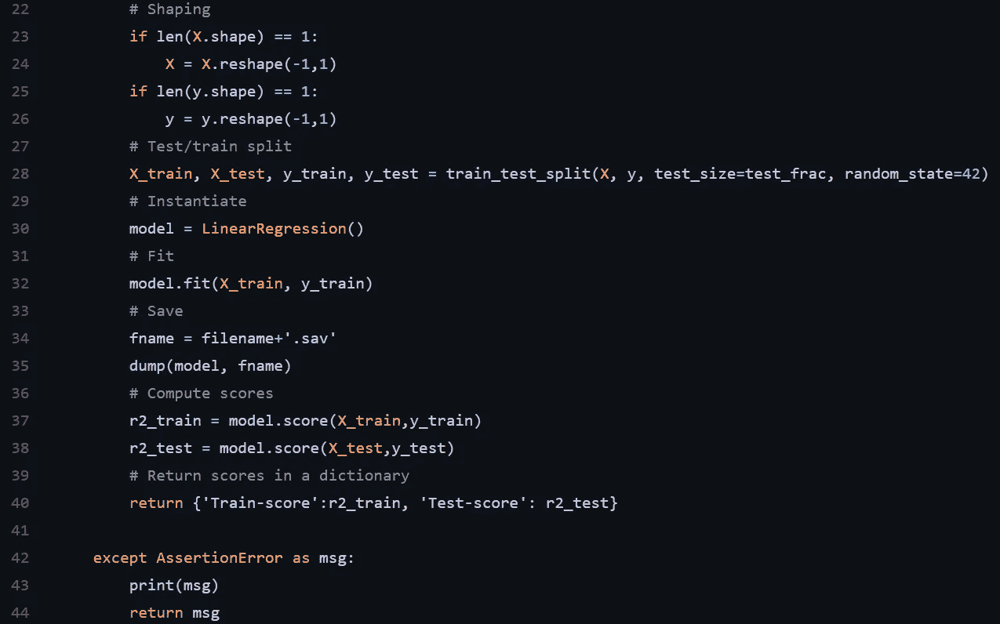
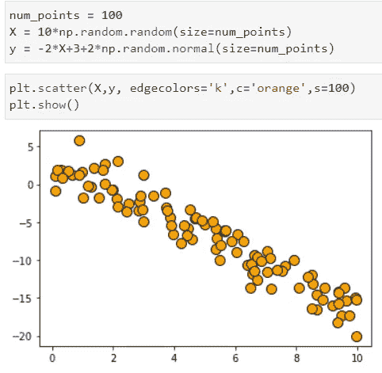
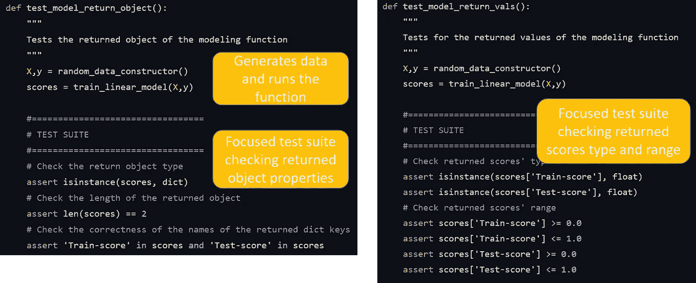

# 用于机器学习的 PyTest 一个简单的基于示例的教程

> 原文：<https://towardsdatascience.com/pytest-for-machine-learning-a-simple-example-based-tutorial-a3df3c58cf8?source=collection_archive---------3----------------------->

## 我们展示了如何使用 PyTest 为一个简单的机器学习模块编写有效的测试函数

图片来源:作者来自 Pixabay [source-1](https://pixabay.com/vectors/check-mark-check-ok-approved-done-42622/) 和 [source-2](https://pixabay.com/vectors/chemistry-test-tube-laboratory-4209556/)

# 介绍

为什么数据科学和机器学习需要软件测试？

这篇文章中有许多精彩的观点，说明了为什么测试可以提高所有商业和行业的任何软件产品/服务的交付、性能和长期盈利能力。

<https://www.westagilelabs.com/blog/why-is-software-testing-and-qa-important-for-any-business/>  

今天，站在 2021 年，我们看到数据科学和机器学习工具、平台和服务越来越多地嵌入到几乎所有行业中，包括医疗保健、金融、制造、零售、娱乐、运输…

机器学习正在触及或将要触及我们生活的几乎所有方面。自然，我们应该期待这些服务背后有一个高质量和健壮的软件框架，它可以预测我最喜欢的餐馆，或者当我在一个新城市迷路时为我提供可靠的指导。**只有当我知道幕后的软件是用成熟可靠的方法测试过的，我才会对这些看起来神奇的服务产生信任**。

在许多情况下，这些新型服务的发展速度甚至高于传统软件产品。加速产品的开发往往是以牺牲质量为代价的。一个好的软件测试策略可以帮助抵消这种权衡。

因此，确保这些新工具经过测试，以获得它们向最终客户承诺的重要特性和功能——可伸缩性、准确性、适应性等，这一点极其重要。

> 只有当我知道幕后的软件是用一种经过验证的、健壮的方法测试过的时候，我才会对这些服务产生信任，这些服务看起来很神奇

# PyTest——什么和为什么？

PyTest 是什么？

据其[网站](https://docs.pytest.org/en/6.2.x/)介绍，“ *pytest 是一款成熟的全功能 Python 测试工具，可以帮助你编写更好的程序。*”

Python 在其安装中提供了一个名为`unittest`的内置测试模块，但是它有一些缺点。这个 GitHub repo 以一种漂亮而直观的方式总结了这两者之间的一些测试场景，

  

互联网上有很多方便的学习和练习 Pytest 的资源。这里是入门教程，

<https://semaphoreci.com/community/tutorials/testing-python-applications-with-pytest>  

而更全面稍微高级一点(处理设计模式)的是下面这个，

<https://realpython.com/pytest-python-testing/>  

然而，**我觉得缺乏高度专注于使用 PyTest 进行机器学习模块的专用教程，并带有清晰的示例**。这是我第一次尝试解决这个问题。

我建议读者在深入研究本文之前，先用简单的 Python 程序和函数复习一下 PyTest 的基本用法，因为本文假设您已经基本熟悉了 PyTest。

那我们就开始吧。

# Scikit-learn 模型培训功能的 Pytest 模块

这是一篇基于示例的文章，我能想到的最典型的例子是用 Pytest 测试一个基于 scikit-learn 的 ML 训练函数。这是任何 Python ML 从业者迟早都极有可能遇到的场景。

这个例子的 GitHub repo 在这里: [**PyTest ML repo**](https://github.com/tirthajyoti/Machine-Learning-with-Python/tree/master/Pytest) 。

这是我们将要探索的想法，

图片来源:作者自制(自带)。Scikit-learn logo 来源:[维基百科(BSD)](https://commons.wikimedia.org/wiki/File:Scikit_learn_logo_small.svg) ，Pytest [版权来源](https://docs.pytest.org/en/stable/license.html)

## 如何基于此回购运行 Pytest

*   安装 pytest `pip install pytest`
*   从 [Github repo](https://github.com/tirthajyoti/Machine-Learning-with-Python/tree/master/Pytest) 中复制/克隆两个 Python 脚本
*   `linear_model.py`有一个使用 scikit-learn 训练简单线性回归模型的函数。注意，它有基本的断言测试和`try-except`构造来处理潜在的输入错误。
*   `test_linear_model.py`文件是测试模块，作为 Pytest 程序的输入。
*   在你的终端上运行`pytest test_linear_model.py -v`来运行测试。您应该会看到如下所示的内容，

## 这是什么意思？

*   终端消息(如上)表明运行了 9 个测试(对应于`test_linear_model.py`模块中的 9 个函数),并且全部通过。
*   它还显示了测试运行的顺序(这是因为您在运行`pytest`命令时在命令行中包含了`- v`参数)。Pytest 允许您随机化测试序列，但是这个讨论将在另一天进行。

## 我的主 ML 函数看起来怎么样？

让我们看看我们正在测试的核心 ML 函数。这是一个简单的函数，用 scikit-learn 库训练一个线性回归模型，并返回 R 分数。它还将训练好的模型保存在本地文件系统上。

我将分两部分向您展示该功能，因为我希望您注意第一部分中的许多`assert`语句。

如果你盯着代码看足够长的时间，你会很容易意识到**函数已经内置了许多类型检查和错误捕捉代码**。

如果函数已经在测试它的传入数据类型和范围，那么我们用 Pytest 检查什么呢？

**PyTest 不检查你的数据。它检查你的代码/程序**。

您仍然必须在主函数中编写各种数据和输入检查代码，以确保数据完整性，并处理 ML 函数部署在实际生产系统中的奇怪情况。

最重要的是，在开发过程中，您希望编写 Pytest 模块来查看您编写的函数是否按预期运行。这包括它自身的错误检查行为。

在这个例子中，我们在原来的`train_linear_model`函数中写了一串`assert`语句，并将它们包装在一个完整的`try...except`块中。**测试代码仅检查我们是否为那些错误的输入情况返回了** `**AssertionType**` **错误**，以及是否为最终用户打印了正确的错误消息。

为了强调这一点，让我以局部的方式重复上面的总体方案，

图片来源:作者制作(自有)

所以，像 ***错误处理*** 或 ***矢量形状检查*** 这样的事情只是你的函数的整体设计模式的一部分。Pytest 将它们视为与其他 ML 特定模式相同，如 ***数据预处理*** 或 ***模型拟合*** 。

在这种情况下，这里是函数的其余部分——这里没有太多断言，只是常规的 ML 内容。您可以在此函数中使用两个 Numpy 数组，它将进行内部测试/训练分割，用训练集拟合模型，在测试集上评估模型并返回分数。

> PyTest 不会检查您的数据。它检查你的代码/程序。你仍然必须在主函数中编写各种数据和输入检查代码，以确保数据完整性和处理奇怪的情况…

## ML 函数捕捉错误的例子

尽管这不是一个直接的 Pytest 主题，但是看到这些断言语句在运行中捕捉错误会很有帮助。这里是一些数据和一个正常的执行，

这里有几个在生产系统中出现的例子，可以用这个函数来处理。

# 现在，让我们看看 Pytest 模块

如果你看一下 [Pytest 模块](https://github.com/tirthajyoti/Machine-Learning-with-Python/blob/master/Pytest/test_linear_model.py)，首先映入你眼帘的是庞大的代码！**为了测试一个 42 行的模块，我们必须编写将近 300 行代码！**

这很正常。您想要测试的特性和功能越多，您的测试套件就会越长。这同样适用于测试更多的*情况*或*拐角情况*。

可以详细过一下[码](https://github.com/tirthajyoti/Machine-Learning-with-Python/blob/master/Pytest/test_linear_model.py)。我将只提到一些突出的特点，

*   注意，`test_linear_model.py`是如何包含 9 个名字以 `**test...**`开头的**函数的。那些包含实际的测试代码。**
*   它还有几个**数据构造函数**，它们的名字不是以`test...`开头，它们被 Pytest 忽略了。但是我们间接需要它们来进行测试。`random_data_constructor`甚至使用一个`noise_mag`参数来控制噪声的大小，以测试线性回归算法的预期行为。请参考`test_noise_impact`功能。

*   注意，我们**需要导入各种库来测试各种东西**，例如，我们导入了像`joblib`、`os`、`sklearn`、`numpy`这样的库，当然，还有来自`linear_model`模块的`train_linear_model`函数。

*   请注意测试函数的**清晰而独特的名称，例如`test_model_return_object()`只检查从`train_linear_model`函数返回的对象，或者`test_model_save_load()`检查保存的模型是否可以正确加载(但不尝试做出预测或任何事情)。总是写简短明了的测试函数，并且只关注一个焦点**。

*   为了检查预测，即训练的模型是否真的工作，我们有`test_loaded_model_works()`功能，其中**使用无噪声的固定数据发生器**(与其他情况相比，我们可以使用有随机噪声的随机数据发生器)。它传递固定的`X`和`y`数据，加载训练好的模型，检查 R ( [回归系数](https://www.geeksforgeeks.org/python-coefficient-of-determination-r2-score/))分数是否完全等于 1.0(对于没有噪声的固定数据集为真)，然后将模型预测与原始地面真实值`y`向量进行比较。

*   注意，前面提到的测试函数**是如何使用一个特殊的 Numpy 测试函数** `**np.testing.assert_allclose**` **代替常规的** `**assert**` **语句**。这是为了避免与模型数据(即 Numpy 数组和涉及线性代数运算的预测算法)相关的任何潜在的数值精度问题。
*   `test_model_works_data_range_sign_change`函数**测试线性回归估计器**的预期行为，即无论数据范围如何，回归分数仍将为 1.0(按 10e-9 或 10e+9 缩放数据)。如果数据以某种方式改变符号，它也会改变预期的行为。

*   `test_additive_invariance`函数测试线性回归估计量的加性不变性。类似地，**你应该考虑你的最大似然估计器的特殊属性，并为它们编写定制的测试**。

*   看一下`test_wrong_input_raises_assertion`函数，当输入各种类型的错误输入参数时，**测试原始建模函数是否产生正确的异常和消息。**

*   最后，`test_raised_exception`函数**使用一个特殊的 Pytest 特性-`[pytest.raises](https://docs.pytest.org/en/reorganize-docs/new-docs/user/pytest_raises.html)`[上下文管理器](https://docs.pytest.org/en/reorganize-docs/new-docs/user/pytest_raises.html)在运行时测试其他异常类型的出现(即不同于** `**AssertionError**` **可能由函数模块**中的 `**assert**` **语句引发)。**

> 您想要测试的特性和功能越多，您的测试套件就会越长。这同样适用于测试更多的*情况*或*角落情况*。

# 摘要

在本文中，我们展示了如何为简单的线性回归函数模块编写 PyTest 模块/测试套件。我们谈到了编写测试的一些一般原则，如数据类型和输入向量形状检查，以及机器学习任务的特定方面，如线性回归估计器在数据规模变化下应如何表现。

Pytest 是一个轻量级且易于使用的实用程序，但它提供了足够的灵活性来在测试套件中构建强大的设计模式。您可以利用这一点，使您的数据科学和机器学习包更加健壮和高效。

*喜欢这篇文章吗？成为* [***中等会员***](https://medium.com/@tirthajyoti/membership) *继续* ***无限制学习*** *。如果你使用下面的链接，* ***我会收到你的一部分会员费，而不会给你带来额外的费用*** *。*

<https://medium.com/@tirthajyoti/membership> 