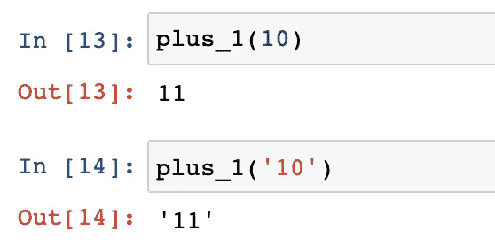
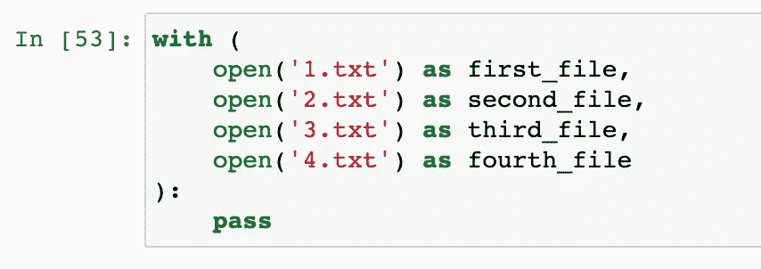

# Python 3.10 五项新功能和注意事项

> 原文：<https://towardsdatascience.com/python-3-10-five-new-features-and-considerations-f775c9432887?source=collection_archive---------2----------------------->


来自[皮克斯拜](https://pixabay.com/?utm_source=link-attribution&utm_medium=referral&utm_campaign=image&utm_content=6706894)的[乔舒亚·沃罗尼耶基](https://pixabay.com/users/joshuaworoniecki-12734309/?utm_source=link-attribution&utm_medium=referral&utm_campaign=image&utm_content=6706894)的图片

## 不仅仅是列表，还有例子和注意事项。

日前，Python 3.10 终于发布了。网上已经有很多文章甚至在它发布之前就已经发表了。然而，我发现大多数都只是列出了新的特性，没有太多的讨论。因此，在我的文章中，我将尝试给出一些关于如何使用这些新特性的例子。还有，我就用我个人的观点来讨论一下。

这些变化我就不一一列举了。如果你想要所有新特性的列表，官方文档总是最好的地方。

<https://www.python.org/downloads/release/python-3100/>  

我不会只关注特性，我还会建议如何获得 Python 的这个新版本，这样我们都可以开始玩了。既然它已经发布了，我可以使用我最喜欢的 Python 环境管理工具包——Anaconda 来下载它。如果你还没拿到，可以免费下载。

<https://www.anaconda.com/products/individual>  

安装后，我们可以使用最新版本 3.10 创建一个新的 Python 虚拟环境。

```
conda create --name py310 python=3.10
```

恭喜你！已经安装了最新的 Python。

# 1.允许将联合类型写成 X | Y


图片来自 [Pixabay](https://pixabay.com/?utm_source=link-attribution&utm_medium=referral&utm_campaign=image&utm_content=2156174)

第一个重要特性是联合类型语法。具体来说，我们可以在两个或多个类型之间使用一个管道来表示“不是这个类型就是那个类型”。

这种语法最常见的用法是检查对象的类型。我们现在可以像下面这样编写代码，而不是像`isinstance(x, int) or isinstance(x, str)`那样编写多个条件。

```
isinstance(x, int | str)
```

请参见下面的示例。


我首先想到的是，我们可以使用这个语法来编写一些健壮的条件。例如，一个变量应该是一个整数，但也可以是“无”，这也是有效的，那么我们可以这样写条件。

```
isinstance(x, int | None)
```


除此之外还有函数签名。现在，我们可以用这个语法来表示一个参数可以有多种类型。例如，我们想编写这样一个函数，将传递给它的参数加 1。参数可以是整数或字符串，返回值应该与原始类型相同。

```
def plus_1(number: int | str):
    if isinstance(number, int):
        return number + 1
    else:
        number = int(number)
        return str(number + 1)
```

我们可以验证它是否如预期的那样工作。



# 2.向 zip()添加可选的长度检查


来自 [Pixabay](https://pixabay.com/?utm_source=link-attribution&utm_medium=referral&utm_campaign=image&utm_content=4615782) 的 [Stjepan Zlodi](https://pixabay.com/users/ylodi-9215071/?utm_source=link-attribution&utm_medium=referral&utm_campaign=image&utm_content=4615782) 的图片

在我之前的一篇文章中已经对`zip()`函数进行了深入的讨论。这里也提到了 Python 3.10 中的这个新特性。这是 Python 中一个非常强大和有用的函数。如果不是太了解，强烈推荐看我的文章。

</fasten-python-objects-using-zip-88a1e7a68c7>  

简而言之，`zip()`函数将从两个容器(比如一个列表)中逐个获取项目，并将两个容器中相应位置的项目放在一个元组中。看看下面的例子。

```
list(
    zip([1, 2, 3], ['a', 'b', 'c'])
)
```


默认情况下，如果我们提供两个不同长度的列表，长列表中的额外项目将被忽略。这也被称为“木桶效应”。

```
list(
    zip([1, 2, 3], ['a', 'b', 'c', 'd'])
)
```


在上面的例子中，第二个列表中的项目`'d'`被忽略。

然而，有时我们可能没有意识到有些项目被忽略了，因为函数会自动忽略。因此，在 Python 3.10 中，引入了一个名为“strict”的新标志，以强制两个列表具有相同的长度。

```
list(
    zip([1, 2, 3], ['a', 'b', 'c', 'd'], strict=True)
)
```

如果我们显式设置`strict=True`，当长度不同时会抛出异常。


# 3.现在正式允许带括号的上下文管理器


图片来自 [Pixabay](https://pixabay.com/?utm_source=link-attribution&utm_medium=referral&utm_campaign=image&utm_content=15712) 的 [PublicDomainPictures](https://pixabay.com/users/publicdomainpictures-14/?utm_source=link-attribution&utm_medium=referral&utm_campaign=image&utm_content=15712)

在以前的版本中，在一个“with”语句中包含多个子句有点痛苦。例如，如果我们想在一个“with”语句中打开两个文件，我们必须将它们写在一行中。

```
with open('sample_data/mnist_test.csv') as test, open('sample_data/mnist_train_small.csv') as train:
    pass
```

在笔记本里，是这样的。


当我们在`open()`函数中有非常长的参数时，这将是非常痛苦的。

有一个解决方案可以让我们的代码更好，那就是添加一个反斜杠，这样我们就可以把它们分成多行。

```
with open('sample_data/mnist_test.csv') as test, \
     open('sample_data/mnist_train_small.csv') as train:
    pass
```

它看起来像这样。


这肯定是更好，但仍然有点丑陋的反斜线。

现在，在新版本中，我们可以将放入一对括号中，这样代码会更整洁，可读性更好。

```
with (open('1.txt') as first_file,
      open('2.txt') as second_file):
```


就我个人而言，我希望将代码编写如下，我认为这样可读性会更好，尤其是当我们有两个以上的项目时。

```
with (
    open('1.txt') as first_file,
    open('2.txt') as second_file,
    open('3.txt') as third_file,
    open('4.txt') as fourth_file
):
```



# 4.新语法:匹配…大小写…


图片由[埃尔默·盖斯勒](https://pixabay.com/users/pxel_photographer-17831348/?utm_source=link-attribution&utm_medium=referral&utm_campaign=image&utm_content=6363378)从[皮克斯拜](https://pixabay.com/?utm_source=link-attribution&utm_medium=referral&utm_campaign=image&utm_content=6363378)拍摄

Python 中的“switch … case …”语法颇具争议。就连 Python 之父 Guido 也不支持在 Python 中加入这样的语法。然而，它仍然在这个新版本中发布，我实际上确信这个语法是好的。

请注意，人们通常说“switch case ”,因为这在其他编程语言中也很常用。然而，在 Python 中，关键字是“匹配…大小写…”。

例如，我们可以根据 HTTP 代码返回不同的消息。

```
def http_error(status):
    match status:
        case 400:
            return "Bad request"
        case 401:
            return "Unauthorized"
        case 403:
            return "Forbidden"
        case 404:
            return "Not found"
        case _:
            return "Unknown status code"
```


在这个例子中，保守的开发人员可能仍然会争辩说，它实际上并没有为提高代码的可读性提供任何好处。我们可以用 if-else 重写这个函数，也不算太差。

```
def http_error(status):
    if status == 400:
        return "Bad request"
    elif status == 401:
        return "Unauthorized"
    elif status == 403:
        return "Forbidden"
    elif status == 404:
        return "Not found"
    else:
        return "Unknown status code"
```

事实上，对于这样一个通用用例，匹配用例语法并没有太大的区别。然而，在我看来，新的关键字“match”表明了这种语法的核心逻辑和目的。当我们想为一个表达式“匹配”一些模式时，这意味着让我们的生活更容易。

例如，我们想写一个函数从一个元组中返回主机 URL、端口号和协议类型。然而，元组只能有两个项目(主机和端口)。在这种情况下，我们希望返回一个默认协议“https”。如果元组已经提供了协议，我们将需要返回它。

使用 if-else 语法，我们必须编写如下代码。

```
def get_url(info):
    if isinstance(info, tuple) and len(info) == 2:
        host, port = info
        protocol = "http"
    elif isinstance(info, tuple) and len(info) == 3:
        host, port, protocol = info

    return host, port, protocol
```


实际上也不算太糟。然而，如果我们考虑我们试图匹配的两种模式，我们可以使用新的语法重写代码，如下所示。

```
def get_url(info):
    match info:
        case host, port:
            protocol = 'http'
        case host, port, protocol:
            pass

    return host, port, protocol
```


哇！非常整洁干净，可读性比 if-else 版本好很多。这就是我对我们应该如何使用这个新语法的想法！

# 5.增强型错误消息


图片由[安德鲁·马丁](https://pixabay.com/users/aitoff-388338/?utm_source=link-attribution&utm_medium=referral&utm_campaign=image&utm_content=1951987)来自 [Pixabay](https://pixabay.com/?utm_source=link-attribution&utm_medium=referral&utm_campaign=image&utm_content=1951987)

以前 Python 的错误信息有时候并不理想。例如，下面的代码缺少右大括号。

```
my_dict = {'name': 'Chris', 'age': 33
```


错误消息将简单地告诉我们解析代码时没有成功。

在新版本中，这些错误信息在很大程度上得到了改进。它会直接告诉我们为什么解析代码失败。


一些错误消息让开发者感到温暖，太:D 了


# 摘要


来自 [Pixabay](https://pixabay.com/?utm_source=link-attribution&utm_medium=referral&utm_campaign=image&utm_content=6679843) 的 [yamabon](https://pixabay.com/users/yamabon-11501053/?utm_source=link-attribution&utm_medium=referral&utm_campaign=image&utm_content=6679843) 图片

在这篇文章中，我介绍了几天前发布的 Python 3.10 中最重要的 5 个新特性。希望这将是有帮助的，并展示了这些新功能以及我提供的例子。

<https://medium.com/@qiuyujx/membership>  

如果你觉得我的文章有帮助，请考虑加入 Medium 会员来支持我和成千上万的其他作者！(点击上面的链接)