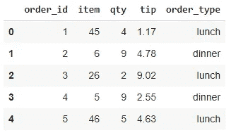
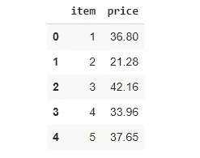
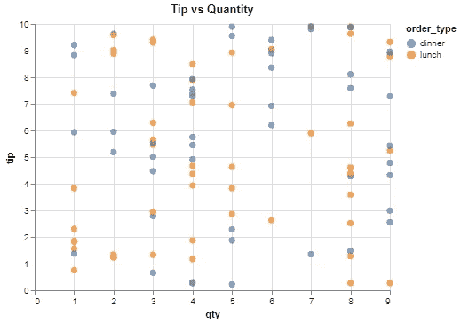
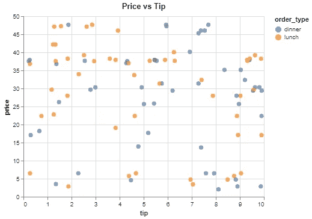
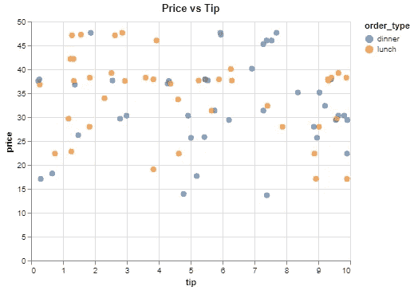
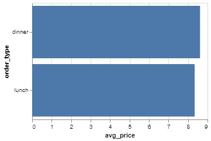

# Python Altair 将过滤、分组和合并结合到一个数据可视化中

> 原文：<https://towardsdatascience.com/python-altair-combines-filtering-grouping-and-merging-into-a-single-data-visualization-13e7e8306b6c?source=collection_archive---------30----------------------->

## 探索性数据分析的完整工具


照片由[艾萨克·史密斯](https://unsplash.com/@isaacmsmith?utm_source=unsplash&utm_medium=referral&utm_content=creditCopyText)在 [Unsplash](https://unsplash.com/s/photos/chart?utm_source=unsplash&utm_medium=referral&utm_content=creditCopyText) 拍摄

Altair 是 Python 的统计数据可视化库。它为创建静态和交互式可视化提供了简单易懂的语法。

我认为 Altair 与其他常见的数据可视化库的区别在于，它将数据分析组件无缝集成到可视化中。因此，它是一个非常实用的数据探索工具。

在本文中，我们将逐步了解如何创建包含过滤、分组和合并操作的可视化。最后，我们将创建一个信息丰富的图，可用作探索性数据分析过程的一部分。

我们首先生成由两个数据帧组成的模拟数据。第一个包含餐馆订单，另一个包含订单中商品的价格。

```
# import libraries
import numpy as np
import pandas as pd
import altair as alt
import random# mock data
orders = pd.DataFrame({
   "order_id": np.arange(1,101),
   "item": np.random.randint(1, 50, size=100),
   "qty": np.random.randint(1, 10, size=100),
   "tip": (np.random.random(100) * 10).round(2)
})prices = pd.DataFrame({
   "item": np.arange(1,51),
   "price": (np.random.random(50) * 50).round(2)
})order_type = ["lunch", "dinner"] * 50
random.shuffle(order_type)
orders["order_type"] = order_type
```

这些值使用 numpy 函数生成。然后，我们使用 100 个商品的列表添加订单类型。Python 的 random 模块下的 shuffle 函数是用来随机化列表的。

让我们看一下刚刚创建的数据框。



订单数据框架



价格数据框架

您可能会认为我们可以在订单表中输入商品价格。我们以这种方式设计数据帧，以便能够使用合并操作。此外，它稍微演示了关系数据库的概念。

让我们首先创建一个简单的情节来介绍 Altair 语法的结构。

```
alt.Chart(orders).mark_circle(size=50).encode(
   x="qty", y="tip", color="order_type"
).properties(
   title = "Tip vs Quantity"
)
```



(图片由作者提供)

我们首先将数据传递给一个顶级图表对象。数据可以是 Pandas 数据框的形式，也可以是指向 json 或 csv 文件的 URL 字符串。然后，选择可视化的类型(例如`mark_circle`、`mark_line`等)。

`encode`函数指定在给定的数据框中绘制什么。因此，我们在编码函数中写的任何东西都必须链接到数据帧。最后，我们使用 properties 函数指定绘图的某些属性。

考虑这样一种情况，我们需要创建价格和小费值的散点图。它们在不同的数据帧中。一种方法是合并两个数据框，并在散点图中使用这两列数据。

Altair 提供了一种更实用的方法。它允许在不同的数据框中查找列。直觉和熊猫的合并功能一样。

```
alt.Chart(orders).mark_circle(size=50).encode(
   x="tip", y="price:Q", color="order_type"
).transform_lookup(
   lookup="item",
   from_=alt.LookupData(data=prices, key="item", fields=["price"])
).properties(
   title = "Price vs Tip"
)
```



(图片由作者提供)

`transform_lookup`功能类似熊猫的`merge`功能。用于匹配观察值的列(即行)被传递给`lookup`参数。`fields`参数用于从其他数据框中选择所需的列。

我们还可以将过滤组件集成到我们的绘图中。我们把价格超过 10 美元的数据点标出来。

```
alt.Chart(orders).mark_circle(size=50).encode(
   x="tip", y="price:Q", color="order_type"
).transform_lookup(
   lookup="item",
   from_=alt.LookupData(data=prices, key="item", fields=["price"])
).transform_filter(
   alt.FieldGTPredicate(field='price', gt=10)
).properties(
   title = "Price vs Tip"
)
```



(图片由作者提供)

`transform_filter`功能用于过滤。`FieldGTPredicate`处理“大于”条件。Altair 还为“等于”、“小于”、“范围”等其他条件提供了谓词。

除了过滤和合并，Altair 还允许在绘图前对数据点进行分组。例如，我们可以创建一个条形图，显示每种订单类型的平均价格。此外，我们可以为价格低于 20 美元的商品执行此操作。

```
alt.Chart(orders).mark_bar().encode(
   y="order_type", x="avg_price:Q"
).transform_lookup(
   lookup="item",
   from_=alt.LookupData(data=prices, key="item", fields=["price"])
).transform_filter(
   alt.FieldLTPredicate(field='price', lt=20)
).transform_aggregate(
   avg_price = "mean(price)", groupby = ["order_type"]
).properties(
   height=200, width=300
)
```



(图片由作者提供)

让我们详细说明每一步:

*   `transform_lookup`:从价格数据框中查找价格。
*   `transform_filter`:过滤 20 美元以下的价格。
*   `transform_aggregate`:按订单类型对价格进行分组，并计算平均值。

确保将聚合列的名称传递给`encode`函数。

## 结论

筛选、合并和分组是探索性数据分析过程中必不可少的。Altair 允许在创建数据可视化的同时执行所有这些操作。在这个意义上，Altair 也可以被认为是一个数据分析工具。

我们在文章中做的例子可能看起来不那么有用，但是它们清楚地解释了这些组件是如何在可视化中使用的。

感谢您的阅读。如果您有任何反馈，请告诉我。