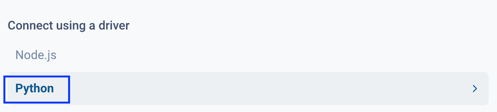
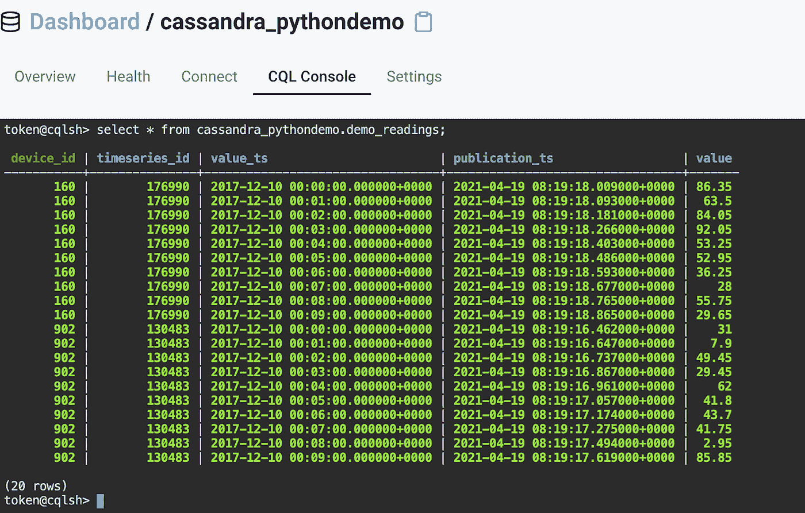

# 面向初学者的 Python 和 Apache Cassandra

> 原文：<https://towardsdatascience.com/python-and-apache-cassandra-for-beginners-d9682f2f43c1?source=collection_archive---------10----------------------->

## [实践教程](https://towardsdatascience.com/tagged/hands-on-tutorials)

## 了解如何将 Python 连接到 Cassandra，并使用 Datastax ODBC 驱动程序插入数据，以及使用 Astra web 控制台查询数据。

Python 是使用最广泛的编程语言之一，拥有庞大的支持社区，而 Cassandra 是最受欢迎的 NoSQL 数据库之一，传统上用于 web 应用程序存储或依赖于快速数据检索的以数据为中心的应用程序。总之，它们在各行各业和学术界的许多应用中都能找到。

本 Cassandra Python 教程面向 Python 和 Cassandra 初学者。你可以在整篇文章中看到的代码样本可以在这个 [Github 库](https://github.com/andyadamides/python-cassandra-intro)中公开获得。我们将指导您设置 Python 和 DataStax Astra，这是一个托管的 Cassandra as-a-Service 应用程序，可以在任何云上免费运行。我们将向您展示如何将 Python 连接到 Cassandra，如何使用 Datastax ODBC 驱动程序插入数据，以及如何使用 Astra web 控制台通过 CQL 控制台查询存储在 Cassandra 中的数据。即将发布的 Python SDK for Astra 将支持针对给定 Astra 数据库实例的 REST、GraphQL 和无模式 JSON 文档 API 的 API 访问，这将在下一篇文章中讨论。


# Python 入门

Python 在过去十年中广受欢迎，这是有充分理由的。简单地说，它是一种可读性很强、简单易用的编程语言。它也很容易上手，但同时它可以用于各种不同的应用程序和不同的领域。存在多个 Python 库，允许解决诸如字符串操作、实现机器学习算法、[、面向对象](https://en.wikipedia.org/wiki/Object-oriented_programming)编程和数据工程目的等问题，我们将在本教程中重点介绍这些问题。

# 安装 Python

Python 有两个主要版本，Python 2 和 Python 3。前者不再接收更新，也不再受支持，而后者是最新版本，也是我们将使用的版本。无论您使用什么操作系统，安装 Python 都很容易。

在你的电脑上安装 Python 的最好方法是通过官方的 Python 页面。根据你使用的操作系统，从官方[页面](https://www.python.org/downloads/release/python-394/)选择合适的安装程序。

要验证 Python 是否已正确安装在您的计算机上，请打开命令行窗口并执行以下操作:

```
python --*version*
```

这将返回您刚刚安装的版本:

```
Python 3.8.2
```

如果你正确地安装了 Python 并且得到了一个**命令没有找到**或者类似的错误信息，这很可能意味着 Python 没有被正确地添加到你的操作系统的 PATH 变量中；所以一定要仔细检查 Python 的安装路径是否是该路径的一部分。

# 安装 Python 依赖项

像任何其他编程语言一样，Python 也使用单独的实用程序来安装包。Python 内置的包管理器叫做 **pip。**除了来自 pip，其他流行的 Python 包管理器包括[**virtualenv**](https://pypi.org/project/virtualenv/)**和 [**conda**](https://www.anaconda.com/products/individual) **，**但是为了这个 Cassandra Python 教程的目的，我们将使用 **pip。****

**每一个使用 **pip，**的 Python 项目通常会在资源库的根目录下有一个名为 **requirements.txt** 的文件，就像我们在 [Github 项目中有 requirements.txt 一样。这个文件的内容非常简单；每一行都由包的名称组成，可选地后跟该包的特定版本:](https://github.com/andyadamides/python-cassandra-intro/blob/main/requirements.txt)**

```
cassandra-driver==3.25.0
numpy==1.19.3
astrapy==0.0.2
simplejson==3.17.2
```

**要安装所需的包，包括 Cassandra Python 库 **cassandra-driver** 和 **astrapy** ，只需在命令行中导航到根目录并执行:**

```
pip install -r requirements.txt
```

**后台发生的事情是 **pip** 将从默认和公共 Python 包索引 [PyPi](https://pypi.org/) 中获取这些包。您可以查看每个包的 PyPi 主页，包括可用版本、进一步的文档、每个包的 Github 库的链接以及如何使用每个包的示例。例如，这是[数字](https://pypi.org/project/numpy/)的页面，这是[卡珊德拉驱动](https://pypi.org/project/cassandra-driver/)的页面。**

**这就完成了我们 Python 项目的依赖项的安装。**

# **卡珊德拉是什么？**

**Cassandra 是领先的开源 NoSQL 分布式数据库管理系统(DBMS)。与 Oracle 或 SQL Server 等传统 SQL DBMS 不同，NoSQL 数据库遵循不同的存储模型。在 SQL 系统中，数据组织在由固定模式驱动的表和列中，而在 Cassandra 中，固定模式并不强制实施，允许同一表(或 Cassandra 中通常称为表的列族)中有动态数量的列，并且能够处理和存储非结构化数据。除此之外，用于与 Cassandra 交互的语言是传统 SQL 的变体(和子集)，称为 Cassandra 查询语言(CQL)。**

**90%的财富 100 强公司都在使用 Cassandra。快速增长的事实可以用其丰富的功能集来解释，这些功能对大量数据特别有益。其分布式体系结构可确保超快的写入性能和数据查询的快速检索，无单点故障，从而实现 100%的高可用性，并显著缩短上市时间，因为 Cassandra 集群的部署、管理和维护非常简单。**

# **建立卡珊德拉数据库**

**Cassandra 是开源的，这意味着它可以免费使用。根据您使用的操作系统，您可以在本地下载 Cassandra 及其依赖项，并进行配置和安装。Kubernetes 用户也可以使用 Docker 图像，但所有这些过程可能会令人厌倦，尤其是对于第一次使用的用户。**

**开始使用 Cassandra 的最佳方式是通过一个可从网上获得的托管 Cassandra 数据库。Datastax Astra 是一个由 Apache Cassandra 支持的无服务器数据库即服务，只需几次点击即可启动，有一个慷慨的免费层，可在主要的云提供商(亚马逊网络服务，Azure 或谷歌云)中使用。**

**官方 Astra 指南提供了创建 Astra 服务所需的所有信息；你需要注册一个账户，然后选择更多的细节，比如选择一个云提供商和命名你的数据库。**

# **使用 astrapy 生成 JSON 并插入到 Astra 中**

**使用 React、Angular 或 Vue 作为前端？ [**astrapy**](https://pypi.org/project/astrapy/) 是一个方便的 Cassandra Python 库，它在 Datastax Astra 的 REST API 上创建了一个无模式的、面向 JSON 文档的 API。在这个例子中，我们将使用一个令牌(而不是客户端密码)向 Astra 认证，生成一个伪 JSON 文档，并发出一个 PUT REST 调用，将 JSON 插入到 Astra 集合中。**

**在浏览代码之前，确保你已经安装了 **astrapy** 和 [simplejson](https://pypi.org/project/simplejson/) 库。你可以通过执行 **pip 冻结来检查。**如果你没有它们，用**pip install-r requirements.txt .**从项目根目录下的 requirements . txt 文件中安装它们**

**首先在代码中，我们将得到一个 Astra HTTP 客户端。在此之前，我们需要生成一个应用程序令牌，并总共导出五个环境变量。导航至 Datastax Astra 主页，点击数据库名称:**

****

**然后，在数据库名称下方，点击**连接**:**

****

**这一次，使用 API 选项保持在**连接上:****

****

**注意您需要在页面右侧导出的 5 个环境变量中的 3 个:**

*   ****ASTRA_DB_ID****
*   ****ASTRA_DB_REGION****
*   ****ASTRA_DB_KEYSPACE****

**对于**ASTRA _ DB _ APPLICATION _ TOKEN**环境变量，让我们生成**连接凭证**。点击显示“**此处”**的地方:**

****

**将弹出一个新页面，选择角色(选择**读/写用户**)并点击**生成令牌**:**

****

**一旦你这样做，你会得到一个窗口，所有的细节:**

****

**确保将其他(客户 Id、客户机密)信息保存在您可以参考的地方，因为我们稍后会用到它们。导出**ASTRA _ DB _ APPLICATION _ TOKEN**环境变量，该变量等于在此步骤中生成的令牌..**

**为第五个也是最后一个环境变量 **ASTRA_DB_COLLECTION 填入您喜欢的任何名称。**在我这里这个变量等于 **demo_book。****

**一旦根据所使用的操作系统导出了五个环境变量，就可以开始执行 Python 脚本了。第一部分将使用令牌身份验证来验证 Datastax Astra:**

**一旦我们有了 HTTP 客户机对象，它就被传递给下一个方法，在这个方法中，我们创建一个 JSON 文档并将其插入到 Astra 集合中:**

**要执行 Python 脚本，请键入**Python JSON _ document _ API . py**并按回车键。**

**最后，我们可以通过发出一个 **curl** 命令来确认文档已经成功插入，并通过如下命令行检索它:**

**这个命令将返回所有插入的文档，在我们的例子中:**

# **使用驱动程序建立从 Python 到 Astra 的连接**

**Cassandra Python[**Cassandra-driver**](https://pypi.org/project/cassandra-driver/)使得在 Datastax Astra 中认证和插入表格数据变得容易。到目前为止，我们已经确保安装了 Python，并且有了一个 Astra 无服务器实例，我们可以使用一个无模式的、面向 JSON 文档的 API 来处理它。让我们继续使用 cassandra-driver 作为 Astra Python SDK 中文档 API 的模式驱动替代，与我们的 Astra 数据库进行实际交互。**

**在开始编码之前，我们需要了解配置从 Python 到 Astra 的连接的先决条件。在 Astra 仪表板页面上，点击页面左侧的数据库名称:**

****

**然后，在数据库名称的正下方，点击**连接**:**

****

**从驱动列表中选择 **Python** :**

****

**现在，您会看到页面右侧弹出了一个详细的步骤指南。首先，我们将确保下载**包**，并将其存储在我们的本地存储中。我们将在后面的代码中引用这一点。在页面右侧，点击**下载捆绑包**按钮，然后点击**安全连接捆绑包**弹出按钮**

****

**这将下载从浏览器配置的默认下载目录中的包。这通常位于您的主目录中，包的名称遵循特定的命名格式**secure-connect-<database-name>。例如，在我们的例子中，它被命名为**secure-connect-Cassandra-pythondemo . zip。******

# **如何在 Astra 中创建 Cassandra 表**

**在本节中，我们将使用 Python 生成一个虚构的[时间序列](https://en.wikipedia.org/wiki/Time_series)数据集，并使用 Datastax Python ODBC/JDBC 驱动程序将数据插入到我们的 Astra 数据库中。**

**首先，我们将创建 Astra 表来保存我们的数据。导航至 Astra 仪表板页面，点击页面左侧的数据库名称:**

****

**点击 Cassandra 查询语言(CQL)控制台:**

****

**从 [Github repo](https://github.com/andyadamides/python-cassandra-intro) 中复制**intro/demo _ readings . SQL**并粘贴到 CQL 控制台上，然后点击回车:**

**这就完成了 Astra 表的创建。正如您在上面的 [DDL](https://en.wikipedia.org/wiki/Data_definition_language) 脚本中所看到的，这个 timeseries 数据集由浮点值度量(*值*)组成，它是在连续的时间间隔(*值 _ts* )中为一个虚构的硬件对(*设备 _id* 和*时间序列 _id* )捕获的，同时还包括记录被捕获时的时间戳(*发布 _ts* )。**

# **用 Python 在 Cassandra 中插入数据**

**创建 Cassandra 表之后，让我们导航到 **Python** 。首先，确保 **git 在您的本地文件系统中克隆**项目:**

```
git clone git@github.com:andyadamides/python-cassandra-intro.git
```

***注意*:如果您没有安装 git，请按照本 [Github 指南](https://github.com/git-guides/install-git)进行安装。**

**该程序由一个名为 **main.py** 的 Python 脚本组成。入口点位于脚本的最后两行。Python 解释器通过设计知道从脚本的这一部分开始执行:**

```
if __name__ == “__main__”:
    main()
```

****main()** 方法执行两个高级任务，它建立与 Astra 数据库的连接，然后插入已经生成的数据:**

```
**def** main():
“””The main routine.”””
    session = getDBSession()
    generateDataEntrypoint(session)
```

**建立与 Astra 数据库的连接发生在 **getDBSession()** 方法中:**

**在这一步，确保填写正确的连接 Astra 的详细信息。特别要确保**导出**Python 代码期望的三个环境变量，以便安全成功地建立到 Astra 的连接:**

*   **ASTRA_PATH_TO_SECURE_BUNDLE**
*   **ASTRA_CLIENT_ID**
*   **阿斯特拉 _ 客户 _ 秘密**

****注:** ASTRA_CLIENT_ID 和 ASTRA_CLIENT_SECRET 是在上面的部分生成的。**

**找到上一步中下载的包 zip，并将其复制到一个目录中，该目录可以配置为 ASTRA_PATH_TO_SECURE_BUNDLE 环境变量的一部分:**

> **cloud_config= {**
> 
> **' SECURE _ connect _ BUNDLE ':OS . environ . get(' ASTRA _ PATH _ TO _ SECURE _ BUNDLE ')**
> 
> **}**

**例如，如果将安全包 zip 放在 Python 项目的根目录中，ASTRA_PATH_TO_SECURE_BUNDLE 环境变量的值需要等于'**../secure-connect-Cassandra-pythondemo . zip**，项目的根目录将包括以下文件和文件夹:**

****

**同样，用上一步中的值设置 ASTRA_CLIENT_ID 和 ASTRA_CLIENT_SECRET 环境变量。**

**一旦建立了连接，我们就通过传递在上一步的 **getDBSession()** 方法中生成的 Astra **session** 对象，在**generateDataEntrypoint(session)**方法中生成和插入数据。**

****注意:**拥有[硬编码的](https://en.wikipedia.org/wiki/Hard_coding)秘密是**而不是**推荐的最佳实践；请确保不要在生产中使用它，并以安全第一的心态设计您的应用程序。在本文中，我们不会讨论安全获取机密的最佳实践。**

**当我们生成虚构的数据时，我们利用[**numpy**](https://numpy.org/)**和[**random**](https://docs.python.org/3/library/random.html)**Python 库来帮助创建一个基于任意范围的 id 列表，然后随机选取一个 id:******

******我们还用两个循环包围了我们的生成脚本，并且我们根据两个静态变量配置了运行次数。例如，以下脚本将生成 2 个时间序列，每个序列有 10 行(基于 **timeseries_to_generate** 和 **number_of_rows** 变量):******

****将数据插入 Astra 发生在 **generateInsertData(t_id，number_of_rows，session)** 方法中:****

****首先，我们用**读数**和**设备标识**变量准备虚拟数据。对于这些变量，我们正在创建另外两个 **numpy** 任意列表，方法与我们之前创建**时间序列 id**的方法相同。我们还引入了一个名为[**datetime**](https://docs.python.org/3/library/datetime.html)**的新 Python 模块，在其中我们用来创建 **value_ts** 和 **t_pub_ts** 变量。******

****在上述变量初始化之后，我们正在用 **insert_query** 变量为 Astra 准备 insert 语句。一个 [PreparedStatement](https://docs.datastax.com/en/developer/python-driver/3.9/api/cassandra/query/#cassandra.query.PreparedStatement) 对于在一个应用程序中多次执行的查询特别有用，这符合我们的用例。如您所见，我们将在下面的 for 循环中调用 **insert_query** 与 **number_of_rows** 变量一样多的次数，将数据插入到我们在上一步中创建的表中:****

```
**session.execute(insert_query, [device_id, t_id, value_ts, t_pub_ts, round(random.choice(readings),2)])**
```

******session . execute(insert _ query，data)** 函数调用有效地使用了我们在上一步中创建的 Astra 数据库会话。它的第一个参数是 **insert_query** 预准备语句，第二个参数是一个类似于**数组的对象**，它包含要插入数据库表的实际数据。****

****在 Astra 中执行 Python 脚本并检查结果****

****让我们继续执行 Python 脚本。****

******注意:**在尝试执行这个脚本之前，确保 [**git 克隆**](https://github.com/git-guides/git-clone) 回购以及遵循本文开头列出的所有先决条件(安装 Python、设置 Astra、在 Python 中设置 Astra 捆绑包和客户端 id/secret)。****

****打开命令提示符，导航至 Python 脚本文件的位置。确保配置要生成的数据数量( **timeseries_to_generate** 和 **number_of_rows** 变量)。然后，执行:****

```
**python main.py**
```

****根据您汇总的配置，您将获得类似于以下内容的输出:****

```
**Processing:130483SuccessSuccessSuccessSuccessSuccessSuccessSuccessSuccessSuccessSuccessProcessing:176990SuccessSuccessSuccessSuccessSuccessSuccessSuccessSuccessSuccessSuccess**
```

****以上表明 Python 程序的执行是成功的。为了检查数据是否已经被插入到 Astra 中，让我们转到 Astra 控制台并执行一个 **CQL** 脚本。****

****在 Astra 控制台中，导航至 CQL 控制台选项卡:****

********

****键入以下 CQL 查询并点击**回车**:****

```
**select * from cassandra_pythondemo.demo_readings;**
```

****这将产生以下结果集:****

********

****Python 中的插入脚本非常有效，我们已经成功地在 Astra Cassandra 数据库中插入了数据。****

# ****结论****

****我们现在已经成功构建了一个连接到 Astra 的 Python 脚本，Astra 是一个由 Apache Cassandra 支持的无服务器数据库即服务。我们展示了如何浏览 Astra 网站以创建新的 Cassandra 表，如何通过 CQL 控制台执行查询，如何使用多个 Python 库(如 numpy 和 datetime)在 Python 中生成数据，以及如何使用 Python cassandra-driver 配置与 Astra 的连接，并使用准备好的语句插入数据。我们还使用 astrapy Cassandra Python 库与 Astra Document API 进行交互，以插入和检索 JSON 数据。****

****了解更多信息:****

*   ****[一张照片](https://pypi.org/project/astra-python/)****
*   ****【Astra 的 Python 驱动****

****这个 Cassandra Python 教程的代码可以在这里找到:【https://github.com/andyadamides/python-cassandra-intro】T5****