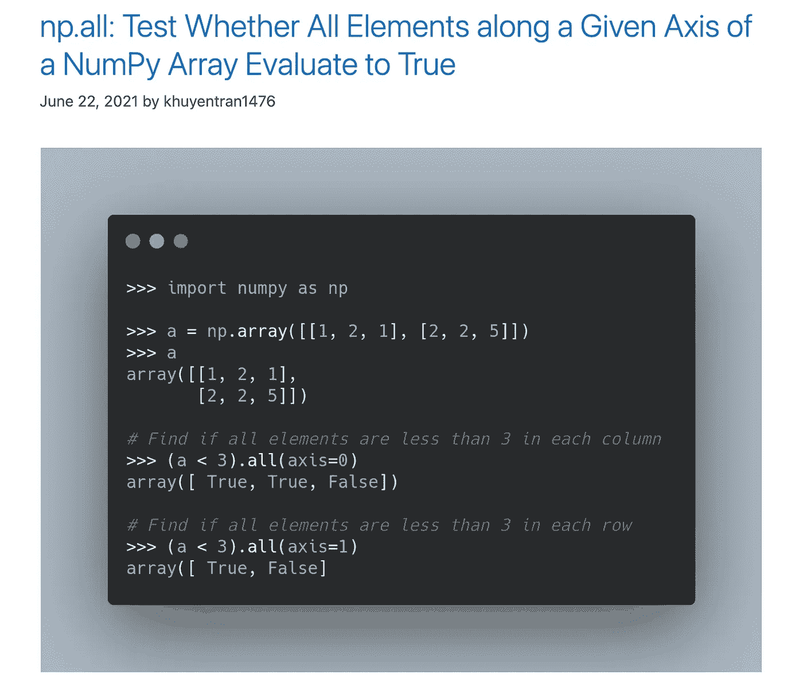
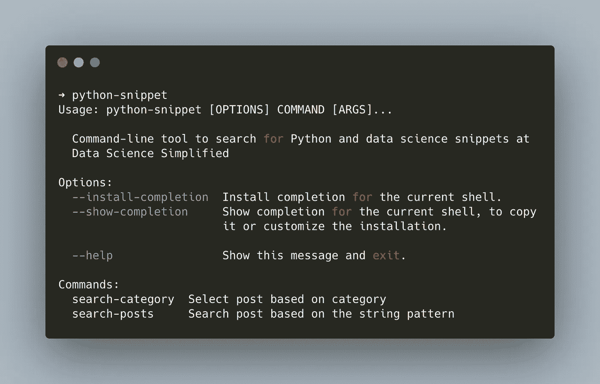
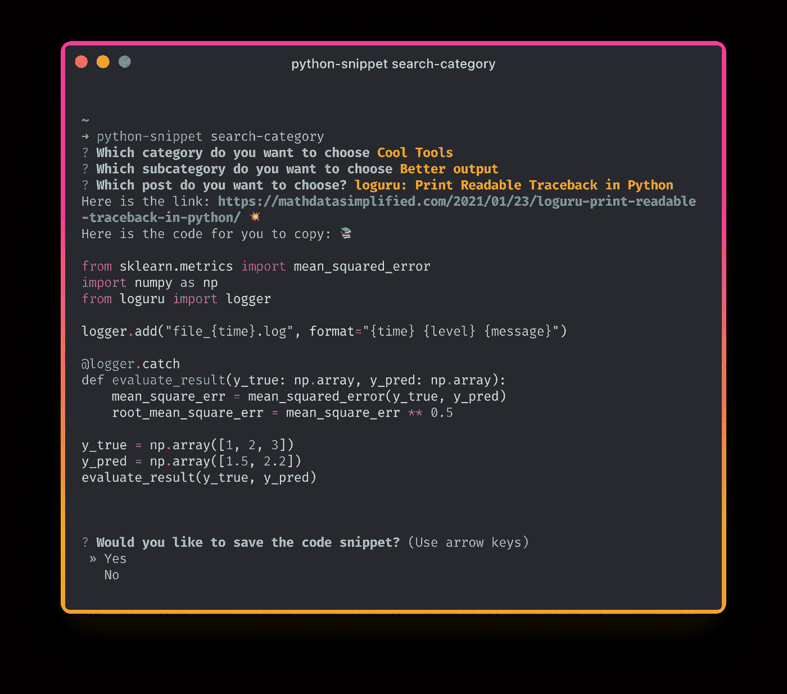
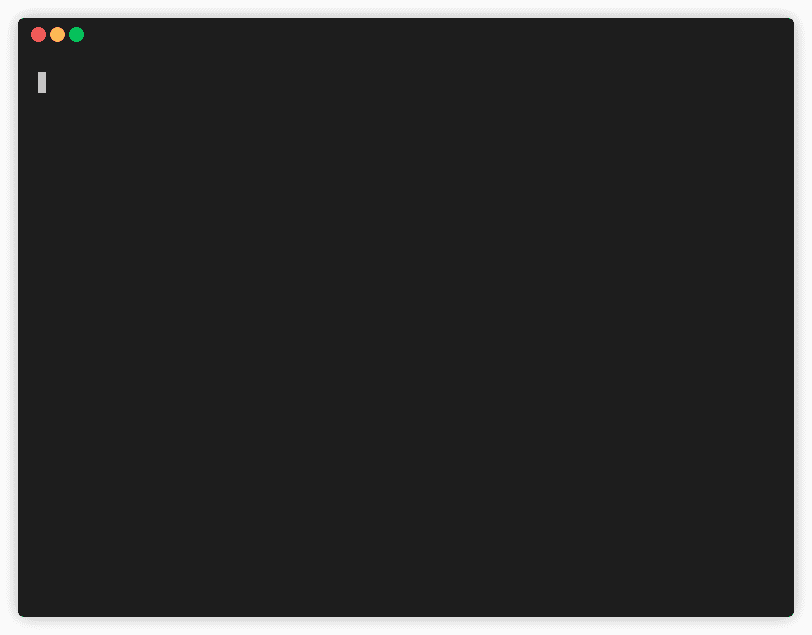
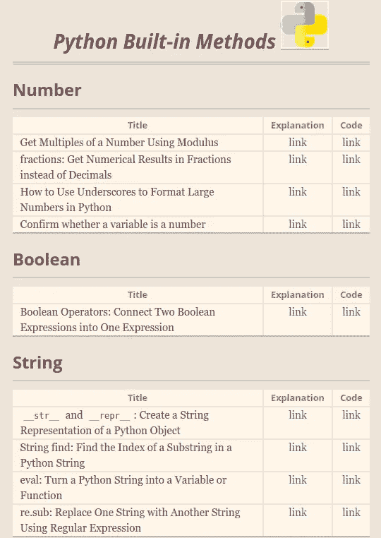
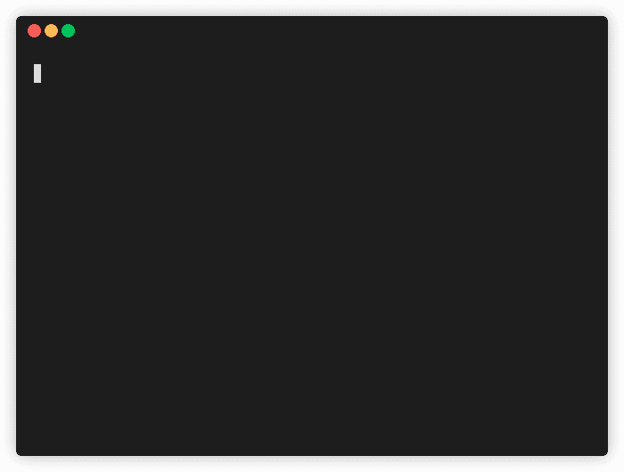
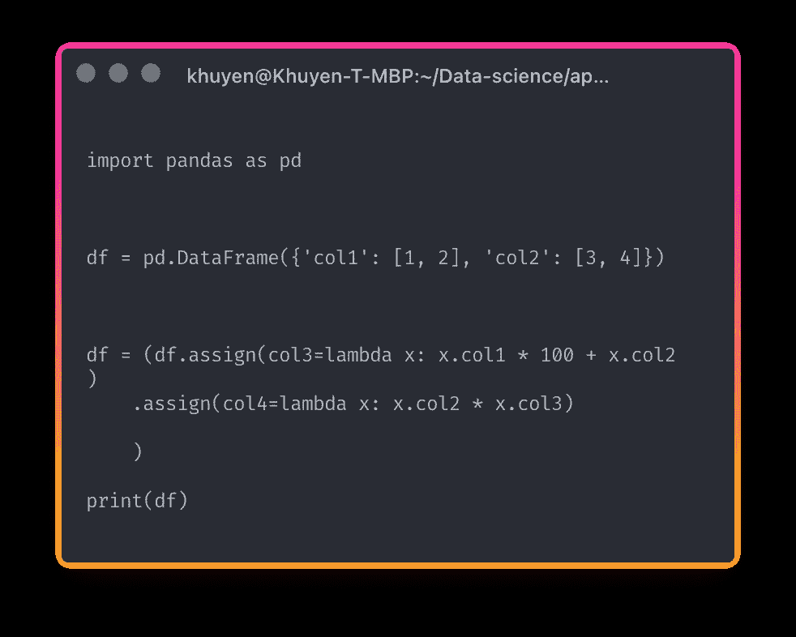
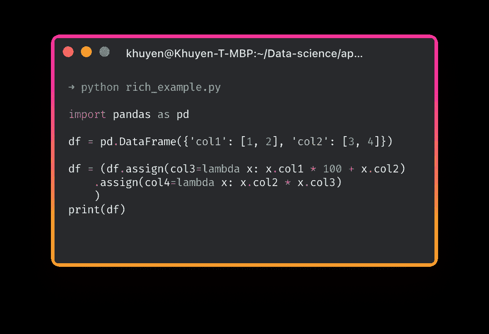

# 命令行上的 Python 和数据科学片段

> 原文：<https://towardsdatascience.com/python-and-data-science-snippets-on-the-command-line-2673d5d9e55d?source=collection_archive---------23----------------------->

## 在一行代码中访问有用的 Python 片段

# 动机

[Data Science Simplified](https://mathdatasimplified.com/) 是我创建的一个网站，它将每天的 Python 和数据科学技巧发送到你的邮箱。这个小贴士可以让你在 1 分钟内获得有用的知识，并继续你的一天。



作者图片

但是，有时您可能想在需要时搜索某些提示，而不去网站。如果您能像下面这样在命令行上搜索和查看代码片段，那不是很好吗？


作者 GIF

这就是 python-snippet 派上用场的时候。在本文中，您将了解什么是 python-snippet 以及我用来创建这个方便工具的库。

# 什么是 python-snippet？

[python-snippet](https://github.com/khuyentran1401/python_snippet) 是一款 python 工具，让你在命令行上轻松获得 Data Science 简化版的代码片段。

要安装 python-snippet，请键入:

```
python3 -m pip install --user python-snippet*.*
```

确保您的 Python 版本> = 3.6.2。

```
python3 --version
```

要检查安装是否成功，请键入:

```
python-snippet
```



作者图片

# 基于类别搜索帖子

您可以通过键入以下内容来基于类别搜索帖子:

```
python-snippet search-category
```

python-snippet 会根据你选择的类别推荐相关的文章。


作者 GIF

选择一篇文章后，您应该会看到原始文章的链接和打印在终端上的代码片段，如下所示:



作者图片

如果您想使用代码，也可以将代码片段保存到当前目录。

# 基于字符串模式搜索帖子

您可以将此命令视为终端上的搜索栏。


作者图片

要基于字符串模式搜索帖子，请键入:

```
python-snippet search-posts <PATTERN>
```

例如，输入`python-snippet search-posts pandas`会给出包含字符串`pandas`的搜索结果。



作者 GIF

与前面的命令类似，在选择输出后，一个代码片段将被打印在终端上，并可以保存到您的当前目录中。


作者图片

点击这里可以找到所有代码片段的完整列表[。](https://khuyentran1401.github.io/Python-data-science-code-snippet/)

# 我是如何创建这个工具的？

这个工具很方便，但也很容易创建。如果你想创建一个类似的工具，这里是我用来创建 python-snippet 的库。

## 数据

我使用[请求](https://docs.python-requests.org/en/master/)从我的 GitHub 页面获取 HTML，并使用 [Beautiful Soup](https://www.crummy.com/software/BeautifulSoup/bs4/doc/) 提取相关元素，比如我页面上的表格行。



作者图片

## 问题

为了提示用户选择特定的类别和帖子，我使用了 questionary。

[Questionary](https://github.com/tmbo/questionary/tree/94f5386da93852b436524318314de19702e1c73d) 是一个 Python 库，可以在一行代码中构建漂亮的命令行用户提示。要给用户一个可供选择的项目列表，请使用`questionary.select(question, choices).ask()`:



作者 GIF

## 命令

为了创建像`python-snippet search-category`和`python-snippet search-posts`这样的命令，我使用了 [Typer](https://typer.tiangolo.com/) 。

Typer 是一个基于 Python 的类型提示构建命令行界面(CLI)应用程序的库。使用 Typer，您可以在一行代码中创建命令行界面，如下所示:


作者图片

你可以在这里找到关于 Typer 的综合教程:

</typer-build-powerful-clis-in-one-line-of-code-using-python-321d9aef3be8>  

## 用语法在终端上打印代码

像下面这样没有语法突出显示的代码很无聊。



作者图片

为了在终端上打印带有语法突出显示的代码，我使用了丰富的。

Rich 是一个 Python 库，用于终端中丰富的文本和漂亮的格式。下面是如何使用 Rich 打印带有语法高亮的代码。



作者图片

现在代码在终端上看起来更好了！

你可以在这里找到 Rich 的完整教程:

</rich-generate-rich-and-beautiful-text-in-the-terminal-with-python-541f39abf32e>  

## 出版

最后，为了发布我的包，我使用了诗歌。[poems](https://python-poetry.org/docs/)是一个 Python 库，它使得管理依赖关系和打包 Python 项目变得简单高效。

使用诗歌，您可以通过以下 5 个命令将您的包发布到 PyPI:

*   `poetry init`
*   `poetry shell`
*   `poetry add <package>`
*   `poetry build`
*   `poetry publish`

在这里找到完整的诗歌教程:

</how-to-effortlessly-publish-your-python-package-to-pypi-using-poetry-44b305362f9f>  

# 结论

恭喜你！您刚刚学习了如何使用 python-snippet 从终端访问 Data Science Simplified 中的代码片段。我希望这个工具能让你不用离开终端就能获得有用的提示。

您还可以使用您在本文中学到的库来创建一个适合您需要的命令行工具。

随意发挥，并在这里叉这篇文章的源代码:

<https://github.com/khuyentran1401/Data-science/tree/master/applications/python_snippet_tutorial>  

我喜欢写一些基本的数据科学概念，并尝试不同的算法和数据科学工具。你可以在 LinkedIn 和 T2 Twitter 上与我联系。

星[这个回购](https://github.com/khuyentran1401/Data-science)如果你想检查我写的所有文章的代码。在 Medium 上关注我，了解我的最新数据科学文章，例如:

</introduction-to-datapane-a-python-library-to-build-interactive-reports-4593fd3cb9c8>  </how-to-create-mathematical-animations-like-3blue1brown-using-python-f571fb9da3d1>  </3-tools-to-track-and-visualize-the-execution-of-your-python-code-666a153e435e> [## 3 个跟踪和可视化 Python 代码执行的工具

towardsdatascience.com](/3-tools-to-track-and-visualize-the-execution-of-your-python-code-666a153e435e) </introduction-to-dvc-data-version-control-tool-for-machine-learning-projects-7cb49c229fe0> 