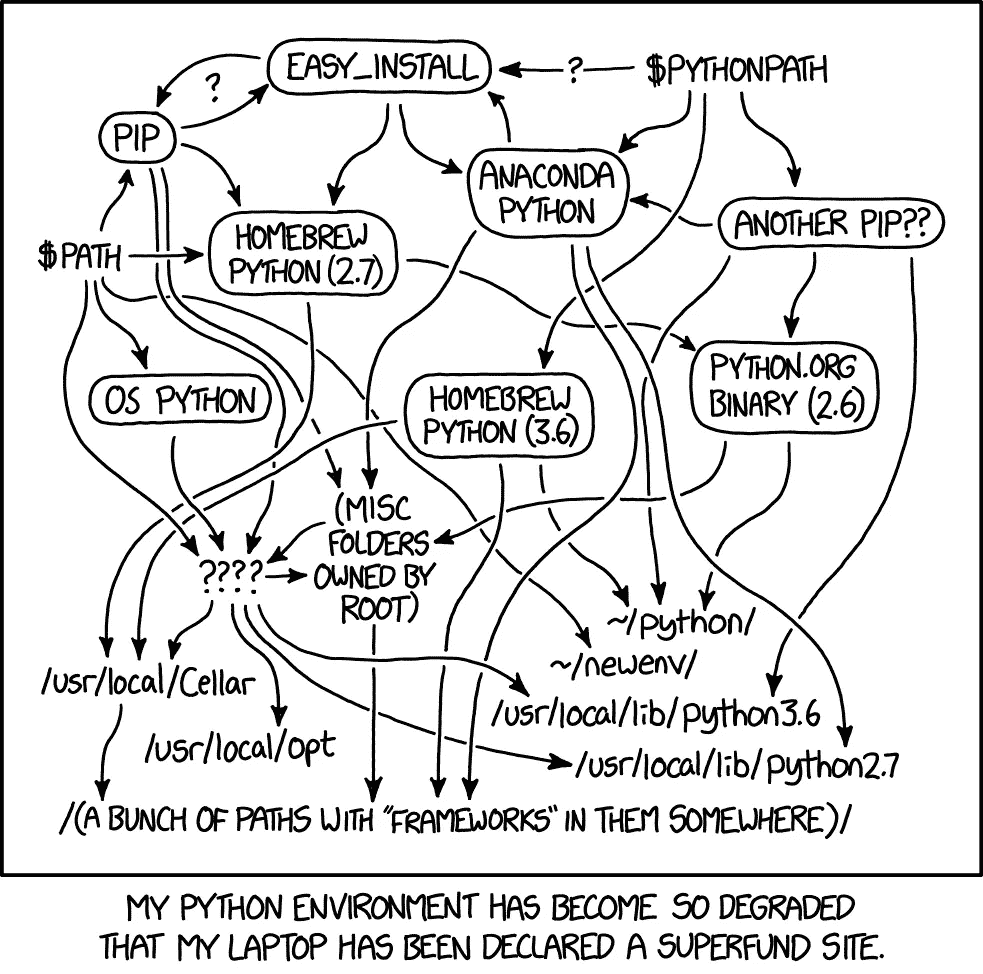

# Python 和模块搜索路径

> 原文：<https://towardsdatascience.com/python-and-the-module-search-path-e71ae7a7e65f?source=collection_archive---------9----------------------->


克里斯·里德在 [Unsplash](https://unsplash.com/s/photos/code-system-path?utm_source=unsplash&utm_medium=referral&utm_content=creditCopyText) 上拍摄的照片

## python 如何知道要导入哪些包，在哪里可以找到它们，以及现代工具(conda、pyenv、them)如何让这一切变得简单

之前我们已经研究过各种工具(conda，pyenv)如何操作`$PATH`变量，这样当你输入`python`时，你想要的 python 版本(在给定的环境中)就是你得到的 python 版本。对于导入 python 标准默认函数库来说，这一切都很好，但是:

*   当我们想从 PyPI 安装第三方软件包时(比如 numpy，pandas，scipy)
*   当我们想在本地安装我们自己的包/模块时——无论是开发还是在为 PyPI 构建我们自己的包之前进行测试

python 如何知道:

*   在哪里寻找这些包
*   如果我们有两个同名的，如何区分它们的优先级

为此，你一输入`python`，它就会构建‘模块搜索路径’。

## 输入`python`会发生什么？

所以我们已经知道，当你输入`python`时，你的操作系统会从上到下查找第一个名为‘python’的可执行文件的路径(不管它实际上是不是 pyenv shims 指出的 python 可执行文件)。然后，一旦找到它，它就执行它。但是这有什么用呢？接下来是什么？在知道如何定位我们的包的背景下，我们关心它如何构造`sys.path`变量。

类似于`$PATH` , `[sys.path](https://docs.python.org/3/library/sys.html#sys.path)`是一个内部 python 版本，类似于操作系统如何自顶向下遍历`$PATH`来匹配可执行文件，python 遍历`sys.path`来匹配包和模块。

[](/python-the-system-path-and-how-conda-and-pyenv-manipulate-it-234f8e8bbc3e) [## Python，系统路径以及 conda 和 pyenv 如何操纵它

### 深入探究当您在 shell 中键入“python”时会发生什么，以及流行的环境管理工具如何操纵…

towardsdatascience.com](/python-the-system-path-and-how-conda-and-pyenv-manipulate-it-234f8e8bbc3e) 

## `sys.path`是如何确定和设定的？

这里有一篇很棒的文章介绍了这一点的复杂性，尽管这看起来是一个简单的任务，但有许多困难需要克服。在“现代 python 设置”中，我们有幸使用以下一项或多项:

*   pyenv
*   康达
*   诗意

这个过程在很大程度上被简化了，因为我们并不真正关心像 T0 和 T1 这样的东西，因为它们往往是空白的。

我们来看一个例子。我使用的是`pyenv`，就像之前一样，我们可以验证我们运行的是哪个版本的 python:

```
> pyenv version
3.9.7 (set by /Users/jamisonm/.pyenv/version)
```

鉴于我们已经在上一篇文章中讨论了[和](https://markjamison03.medium.com/python-the-system-path-and-how-conda-and-pyenv-manipulate-it-234f8e8bbc3e)pyenv 实际上是如何查找和设置可执行文件的，我们知道我们在这个实例中使用了`/Users/jamisonm/.pyenv/versions/3.9.7/bin/python`作为 python 可执行文件。那么现在会发生什么呢？

**找到这个版本的 python 被执行的位置**

因此，操作系统执行 python 可执行程序，然后被执行的程序向操作系统询问其位置。假设没有打嗝，这将被设置在变量`sys.executable` = `/Users/jamisonm/.pyenv/versions/3.9.7/bin/python`中。

**设置 sys.prefix 和 sys.exec_prefix**

接下来，python 设置前缀和 exec_prefix，它们看起来通常是相同的。如果我们的`sys.executable`变量设置为`/Users/jamisonm/.pyenv/versions/3.9.7/bin/python`，那么`sys.prefix` = `sys.exec_prefix` = `/Users/jamisonm/.pyenv/versions/3.9.7/`。然而，如果一个`pyvenv.cfg`文件存在于`sys.executable`之上的目录中，那么它被读取，并且`sys.prefix`和`sys.exec_prefix`都被设置到那个目录——这是由[这个函数控制的，这里是](https://github.com/python/cpython/blob/32f55d1a5de66f9a86964fc0655d7a006a9d90b9/Lib/site.py#L495)。

**使用 sys.prefix 和 sys.exec_prefix 设置 sys . path**

Python 现在导入模块[站点](https://docs.python.org/3/library/site.html#module-site)并运行其[主函数](https://github.com/python/cpython/blob/32f55d1a5de66f9a86964fc0655d7a006a9d90b9/Lib/site.py#L587)。根据文件[这里的](https://docs.python.org/3/library/site.html#module-site)，这样做如下:

*“它从头部和尾部开始构建多达四个目录。对于 head 部分，它使用 sys.prefix 和 sys.exec _ prefix 跳过空磁头。对于尾部，它使用空字符串，然后是 lib/site-packages(在 Windows 上)或 lib/pythonX。Y/site-packages(在 Unix 和 macOS 上)。对于每个不同的头尾组合，它会查看它是否引用现有目录，如果是，则将其添加到 sys.path 中，并检查配置文件的新添加路径。*

实际上，这会将以下内容添加到 sys path 中:

```
/Users/jamisonm/.pyenv/versions/3.9.7/lib/python39.zip
/Users/jamisonm/.pyenv/versions/3.9.7/lib/python3.9
/Users/jamisonm/.pyenv/versions/3.9.7/lib/python3.9/lib-dynload
/Users/jamisonm/.pyenv/versions/3.9.7/lib/python3.9/site-packages
```

仅此而已。现在我们有了我们的`sys.path`变量。就像使用`$PATH`和操作系统一样，python 从上到下遍历`sys.path`变量，寻找匹配的模块和包名，当找到一个匹配的模块和包名时，它就执行那段 python 代码。与`$PATH`的唯一区别是 python 在遍历`sys.path`之前首先检查本地调用目录以寻找匹配的模块(下面将详细介绍)。



图片来自[https://xkcd.com/1987/](https://xkcd.com/1987/)

## 什么是“站点包”？

这是你从 PyPI 下载的所有第三方软件包的去处(通过 pip，conda，poetics 等)。一旦我们以这种方式看待事情，管理一个环境并确保所有依赖关系都在正确的位置的想法就变得非常琐碎。一旦我们有了 python 可执行文件的正确位置，我们只需确保遵守规则，并将其放入相应的`site-packages`文件夹中。当我们在那个环境中键入`python`时:

*   操作系统遍历`$PATH`变量，找到并执行 python 的正确版本
*   然后，操作系统将这个位置交给 python 可执行文件，并初始化类似于`sys.executable`的东西
*   python 还基于上面的公式创建了`sys.path`变量，指定在相应的`site-packages`文件夹中查找包

## 在本地安装一个包怎么样？

如果我们想用特定版本的 python 和相关的依赖项(我们可以从 PyPI 中获取)来建立一个环境，上面的方法非常有用。但是那些不在 PyPI 上的东西呢？或者，如果我们从 PyPI 中取出一个包并修改它(可能是为了改进它)然后想要使用它呢？

对此，python 有另一种解决方案— **。pth 文件**。从 python 文档[这里](https://docs.python.org/3/library/site.html#module-site):

*“路径配置文件是一个文件，其名称的格式为 name.pth，并且存在于上述四个目录之一中；它的内容是要添加到 sys.path 中的附加项(每行一项)。不存在的项永远不会添加到 sys.path 中，并且不会检查该项是否引用了目录而不是文件。任何项都不会被多次添加到 sys.path 中。空行和以#开头的行将被跳过。执行以 import(后跟空格或制表符)开头的行。*

因此，为了在本地编写一些代码，并确保当我们在某个地方启动 python 时，我们可以导入我们需要的代码:

*   将代码写在名为`module_name.py`的文件中
*   在`sys.path`(通常是`site-packages`)的某个目录中添加一个名为`module_name.pth`的文件，该文件包含我们的模块所在的目录

**这正是当您运行类似** `**poetry install**` **或** `**pip install . -e**`的程序时所发生的事情——一个. pth 文件被添加到`site-packages`文件夹中，该文件夹将该位置添加到`sys.path`变量中。

让我们用一个测试模块来测试一下。在一个新目录中创建一个名为 test 的文件夹。在我的主目录中，我们有`mkdir ~/test`。然后，我们可以将以下文件添加到名为`datetime.py`的目录中(故意命名为与 python 标准库中的`datetime.py`文件冲突)。总而言之，我们有以下几点:

```
> mkdir ~/test
> cd test
> touch datetime.py
```

然后将以下内容添加到`datetime.py`:

```
def hello_world():
    print('hello world')
    return
```

最后，我们需要将我们的`test.pth`文件添加到我们当前环境的`site-packages`目录中。如上所述，使用 pyenv(在我使用 python 版本 3.9.7 的全局设置中)，我的目录位于`/Users/jamisonm/.pyenv/versions/3.9.7/lib/python3.9/site-packages`。然后，我们可以添加以下内容:

```
> cd /Users/jamisonm/.pyenv/versions/3.9.7/lib/python3.9/site-packages
> echo "/Users/jamisonm/test" > test.pth
```

其中最后一个命令是一个命令行程序，创建一个包含我们想要的目录的文本文件。现在，如果我们启动 python 并运行 sys.path，我们会看到以下内容:

```
>>> import sys
>>> print('\n'.join(sys.path))
/Users/jamisonm/.pyenv/versions/3.9.7/lib/python39.zip
/Users/jamisonm/.pyenv/versions/3.9.7/lib/python3.9
/Users/jamisonm/.pyenv/versions/3.9.7/lib/python3.9/lib-dynload
/Users/jamisonm/.pyenv/versions/3.9.7/lib/python3.9/site-packages
/Users/jamisonm/test
```

增加了底部条目。这是因为当 python 扫描`sys.path`中的前 4 个位置时，它发现了一个`.pth`文件(我们创建的`test.pth`文件),并相应地将其添加到最后的`sys.path`。重要的是，这意味着:

*   python 将在`/Users/jamisonm/test`中查找之前，首先在其他位置搜索匹配的包或模块名
*   在此之前，python 实际上在当前目录中搜索匹配项

这意味着，如果我们从`/Users/jamisonm/test`开始运行以下命令，我们会看到:

```
import datetime
datetime.date.today()
Traceback (most recent call last):
  File "<stdin>", line 1, in <module>
AttributeError: module 'datetime' has no attribute 'date'
```

因为我们在`/Users/jamisonm/test`中定义的`datetime.py`模块优先于其余的`sys.path`——包括在`/Users/jamisonm/.pyenv/versions/3.9.7/lib/python3.9`中定义的 python 标准库模块`datetime.py`。但是，如果我们移出`test`目录并重复，我们会看到:

```
import datetime
datetime.date.today()
datetime.date(2021, 11, 5)
import sys
print('\n'.join(sys.path))
/Users/jamisonm/.pyenv/versions/3.9.7/lib/python39.zip
/Users/jamisonm/.pyenv/versions/3.9.7/lib/python3.9
/Users/jamisonm/.pyenv/versions/3.9.7/lib/python3.9/lib-dynload
/Users/jamisonm/.pyenv/versions/3.9.7/lib/python3.9/site-packages
/Users/jamisonm/test
```

即 python 首先找到标准库`datetime.py`模块(它包含`datetime.date.today()`函数)，即使`/Users/jamisonm/test`仍然在我们的`sys.path`中。

## 结论

类似于当您通过从上到下遍历您的`$PATH`变量来键入`python`时，您的操作系统如何确定运行哪个 python 版本，python 创建并搜索模块搜索路径(主要通过创建`sys.path`变量)来定位已安装的包，并且如果我们有名称冲突，哪个应该优先。

一旦我们以这种方式理解了事情，环境和依赖性管理的主题就变得容易了。通过消除设置这些变量的人工工作，让我们的生活变得更轻松的工具非常有用，但基本过程不一定非常复杂:

*   操作系统找到要使用的正确 python 版本
*   使用这些信息，python 定义了`sys.path`来创建模块搜索路径
*   。pth 文件可以添加到这些位置之一，以将本地模块的位置添加到[模块搜索路径](https://docs.python.org/3/tutorial/modules.html#the-module-search-path)的末尾

像 conda 和 pyenv+poem 这样的工具就是这样做的——它们通过创建、更改和管理这些 python 可执行文件、相应的站点包目录和任何其他文件，使我们能够轻松地掌握这些步骤。pth 文件添加到它们中以简化本地开发。