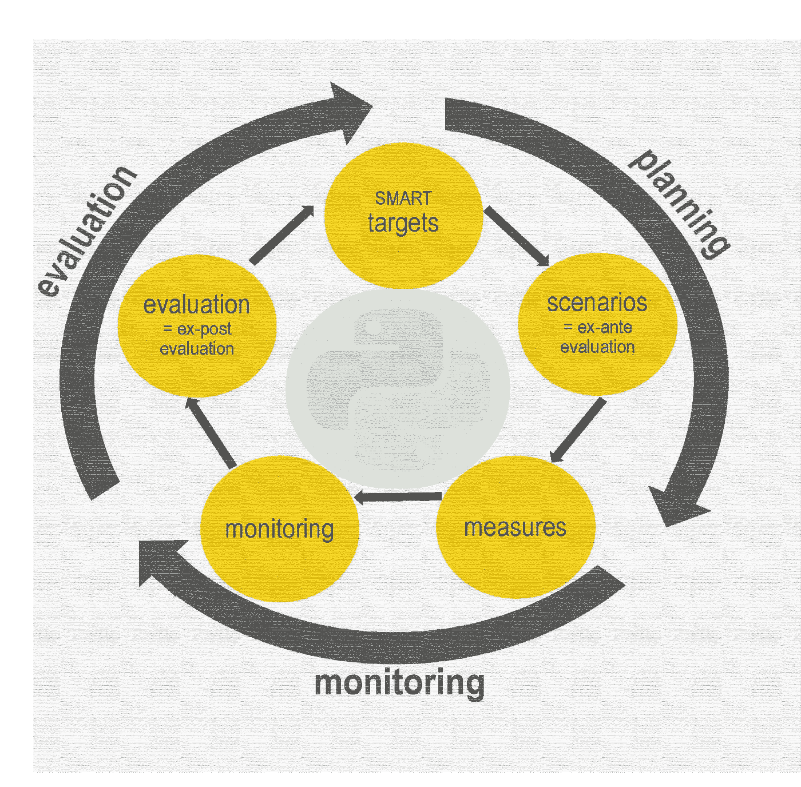

# Python 在项目评估中的应用:从数据上传到分析

> 原文：<https://towardsdatascience.com/python-applied-to-project-evaluations-from-data-upload-to-analysis-1090647c7832?source=collection_archive---------23----------------------->

## 这里介绍的 Python 片段应用于评估研究的一组数据框架，举例说明了关键的分析步骤和可复制的编码解决方案，可用于其他评估

来源于 [Pixabay](https://pixabay.com/photos/data-computer-internet-online-www-2899901/)

# 编程语言与社会科学相遇

Python 为计算科学提供了广泛的应用。另一方面，在任何形式的研究中，确定最适当的方法、变量和伦理标准仍然是个人的责任。某种[希波克拉底誓言](https://en.wikipedia.org/wiki/Hippocratic_Oath)应该让研究人员承担责任(提到[就是数据科学家](/hippocratic-oath-for-data-scientists-407d2db15a78))，这意味着每个数据点都应该遵循坚实的理论或假设，有助于从多个科学的定性角度进行充分的三角测量。在社会、卫生和人道主义部门进行干预时尤其如此，因为背景驱动因素相互关联，对每个人都有不可预测的影响。这是大画面和小画面之间的舞蹈。

由于任何适用于社会和行为变化的指标都带有一大堆与可比性和结论性相关的问题，人们应该小心地庆祝一种可以快速得出结论和一般性发现的编程语言。记住这一点，对定性和定量证据进行三角测量的努力可以受益于像 Python 这样的面向对象语言来处理和分析结构化和非结构化证据。已经有许多数据科学专家和组织在这些领域努力改进实践的[例子](https://www.datakind.org/chapters/datakind-uk)，这是一个非常令人鼓舞的趋势。

由作者组合来自[源 1、](http://www.sump-challenges.eu/content/monitoring-and-evaluation) [源 2](https://upload.wikimedia.org/wikipedia/commons/c/c3/Python-logo-notext.svghttps://upload.wikimedia.org/wikipedia/commons/c/c3/Python-logo-notext.svg) 的图像

## 目的

我觉得有必要开始根据我的实践经验撰写一系列文章，这样我就可以为其他人提供有用的代码片段。我将依靠来自现实世界评估的证据，并提出一步一步的描述。尽管一些度量标准是特定于特定领域的，但是每个例子的目的都是概述一个过程和可复制的代码，这些代码也可以用于其他领域——这取决于变量的类型和模型需求。这也是为了就更有效的编码解决方案和我的自学进行对话，这样我就可以在学习和分享的同时成长。

## 启动的先决条件

1.访问支持笔记本电脑的平台，该平台允许您复制粘贴代码并查看相关输出
2。检查你的数据是否在。csv 格式，并且证据是按照系统的列-行结构排列的(特别是如果是手工的话)
3。确保你的机器上安装了最新版本的 Python，并且相关包的安装已经提前完成
4。对数据分析和逻辑思维的基本理解以及对问题和提问的开放态度:)

# 步骤 1:上传和快速清理

第一步是上传相关的包，这些包提供了将 Python 进一步提升为可解释性资产的能力:通过集合访问和编程语言的共同创造，这是真正的突破。如果安装了所有相关的包，这是一个相对容易的步骤。代码中见:[熊猫](https://pandas.pydata.org/)、 [numpy](https://numpy.org/) 、 [seaborn](https://seaborn.pydata.org/) 、 [scipy](https://www.scipy.org/) 和 [matplotlib](https://matplotlib.org/) 。所有这些在数据科学应用中都非常重要，它们都有不同的用途，但有很大的互补性。

上传完这些包后，就该上传数据帧了。当然，如果我们谈论的是成千上万的数据帧，这个片段的适用性就很低。然而，如果我们在同一个干预领域只有一些重复的数据收集，那么我们可以将它们视为不同的实体。 **info** 命令给我关于条目数量、数据类型和内存使用的信息。已经有三个非常有趣的方面需要考虑。在这种情况下，3 个数据帧(dfBase、dfMid、dfEnd)被上传，对应于跨越超过 1000 个回答者的大样本的连续顺序的一个数据收集周期。

一旦上传了数据帧，快速清理通常包括移除所有没有条目的行或看起来重复的行。对于数值变量，频繁的数据质量检查是用较低和较高的五分位数值替换极端异常值。从 Pythonic 的角度来看，离群值的建议片段相当简洁，但是数据清理可以更加复杂，特别是我们为缺失值提供的含义。这是数据科学中最大的难题之一，尤其是在涉及[预测分析时。](https://www.researchgate.net/publication/333075475_Missing_Data_Problem_in_Predictive_Analytics)本身就是一个话题。

# 步骤 2:定位变量并创建虚拟模型

在深入分析之前可以采取的其他相关行动是，如果出于推理目的需要，可以创建虚拟模型。一个最常见的哑元是位置，因为它们作为独立的条件，它们可以被视为独立的事件，并作为控制因素包含在回归中。这种情况下的关键命令是`pd.get_dummies.`

另一项行动是通过`value_counts(dropna=False)`中的分类规范验证是否有任何相关变量`is_unique`条目或频率。我发现另一个非常有用的命令是`columns.get_loc("Name Variable")`，因为它帮助我定位数据帧中变量的位置。有了变量的位置，提取/分割证据子集变得更加容易。

# 步骤 3:关键指标的分析

就个人而言，这是我更喜欢的步骤，因为此时分析变得更加迭代，对变量行为的理解更加具体。我们应该把任何形式的分析都视为进化，从而产生新的假设和问题，进一步丰富模型或使计算结果更加准确。下面的代码片段提供了不同层次的规范。例如，我希望调整我的视觉输出`plt.rcParams`的大小，并确定我需要可视化多少情节`fig, ax = plt.subplots(nrows=1, ncols=1)`。一旦定义了这些布局细节，通过连接`pd.concat`相关变量进行比较，我就可以获得相关结果指标的`boxplot`值分布。我们可以清楚地看到从基线到终点的进展，这对应于这一特定指标的改进。

另一种分析信息的方法是了解关键指标在一个数据框架中的分布和相关性。在这种情况下，我考虑的是终点的[食物消耗分数](https://inddex.nutrition.tufts.edu/data4diets/indicator/food-consumption-score-fcs)和结果 1 和 2。这两个指标是由知识、态度和实践( [KAP](https://www.spring-nutrition.org/publications/tool-summaries/kap-survey-model-knowledge-attitudes-and-practices) )的各种子成分组成的复合指标。我使用命令`rename`确保视觉输出清晰，使用`next_dffull_label = iter(Outcomes).__next__`为我的`ax`图的`annotate`创建标签。其次，在`corrdot`和`corrfunc`函数中，我定义了[皮尔逊相关系数](https://en.wikipedia.org/wiki/Pearson_correlation_coefficient)到`stats.pearsonr`的标签和 p 值的参数。

第二步，我用命令`sns.PairGrid`激活 seaborn，这个命令应用于不包含任何零值的结果数据帧。`map_lower`、`map_diag`、`map_upper`、`map_upper`的各种参数的功能是将图形的各种元素定位在预定位置。`fig.subplots_adjust`在`axes.flatten`、`set_xlabel`和`set_ylabel`的基础上进一步布局调整。修改这些参数将告知标签和空间方面的最终视觉输出。结果是一个视觉输出，它指定了关键的相关性(例如饮食多样性和食物消费之间的相关性)，并概述了每个值的分布及其相关性。它可以提供一个初始的图像来识别要包含在推理模型中的变量。

# 步骤 4:切片和分解分析

根据所考虑的指标，如果结果值是综合的，则有不同的分解级别。在这种情况下，我们可以提示一个`InteractiveShell`来查看值如何跨越相关的度量从基线发展到终点。在这种情况下，对知识、态度和做法的变化的分类是通过对每个方面的相关组成部分求和并对结果进行平均来呈现的。对相同值的进一步分解是通过使用分类规范过滤数据帧并应用总和的平均值来完成的。该值可以是`mean`、`median`或`sd`偏差，这完全取决于分析的目的。

# 最后的考虑

你在这篇博客中看到的是一系列片段，可以指导你用几个步骤来准备数据框架和分析关键指标。每个步骤的复杂程度可能会因数据帧的数量、形状、大小和长度而有很大差异。这些方面决定了将证据转换成可用于生成视觉或计算输出的格式的一组决策和方法。一般来说，社会科学依赖于数据框架，这些数据框架相对较小，但有时是手动生成的，并且富含需要清理和特殊处理的字符串(定性)变量( [NLP](https://journals.sagepub.com/doi/full/10.1177/1609406919887021#:~:text=Qualitative%20data%2Danalysis%20methods%20provide,algorithms%20to%20analyze%20textual%20data.) )。在自然科学的背景下，数值矩阵形式的数据帧更为常见，信息的迭代可能会很频繁，因此特定算法对于解决计算问题变得很有必要。

尽管这种明显的分歧根植于教育的结构方式，但当今世界正迫使我们采取整体解决方案，克服学科孤岛。编程提供了一个桥梁，从一个超专业的学科语言到一个更跨学科的方法，旨在发展综合知识和研究方法。跨学科研究的一个[定义](https://research.ncsu.edu/rdo/2020/08/the-difference-between-multidisciplinary-interdisciplinary-and-convergence-research/)是:

> “由团队或个人进行的一种研究模式，它整合了来自两个或更多学科或专业知识主体的信息、数据、技术、工具、观点、概念和/或理论，以促进基本理解或解决其解决方案超出单一学科或研究实践领域范围的问题。”

Python 是一种编程语言，通过[编译方法](https://nedbatchelder.com/blog/201803/is_python_interpreted_or_compiled_yes.html)来实现更高程度的解释。任何二进制逻辑从 a 代码(字节码)到可以跨领域应用的复杂编程语言的演变，确实描述了我们这个时代的一个巨大机遇。对这些抽象语言的访问越来越多地激励专家在分析信息时模糊自然描述和形式描述之间的界限。向相似的语言靠拢将使来自不同学科的个人能够一起工作，从多个、综合、三角化的角度和技术来看待基于研究的证据。