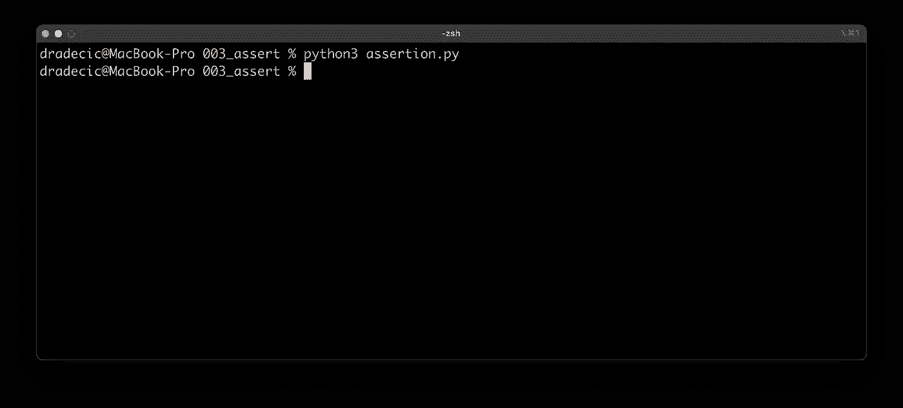
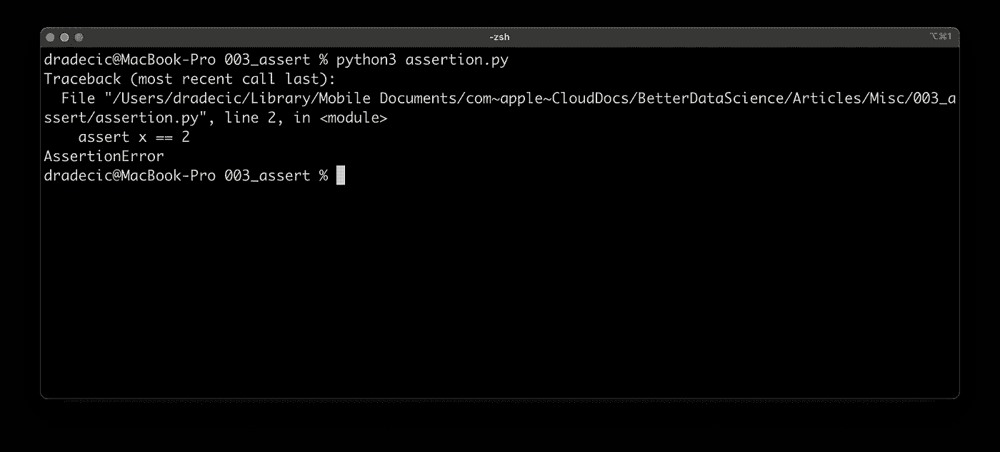
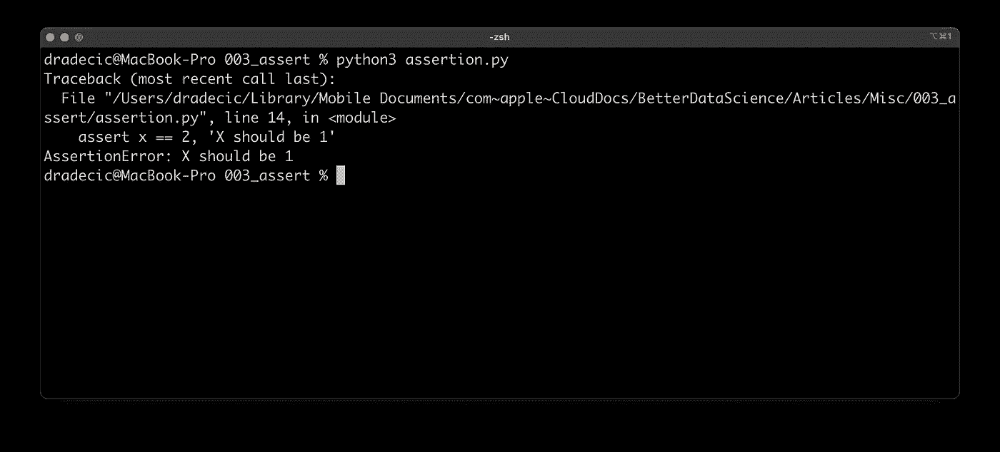
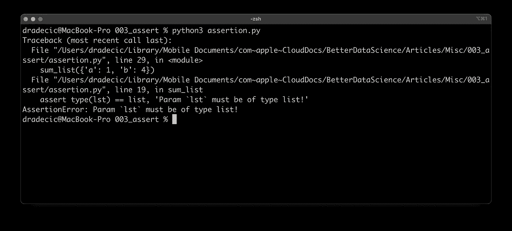
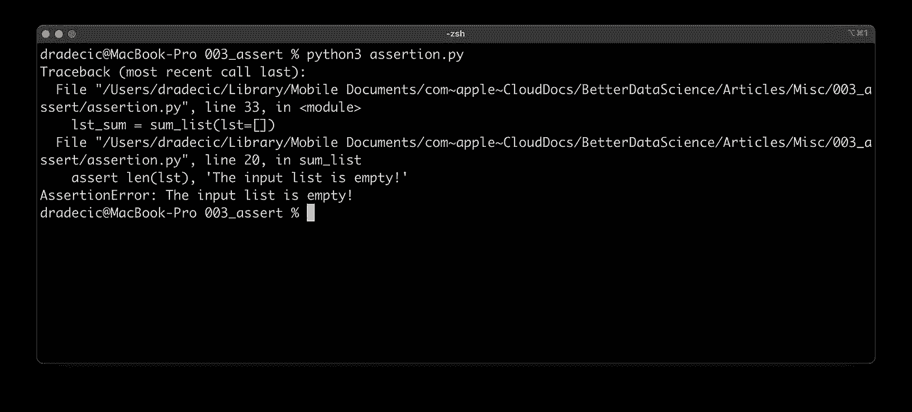
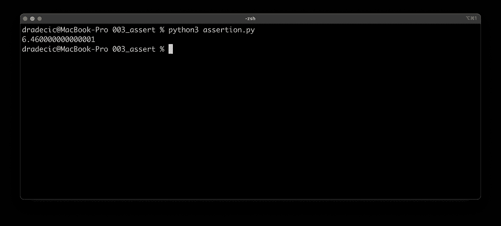
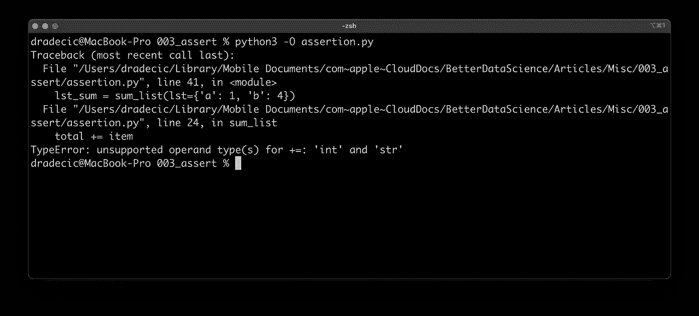

# Python Assert 语句—你需要知道的一切在 5 分钟内解释完毕

> 原文：<https://towardsdatascience.com/python-assert-statement-everything-you-need-to-know-explained-in-5-minutes-4b13c39c8391?source=collection_archive---------15----------------------->

## 原因、时间和方式—立即学习 Python 中的 assert 语句。


[Jason Briscoe](https://unsplash.com/@jsnbrsc?utm_source=unsplash&utm_medium=referral&utm_content=creditCopyText) 在 [Unsplash](https://unsplash.com/?utm_source=unsplash&utm_medium=referral&utm_content=creditCopyText) 上的照片

作为一种解释型和动态类型的语言，Python 有着难以预料和难以跟踪的错误的坏名声。这份声明可能会让你少一两次紧张。这是一种捕捉不应该在早期发生的事情的常用方法，最有可能发生在函数的开始。

这是一个简单的布尔表达式，用于检查条件是否返回 true。如果是这样，什么都不会发生。如果没有，脚本会用一条可选消息引发一个`AssertionError`。

请记住，断言不能代替异常处理。你应该使用`try except`块来防止在某个时候必然会发生的任何错误。对不应该发生的事情使用断言。

不想看书？看看我关于这个主题的视频:

# 如何使用 assert？

正如您所想象的，Python 内置了`assert`关键字。它后面必须跟一个条件，如果条件的计算结果为 false，您可以选择打印一条消息。

下面是语法:

```
assert <condition>, <optional error message>
```

例如，如果梅根未成年，她就不能进入俱乐部:

```
assert age > 18, 'Go home, Megan.'
```

让我们暂时离开 Megan，关注一个更简单的例子。我们有一个设置为 1 的变量`x`。让我们断言它，看看会发生什么:

```
x = 1
assert x == 1
```

以下是输出结果:



图片 1 —断言基础知识(1)(图片由作者提供)

实际上什么也没发生。这是因为条件评估为真，所以没有引发错误。让我们稍微修改一下代码:

```
x = 1
assert x == 2
```

这次的输出有所不同:



图片 2-断言基础(2)(图片由作者提供)

您得到了一个`AssertionError`，因为条件评估为假— `x`是 1，所以它不可能是 2。控制台输出没有提供任何解释，这可能不是您想要的。您可以指定当`AssertionError`出现时打印的错误信息:

```
x = 1
assert x == 2, 'X should be 1'
```

以下是输出结果:



图片 3-断言基础(3)(图片由作者提供)

*简单，对吧？*应该是。实际上，你更有可能在函数的开头写`assert`语句。让我们看看接下来该怎么做。

# Python 函数中的断言

让我们声明一个简单的 Python 函数。它将接受一个列表作为参数，对其求和，然后以浮点形式返回总和。有两个问题需要尽早发现:

1.  **列表是否传递给函数？**你可以在 Python 中使用类型提示来指示应该传递哪种数据类型，但是没有人阻止你传递字典而不是列表。暗示只是暗示。
2.  **列表是空的吗？显然，你不能对一个空列表求和。嗯，调用`sum([])`返回 0，但这不是你想要的。**

这就是为什么您将有两个断言语句，后面是一段用于汇总列表元素的代码。如果这两个条件都不为真，Python 解释器将不会执行该代码:

```
def sum_list(lst: list) -> float:
    assert type(lst) == list, 'Param `lst` must be of type list!'
    assert len(lst), 'The input list is empty!'

    total = 0
    for item in lst:
        total += item 

    return total
```

现在让我们试着调用`sum_list()`并传入一个字典:

```
lst_sum = sum_list(lst={'a': 1, 'b': 4})
print(lst_sum)
```

事情是这样的:



图 4 —函数中的断言(1)(作者图片)

正如您所希望的——没有向函数提供列表，因此将一个适当的断言错误打印到控制台。

*传一个空单怎么办？*

```
lst_sum = sum_list(lst=[])
print(lst_sum)
```



图 5 —函数中的断言(2)(图片由作者提供)

你仍然得到了`AssertionError`，但是这一次有了不同的消息。

最后，让我们通过提供一系列数字来验证该函数是否正常工作:

```
lst_sum = sum_list([1.11, 2.21, 3.14])
print(lst_sum)
```



图 6 —函数中的断言(3)(图片由作者提供)

现在你知道了，它像广告宣传的那样工作。

# 如何忽略运行时的断言？

`assert`语句的特别之处在于，您可以在运行脚本时忽略它们，而无需修改代码。

以下是如何正常运行 Python 脚本:

```
python3 script.py
```

如果您有`asserts`语句并且想忽略它们，只需在命令中添加`-O`:

```
python3 -O script.py
```

这里有一个我们的`assertion.py`文件的例子，里面有下面的代码(你之前已经声明了`sum_list()`函数):

```
lst_sum = sum_list(lst={'a': 1, 'b': 4})
print(lst_sum)
```



图 7 —忽略运行时的断言(作者图片)

如您所见，引发了`TypeError`，因为传递的是字典而不是列表。

# 应该使用断言语句吗？

我以前已经说过了，但是我要再重复一次——断言不能代替`try except`块。对于不可避免会发生的错误，您应该总是使用`try except`。

尽管如此，`assert`语句至少有两个优点。

`**assert**` **比** `**if**`更紧凑，可读性更强。写`assert <condition>, <message>`比写`if <condition>: <message>`容易。至少它会为您节省一行代码。此外，通过写`assert`，你知道你在检查不应该发生的情况。`if`只是一个一般性的检查。

`**assert**` **语句在运行时可以忽略**。你已经看到如何做到这一点，所以我不会重复自己。

总而言之，`assert`编写起来更快，也更容易与常规的条件检查区分开来。好好使用它们，但不要把它们作为异常处理的唯一方法。

*你们觉得断言语句怎么样？它们是你的 Python 项目的一部分吗，还是你经常使用 if 和* `*try except*` *？*。请在下面的评论区告诉我。

*喜欢这篇文章吗？成为* [*中等会员*](https://medium.com/@radecicdario/membership) *继续无限制学习。如果你使用下面的链接，我会收到你的一部分会员费，不需要你额外付费。*

<https://medium.com/@radecicdario/membership>  

# 保持联系

*   注册我的[简讯](https://mailchi.mp/46a3d2989d9b/bdssubscribe)
*   在 YouTube[上订阅](https://www.youtube.com/c/BetterDataScience)
*   在 LinkedIn 上连接