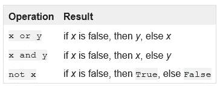
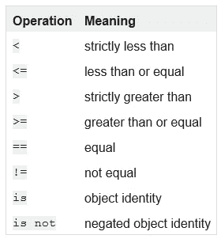
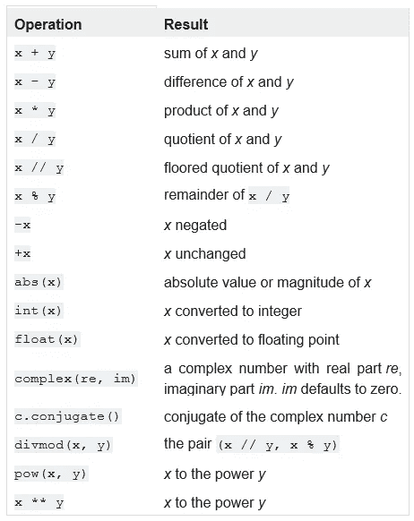
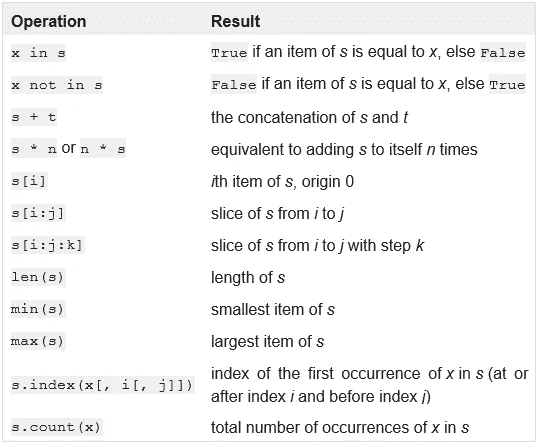
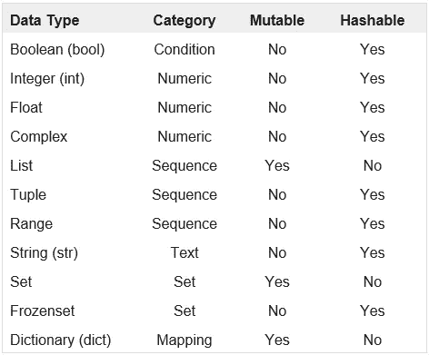

# Python 初学者突破(数据类型)

> 原文：<https://towardsdatascience.com/python-beginner-breakthroughs-data-types-b2a9f8b85836?source=collection_archive---------43----------------------->

## 在开始构建数据科学项目之前，编码是必须的，在 Python 中，理解数据类型的关键属性和差异将使学习编码更加顺利。


马库斯·斯皮斯克在 [Unsplash](https://unsplash.com?utm_source=medium&utm_medium=referral) 上的照片

学习为数据科学编码可能会令人望而生畏，尤其是如果你以前没有任何编码或编程语言的经验和/或理解。更糟糕的是，如果大多数人像我一样，那么真正理解像数据类型和结构这样的简单概念，可能是你不去做的事情，而是继续跋涉到更重要的事情，比如一头扎进 TensorFlow、Keras 和 Scikit-Learn。这种方法的愚蠢之处在于，每当你遇到问题并在执行代码时出现类型错误时，你很可能会复制整个错误语句并将其粘贴到 stackoverflow.com 中，希望得到一个简单的解释。花些时间熟悉并理解类型和结构的基础知识，可以帮助您处理在遇到更复杂的代码时会遇到的所有棘手的细微差别。

本文将介绍各种数据类型的基础知识，并希望以这样一种方式来解释它，使那些很少或没有编码背景的人容易理解和消化，以及那些对该主题进行了很好的复习的人。正如前面提到的理解，数据类型所代表的内容背后的关键方面以及它们的关键属性/特性将有助于理解在您的代码中处理数据的方式。

## 运算符和比较:

要注意的关键点是，运算符和比较允许您定义逻辑语句来执行、运算和/或比较两个不同的变量。布尔运算符包括:*、 ***或*** 、 ***not。****

**

*如何使用运算符及其结果的表格*

*此外，比较操作允许您在对象或变量之间创建条件逻辑语句。下表详细介绍了 Python 中可用的大多数比较操作。*

**

*比较运算符的类型和含义*

**

*扬·安东宁·科拉尔在 [Unsplash](https://unsplash.com?utm_source=medium&utm_medium=referral) 上拍摄的照片*

# *数据类别:*

*数据类型可以分为几个关键类别:*、 ***【序列】*** 、 ***文本*** 、 ***集合*** 和 ***映射*** (注意:还有一些其他的，但本文的重点将是提到的那些通常最常用的)。**

****

**苏珊·霍尔特·辛普森在 Unsplash[上的照片](https://unsplash.com?utm_source=medium&utm_medium=referral)**

## **数字类型:**

**顾名思义，Python 中的数字类型通常以数字形式表示。三种数值类型是:**

*   ****int (integer) —** 整数就像它们的数学表示一样，代表整数(或整数)。这意味着没有小数部分。这意味着整数也有无限的精度，所以当你对整数进行计算时，结果就是精确的答案。**
*   ****float —** 或有时被称为浮点数(或 C 等语言中的 double)用带小数的数字表示。关于浮点数要注意的一个关键点是，因为它们有固定的小数位数(或精度),所以你可以解决问题并有浮点错误。这意味着，假设你有一个精确到小数点后 10 位的数字，如果你执行一系列的运算，你可能会得到与真实值的微小差异。跟踪您的精度以及您希望如何表示它们是确保数据按照您的期望进行处理的关键。**
*   ****复数—** 顾名思义，它代表既有实部又有虚部的复数。**

**下面是可以应用于数值类型的常见操作列表。**

****

**常见数字运算符**

****

**照片由 [Arisa Chattasa](https://unsplash.com/@golfarisa?utm_source=medium&utm_medium=referral) 在 [Unsplash](https://unsplash.com?utm_source=medium&utm_medium=referral) 上拍摄**

## **序列类型:**

**序列类型表示一种内部可以包含多个值的数据类型。各种序列类型可以通过其携带数据的属性来区分。序列的另一个关键特性是它们是可迭代的，这意味着您可以处理序列中的每一项。**

*   ****列表**—是最常见的序列数据类型之一。列表是可以包含其他数据类型的各种值的对象。这意味着您可以在一个列表中构建一个整数、浮点数、字符串(或文本)或它们的组合的列表。关于列表需要注意的一点是，它们是可变的，这意味着列表中的值和项数可以改变。密切关注列表上正在执行的流程对于确保维护数据的完整性至关重要。列表通常也表示为方括号内的项目，即[列表项目 1、项目 2、项目 3 等]。在我之前写的一篇文章中可以找到一种使用列表理解快速建立列表的方法([列表理解](/python-beginner-breakthroughs-list-comprehensions-4090f26b9f50)**
*   ****元组** —与列表非常相似的序列类型是元组。列表和元组之间的关键区别在于元组是不可变的，这意味着它们不能被改变。这对于存储可以表示为常量并在算法中使用的项非常有用，而不用担心元组中的值会受到影响。元组通常用括号表示(元组项目 1、项目 2 等)。**
*   ****范围** —范围项目是一种特殊类型的序列，通常有助于定义(顾名思义)要查看的范围或间隔。通常，当定义一个范围时，您可以通过记录您要调查的*开始*(从哪里开始)、*停止*(从哪里结束)和*步骤*(每个项目之间的实例数)来定义另一个序列数据类型的范围。当定义如何在一个具有更复杂逻辑的序列中循环时，这些就很方便了。**

****

**常见序列类型运算符**

****

**由[拉斐尔·沙勒](https://unsplash.com/@raphaelphotoch?utm_source=medium&utm_medium=referral)在 [Unsplash](https://unsplash.com?utm_source=medium&utm_medium=referral) 上拍摄的照片**

## **字符串(文本)类型:**

**字符串代表了我们在书写中使用的字符。对于那些希望深入研究数据科学中的 NLP 的人来说，处理和理解 Python 中字符串的工作方式是至关重要的。字符串被表示为一个类对象，有许多方法可以应用于它们。这基本上意味着当您导入和/或创建字符串数据类型时，可以应用特定于字符串数据的附加方法(过程)。还要注意的是，字符串是不可变的序列。字符串可以用单引号或双引号来表示，比如:“字符串项”或“字符串项”，两者是等价的。**

## **设置类型:**

**集合是 Python 中的一种数据类型，它包含无序且不同的项目。这意味着集合不能包含任何重复项。集合对于确定成员测试(是另一个项目中的一个项目)、从其他序列类型中删除重复项以及执行数学运算(如交集、并集、差集和对称差集)非常有用。由于集合是无序的，所以无论何时调用集合，它都不会为其中的数据保留索引或位置。这意味着对集合中第一个项目的两次连续调用会产生两个不同的项目，尽管理论上它是从同一个对象中提取的。因此，许多序列行为对集合不起作用，如切片和索引。在集合类型中，有两种主要的集合类型:集合和冷冻集合。关键的区别在于，集合是可变的(创建后可以更改)，而 frozensets 是不可变的，这使得它们是可散列的(可以转换为一个在其生命周期中保持不变的散列值)。集合通常用圆括号表示，比如:(set item1，item2 等等)。**

****

**照片由[皮斯特亨](https://unsplash.com/@pisitheng?utm_source=medium&utm_medium=referral)在 [Unsplash](https://unsplash.com?utm_source=medium&utm_medium=referral) 上拍摄**

## **映射类型:**

**字典，简称 dict，是非常强大的映射类型，允许在字典中保存的两个条目之间建立某种关系连接。字典由键和值对组成。一种很好的思考方式是，对于一个给定的键，有一个层次或结构，其中可以有一组值。字典是可变的，所以它们可以在创建后改变，键/值可以由各种类型组成，比如列表、集合和元组。字典可以通过多种方式构建:迭代，通过字典理解(类似于列表理解逻辑)，以及通过初始化和添加单个条目。在学习 Python 之前，我从未遇到过像 dictionaries 这样的类型，但是在熟悉它之后，它所包含的效用是巨大的。嵌套字典是使其更加强大的另一个很好的例子，对于字典中的键/值对，值实际上是嵌套在其中的另一个字典。嵌套字典的一个例子是马尔可夫链概率，比如猜测天气。关键字可以是各种天气条件(即晴天、阴天、雨天),值将代表新的字典，关键字是未来天气状态，值是未来天气状态发生的概率。下面的代码块将详细说明这一点。**

```
**{('sunny'): {'sunny': 0.3333333333333333, 'cloudy': 0.3333333333333333, 'rainy': 0.3333333333333333}, ('rainy'): {'rainy': 1.0}, ('cloudy'): {'sunny': 0.5, 'rainy': 0.5}}**
```

**如何理解这一点是，对于第一个键或状态，“sunny”表示“sunny”状态的值的嵌套字典表示未来状态和概率。所以如果一天是晴天，第二天是晴天的概率是 0.33，是阴天的概率是 0.33，是雨天的概率是 0.33。对于多雨的状态，唯一的未来状态和概率。如果你仔细想想，那是相当强大的。注意:我可能会在将来做一个更完整的字典综述。**

****

**本文中提到的 Python 数据类型的基本属性**

## **包裹**

**理解各种数据类型以及如何正确使用它们将使项目的编码部分变得容易得多。您也将很好地理解从哪里开始故障诊断，因为当您遇到类型错误时，您可以理解它在说什么。像往常一样，如果你有任何事情想提出来，请不要犹豫，如果你有一些你希望在未来看到的话题，请在下面的回复中注明。**

**Python(以及您使用的任何其他库)中的一个很好的资源是 Python 文档，可以在这里找到: [Python 3.9.1 文档](https://docs.python.org/3/)**