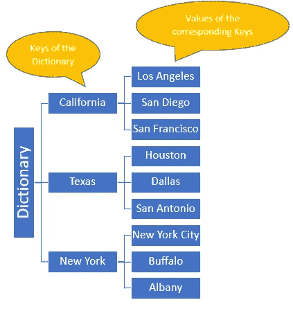
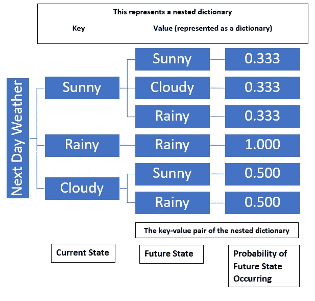

# Python 初学者突破(词典)

> 原文：<https://towardsdatascience.com/python-beginner-breakthroughs-dictionaries-469597c96455?source=collection_archive---------28----------------------->

## 对于数据科学工作来说，一种非常通用的数据类型是 dictionary，它提供了大量的实用工具，允许在自身内部建立内置的关系和层次结构。


照片由[皮斯特亨](https://unsplash.com/@pisitheng?utm_source=medium&utm_medium=referral)在 [Unsplash](https://unsplash.com?utm_source=medium&utm_medium=referral) 上拍摄

我不得不承认，在学习 Python 和计算机科学之前，我根本不知道这种数据类型的存在。当我最终接触到它并看到它的巨大潜力时，字典很快就成为了我因其结构和多功能性而钦佩的数据类型之一。本文旨在快速概述什么是字典，如何使用字典的一般规则，使用字典的实际方法，然后提供一些快速假设的例子，说明在哪里可以使用字典。

在其他编程语言中通常被称为“关联存储器”或“关联数组”，字典的关键原则是通过父子关系映射两个变量。在这种关系中，语法上称为键的父节点和称为值的子节点表示数据类型中的键-值对。该字典最常见的用法是拥有一组可以被调用的键，然后生成与该键相关联的匹配值。

下图是代表键和值对的美国一些州和城市的字典的基本示例。请注意，对于每个值，都有一个与之关联的独特的键值对。



用一些美国州(作为关键字)和城市(作为关键字的值)来可视化表示字典。作者图片

## 词典规则:

使用词典时要注意一些基本规则，这将使使用词典的学习曲线不那么陡峭。

*   字典键可以是任何不可变的类型，比如字符串、数字或元组(注意:包含不可变对象的元组不可作为键接受)
*   字典本身是可变的，这意味着您可以在创建时对条目进行更改(添加/删除/修改)
*   字典中不能存在重复的键，因为字典本身是跨键索引的。*如果你给一个已经存在的键赋值，你将覆盖先前的值*。
*   因为字典是跨关键字索引的，所以不能使用 list(基于序列的)命令，例如。追加&。延伸或切割按键
*   项目的顺序被保留(因为索引是跨键完成的)，新项目被添加到末尾。删除项目时也是如此。
*   字典可以嵌套，以提供两个独立项目(或字典)之间的额外关系

# 如何…使用字典:

## 建立字典

可以使用 dict()函数添加条目，如下所示，其中定义的键和值对几乎就像一个元组。

```
d = dict([
    (<key>, <value>),
    (<key>, <value),
      .
      .
      .
    (<key>, <value>)
])
```

另一个建立字典的有效方法是使用理解。我有另一篇文章，讨论了列表理解逻辑和结构，这些相同的想法可以应用到字典中。你可以在这里找到列表理解文章[。](/python-beginner-breakthroughs-list-comprehensions-4090f26b9f50)

可以想象，就像列表一样，有多种方法来构建列表，比如遍历序列或范围。

## **遍历字典**

您可以用各种方式遍历字典，特定的方法将允许您访问或调用所需的键、值或键值对。最简单的方法是简单地使用字典的 for 循环进行迭代，如下所示。

```
a_dict = {'a': '1', 'b': '2', 'c': '3'}
for key in a_dict:
    print(key)
...
a
b
c
```

Python 字典类型内置了 3 个特别强大的方法，可以根据您想要从字典中提取的内容进行有针对性的迭代。这些方法是:。keys()，。values()，。项目()

## 你想要钥匙吗？

*   。keys()方法只返回字典的键，下面是一个使用它的例子。注意，这类似于遍历字典

```
a_dict = {'a': '1', 'b': '2', 'c': '3'}
for key in a_dict.keys()
    print(key)
...
a
b
c
```

## **所以你希望键和值成对出现？**

*   。items()方法返回表示为元组的键值对的视图对象。请注意下面方法的使用以及作为元组对(key，value)的结果输出。请注意第二个例子中的语法。

```
# .items() Example 1
a_dict = {'a': '1', 'b': '2', 'c': '3'}
for item in a_dict.items()
    print(item)
...
(a,1)
(b,2)
(c,3)# .items() Example 2
a_dict = {'a': '1', 'b': '2', 'c': '3'}
for keys, value in a_dict.items()
    print(key, value)
...
(a,1)
(b,2)
(c,3)
```

## 所以你只想要值？

*   最后一个特定于字典的方法用于调用字典的值，它是。values()方法。类似地，注意方法调用和输出

```
a_dict = {'a': '1', 'b': '2', 'c': '3'}
for value in a_dict.values()
    print(value)
...
1
2
3
```

## 如何筛选字典？

具有适当方法的条件逻辑可结合使用，以根据所述条件构建所需的新字典。在下面的示例中，基于与值相关的条件过滤新字典。

```
a_dict = {'a': '1', 'b': '2', 'c': '3'}
new_dict = {}
for key, value in a_dict.items():
    if value <= 2:
        new_dict[key] = value

new_dict
{'a':1, 'b':2}
```

## 想根据字典条目做一些计算？

利用适当的方法和条件逻辑的组合将允许您基于字典中包含的条目执行计算。下面是一个玩具及其价格字典的例子，使用方法和条件很容易找出字典中所有项目的总价值。

```
toy_price_dict = {'toy car': '100.00', 'toy boat': '200.00', 'toy train': '300.00'}
total_cost = 0
for value in toy_price_dict.values():
    total_cost += value

total_cost
600.0
```

当然，这是一个非常简单的例子，可以进行更复杂的计算，但这是你如何做的基本结构。

## 如何给字典排序？

使用内置的 sorted()函数对字典进行排序很容易。排序可以通过对键或值进行排序来完成，如下例所示。在字典中排序的第二个例子是另一种方式，但是使用一个助手函数来定义排序所依据的键。另外，请注意，在第二个示例中，您可以通过将“reverse”参数设置为 True 来颠倒排序顺序。

```
# Sorting by keys example
toy_price_dict = {'toy car': '100.00', 'toy boat': '200.00', 'toy train': '300.00'}
for key in sorted(toy_price_dict):
    print(key, '->', toy_price_dict[key])

toy boat -> 200.0
toy car -> 100.0
toy train -> 300.0#Sorting by values example 1
toy_price_dict = {'toy car': '100.00', 'toy boat': '50.00', 'toy train': '120.00'}
for value in sorted(toy_price_dict):
    print(values)

120
100
50#Sorting by values example 2
toy_price_dict = {'toy car': '100.00', 'toy boat': '50.00', 'toy train': '120.00'}
def by_value(item):
    return item[1]

for k, v in sorted(toy_price_dict.items(), key=by_value, reverse=True):
    print(k, '->', v) ('toy boat', '->', 50.00)
('toy car', '->', 100.00)
('toy train', '->', 120.00)
```

## 整理你的字典

利用嵌套字典更加强大和有用。除了别的以外，嵌套字典可以作为未来概率的地图。这方面的一个例子如下所示:

```
next_day_weather = {('sunny'): {'sunny': 0.3333333333333333, 'cloudy': 0.3333333333333333, 'rainy': 0.3333333333333333}, ('rainy'): {'rainy': 1.0}, ('cloudy'): {'sunny': 0.5, 'rainy': 0.5}}
```

您可以在这里看到，无论您用什么方法预测未来状态的概率，嵌套字典都可以将未来状态作为键，将值作为概率。下图直观地演示了这一点。



代码块中嵌套字典的可视化表示形式。作者图片

希望这篇文章介绍了字典的用途和使用方式，并能帮你省去一些搜索如何完成与字典相关的简单任务的麻烦。如果你有任何问题或意见，或想看一些具体的东西，让我知道作为回应。谢了。